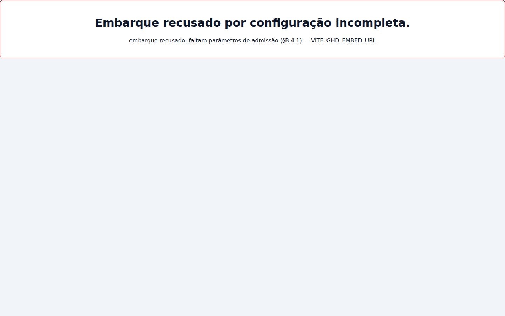
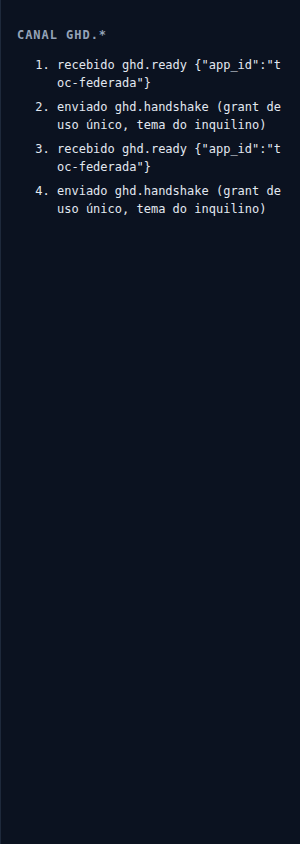
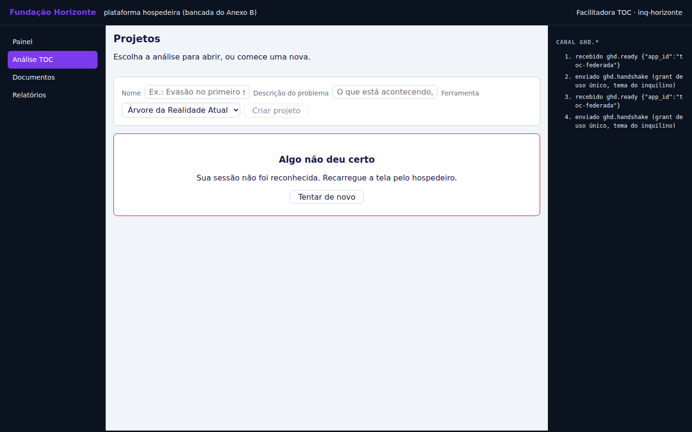
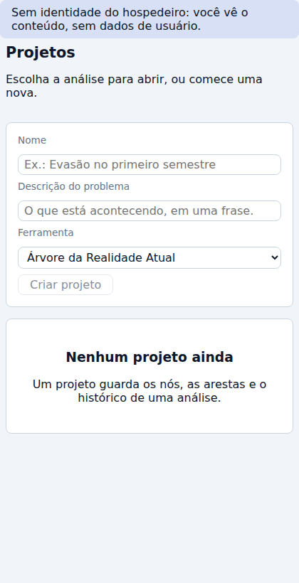
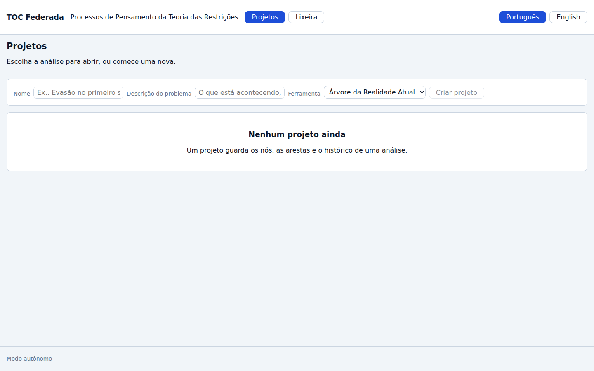

# J-01 · Chegada e embarque

> **Siglas deste documento**, na primeira ocorrência: **TOC** — Teoria das Restrições ·
> **ARA** — Árvore da Realidade Atual · **NC** — Nuvem de Conflito · **APH** — Aplicação ↔
> Harness, o padrão da fronteira · **API** — interface de programação de aplicações ·
> **URL** — *Uniform Resource Locator* · **HTTP** — *HyperText Transfer Protocol* ·
> **P6** — o princípio "Jornada viva" da constituição do projeto · **ADR** — Registro de
> Decisão Arquitetural · **UDE** — Efeito Indesejável.

- **Estágio**: 🟢 viva — capturas do build real
- **Nasce no ciclo**: 003 (esqueleto federado) · **Spec**:
  [`../../specs/003-esqueleto-federado/spec.md`](../../specs/003-esqueleto-federado/spec.md)
- **Capturas geradas em**: 2026-09-06 · **Avaliação heurística revisitada em**: 2026-09-06
- **Como regenerar** (o comando exato, e ele é a prova):

  ```bash
  PLAYWRIGHT_BROWSERS_PATH=/opt/pw-browsers node docs/jornadas/scripts/capturar-telas.mjs --jornada J-01
  ```

- **Base**: sintética, `docs/produto/dados/analise-horizonte.json` v1.0.0. A Instituição
  Horizonte e a Facilitadora TOC são **fictícias** (ADR 0006). Nenhum dado real de pessoa.

## Quem, e o que quer

A **Facilitadora TOC** já está logada na plataforma hospedeira da Fundação Horizonte. Ela
clica em "Análise TOC" no menu da fundação e espera **continuar sendo ela mesma**: não
quer criar conta nova, não quer digitar senha de novo, e quer que a aplicação apareça com
a cara do inquilino dela, dentro da tela onde já estava.

Do lado da aplicação, isso é o §B.4 e o §B.6 do Anexo B do Padrão APH: exigir os
parâmetros de admissão na partida, falar primeiro no canal `ghd.*`, conferir a origem
contra configuração, e trocar o *grant* de uso único por identidade **imediatamente**.

> **O hospedeiro desta jornada é uma bancada, e isso está dito antes de qualquer imagem.**
> A `ghdaru` real não roda nesta máquina. O que embarca a aplicação aqui é uma página de
> bancada servida pelo próprio script de captura, que fala o `ghd.*` do Anexo B e responde
> `POST /auth/introspect` com a persona fictícia. Ela prova o **lado da aplicação** da
> junta — que é o lado que este repositório escreve. Ela **não** prova o lado do
> hospedeiro. Toda afirmação abaixo vale para o lado da aplicação.

## O percurso

### 1 · Falta um parâmetro: a aplicação não sobe, e diz qual

A primeira coisa que a jornada mostra não é sucesso, é recusa. A instância de
[`../../apps/web`](../../apps/web) subiu com três dos quatro parâmetros do §B.4 —
`VITE_GHD_HOST_ORIGIN`, `VITE_GHD_HOST_BASE_URL`, `VITE_GHD_APP_ID` — e **sem**
`VITE_GHD_EMBED_URL`. O que aparece em tela é uma recusa categorizada que **nomeia** o que
faltou:

> Embarque recusado por configuração incompleta.
> embarque recusado: faltam parâmetros de admissão (§B.4.1) — VITE_GHD_EMBED_URL



Nenhum conteúdo é renderizado, e nenhum `ghd.ready` é emitido — sem origem admitida não há
a quem endereçar, e endereçar a `"*"` "para pelo menos tentar" seria a violação do §B.2.4
disfarçada de resiliência ([`../../apps/web/src/federacao/embarque.ts`](../../apps/web/src/federacao/embarque.ts),
o bloco `if (!admissao.admitida)`).

### 2 · O handshake acontece, e o canal registra os dois lados

Com os quatro parâmetros no lugar, a aplicação embarcada fala primeiro. O painel do canal
na bancada mostra a sequência do §B.2.2 e §B.3, na ordem:



Copiado da saída do script, que lê as linhas do painel depois da captura:

```text
  · canal: recebido ghd.ready {"app_id":"toc-federada"}
  · canal: enviado ghd.handshake (grant de uso único, tema do inquilino)
```

(as duas linhas aparecem duas vezes no registro porque o `iframe` monta o canal e o
servidor de desenvolvimento o remonta; o envelope é idêntico nas duas.)

### 3 · Embarcada: sem casca, com o tema do inquilino — e com a sessão que o conteúdo recusa



Três coisas nesta captura são o que a jornada existe para mostrar:

1. **Nenhuma casca própria** (§B.8.1): não há cabeçalho "TOC Federada", não há menu
   Projetos/Lixeira, não há rodapé. Quem navega é o hospedeiro, à esquerda. A contagem
   veio medida: `casca própria no modo embarcado (§B.8.1, esperado 0): 0`.
2. **O tema é do inquilino.** O título "Projetos" está roxo porque a bancada mandou
   `theme.tokens` com `color-primary: #7c3aed`, e a aplicação aplicou por lista de
   permissão os quatro tokens que o manifesto declara consumir
   ([`../../apps/web/src/federacao/tema.ts`](../../apps/web/src/federacao/tema.ts)).
3. **O conteúdo falhou** — e o erro é verdadeiro, não encenado. "Sua sessão não foi
   reconhecida." é o que a tela mostra porque a rota de conteúdo devolveu `401` para a
   sessão nascida do embarque. Esse é o achado **A-01** da avaliação abaixo, e o motivo de
   ele estar no meio da jornada em vez de escondido é o P6.

A cadeia foi medida fora do navegador, no mesmo serviço, e a saída está colada inteira:

```text
  · POST /toc/embarque → HTTP 201 {"sessao":"abaf4d52064a43b7ae4c68062c2f3b94","usuario":{"id":"usr-facilitadora","nome":"Facilitadora TOC"},"tenant_id":"inq-horizonte","capabilities":["toc:read","toc:write"],"expira_em":null}
  · GET /toc/projetos  com a sessão do embarque → HTTP 401
  · GET /aph/catalog   com a sessão do embarque → HTTP 200
```

O `201` prova que a introspecção do §B.6 fechou: o *grant* virou identidade
(`usr-facilitadora`, inquilino `inq-horizonte`, capacidades `toc:read` e `toc:write`). O
`200` no catálogo prova que a superfície federada aceita essa sessão. O `401` no conteúdo
é a lacuna.

### 4 · Embarcada numa faixa estreita: 420 px, conteúdo inteiro

Quando o hospedeiro não responde dentro da janela de 6 s, o §B.3.2 manda **seguir anônima**
em vez de mostrar erro fatal — e é o que acontece: o aviso "Sem identidade do hospedeiro:
você vê o conteúdo, sem dados de usuário" no topo, e o conteúdo renderizado abaixo, com o
formulário empilhado.



### 5 · A mesma aplicação, autônoma: aí sim ela tem casca



Fora do embarque a aplicação veste a casca inteira — marca, navegação Projetos/Lixeira,
seletor de idioma e rodapé "Modo autônomo". O contraste entre esta captura e a do passo 3
é a prova visual do §B.8.1: **é o mesmo build**, e a diferença é o sinal explícito
`?embarcado=1` na URL, nunca uma heurística de `window.parent !== window`.

## O que esta jornada prova (e o que não prova)

| Afirmação | Evidência |
|---|---|
| A aplicação recusa subir sem parâmetro de admissão, nomeando qual | captura 01, texto legível na imagem |
| A aplicação fala primeiro (`ghd.ready`) e o hospedeiro responde (`ghd.handshake`) | captura 03 + linhas do canal na saída do script |
| O *grant* vira identidade por introspecção real | `POST /toc/embarque → HTTP 201`, corpo colado acima |
| Embarcada, a aplicação não desenha casca própria | `casca própria no modo embarcado (§B.8.1, esperado 0): 0` |
| O tema do inquilino é aplicado por lista de permissão | captura 02 (título roxo `#7c3aed`) |
| **Não prova**: que a junta fecha contra a `ghdaru` real | o hospedeiro aqui é bancada; ver o aviso no topo |
| **Não prova**: que a pessoa embarcada consegue trabalhar | achado A-01 abaixo: `GET /toc/projetos` devolve `401` |

## Avaliação heurística — 2026-09-06

Avaliada por um agente, em contexto de construção, sobre as capturas geradas nesta mesma
data. **Não houve teste com pessoa usuária**; nenhum achado abaixo tem origem em
observação de uso real, e essa é a limitação principal desta avaliação.

| # | Achado | Heurística | Severidade | Destino |
|---|---|---|---|---|
| A-01 | A sessão emitida por `POST /toc/embarque` autentica `/aph/*` (`200`) mas **não** `/toc/*` (`401`): embarcada de verdade, a aplicação não carrega conteúdo nenhum | Correspondência com o mundo real / prevenção de erro | **Alta** | 📝 registrado — correção fora deste lote (é código de produção do serviço, e entra pelo ciclo com spec e teste que falha antes) |
| A-02 | Na largura do `iframe` do hospedeiro (≈1 010 px) o formulário de criação fica numa linha só, com rótulos e campos intercalados e o `select` quebrando para a linha de baixo — em 420 px ele empilha corretamente | Estética e design minimalista | Média | 📝 registrado para o ciclo de interface |
| A-03 | A mensagem de erro do conteúdo diz "Recarregue a tela pelo hospedeiro", que é uma instrução que **não resolve** enquanto A-01 existir | Ajuda a reconhecer e recuperar de erros | Média | 📝 registrado — depende de A-01 |
| A-04 | Uma credencial de aplicação com caractere fora de ASCII faz o serviço responder `503 FUNDACAO_INDISPONIVEL` em vez de recusar a configuração na partida; medido nesta bancada com `TOC_APP_CREDENTIAL` acentuada | Diagnóstico de erro | Baixa | 📝 registrado |
| A-05 | A recusa de admissão ocupa a tela inteira com um aviso de duas linhas e nenhuma orientação de onde a variável é configurada | Estética / ajuda e documentação | Baixa | 📝 registrado |
| ✅ | A recusa **nomeia** o parâmetro que faltou, como o §B.4.1 exige | Prevenção de erro | — | conforme |
| ✅ | Embarcada, zero casca própria — medido, não estimado | Consistência e padrões | — | conforme |
| ✅ | Silêncio do hospedeiro vira estado honesto ("sem identidade… você vê o conteúdo"), não erro fatal | Visibilidade do estado do sistema | — | conforme |

### Rastro do achado A-01, por `arquivo:linha`

Investigado antes de ser nomeado (skill `diagnose-before-fix`), e a causa é estrutural, não
um bug de digitação: **existem dois registros de identidade e nenhuma ponte entre eles.**

- [`apps/api/src/toc_api/http/aph.py:172`](../../apps/api/src/toc_api/http/aph.py) —
  `fed.sessoes_de_aplicacao.abrir(token_de_sessao, principal)`: o embarque grava a sessão
  no registro **da federação**.
- [`apps/api/src/toc_api/http/aph.py:130`](../../apps/api/src/toc_api/http/aph.py) —
  `fed.sessoes_de_aplicacao.principal(token)`: as rotas `/aph/*` leem esse registro. Daí o
  `200` no catálogo.
- [`apps/api/src/toc_api/http/dependencias.py:55`](../../apps/api/src/toc_api/http/dependencias.py) —
  `composicao.identidade.identificar(token)`: as rotas `/toc/*` leem **outro** provedor.
- [`apps/api/src/toc_api/http/app.py:90`](../../apps/api/src/toc_api/http/app.py) —
  `identidade=criar_provedor_de_identidade(config)`: esse outro provedor é o registro
  fechado de personas de desenvolvimento
  ([`apps/api/src/toc_api/infra/identidade/falso.py`](../../apps/api/src/toc_api/infra/identidade/falso.py)),
  que só conhece o token `tok-desenvolvimento-facilitadora` — e não a sessão recém-aberta.

Em desenvolvimento a lacuna fica invisível porque o proxy do servidor de desenvolvimento
injeta o token de persona em toda chamada
([`apps/web/vite.config.ts`](../../apps/web/vite.config.ts)); é por isso que as jornadas
J-02, J-03 e J-07 funcionam. A instância embarcada desta jornada **não** recebe esse token,
de propósito — é o que faz a lacuna aparecer.
