# J-02 · Primeiro projeto e a Árvore da Realidade Atual

> **Siglas deste documento**, na primeira ocorrência: **TOC** — Teoria das Restrições ·
> **ARA** — Árvore da Realidade Atual · **UDE** — Efeito Indesejável (*Undesirable
> Effect*) · **NC** — Nuvem de Conflito · **API** — interface de programação de aplicações
> · **HTTP** — *HyperText Transfer Protocol* · **URL** — *Uniform Resource Locator* ·
> **P6** — o princípio "Jornada viva" da constituição do projeto · **ADR** — Registro de
> Decisão Arquitetural · **RF/RI/RN** — requisito funcional / de interface / regra de
> negócio.

- **Estágio**: 🟢 viva — capturas do build real
- **Nasce nos ciclos**: 004 (núcleo de diagramas) e 005 (ARA) · **Specs**:
  [`../../specs/004-nucleo-de-diagramas/spec.md`](../../specs/004-nucleo-de-diagramas/spec.md),
  [`../../specs/005-arvore-da-realidade-atual/spec.md`](../../specs/005-arvore-da-realidade-atual/spec.md)
- **Capturas geradas em**: 2026-09-06 · **Avaliação heurística revisitada em**: 2026-09-06
- **Como regenerar**:

  ```bash
  PLAYWRIGHT_BROWSERS_PATH=/opt/pw-browsers node docs/jornadas/scripts/capturar-telas.mjs --jornada J-02
  ```

- **Base**: sintética, `docs/produto/dados/analise-horizonte.json` v1.0.0 — 16 nós, 16
  arestas causais, 12 UDEs. Instituição e personas **fictícias** (ADR 0006).

## Quem, e o que quer

A **Facilitadora TOC** acabou de sair de uma oficina com a equipe da Instituição Horizonte.
Ela tem doze frases numa folha — as queixas que o grupo levantou — e três coisas para
fazer com elas: **guardar** onde não se perca, **descobrir quais estão mal escritas** antes
de construir lógica em cima, e **ligar causa a efeito** até chegar a uma causa raiz que
valha a pena atacar.

O que a linhagem TOC-Builder fazia nessa hora: guardava tudo num mapa em memória do
navegador (`tocbuilderv3/services/mockApiService.ts`) e mandava o texto para um provedor de
modelo de linguagem **a partir do navegador**, com a chave no cliente
(`tocbuilderv3/services/geminiService.ts:16`). Aqui não: quem guarda é o PostgreSQL, e
quem decide se um UDE está bem escrito é **regra pura de domínio**, sem rede.

## O percurso

### 1 · A lista vazia, e o que ela oferece


Um formulário com três campos — Nome, Descrição do problema, Ferramenta — e um estado
vazio que explica o que um projeto guarda ("os nós, as arestas e o histórico de uma
análise"). O rodapé diz "Modo autônomo": não há hospedeiro nesta tela.

### 2 · O projeto criado, e a escolha da ferramenta

A Facilitadora escreve **"Evasão na Instituição Horizonte"**, descreve o problema em uma
frase e escolhe a ferramenta **Árvore da Realidade Atual**. A escolha não é cosmética: o
projeto nasce pela rota da ARA (`POST /toc/ara/projetos`) e por isso já tem a semântica do
módulo M2 — UDEs, exames de elo, conectores E.

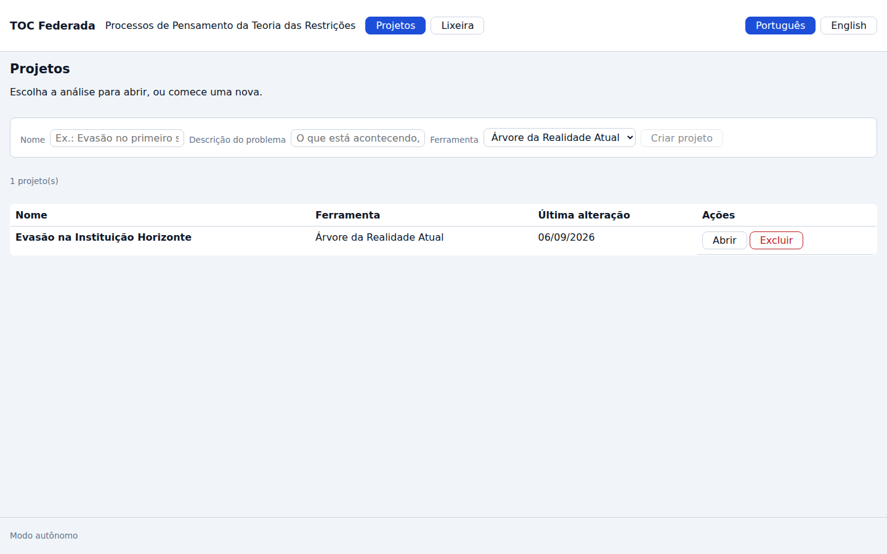

### 3 · A árvore vazia: canvas e painel, lado a lado

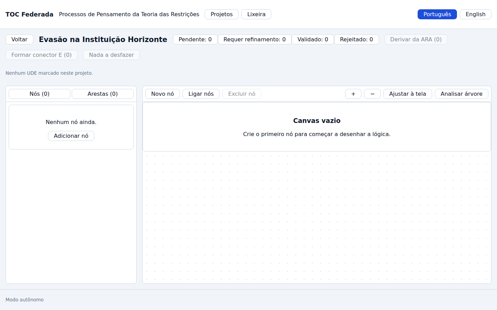

Duas projeções do **mesmo** grafo: o painel de entidades à esquerda, com as abas "Nós (0)"
e "Arestas (0)", e o canvas à direita. Nenhuma das duas é secundária — o painel é o que
sobrevive num `iframe` estreito, e é por ele que se cria aresta sem arrastar.

### 4 · A análise da Instituição Horizonte, inteira

Os 16 nós e as 16 arestas da base entram pela mesma API que a tela usa, e as 12 queixas são
marcadas como Efeito Indesejável. O que a árvore mostra: doze efeitos em cima, três causas
intermediárias no meio, e a causa raiz embaixo — *"A instituição avalia o semestre pelo
volume de matrículas, não pela conclusão dos cursos."*

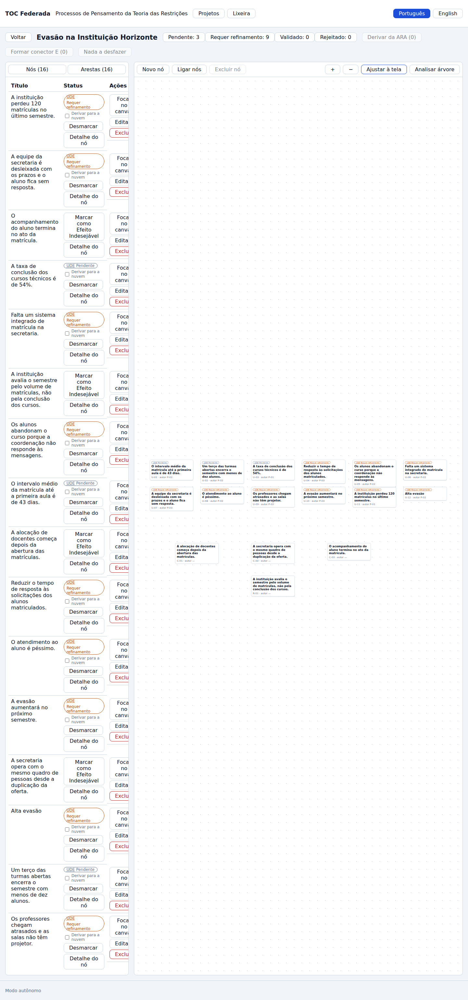

O cabeçalho traz o resumo por status, e ele veio medido pela API, não lido da imagem:

```text
  · 12 UDEs marcados · resumo por status: pendente=3 requer_refinamento=9 validado=0 rejeitado=0
```

**Esses dois números são o produto funcionando.** A base foi escrita de propósito com
patologias (ADR 0006: "dos doze UDEs, a maioria está escrita **errado** — errado do jeito
que um facilitador humano erra"), e o domínio separou **3 bem formulados** de **9 que
requerem refinamento** sem nenhuma chamada de rede.

### 5 · O achado que a captura anterior esconde

A captura acima é de **página inteira**. O que a pessoa vê na janela, logo depois de
clicar em "Ajustar à tela", é isto:

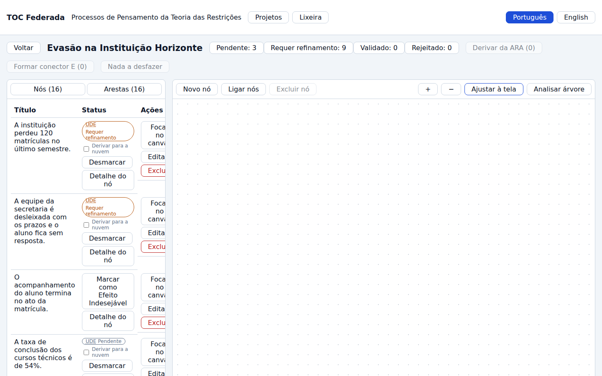

O canvas visível está **vazio**. Não é falha da captura: a área de trabalho cresce com o
painel de entidades, e o enquadramento é calculado sobre essa altura inteira. Medido no
navegador, na mesma corrida:

```text
  · canvas: janela 900px · área do canvas 2761px · translate(14.561px, 1143.08px) scale(0.557317) · topo do 1º nó em 1497px
```

Em português: a janela tem 900 px de altura, a área do canvas tem **2 761 px**, e
"Ajustar à tela" centrou a árvore a **1 143 px** do topo dessa área — o primeiro nó
aparece a 1 497 px, ou seja, cerca de 600 px abaixo da dobra. É o achado **A-03**.

### 6 · As arestas, na vista tabular

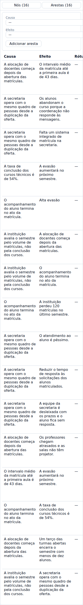

Cada linha é uma aresta causal lida como **Causa → Efeito**, e o formulário no topo cria
aresta escolhendo os dois nós em listas — sem arrastar, que é o que torna a ferramenta
utilizável num `iframe` estreito e com teclado.

### 7 · A ficha de validação: o que a linhagem chamava de "IA" e aqui é regra

A Facilitadora clica no UDE mais mal escrito do lote — *"O atendimento ao aluno é
péssimo."*

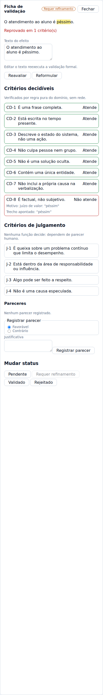

A ficha tem **duas seções, e a separação é a decisão**:

- **Critérios decidíveis** (CD-1 a CD-8) — "Verificados por regra pura do domínio, sem
  rede". Sete atendem; o CD-8 ("É factual, não subjetivo") **não atende**, com o motivo
  ("juízo de valor: 'péssimo'") e o **trecho apontado** marcado em amarelo dentro do
  próprio texto do efeito.
- **Critérios de julgamento** (J-1 a J-4) — "Nenhuma função decide: dependem de parecer
  humano". Eles aparecem sem veredito, de propósito.

Na 4ª geração da linhagem, as onze características vinham num bloco de saída de modelo de
linguagem e `validado_por` era texto que o modelo devolvia (`tocbuilderv3/types.ts:171-213`).
Aqui, oito das onze viraram função pura e as outras quatro estão **declaradas como
indecidíveis** em vez de fingidas.

### 8 · Reformular é revalidar — e a ficha não conta isso na hora

A Facilitadora reescreve o efeito para *"A instituição responde 31% das mensagens de aluno
em até cinco dias úteis."* e clica em **Reformular**. A ficha, logo depois do clique,
continua mostrando o texto velho no topo e "Reprovado em 1 critério(s)":

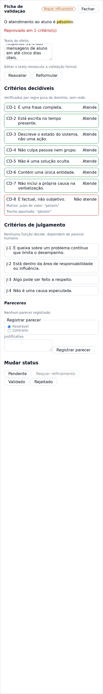

O servidor, porém, já fez o que devia. Medido na mesma corrida:

```text
  · reformulação no servidor: "A instituição responde 31% das mensagens de aluno em até cin…" · aprovado nos decidíveis: true · reprovações: 0
```

Fechar e reabrir a mesma ficha mostra o veredito certo — os oito decidíveis "Atende" e
"Aprovado nos decidíveis" em verde:

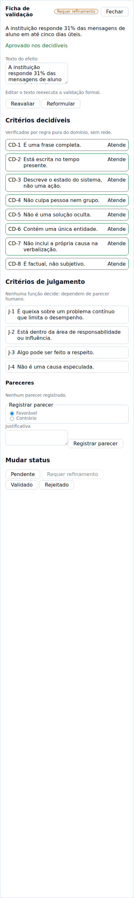

Repare que o selo continua **"Requer refinamento"**: o status é decisão humana e não é
derivado do veredito formal (RN-10 da spec 005). Isso está certo. O que está errado é a
ficha ter mostrado o veredito velho ao lado do texto novo, que é literalmente o defeito que
o comentário de [`../../apps/web/src/telas/TelaDaAra.tsx`](../../apps/web/src/telas/TelaDaAra.tsx)
diz que a reformulação existe para evitar — achado **A-02**.

### 9 · Um UDE bem formulado, o parecer humano e o status

*"O intervalo médio da matrícula até a primeira aula é de 43 dias."* passa nos oito
decidíveis já na primeira leitura:

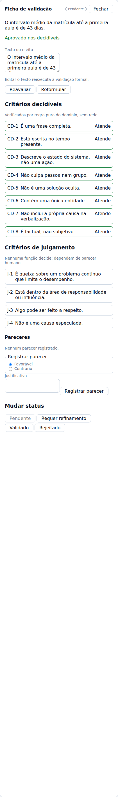

A Facilitadora registra um parecer favorável com justificativa e move o status para
**Validado**:

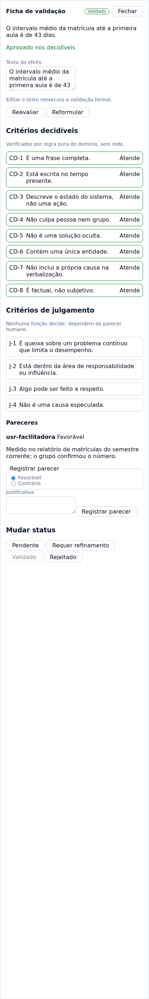

O autor do parecer **não vem do cliente**: vem do principal da introspecção (RF-16 da spec
005). É o que faz "Validado" significar alguma coisa.

### 10 · Filtrar por status

Clicar em "Pendente: 2" no cabeçalho reduz o painel aos dois UDEs pendentes:

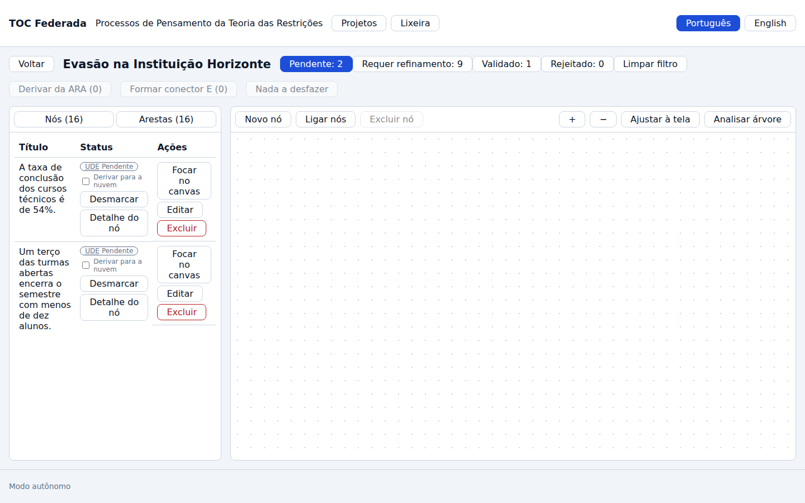

O rótulo do botão **carrega a contagem** e o filtro fica marcado com `aria-pressed` — quem
usa leitor de tela ouve o número, não só "Filtrar por Validado".

### 11 · O exame de suficiência de um elo

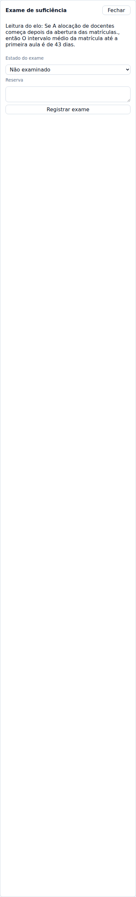

O painel lê o elo em voz alta — *"Se A secretaria opera com o mesmo quadro de pessoas desde
a duplicação da oferta., então A instituição responde 31% das mensagens de aluno em até
cinco dias úteis."* — e oferece os quatro estados (Não examinado, Suficiente, Insuficiente,
Com reserva) mais o campo de reserva. Insuficiente e Com reserva **exigem** a reserva
escrita.

### 12 · O relatório estrutural, e a causa raiz

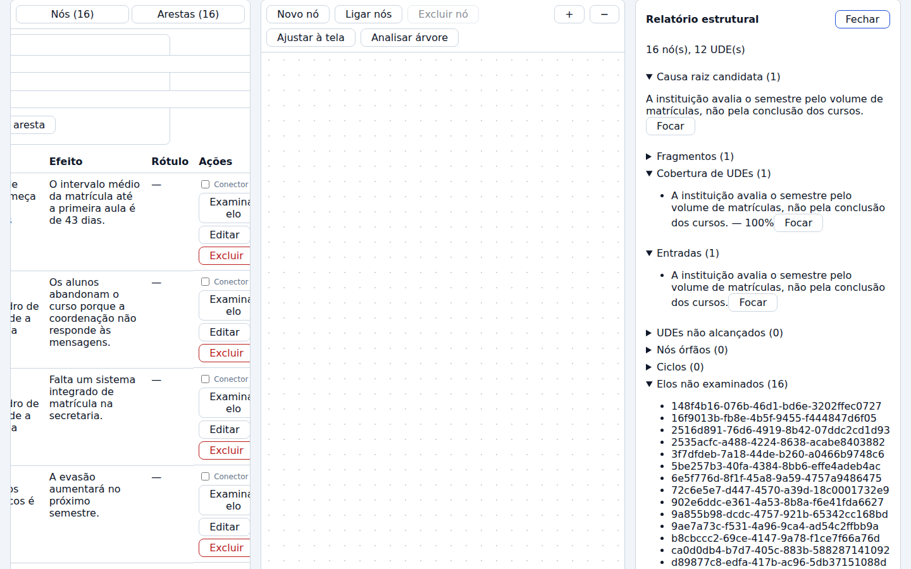

`16 nó(s), 12 UDE(s)`, e depois: **Causa raiz candidata (1)** — *"A instituição avalia o
semestre pelo volume de matrículas, não pela conclusão dos cursos."*, com cobertura de
**100%** dos UDEs; Fragmentos (1); Nós órfãos (0); Ciclos (0); e **Elos não examinados
(16)**.

O "Ciclos (0)" não é decorativo: a regra que proíbe ciclo causal é de domínio, e a árvore
inteira passou por ela.

### 13 · A exclusão é reversível, e a confirmação nomeia o projeto

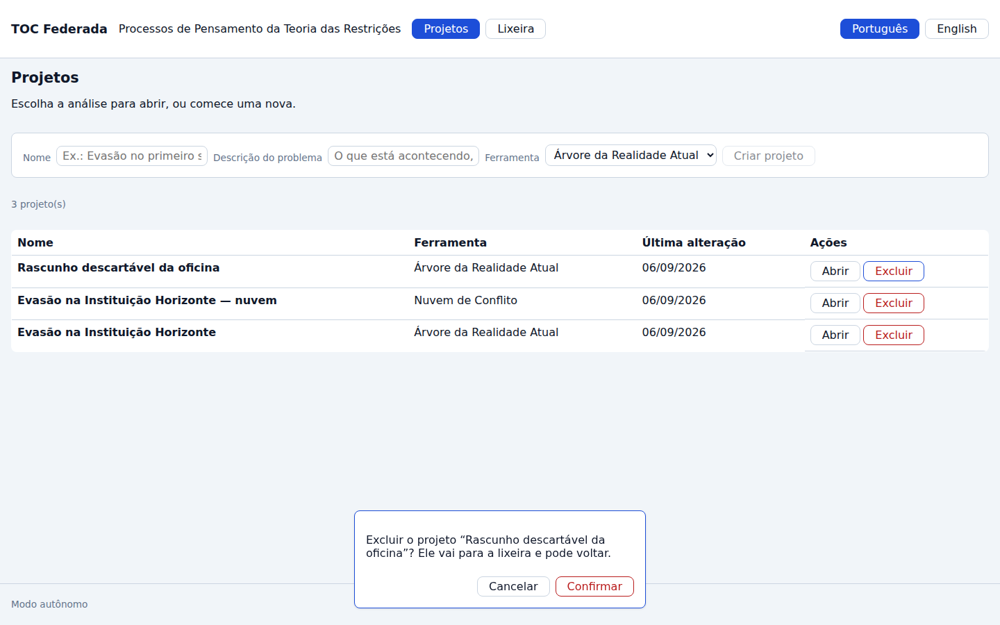

> Excluir o projeto "Rascunho descartável da oficina"? Ele vai para a lixeira e pode voltar.

E ele vai mesmo, com data e botão de restaurar:

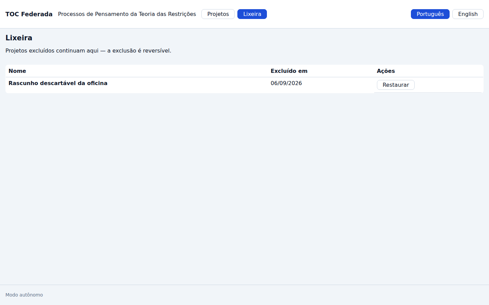

## O que esta jornada prova

| Afirmação | Evidência |
|---|---|
| Doze UDEs sintéticos separados em 3 bem formulados e 9 a refinar, por regra pura | `resumo por status: pendente=3 requer_refinamento=9 validado=0 rejeitado=0` |
| A reprovação aponta o **trecho** e o motivo, não só um veredito | captura 07 — "juízo de valor: 'péssimo'", trecho marcado |
| Quatro critérios são declarados indecidíveis em vez de fingidos | captura 07, seção "Critérios de julgamento" |
| Reformular reexecuta a validação no servidor | `aprovado nos decidíveis: true · reprovações: 0` após o comando |
| A causa raiz é calculada, com cobertura | captura 14 — "Causa raiz candidata (1) … 100%" |
| A exclusão é suave e a confirmação nomeia o alvo | capturas 15 e 16 |
| A persistência é real | a árvore inteira sobrevive ao `reload` do passo 4 (o projeto é reaberto pela lista, e os 16 nós estão lá) |

## Avaliação heurística — 2026-09-06

Avaliada por um agente, em contexto de construção, sobre as capturas geradas nesta mesma
data. **Não houve teste com pessoa usuária.**

| # | Achado | Heurística | Severidade | Destino |
|---|---|---|---|---|
| A-02 | Depois de "Reformular", a ficha continua mostrando o texto e o veredito antigos até ser fechada e reaberta — o veredito velho ao lado do texto novo | Visibilidade do estado do sistema | **Alta** | 📝 registrado — correção fora deste lote (código de produção da interface) |
| A-03 | A área de trabalho cresce com o painel (2 761 px numa janela de 900 px) e "Ajustar à tela" enquadra a árvore **abaixo da dobra**: o canvas visível fica vazio com 16 nós no projeto | Visibilidade do estado do sistema / correspondência com o mundo real | **Alta** | 📝 registrado |
| A-01 | A rota vive no estado do React e não na URL: recarregar a página devolve à lista de projetos, e não há como enviar o link de uma árvore a ninguém | Controle e liberdade / flexibilidade | Média | 📝 registrado |
| A-04 | Na largura padrão do painel, a coluna "Ações" fica cortada ("Exclu…", "Foca no canva…") — as ações existem mas não se leem | Estética e design minimalista | Média | 📝 registrado (o painel é redimensionável, o que atenua mas não resolve o estado inicial) |
| A-05 | O relatório estrutural lista os 16 "Elos não examinados" por identificador universal (`072261e0-9546-…`), que não diz a ninguém qual elo é | Correspondência com o mundo real | Média | 📝 registrado |
| A-06 | O filtro por status filtra o painel e **não** o canvas — os nós filtrados continuam desenhados; a assimetria não é anunciada em lugar nenhum da tela | Consistência e padrões | Baixa | 📝 registrado |
| A-07 | A leitura do elo concatena as duas frases sem tratar a pontuação: *"…duplicação da oferta., então…"* | Estética | Baixa | 📝 registrado |
| ✅ | O trecho reprovado é marcado dentro do texto, com motivo | Diagnóstico de erro | — | conforme |
| ✅ | Decidível e julgamento são seções separadas e rotuladas | Correspondência com o mundo real | — | conforme |
| ✅ | O botão de filtro carrega a contagem no texto visível (e não num `aria-label` que apagaria o número) | Acessibilidade / visibilidade | — | conforme |
| ✅ | A confirmação de exclusão nomeia o projeto | Prevenção de erro | — | conforme |
| ✅ | A exclusão é reversível e a lixeira diz isso na descrição | Controle e liberdade | — | conforme |

### Rastro dos achados, por `arquivo:linha`

- **A-02** — [`apps/web/src/componentes/ude/FichaDeUde.tsx:52`](../../apps/web/src/componentes/ude/FichaDeUde.tsx):
  `const [validacao, setValidacao] = useState<ValidacaoFormal>(ude.validacao)` inicializa o
  veredito **uma vez**; como
  [`apps/web/src/telas/TelaDaAra.tsx:420`](../../apps/web/src/telas/TelaDaAra.tsx) monta
  `<FichaDeUde>` sem `key` que mude com o nó, o componente não remonta quando o agregado
  recarrega e o estado local sobrevive à troca de `props`.
- **A-03** — [`apps/web/src/estilos.css:279`](../../apps/web/src/estilos.css):
  `.area-de-trabalho { align-items: stretch; flex: 1; min-height: 480px; }` — sem altura
  máxima, a linha estica até a altura natural do painel; e
  [`apps/web/src/componentes/canvas/useViewport.ts:103`](../../apps/web/src/componentes/canvas/useViewport.ts)
  (`ajustar`) mede essa altura com `getBoundingClientRect` e centra nela.
- **A-01** — [`apps/web/src/App.tsx:73`](../../apps/web/src/App.tsx):
  `const [rota, setRota] = useState<Rota>({ tela: "projetos" })`.
- **A-06** — [`apps/web/src/telas/TelaDaAra.tsx`](../../apps/web/src/telas/TelaDaAra.tsx):
  `filtrarNo` é passado ao `PainelDeEntidades`; o `Canvas` recebe `nos={nos}` sem filtro.
