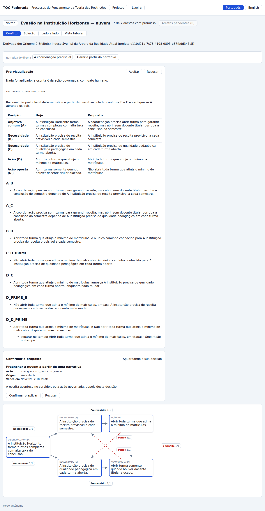
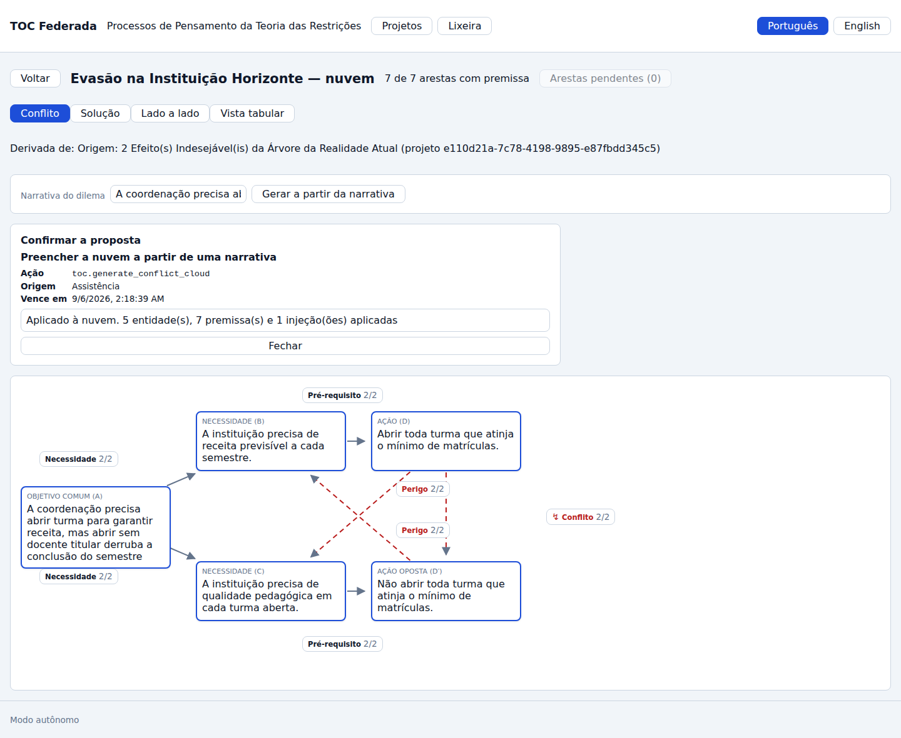
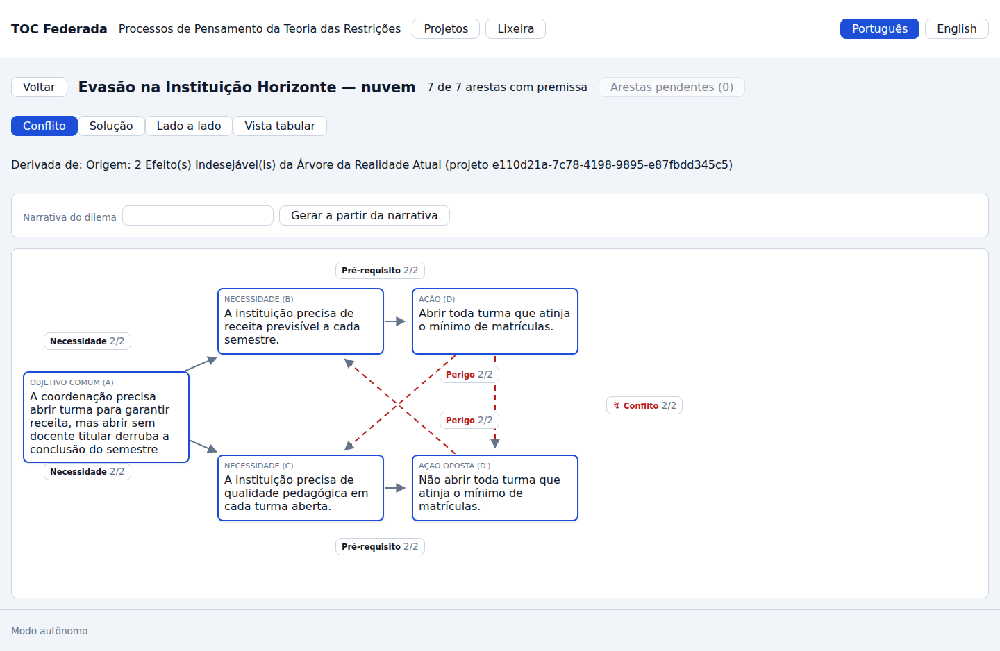

# J-03 · A Nuvem de Conflito

> **Siglas deste documento**, na primeira ocorrência: **TOC** — Teoria das Restrições ·
> **NC** — Nuvem de Conflito · **ARA** — Árvore da Realidade Atual · **UDE** — Efeito
> Indesejável (*Undesirable Effect*) · **TRIZ** — Teoria da Resolução Inventiva de
> Problemas · **API** — interface de programação de aplicações · **IA** — inteligência
> artificial · **ADR** — Registro de Decisão Arquitetural · **P6** — o princípio "Jornada
> viva" · **RF/RI/RN** — requisito funcional / de interface / regra de negócio.

- **Estágio**: 🟢 viva — capturas do build real
- **Nasce no ciclo**: 007 · **Spec**:
  [`../../specs/007-nuvem-de-conflito/spec.md`](../../specs/007-nuvem-de-conflito/spec.md)
- **Capturas geradas em**: 2026-09-06 · **Avaliação heurística revisitada em**: 2026-09-06
- **Como regenerar** (a nuvem desta jornada é a que a travessia derivou, e por isso a
  corrente J-02 → J-07 → J-03 corre junta):

  ```bash
  PLAYWRIGHT_BROWSERS_PATH=/opt/pw-browsers node docs/jornadas/scripts/capturar-telas.mjs --jornada J-03
  ```

- **Base**: sintética, `docs/produto/dados/analise-horizonte.json` v1.0.0 — cinco
  entidades, sete arestas com premissa escrita, duas injeções. Instituição e personas
  **fictícias** (ADR 0006).

## Quem, e o que quer

A **Facilitadora TOC** entra na nuvem que acabou de derivar da árvore (jornada
[J-07](007-a-travessia.md)). O dilema da Instituição Horizonte é conhecido pelo grupo, e
ninguém consegue resolvê-lo discutindo: **abrir toda turma que atinja o mínimo de
matrículas** garante a receita do semestre, e **abrir só quando houver docente titular
alocado** garante a qualidade — as duas ações não cabem juntas.

O que ela quer da ferramenta não é uma resposta. É **escrever as premissas**: a frase que
cada seta está assumindo, para o grupo poder atacar a mais frágil em vez de negociar um
meio-termo entre as duas ações. É esse o método, e é isso que a nuvem tem de tornar
visível.

## O percurso

### 1 · O diagrama canônico, preenchido

As cinco entidades ganham o texto do grupo e cada uma das sete arestas recebe a sua
premissa. O cabeçalho passa de `0 de 7` para **`7 de 7 arestas com premissa`**, e o botão
"Arestas pendentes" fica desabilitado em `(0)`:


Contagem medida, não estimada:

```text
  · arestas desenhadas no diagrama: 7
  · completude: 7 de 7 arestas com premissa · injeções criadas: 2
```

A leitura do diagrama, da esquerda para a direita:

| Posição | Texto |
|---|---|
| **A** — objetivo comum | A Instituição Horizonte forma turmas completas com alta taxa de conclusão. |
| **B** — necessidade | A instituição precisa de receita previsível a cada semestre. |
| **C** — necessidade | A instituição precisa de qualidade pedagógica em cada turma aberta. |
| **D** — ação | Abrir toda turma que atinja o mínimo de matrículas. |
| **D′** — ação oposta | Abrir turma somente quando houver docente titular alocado. |

E as sete arestas, com a classe que o domínio dá a cada uma: duas de **Necessidade**
(A↔B, A↔C), duas de **Pré-requisito** (B↔D, C↔D′), duas de **Perigo** (as diagonais
tracejadas em vermelho, D↔C e D′↔B) e uma de **Conflito** (D↔D′).

> **Não existe arrastar neste diagrama, e a ausência é decisão.** A topologia é fixa
> (RN-01): quem usa edita **texto**, não arruma caixas. As posições vêm do servidor.

### 2 · A ficha de uma aresta: a premissa que a sustenta

Clicar na aresta de conflito abre a ficha, com a leitura do elo no cabeçalho e a premissa
em estado **Vigente**:


> Esperar a alocação do docente titular faz a turma perder a janela de matrícula.

Dois botões guardam o método: **Desafiar premissa** (que exige justificativa escrita) e
**Arquivar premissa** (que responde quantas injeções foram junto — nunca em silêncio).

### 3 · A injeção nasce ligada à premissa que invalida


> A alocação do docente titular acontece na abertura do calendário, antes da matrícula.
> Separação no tempo · Candidata

A injeção **não flutua**: ela mora dentro da premissa que ataca, carrega a classificação
TRIZ ("Separação no tempo") e um status próprio (Candidata / Escolhida / Descartada). É a
diferença entre "uma ideia que alguém teve" e "a coisa que derruba esta frase".

### 4 · A visão de solução: as sete posições espelhadas


Cada uma das sete arestas vira uma posição lida por extenso — *"Para ter A Instituição
Horizonte forma turmas completas com alta taxa de conclusão., precisamos de A instituição
precisa de receita previsível a cada semestre."* — e as que ainda não têm injeção dizem
**"Sem injeção"** com a borda pontilhada. Nesta nuvem, duas das sete têm injeção e cinco
estão pendentes: a ferramenta mostra **o buraco**, não esconde.

### 5 · Conflito e solução, lado a lado


### 6 · A vista tabular


Aresta × premissas × injeções, no mesmo dado. A escolha de visão **persiste na sessão**
(RI-08): quem está conduzindo um grupo não quer reescolher a visão a cada recarga.

### 7 · Gerar não aplica — a assistência entra como proposta

A Facilitadora cola a narrativa do dilema e pede **"Gerar a partir da narrativa"**. O que
volta é uma **pré-visualização**, e a tela diz isso com todas as letras antes de qualquer
conteúdo:


> Nada foi aplicado: a escrita é da ação governada, com gate humano.

Abaixo do aviso vem o identificador da ação do catálogo — `toc.generate_conflict_cloud` —,
o racional, e um diff **Posição × Hoje × Proposto** para as cinco entidades, seguido das
sugestões de premissa por aresta (`A_B`, `A_C`, `B_D`, `C_D_PRIME`, `D_C`, `D_PRIME_B`,
`D_D_PRIME`) e da separação TRIZ sugerida para o conflito. **Aceitar** e **Recusar** estão
lado a lado, com o mesmo peso: recusar fecha a prévia e deixa o projeto exatamente como
estava — não houve escrita para desfazer.

**É aqui que esta aplicação difere da linhagem que ela sucede.** Na 4ª geração, a mesma
operação era uma chamada de rede a um provedor de modelo de linguagem feita **do
navegador**, com a chave no cliente (`tocbuilderv3/services/geminiService.ts:16`), e o que
o modelo devolvia era gravado. Aqui não há cliente de provedor na interface: a geração é do
servidor, é ação nomeada do catálogo, e a escrita passa por proposta com portão humano
(ADR 0007 e P7).

### 8 · Aceitar leva ao gate — a proposta nasce e **espera**

Clicar em **Aceitar** não escreve nada: cria a proposta de ação no servidor, que nasce
`proposed`, vai a `awaiting_approval` e para ali. A superfície de confirmação aparece com o
que o servidor registrou — a ação, a origem, o vencimento — e com as duas decisões de mesmo
peso:



> Confirmar a proposta · Aguardando a sua decisão
> A escrita acontece no servidor, pela ação governada, depois desta decisão.

Medido enquanto a proposta esperava, não estimado:

```text
  · proposta criada e aguardando decisão · nuvem intacta enquanto espera: true · linhas de traço antes da decisão: 0
```

A nuvem lida do serviço **enquanto a proposta espera** é byte a byte a mesma de antes de
propor, e o traço ainda está vazio: não há desfecho, porque ainda não houve decisão.

> **A origem — "Assistência" — é dado, e não desvio de fluxo** (RI-02 da spec 006). Uma
> proposta de origem `humano` mostraria "Pessoa" nessa mesma linha e seguiria exatamente o
> mesmo caminho: no instante em que a origem virar `if`, as duas telas divergem e a menos
> testada é a de mais risco.

### 9 · Confirmar aplica — e a nuvem muda porque foi **relida** do serviço



> Aplicado à nuvem. 5 entidade(s), 7 premissa(s) e 1 injeção(ões) aplicadas

O objetivo comum (A) e a ação oposta (D′) passaram a ser o texto que a prévia propunha, e
cada aresta mostra agora `2/2` premissas — as sete que o grupo tinha escrito **mais** as
sete que a geração acrescentou: premissa da assistência **acumula**, nunca sobrescreve o
que o grupo validou (RN-05 da spec 007).

```text
  · confirmada: 2 de 5 entidades reescritas · premissas 7 → 14 · traço da ação: ["executed"]
```

Duas entidades reescritas e cinco aplicadas não se contradizem: a geração propôs texto para
as cinco, e três delas já diziam o mesmo que a proposta — a contagem de cima é do que
**mudou**, a de dentro do desfecho é do que foi **aplicado**.

A tela não escreveu nada disso. Ela pediu a decisão ao servidor, e o que aparece é o que ela
**releu** dele depois — é a diferença que o defeito D-07 da linhagem nomeia.

### 10 · E sobrevive à recarga



A página é recarregada e a nuvem é reaberta pela lista, como quem usa faria: o texto novo e
as catorze premissas continuam lá, porque quem guardou foi o PostgreSQL do serviço. O campo
da narrativa volta vazio — o que era estado de tela some, e o que era estado do domínio fica.

## O que esta jornada prova

| Afirmação | Evidência |
|---|---|
| O diagrama desenha as **sete** arestas da topologia canônica | `arestas desenhadas no diagrama: 7` |
| Toda aresta pode carregar premissa escrita, e a completude é visível | `completude: 7 de 7 arestas com premissa`; cabeçalho na captura 01 |
| A injeção nasce presa à premissa que ataca, com classificação TRIZ e status | captura 03 |
| A visão de solução declara as posições **sem** injeção | captura 04 — cinco "Sem injeção" |
| O mesmo dado tem quatro projeções (conflito, solução, lado a lado, tabela) | capturas 01, 04, 05 e 06 |
| Gerar **não** escreve: devolve diff e o identificador da ação governada | captura 07 — "Nada foi aplicado…" + `toc.generate_conflict_cloud` |
| Aceitar leva ao gate e a proposta **espera** sem escrever | captura 08; `nuvem intacta enquanto espera: true · linhas de traço antes da decisão: 0` |
| Confirmar aplica pela ação governada, com traço | captura 09; `premissas 7 → 14 · traço da ação: ["executed"]` |
| A mudança sobrevive à recarga — persistência do serviço, não estado de tela | captura 10 (página recarregada, nuvem reaberta pela lista) |
| Nenhum segredo de provedor na interface | não há cliente de provedor em `apps/web`; a geração é rota do serviço |

## Avaliação heurística — 2026-09-06

Avaliada por um agente, em contexto de construção, sobre as capturas geradas nesta mesma
data. **Não houve teste com pessoa usuária.** Esta rodada revisita a avaliação anterior do
mesmo dia depois de o laço da assistência fechar (capturas 08 a 10): os achados A-02 e A-03
saíram corrigidos, e as capturas novas trouxeram dois achados novos (A-06 e A-07).

| # | Achado | Heurística | Severidade | Destino |
|---|---|---|---|---|
| A-01 | A leitura das arestas concatena as frases das entidades sem tratar a pontuação: *"…alta taxa de conclusão., precisamos de A instituição precisa…"* e *"…docente titular alocado. não podem coexistir"*. A visão de solução inteira é feita dessas leituras, então o defeito aparece sete vezes na mesma tela | Correspondência com o mundo real / estética | Média | 📝 registrado |
| A-02 | ~~A pré-visualização da geração abre numa coluna estreita à esquerda enquanto a metade direita da janela fica vazia; o diff Hoje × Proposto fica com três a quatro palavras por linha~~ — **corrigido em 2026-09-06**: a prévia e a superfície de confirmação passaram a `min(880px, 100%)`, porque as duas são leitura para decidir e não formulário lateral (`apps/web/src/estilos.css`) | Estética e design minimalista | Média | ✅ corrigido |
| A-03 | ~~Na pré-visualização, o único botão de decisão é **Recusar** — não há "Aceitar" nenhum, e a tela não explica por onde a proposta seria aplicada~~ — **corrigido em 2026-09-06**: "Aceitar" leva a proposta ao gate governado (`POST /toc/propostas`), a superfície de confirmação decide e a nuvem muda; capturas 08 a 10 e ADR 0009 | Ajuda e documentação | Média | ✅ corrigido |
| A-04 | O texto da injeção e a sua classificação aparecem grudados na visão de solução (*"…antes da matrícula.Separação no tempo · Candidata"*), sem separador | Estética | Baixa | 📝 registrado |
| A-05 | A linha de origem repete o identificador universal do projeto de origem em todas as visões (ver achado A-01 da jornada [J-07](007-a-travessia.md)) | Correspondência com o mundo real | Média | 📝 registrado em J-07 |
| A-06 | O vencimento da proposta aparece como instante absoluto (`9/6/2026, 2:14:22 AM`), em formato do sistema e em inglês; quem decide quer saber **quanto tempo resta**, não a hora exata em outro idioma | Correspondência com o mundo real | Baixa | 📝 registrado |
| A-07 | Depois de confirmar, a superfície de desfecho fica até alguém clicar em "Fechar", e o diagrama mudado aparece abaixo dela — quem não rolar a página pode não ver que a nuvem mudou | Visibilidade do estado do sistema | Baixa | 📝 registrado |
| ✅ | A completude (`7 de 7`) fica no cabeçalho, com salto direto para as pendentes | Visibilidade do estado do sistema | — | conforme |
| ✅ | As posições sem injeção são declaradas em vez de omitidas | Visibilidade do estado do sistema | — | conforme |
| ✅ | Gerar não aplica, e a tela diz isso antes do conteúdo | Prevenção de erro / controle e liberdade | — | conforme |
| ✅ | Aceitar e confirmar são passos distintos: o primeiro é sobre o conteúdo, o segundo é sobre a autorização — e o segundo mostra o que o servidor registrou | Prevenção de erro / visibilidade | — | conforme |
| ✅ | Confirmar e recusar têm o mesmo peso visual nas duas superfícies (mesma classe de botão) | Controle e liberdade | — | conforme |
| ✅ | O desfecho aparece com todas as letras, inclusive na recusa — nunca em silêncio | Visibilidade do estado do sistema | — | conforme |
| ✅ | A topologia é fixa e não há arrastar: quem usa edita texto | Prevenção de erro | — | conforme |
| ✅ | Desafiar premissa exige justificativa; arquivar responde quantas injeções foram junto | Prevenção de erro / visibilidade | — | conforme |

### Rastro do achado A-01, por `arquivo:linha`

A leitura de cada aresta é montada no **servidor**, em
[`apps/api/src/toc_api/dominio/nuvem.py`](../../apps/api/src/toc_api/dominio/nuvem.py)
(método `leitura`), concatenando o texto das entidades com conectivos fixos. Como o texto
das entidades vem do grupo e termina em ponto, a junção produz `".,"` e `". não"`. A
correção é de domínio (aparar a pontuação final antes de concatenar), não de interface — e
por isso vale um teste puro, que é onde ela deve nascer.
