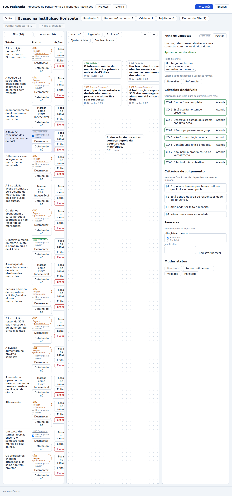
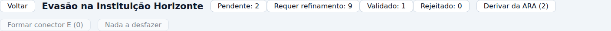
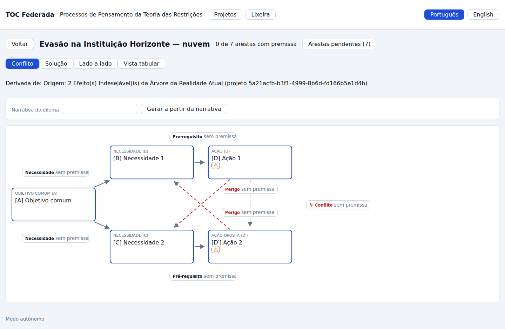
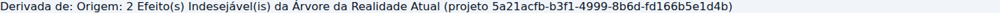
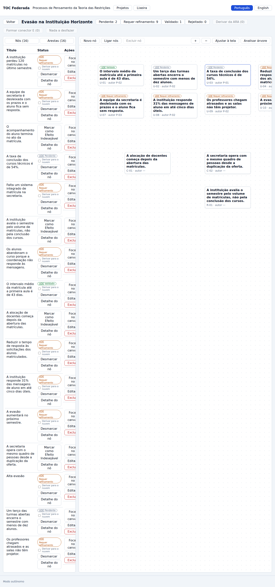

# J-07 · A travessia — da Árvore da Realidade Atual à Nuvem de Conflito

> **Siglas deste documento**, na primeira ocorrência: **TOC** — Teoria das Restrições ·
> **ARA** — Árvore da Realidade Atual · **NC** — Nuvem de Conflito · **UDE** — Efeito
> Indesejável (*Undesirable Effect*) · **API** — interface de programação de aplicações ·
> **HTTP** — *HyperText Transfer Protocol* · **URL** — *Uniform Resource Locator* ·
> **INT** — requisito de integração · **RF/RN** — requisito funcional / regra de negócio ·
> **ADR** — Registro de Decisão Arquitetural · **P6** — o princípio "Jornada viva".

- **Estágio**: 🟢 viva — capturas do build real
- **Nasce no ciclo**: 007 (Nuvem de Conflito), pelo requisito **INT-05** ·
  **Specs**: [`../../specs/005-arvore-da-realidade-atual/spec.md`](../../specs/005-arvore-da-realidade-atual/spec.md)
  e [`../../specs/007-nuvem-de-conflito/spec.md`](../../specs/007-nuvem-de-conflito/spec.md)
- **Capturas geradas em**: 2026-09-06 · **Avaliação heurística revisitada em**: 2026-09-06
- **Como regenerar** (a travessia corre no meio da corrente J-02 → J-07 → J-03, e é assim
  de propósito — é a mesma pessoa, na mesma sessão):

  ```bash
  PLAYWRIGHT_BROWSERS_PATH=/opt/pw-browsers node docs/jornadas/scripts/capturar-telas.mjs --jornada J-07
  ```

- **Base**: sintética, `docs/produto/dados/analise-horizonte.json` v1.0.0 (ADR 0006).

## Por que esta é a jornada que importa

**Nenhuma das quatro gerações da linhagem TOC-Builder entregou o encadeamento entre duas
ferramentas.** Cada uma tinha telas por ferramenta, e cada ferramenta começava do zero: a
pessoa terminava a ARA, olhava para os efeitos indesejáveis, e então **redigitava** o
dilema numa tela de Nuvem que não sabia de onde ele veio. O que se perdia não era
digitação — era a **rastreabilidade**: depois de fechada, ninguém conseguia dizer qual
efeito da árvore justificava aquela nuvem.

Esta jornada mostra a costura fechando: a mesma pessoa, na mesma sessão, escolhe efeitos
indesejáveis **validados** na árvore, promove-os a dilema em um clique, e a nuvem que nasce
**diz de onde veio**, com referência tipada para o projeto e para os nós exatos.

## Quem, e o que quer

A **Facilitadora TOC** já tem a árvore da Instituição Horizonte montada (jornada
[J-02](002-primeiro-projeto-e-ara.md)). Olhando o lote de efeitos, ela reconhece a tensão
clássica daquela instituição, escrita em dois deles:

| Efeito | Enunciado | Puxa para |
|---|---|---|
| **U-02** | *Um terço das turmas abertas encerra o semestre com menos de dez alunos.* | volume de turmas — receita |
| **U-03** | *A taxa de conclusão dos cursos técnicos é de 54%.* | qualidade — conclusão |

Os dois não são causa um do outro: são **os dois lados de um conflito**. É exatamente o
caso em que a ferramenta seguinte é a Nuvem, e o que ela quer é entrar nela **sem perder o
fio**.

## O percurso

### 1 · Escolher os efeitos que sustentam o dilema

Na coluna de status do painel, cada UDE traz a caixa **"Derivar para a nuvem"**. A
Facilitadora marca os dois:



O botão do cabeçalho arma-se e **conta**: `Derivar da ARA (2)`.



Repare no cabeçalho inteiro: `Pendente: 2 · Requer refinamento: 9 · Validado: 1 ·
Rejeitado: 0`. A regra que o domínio aplica aqui é a maior que não trava o método —
**marcado e não rejeitado** —, e ela está escrita e justificada em
[`../../apps/api/src/toc_api/dominio/nuvem.py`](../../apps/api/src/toc_api/dominio/nuvem.py)
(`derivar_nuvem_de_udes`): exigir status `validado` tornaria a costura inalcançável
justamente na sessão em que o dilema aparece, antes do parecer humano.

Três recusas nomeadas guardam a porta: `sem_ude` (derivar sem efeito nenhum), `no_nao_e_ude`
(o nó existe mas não está marcado) e `ude_rejeitado` (o grupo já decidiu que aquele
enunciado não se sustenta).

### 2 · Um clique, e a Nuvem existe

Clicar em "Derivar da ARA (2)" **leva a pessoa para a nuvem** — não abre um diálogo, não
volta para a lista de projetos:



O que nasce é a topologia canônica inteira: **cinco entidades** (A objetivo comum, B e C
necessidades, D e D′ ações em conflito) e **sete arestas** — duas de necessidade, duas de
pré-requisito, duas de perigo e uma de conflito. Todas marcadas `sem premissa`, e o
cabeçalho declarando `0 de 7 arestas com premissa`.

As entidades vêm com texto de exemplo (`[A] Objetivo comum`, `[B] Necessidade 1`…) **por
decisão**: derivar dá o **ponto de partida**, não inventa o conflito. Quem escreve A, B, C,
D e D′ é o grupo — ou a geração assistida, que entra como proposta com portão humano
(jornada [J-03](003-nuvem-de-conflito.md)).

### 3 · A rastreabilidade, que é o ponto inteiro



> Derivada de: Origem: 2 Efeito(s) Indesejável(is) da Árvore da Realidade Atual (projeto
> 5a21acfb-b3f1-4999-8b6d-fd166b5e1d4b)

A linha na tela é a face visível de uma referência **tipada** no agregado. O script conferiu
a referência contra os nós que a pessoa marcou, e **falharia a corrida** se ela apontasse
para outros — a asserção está em
[`scripts/capturar-telas.mjs`](scripts/capturar-telas.mjs) (`a origem aponta para nós
diferentes dos escolhidos`). O que voltou:

```text
  · origem: projeto 5a21acfb-b3f1-4999-8b6d-fd166b5e1d4b, 2 nós
  · leitura: Origem: 2 Efeito(s) Indesejável(is) da Árvore da Realidade Atual (projeto 5a21acfb-b3f1-4999-8b6d-fd166b5e1d4b)
```

### 4 · A árvore de origem, intacta



Voltar à lista e reabrir a árvore mostra os mesmos 16 nós e as mesmas 16 arestas, com os
mesmos status. **Derivar lê, nunca escreve**: a ARA não emite evento nenhum do lado do M2,
e a nuvem é um projeto novo, com dono herdado do agregado de origem — não do pedido, o que
faz o isolamento por inquilino ser consequência do tipo e não de disciplina de quem chama.

## O que esta jornada prova

| Afirmação | Evidência |
|---|---|
| A escolha dos efeitos acontece **na** ARA, sem sair da ferramenta | captura 01 — caixas "Derivar para a nuvem" na coluna de status |
| A promoção é um clique e leva à ferramenta seguinte | captura 03 — a nuvem, não um diálogo |
| A nuvem nasce com a topologia canônica completa | captura 03 — 5 entidades, 7 arestas; contagem medida no diagrama em J-03: `arestas desenhadas no diagrama: 7` |
| A nuvem **diz de onde veio** | captura 04 + `origem: projeto …, 2 nós` |
| A origem aponta para **os nós que a pessoa marcou** | asserção do script, que derruba a corrida se divergir |
| A árvore de origem fica intacta | captura 05 — 16 nós, 16 arestas, status preservados |
| **Não prova**: que a nuvem herda o *texto* dos efeitos nas entidades | as entidades nascem com texto de exemplo, por decisão de domínio |

## Avaliação heurística — 2026-09-06

Avaliada por um agente, em contexto de construção, sobre as capturas geradas nesta mesma
data. **Não houve teste com pessoa usuária**, e esta jornada em particular pediria um: a
pergunta "a pessoa entende que as entidades de exemplo são para ela reescrever?" não se
responde por inspeção.

| # | Achado | Heurística | Severidade | Destino |
|---|---|---|---|---|
| A-01 | A linha de origem identifica o projeto por identificador universal (`5a21acfb-b3f1-…`) em vez do **nome** da árvore, e não diz **quais** dois efeitos foram promovidos — a rastreabilidade existe no dado e está ilegível na tela | Correspondência com o mundo real | **Alta** | 📝 registrado |
| A-02 | A nuvem derivada abre com as cinco entidades em texto de exemplo (`[A] Objetivo comum`) e nada na tela diz que a pessoa deve reescrevê-las; o "0 de 7 arestas com premissa" sugere trabalho pendente, mas o texto das entidades não | Visibilidade do estado / ajuda | Média | 📝 registrado |
| A-03 | Não há caminho de volta: da nuvem não se abre a ARA de origem em um clique — é preciso voltar à lista e reconhecer o projeto pelo nome | Controle e liberdade | Média | 📝 registrado |
| ✅ | O botão de derivar conta quantos efeitos estão escolhidos e fica desabilitado com zero | Visibilidade do estado do sistema | — | conforme |
| ✅ | A promoção **navega** para a nuvem em vez de deixar a pessoa procurá-la | Flexibilidade e eficiência | — | conforme |
| ✅ | A árvore de origem não é alterada pela derivação | Prevenção de erro | — | conforme |
| ✅ | A regra de admissão dos efeitos (marcado e não rejeitado) está declarada e justificada no domínio, com três recusas nomeadas | Diagnóstico de erro | — | conforme |

### Rastro do achado A-01, por `arquivo:linha`

- [`apps/api/src/toc_api/http/esquemas.py`](../../apps/api/src/toc_api/http/esquemas.py) —
  `OrigemOut` carrega `ferramenta`, `projeto_id`, `nos` e `leitura`. **O dado está lá**: os
  identificadores dos nós viajam na resposta.
- [`apps/web/src/telas/TelaDaNuvem.tsx`](../../apps/web/src/telas/TelaDaNuvem.tsx) —
  `{nuvem.origem ? <p className="origem">…{nuvem.origem.leitura}</p> : null}`: a tela mostra
  só a `leitura`, que é a frase montada no servidor com o identificador cru.

A correção é barata e não é deste lote: a `leitura` pode nomear a árvore e enumerar os
enunciados promovidos, já que o agregado de origem foi lido para montar a nuvem.
