# J-09 · Os cinco passos de focalização

> **Siglas deste documento**, na primeira ocorrência: **TOC** — Teoria das Restrições ·
> **M6** — o módulo Focalização · **M1** — Núcleo de Diagramas Lógicos · **ARA** — Árvore
> da Realidade Atual · **NC** — Nuvem de Conflito · **ARF** — Árvore da Realidade Futura ·
> **APR** — Árvore de Pré-Requisitos · **AT** — Árvore de Transição · **UDE** — Efeito
> Indesejável (*Undesirable Effect*) · **API** — interface de programação de aplicações ·
> **IA** — inteligência artificial · **ADR** — Registro de Decisão Arquitetural · **P6** —
> o princípio "Jornada viva" da constituição do projeto · **RF/RI/RN/RNF** — requisito
> funcional / de interface / regra de negócio / não funcional · **DoD** — *Definition of
> Done* (Definição de Pronto).

- **Estágio**: 🟢 viva — capturas do build real
- **Nasce no ciclo**: 009 · **Spec**:
  [`../../specs/009-focalizacao/spec.md`](../../specs/009-focalizacao/spec.md)
- **Capturas geradas em**: 2026-09-06 · **Avaliação heurística revisitada em**: 2026-09-06
- **Como regenerar** (a jornada vincula a árvore da J-02 e a nuvem da J-03, e por isso a
  corrente corre junta):

  ```bash
  PLAYWRIGHT_BROWSERS_PATH=/opt/pw-browsers node docs/jornadas/scripts/capturar-telas.mjs --jornada J-09
  ```

- **Base**: sintética — a análise "Fluxo de matrículas da Instituição Horizonte", sobre a
  ARA de [`docs/produto/dados/analise-horizonte.json`](../produto/dados/analise-horizonte.json)
  v1.0.0. Instituição e personas **fictícias** (ADR 0006).

## Quem, e o que quer

A **Facilitadora TOC** terminou duas coisas: a árvore da evasão (jornada
[J-02](002-primeiro-projeto-e-ara.md)) e a nuvem do dilema que ela revelou (jornada
[J-03](003-nuvem-de-conflito.md)). Ela tem seis ferramentas e uma pergunta que nenhuma
delas responde: **qual é a restrição, e em que passo o grupo está?**

É essa a pergunta que a linhagem TOC-Builder nunca fez. O `grep` sobre as quatro gerações
por `focaliza|five focusing|cinco passos` devolve **`0`** (spec 009, F-01; a saída está
colada no [ADR 0005](../adr/0005-escopo-do-dominio-v1.md)). Sem os cinco passos, seis
ferramentas são seis editores desconexos; com eles, viram uma jornada com começo, direção
e critério de recomeço.

O que ela quer aqui não é mais um diagrama. É **conduzir uma sessão**: registrar a
restrição, avançar um passo por vez com a decisão que encerra cada um, apontar cada passo
para a ferramenta certa, e — quando a restrição quebrar — recomeçar **sem que as regras do
ciclo passado sobrevivam por inércia**.

## O percurso

### 0 · A análise nasce inteira

A listagem começa vazia, e o formulário pede duas coisas: o nome da análise e o **sistema
analisado**. Sem sistema, "restrição de quê?" não tem resposta — e uma restrição sem
sistema é uma frase, não um alvo.

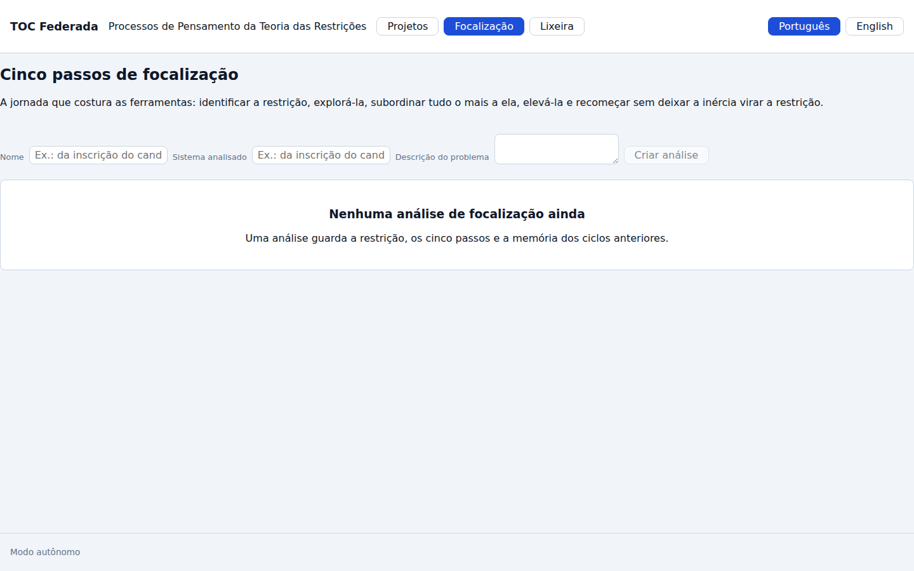

Criar é **um ato só** (RF-02): a análise nasce com o primeiro ciclo aberto no passo
`identificar` e com os cinco passos já instanciados. Não existe análise sem ciclo, nem
ciclo sem os cinco passos — quem cria não escolhe a forma da jornada, e por isso não pode
errá-la.

### 1 · Identificar — a ferramenta do passo é a ARA

O primeiro passo vincula a árvore da J-02 e registra a restrição. Os dois atos são
distintos de propósito: a ferramenta **ajuda, nunca condiciona** (RF-06), e uma restrição
registrada à mão, sem árvore nenhuma, é igualmente válida.

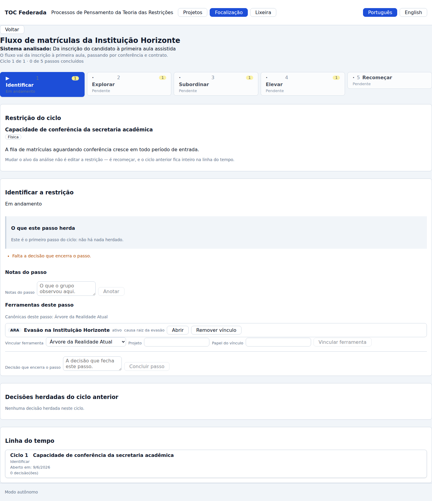

A restrição é a **entidade que dá nome à teoria**, e o round 009 a marca "nunca sai". Ela
tem descrição, tipo (`física` no caso: é capacidade, não política) e a justificativa que a
sustenta. O aviso abaixo dela não é decoração — é a RN-03 escrita onde alguém vai lê-la:

> Mudar o alvo da análise não é editar a restrição — é recomeçar, e o ciclo anterior fica
> inteiro na linha do tempo.

Concluir o passo exige a decisão que o encerra. O avanço é **ato explícito**, nunca efeito
colateral de ter anotado alguma coisa:

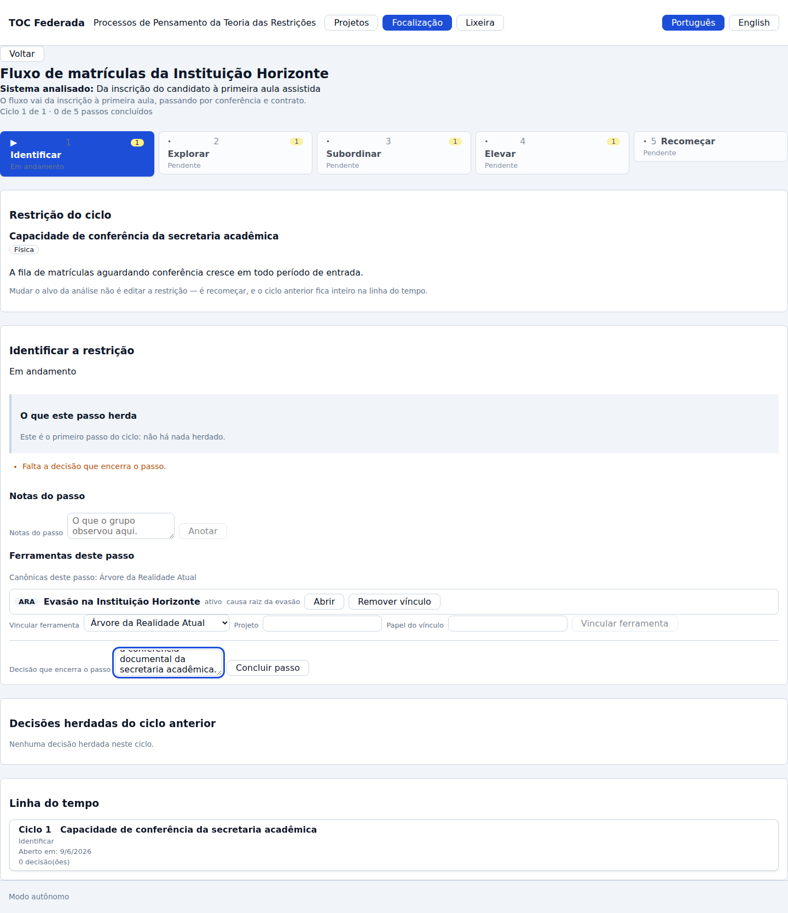

### 2 · Explorar — e o passo abre com o produto do anterior à vista

Este é o requisito que separa uma jornada de cinco caixas de texto em fila. Ao abrir
`explorar`, o topo do painel já traz **o que o passo herda** (RF-13):

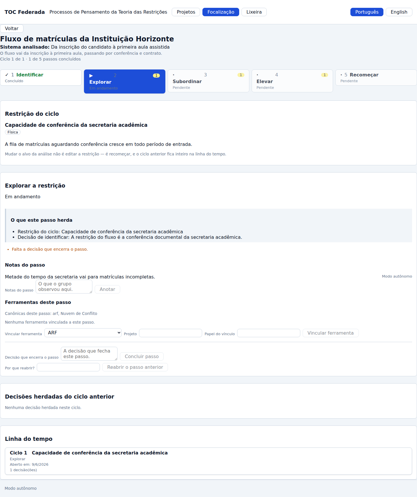

A camada herdada de perto — a restrição do ciclo e a decisão que fechou `identificar`:

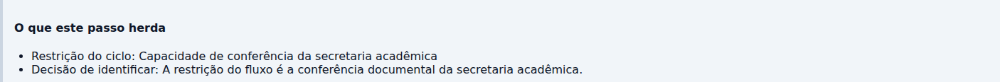

Ela não é montada pela tela. É computada por **função pura de domínio** (`mapa_da_jornada`,
RF-12) e chega pronta na resposta; a interface desenha o que recebeu. Uma segunda conta na
tela seria uma segunda verdade, e as duas divergiriam no primeiro requisito novo.

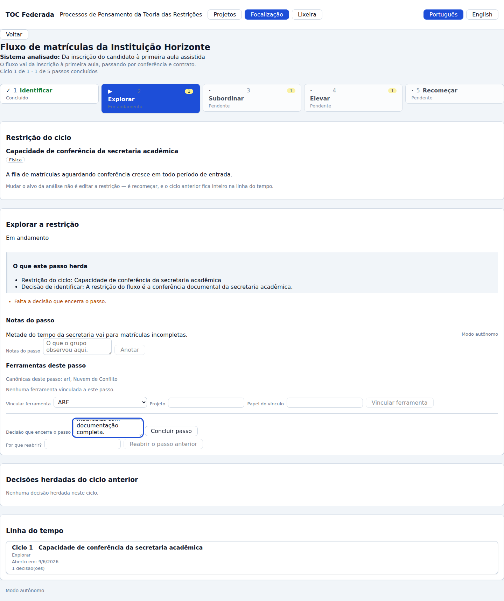

### 3 · Subordinar — o conflito vira Nuvem de Conflito

Aqui aparece a resistência que o método prevê: a coordenação contesta a regra de só abrir
turma com a conferência concluída. **A resistência não é vencida no grito** — ela vira uma
NC vinculada ao passo (US-10, INT-03), e a nuvem que entra é a que a J-03 construiu.

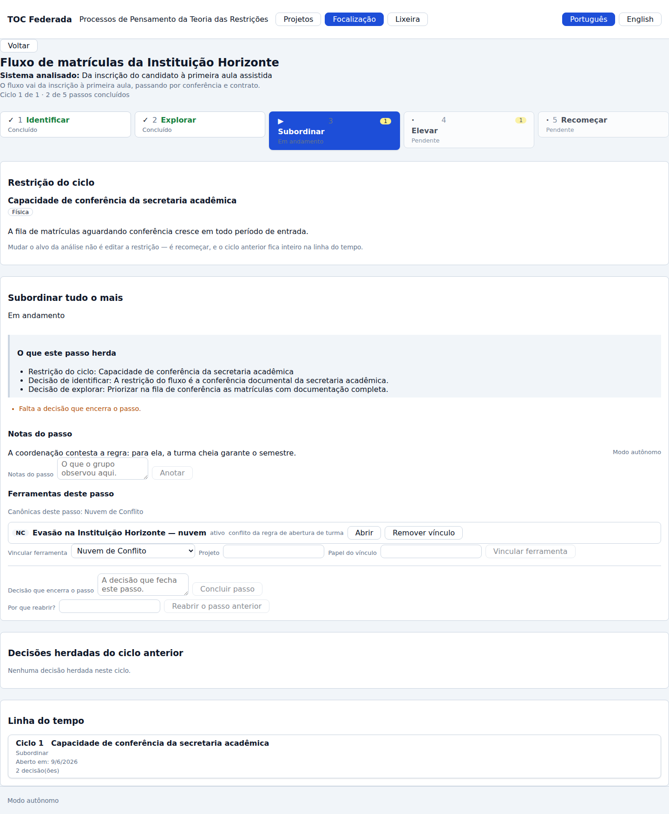

O cartão de vínculo carrega **tipo, nome, estado e navegação — e nenhum conteúdo da
nuvem**. Copiar o texto da nuvem para dentro da análise seria a sétima cópia que o núcleo
M1 existe para impedir, e envelheceria no primeiro `PUT` do outro módulo. O que o cartão
mostra além do nome é o **estado do projeto vinculado** (`ativo`, `arquivado`, `ausente`),
verificado no servidor a cada leitura (RNF-04).

Note também a lista de canônicas do passo: `Nuvem de Conflito`. Vincular uma APR aqui não é
proibido — é **fora do canônico**, e então exige justificativa e sai com aviso. O método
educa; o dado obedece ao grupo (RN-06).

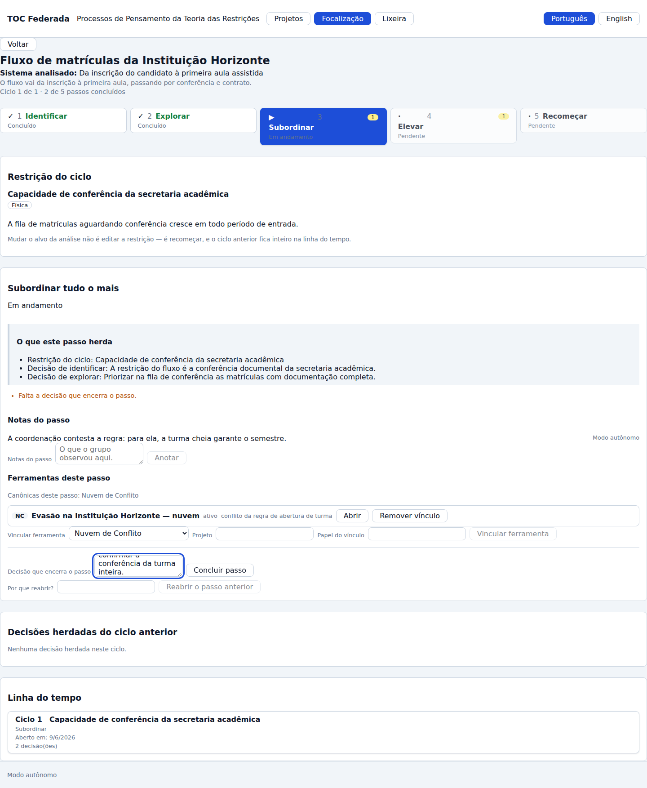

### 4 · Elevar — o plano é uma Árvore de Pré-Requisitos

Elevar a restrição não é um desejo: é um plano sequenciado de obstáculos e objetivos
intermediários. O passo vincula a APR (US-11, INT-04) e conclui com a decisão de elevação.

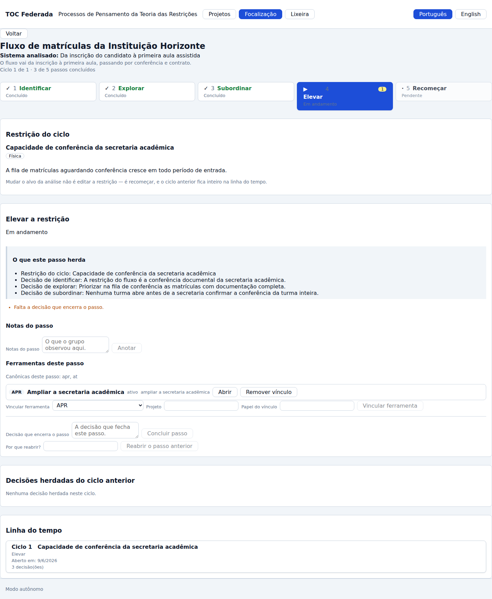

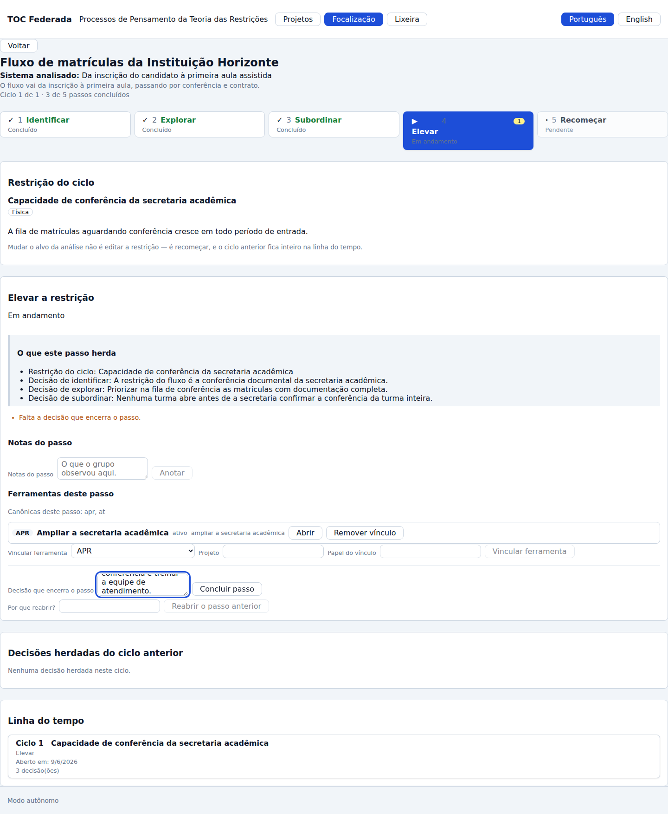

### 5 · Recomeçar — e é aqui que o módulo ganha o seu nome

O quinto passo **não tem decisão de conclusão** (RN-07). O ato dele é o recomeço, e é a
única coisa que a tela oferece:

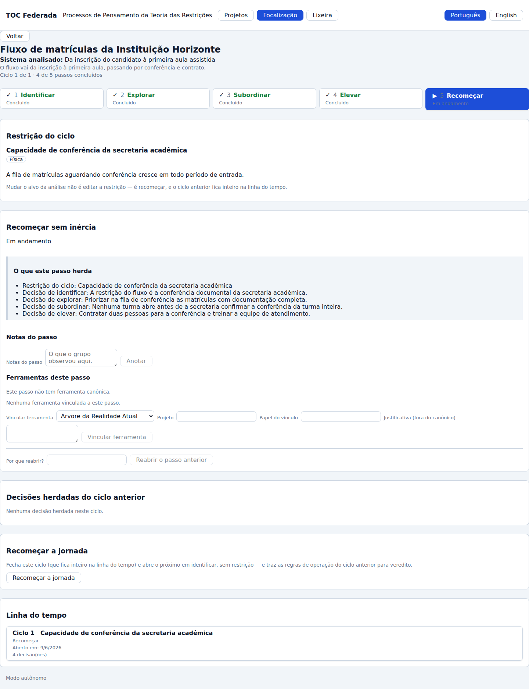

Recomeçar fecha o ciclo 1 e abre o ciclo 2 em `identificar`, **sem restrição** — porque
procurar a nova restrição é o trabalho do primeiro passo, e vir com uma preenchida seria
responder a pergunta que o método manda refazer.

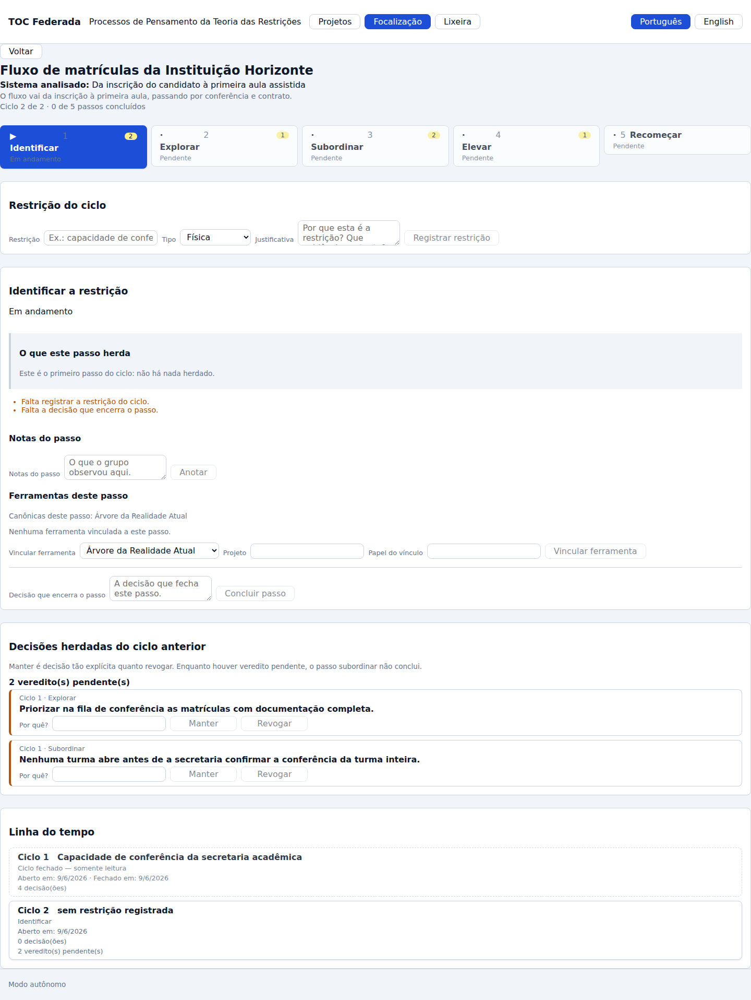

Medida da corrida, colada da saída do gerador:

```text
  · ciclo 2 de 2 · passo identificar · vereditos pendentes: 2
  · linha do tempo: ciclo 1 fechado (4 decisões) · ciclo 2 aberto (0 decisões)
```

## A metade que costuma morrer: a inércia

O quinto passo de Goldratt não é "volte ao passo 1". É "volte ao passo 1 **e não deixe a
inércia virar a restrição do sistema**". A segunda metade é a que desaparece em toda
implementação, porque é a que não tem tela óbvia.

Aqui ela tem — e, antes de ter tela, é **invariante de domínio**. As decisões de exploração
e de subordinação do ciclo que fechou entram no ciclo novo com veredito `pendente`, e o
passo `subordinar` **não conclui** enquanto houver pendência (RN-05):

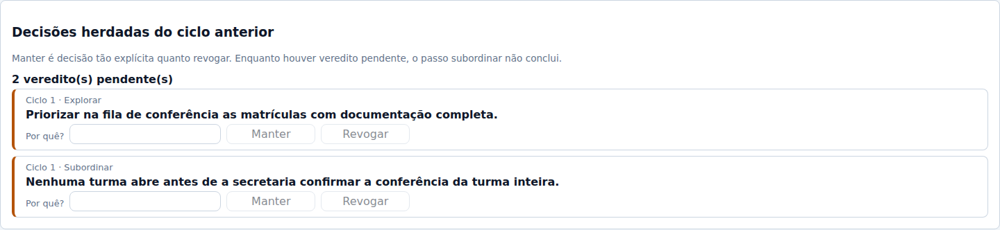

Duas coisas nesta tela são a regra escrita em pixels:

1. **`Manter` e `Revogar` têm o mesmo peso.** Mesmo tipo de botão, mesma largura, mesma
   justificativa obrigatória, lado a lado. Se manter fosse mais barato de clicar do que
   revogar, a interface estaria empurrando a inércia de volta.
2. **A justificativa é obrigatória nos dois caminhos.** Manter uma regra sem dizer por quê
   é exatamente a inércia que a regra existe para impedir.


E há uma regra que a spec não escreveu e que o método exige: **"mantida" não é passe
vitalício**. No recomeço seguinte, uma decisão que o ciclo anterior manteve volta à mesa —
senão ela atravessaria a análise inteira por um julgamento feito uma vez, que é a definição
de inércia. As revogadas morrem ali, que é o que revogar quer dizer. Está no domínio
(`apps/api/src/toc_api/dominio/focalizacao.py`, função `_herdar`) e coberto por
[`test_heranca.py`](../../apps/api/tests/dominio/test_heranca.py).

## Histórico é apêndice, nunca sobrescrita

A linha do tempo cresce e nunca encolhe (RN-04). O ciclo 1 continua ali, com a restrição
que perseguiu, as datas e as quatro decisões que o grupo tomou:

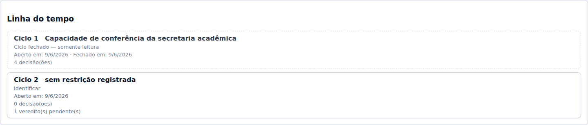

Abrir o ciclo fechado devolve a jornada inteira dele **em somente leitura** — e quem diz
que é somente leitura é o **servidor**, no campo `somente_leitura` da resposta, não um `if`
da tela:

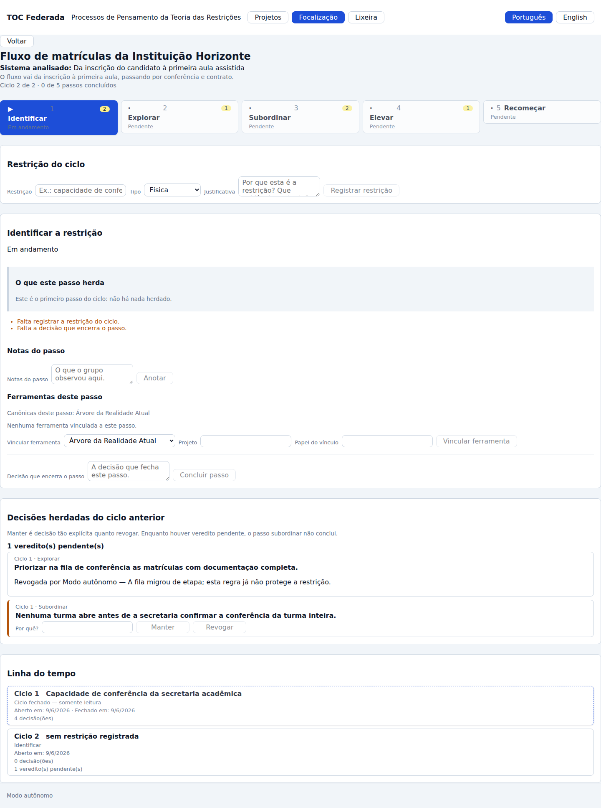

Repare no que **não** existe nesta captura: formulário de nota, formulário de decisão,
formulário de vínculo. O domínio recusaria de qualquer forma (`CicloInvalido`, regra
`ciclo_fechado`); a tela não oferece o que o domínio recusa.

## O que esta jornada NÃO mostra, e por quê

- **A sugestão assistida de restrição** (`toc.suggest_constraint`). Ela existe, nasce
  `action_proposal` e tem prova de recusa intacta
  ([`test_catalogo_m6.py`](../../apps/api/tests/integracao/test_catalogo_m6.py)) — mas o
  round 009 a marca como **primeiro corte de apetite**, e a jornada guiada é completa por
  construção sem ela (RF-20). Esta captura mostra o produto; a assistência é acessório.
- **O conteúdo dos projetos vinculados.** O cartão leva à ARA, à NC e à APR; o que há
  dentro delas é jornada das outras (J-02, J-03). O M6 guarda referência, nunca cópia.

## Avaliação heurística — 2026-09-06

Método: as dez heurísticas de Nielsen aplicadas às capturas acima, do build real. Achado
com número entra no `qa-report.md` do ciclo; achado sem prova não entra.

| # | Heurística | Achado | Gravidade | Encaminhamento |
|---|---|---|---|---|
| A-01 | Visibilidade do estado do sistema | ✅ A trilha diz o passo, o estado por extenso e o número de pendências de cada um; o cabeçalho diz "Ciclo 2 de 2 · 0 de 5 passos concluídos". Estado nunca depende de cor: marcador (`✓`/`▶`/`·`), número de ordem e rótulo textual. | — | — |
| A-02 | Correspondência com o mundo real | ✅ Os cinco passos usam os nomes do método, não jargão de software. `Física`/`Política`/`De mercado` são os três tipos clássicos da literatura da TOC. | — | — |
| A-03 | Controle e liberdade | ⚠️ `Reabrir o passo anterior` fica na **mesma linha** de `Concluir passo`, com o mesmo peso — e as duas ações vão em sentidos opostos. Um clique errado registra reabertura (que é evento, não some). | baixa | A reabertura é reversível por concluir de novo, e o histórico guarda as duas decisões. Separar as duas ações em blocos distintos é ajuste de layout — ADR não é necessário (R3). Registrado como dívida no `qa-report`. |
| A-04 | Consistência e padrões | ⚠️ O rodapé "Modo autônomo" da casca **flutua sobre o painel do passo** em 1440×900 (visível na captura 06, à direita das notas). É defeito da casca, não do M6 — a mesma sobreposição aparece nas jornadas J-02 e J-03. | baixa | Não corrigido neste lote: mexer na casca afeta três jornadas e é escopo de outro ciclo. Registrado. |
| A-05 | Prevenção de erro | ✅ `Concluir passo` e `Vincular ferramenta` ficam desabilitados sem o campo obrigatório; vínculo fora do canônico só libera com justificativa. **E nada é escondido por regra de negócio**: concluir um passo bloqueado por herança continua clicável, e a recusa volta com a regra nomeada — esconder ensinaria a pessoa a não ver a regra. | — | — |
| A-06 | Reconhecer em vez de lembrar | ✅ É o coração do módulo: a camada herdada põe a restrição e as decisões anteriores na frente de quem vai decidir (RF-13). Sem ela, o passo 3 exigiria lembrar o que o passo 2 concluiu. | — | — |
| A-07 | Flexibilidade e eficiência | ⚠️ A rota **não vive na URL**: recarregar volta para a lista de projetos. É o mesmo achado da J-02, herdado da casca (o roteamento é estado do React). | média | Já registrado na J-02; continua aberto e agora afeta duas jornadas a mais. |
| A-08 | Estética e design minimalista | ⚠️ O painel do passo empilha quatro formulários (nota, vínculo, decisão, reabertura) numa coluna só. Com o ciclo cheio, a decisão de conclusão fica **abaixo da dobra** em 1440×900. | média | A decisão é a ação principal do passo; ancorá-la no rodapé visível é ajuste de layout do próximo ciclo de interface. Registrado. |
| A-09 | Ajudar a reconhecer e recuperar erros | ✅ A recusa do servidor chega traduzida **pelo código** (`INVALID_FOCUSING_STEP`, `INVALID_TOOL_LINK`, `INVALID_CYCLE`, …), com `details.regra` — nunca pelo texto da mensagem. Coberto por `TelaDaFocalizacao.test.tsx`. | — | — |
| A-10 | Ajuda e documentação | ✅ A explicação do anti-inércia está **na tela onde a decisão acontece** ("Manter é decisão tão explícita quanto revogar…"), e não num tooltip. | — | — |

### Um achado que a própria captura pegou

A primeira corrida do gerador **falhou no passo `subordinar`**: o botão `Vincular
ferramenta` ficava desabilitado. O motivo era um defeito real, e não do teste — o seletor
de ferramenta guardava a canônica do passo em que o painel havia sido **montado**
(`identificar` → ARA) e não seguia a troca de passo. Em `subordinar`, a interface pedia
justificativa por um vínculo que era canônico.

A correção foi dar ao painel uma `key` pelo tipo do passo, o que também faz o rascunho de
nota e de decisão morrer com o passo que o gerou — que é o comportamento certo. É o
argumento inteiro da Iron Law da skill `living-journey`: **captura do build real acha o que
teste de componente com fixture não acha**, porque a fixture nunca troca de passo no meio.

## Rastreabilidade

| Requisito | Onde vive | Prova |
|---|---|---|
| RF-02 · a análise nasce com o ciclo e os cinco passos | `apps/api/src/toc_api/dominio/focalizacao.py` · `nova_analise_de_focalizacao` | `apps/api/tests/dominio/test_focalizacao.py` |
| RF-12/RF-13 · mapa da jornada e estado herdado | `apps/api/src/toc_api/dominio/focalizacao.py` · `mapa_da_jornada` | `apps/api/tests/dominio/test_jornada_completa.py` |
| RF-14/RN-06 · vínculo tipado e canônicas | `apps/api/src/toc_api/dominio/focalizacao.py` · `vincular_ferramenta` | `apps/api/tests/dominio/test_vinculos.py` |
| RF-15/RN-04 · recomeçar sem apagar | `apps/api/src/toc_api/dominio/focalizacao.py` · `recomecar` | `apps/api/tests/dominio/test_jornada_completa.py`, caso `recomeco` |
| RF-16/RN-05 · a inércia bloqueada | `apps/api/src/toc_api/dominio/focalizacao.py` · `_herdar` | `apps/api/tests/dominio/test_heranca.py` |
| RNF-04 · vínculo validado no servidor | `apps/api/src/toc_api/aplicacao/focalizacao.py` · `VincularFerramenta` | `apps/api/tests/aplicacao/test_vinculos_borda.py` |
| RI-01..RI-05, RI-07 · as telas | `apps/web/src/telas/TelaDaFocalizacao.tsx` | `apps/web/src/telas/TelaDaFocalizacao.test.tsx` |
