# J-10 · As três árvores de futuro e a cadeia

> **Siglas deste documento**, na primeira ocorrência: **TOC** — Teoria das Restrições ·
> **M4** — o módulo Árvores de Futuro e Implementação · **M1** — Núcleo de Diagramas
> Lógicos · **ARA** — Árvore da Realidade Atual · **NC** — Nuvem de Conflito · **ARF** —
> Árvore da Realidade Futura · **APR** — Árvore de Pré-Requisitos · **AT** — Árvore de
> Transição · **UDE** — Efeito Indesejável (*Undesirable Effect*) · **ED** — Efeito
> Desejável · **OI** — Objetivo Intermediário · **API** — interface de programação de
> aplicações · **IA** — inteligência artificial · **ADR** — Registro de Decisão
> Arquitetural · **P6** — o princípio "Jornada viva" da constituição do projeto ·
> **RF/RI/RN** — requisito funcional / de interface / regra de negócio.

- **Estágio**: 🟢 viva — capturas do build real
- **Nasce no ciclo**: 008 (domínio) + este lote (interface) · **Spec**:
  [`../../specs/008-arvores-de-futuro-e-implementacao/spec.md`](../../specs/008-arvores-de-futuro-e-implementacao/spec.md)
- **Capturas geradas em**: 2026-09-06 · **Avaliação heurística revisitada em**: 2026-09-06
- **Como regenerar** (a jornada parte da ARA da J-02, e por isso a corrente corre junta):

  ```bash
  PLAYWRIGHT_BROWSERS_PATH=/opt/pw-browsers node docs/jornadas/scripts/capturar-telas.mjs --jornada J-10
  ```

- **Base**: sintética — a análise da Instituição Horizonte, sobre a ARA de
  [`../produto/dados/analise-horizonte.json`](../produto/dados/analise-horizonte.json)
  v1.0.0. Instituição e personas **fictícias** (ADR 0006).

## Quem, e o que quer

A **Facilitadora TOC** tem a árvore da evasão (jornada [J-02](002-primeiro-projeto-e-ara.md)),
a nuvem do dilema (jornada [J-03](003-nuvem-de-conflito.md)) e a travessia entre as duas
(jornada [J-07](007-a-travessia.md)). O que ela não tem é **o outro lado**: o que passa a
ser verdade quando a injeção existir, o que precisa existir antes disso, e quem faz o quê
na segunda-feira.

Nas **quatro gerações do TOC-Builder** essa metade nunca existiu. A ARF era um botão
cinza — `tocbuilderv3/components/Sidebar.tsx:55`, literalmente `view: 'ARF', disabled:
true` —, e APR e AT nem botão tinham. O ciclo 008 escreveu o domínio das três e o
encadeamento entre elas; **este lote lhes deu tela**. Domínio sem tela é metade do
trabalho: era exatamente a crítica que fazíamos às gerações anteriores, e ela vale para
nós.

## O percurso

### 1 · A árvore de futuro nasce de uma injeção escolhida

A ARF não nasce em branco. Ela é **semeada** pela injeção que a Nuvem de Conflito escolheu
(RF-38), e a injeção escolhida vira o primeiro nó da árvore. O nó semente já chega no lugar
certo da leitura: é dele que tudo parte.

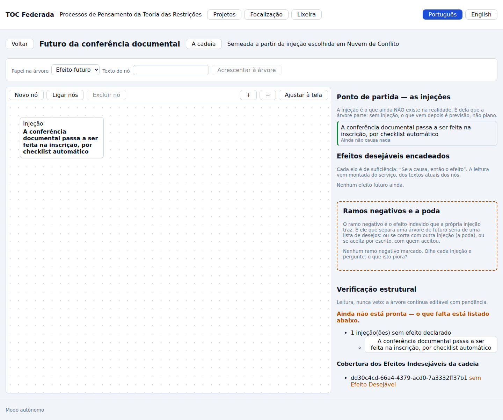

Repare na estrutura da tela, que não é a da ARA por acaso. À esquerda, o canvas. À direita,
**três blocos e não um**: o *ponto de partida* (as injeções), os *efeitos desejáveis
encadeados*, e — separado dos dois — os *ramos negativos*. A separação é a decisão de
projeto mais importante deste lote, e a razão dela está três seções abaixo.

Acrescentar à árvore pede **o papel antes do texto**: injeção (o que ainda não existe) ou
efeito futuro (o que passa a ser verdade quando ela existir). Não há um "novo nó" genérico
que depois se classifica — o papel é o que dá sentido ao nó, e pedi-lo depois seria
convidar a árvore a ficar sem ele.

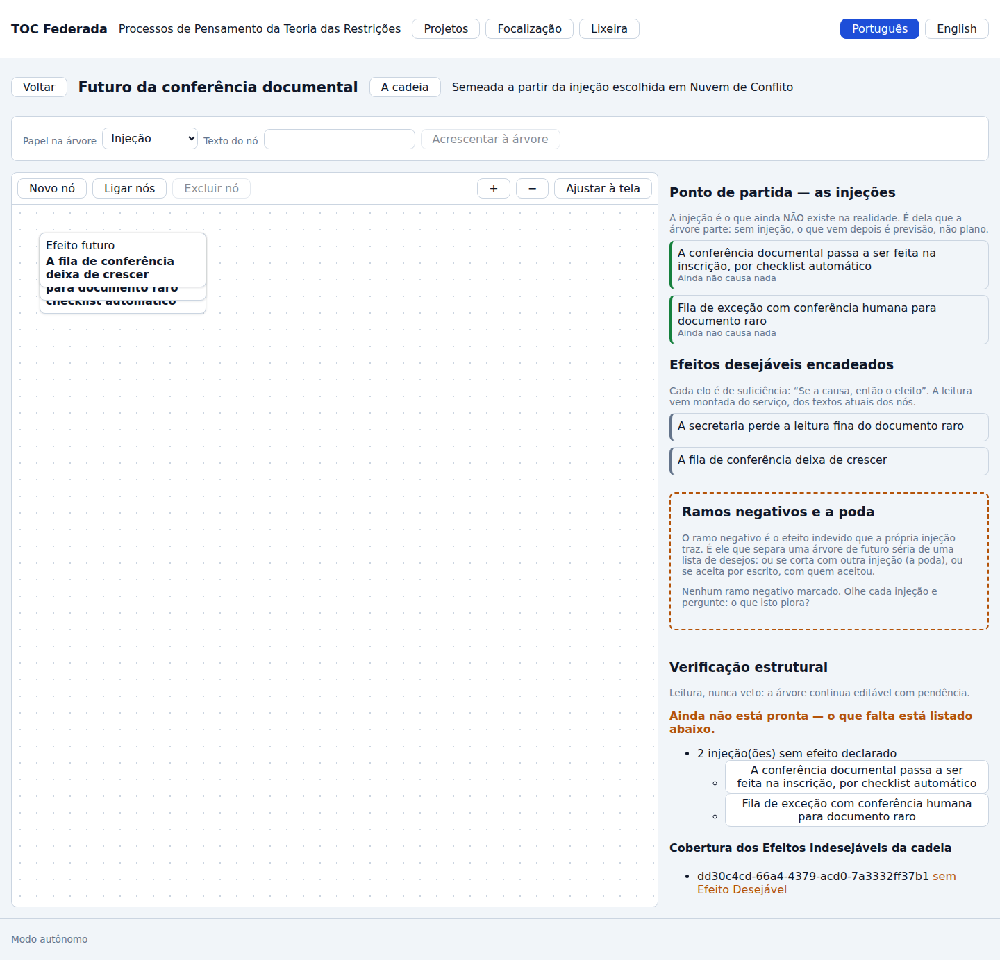

### 2 · A lógica da ARF é suficiência, e a leitura vem pronta

Ligar dois nós na ARF é afirmar **suficiência causal**: "Se a causa, então o efeito". A
leitura de cada elo é montada **no servidor**, dos textos atuais dos nós — a tela não a
remonta, e por isso ela nunca envelhece em relação ao texto que está lá.

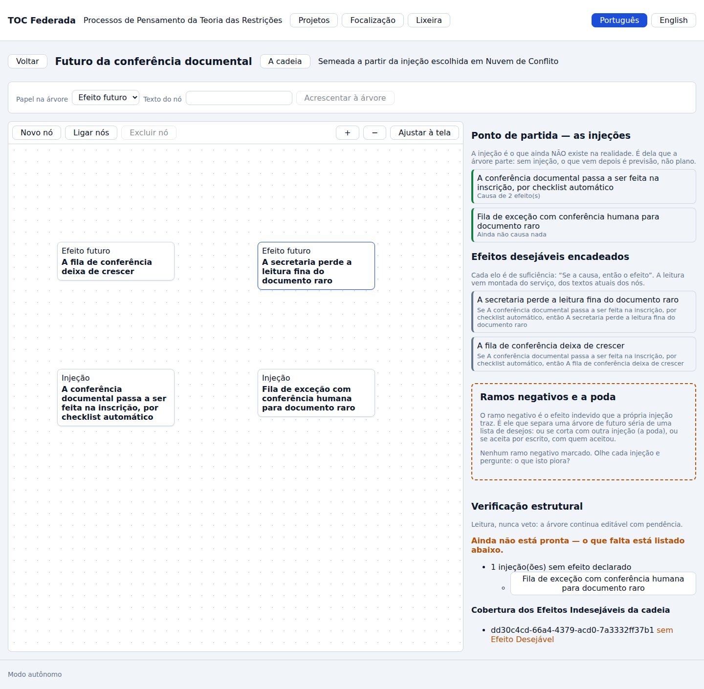

Um efeito futuro vira **Efeito Desejável** quando espelha um Efeito Indesejável da cadeia
(RN-03): é a promessa de que aquele efeito específico converte aquela queixa específica. O
seletor só oferece os UDEs que a cadeia trouxe — e, **numa ARF sem cadeia vinculada, o
espelho simplesmente não existe** e a tela diz isso, em vez de mostrar um seletor vazio
(RF-07).

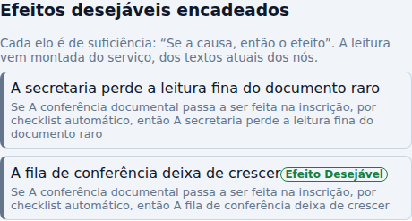

### 3 · O ramo negativo — o que separa árvore de futuro de lista de desejos

Toda injeção traz junto alguma coisa que piora. Uma árvore de futuro que só desenha o que
melhora não é uma análise: é uma lista de desejos com setas. O **ramo negativo** é o efeito
indevido que a própria injeção causa, e a ferramenta existe para obrigar a olhá-lo.

Por isso ele **não é mais um nó da lista**. Ao ser marcado, ele ganha três coisas ao mesmo
tempo: o selo "Efeito indevido" na lista de efeitos, uma moldura tracejada com faixa
lateral e uma **região própria** na tela, com estado e ações próprias.

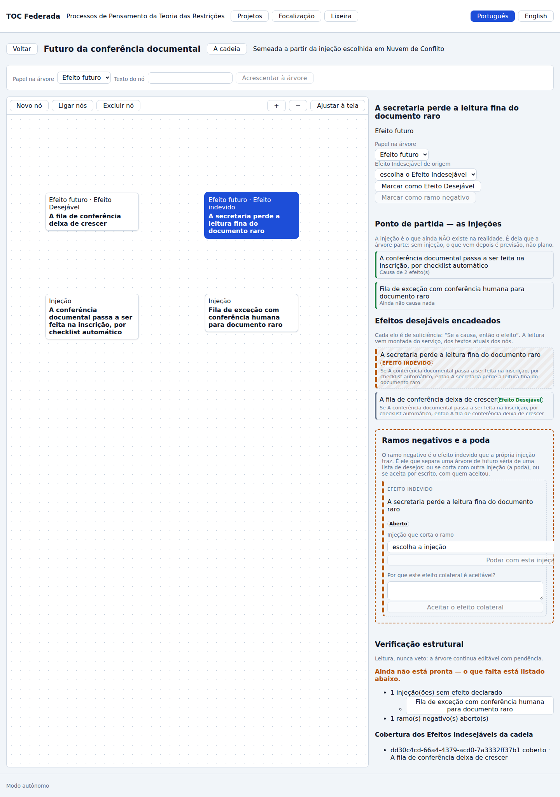

Um ramo aberto tem exatamente dois caminhos, e a tela os põe lado a lado com o mesmo peso:
**podar** (cortar o ramo com outra injeção) ou **aceitar** (conviver com ele, por escrito).

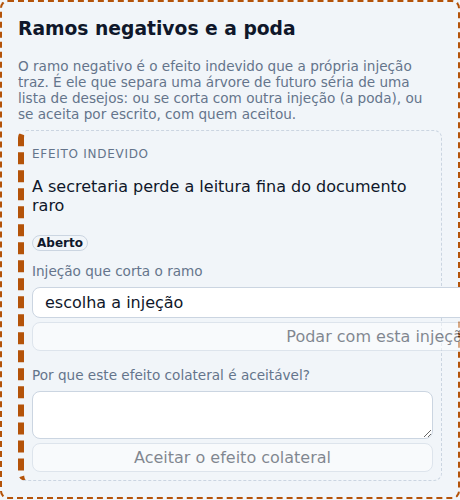

Três regras estão visíveis nessa captura, e nenhuma delas é enfeite:

1. **O seletor da poda só lista injeções** (RN-04). Um ramo negativo é cortado por injeção
   adicional, nunca por um efeito — e oferecer um efeito ali seria oferecer o que o
   servidor já recusa. A recusa continua no domínio, para quem chegar pela API.
2. **Aceitar exige justificativa, e o botão não arma sem ela.** Aceitar um efeito colateral
   é uma decisão, e decisão sem motivo escrito é esquecimento com carimbo.
3. **Não há campo de autor.** Quem aceitou é quem estava autenticado: o autor vem do
   principal no servidor, nunca do corpo do pedido. É a mesma regra do parecer do M2, e ela
   existe porque na 4ª geração da linhagem "quem validou" era texto que alguém digitava.

Podado, o ramo diz **por qual injeção** foi cortado — e o caminho de volta continua ali,
porque poda errada se desfaz:

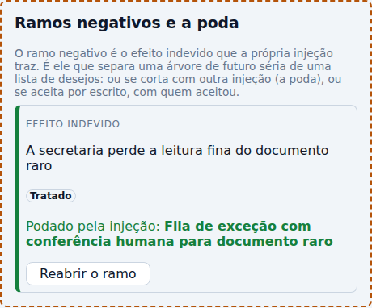

### 4 · A verificação estrutural é leitura, nunca veto

A ARF diz o que falta nela — Efeito Desejável sem caminho desde alguma injeção, injeção que
não causa nada, ramo negativo aberto, cobertura dos UDEs da cadeia — e **continua
editável**. `pronta` não é um portão: é uma leitura. O que a verificação impede é alguém
declarar a árvore pronta sem olhar (RF-11).

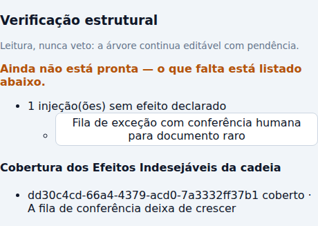

### 5 · A Árvore de Pré-Requisitos: a ordem é a informação

O efeito futuro escolhido **deriva** a APR, e o objetivo dela é *proposto* do texto do
efeito — proposto, não imposto: continua editável (RF-39). A árvore nasce com o objetivo, e
o objetivo não se apaga: sem topo, obstáculo nenhum tem sentido.

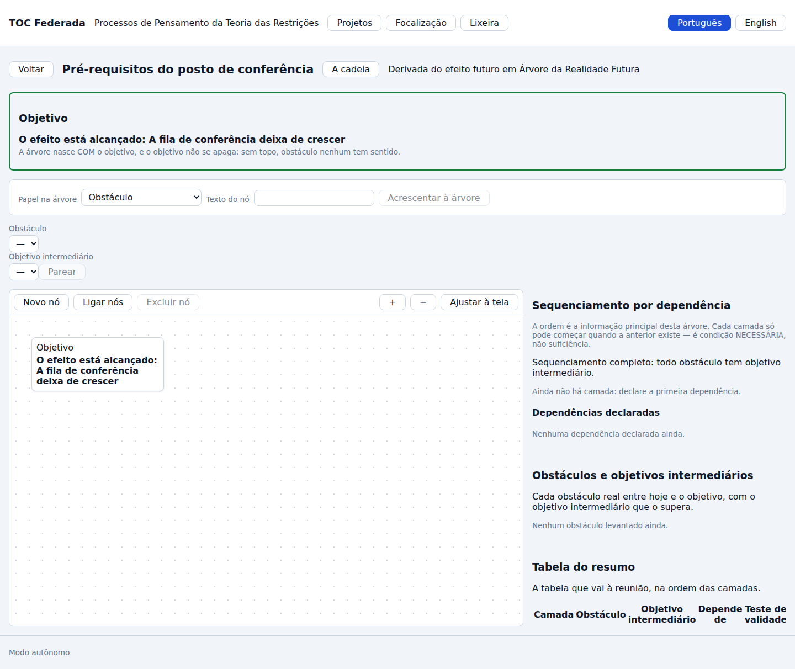

Aqui a lógica **muda**, e essa é a diferença que a spec chama de RN-05: a APR não é de
suficiência, é de **condição necessária** — "A precisa existir antes de B". A prova de que
as duas lógicas não se misturam não é um `if` na interface: é a **ausência da operação**.
Não há exame de suficiência de elo nesta tela porque não há rota de exame de elo na APR, no
servidor.

O gesto central é parear: cada obstáculo real ganha o **objetivo intermediário** que o
supera, e o **teste de validade** nasce com o par, montado pelo servidor.

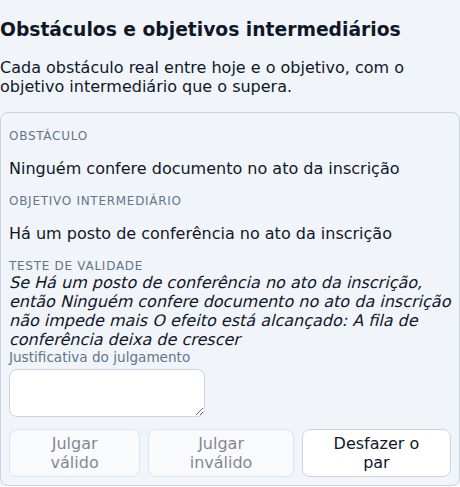

O teste de validade é julgado por gente — e os julgamentos **acumulam**. Válido e inválido
têm o mesmo peso na tela, com a mesma justificativa obrigatória; nenhum julgamento apaga o
anterior (RN-07), e o autor, de novo, vem do principal.

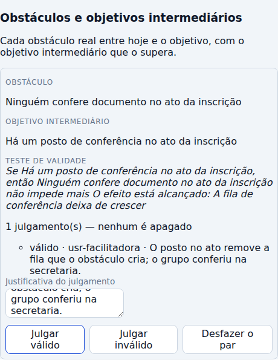

E então a informação principal desta ferramenta: **a ordem**. O sequenciamento sai em
camadas numeradas — o que precisa existir antes vem antes —, com as dependências declaradas
por extenso e as pendências de pareamento contadas. Dependência circular **bloqueia** (RN-06,
diferente da ARA, onde ciclo é aviso), e a tela nomeia os nós do laço, porque é isso que a
pessoa precisa para desfazê-lo.

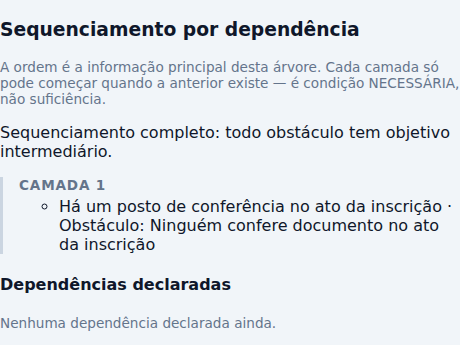

### 6 · A Árvore de Transição: necessidade, ação, resultado esperado

O objetivo intermediário deriva a AT (RF-40), que nasce apontando para ele e sem passo
nenhum — um plano é o que se escreve, não o que se herda.

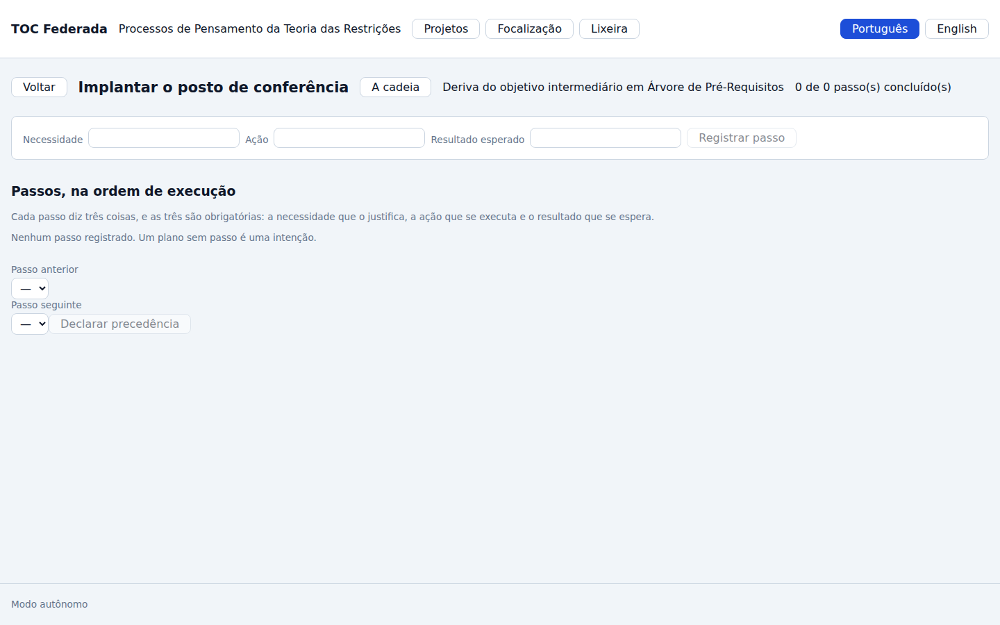

Cada passo diz **três coisas, e as três são obrigatórias** (RN-10): a necessidade que o
justifica, a ação que se executa e o resultado que se espera. É essa tripla que separa um
plano de uma lista de tarefas, e é por isso que ela aparece rotulada em cada passo, além da
leitura corrida ("Para <necessidade>, <ação>; espero <resultado>") que o servidor monta.

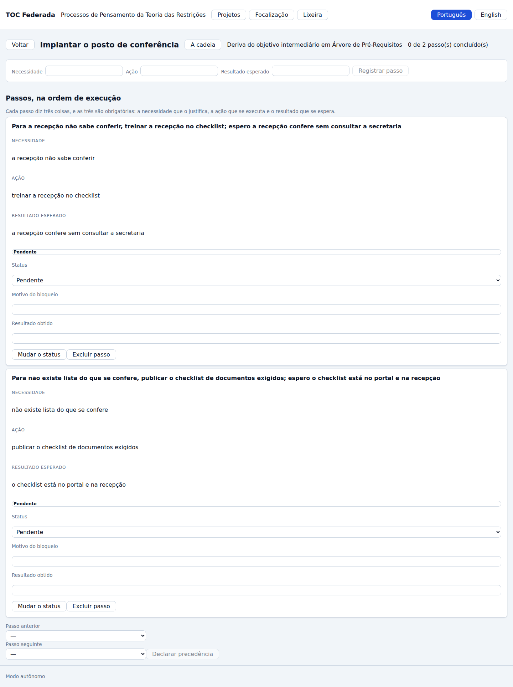

Bloquear um passo **exige motivo** (RF-30), e concluir exige o resultado real. O esperado
**não é apagado** por nenhum dos dois: quando o real diverge, os dois ficam na tela com a
divergência dita por extenso — é a diferença entre aprender com o plano e reescrever a
história dele.

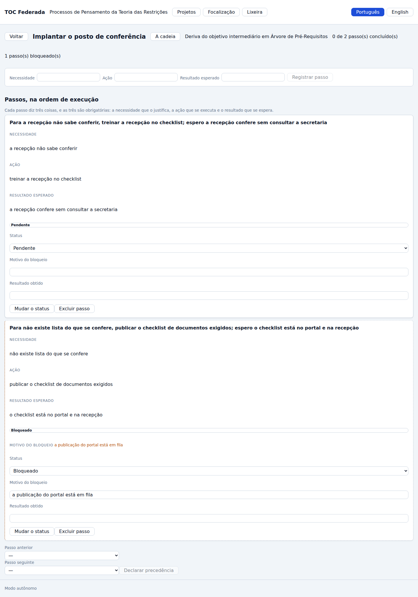

### 7 · A cadeia — o percurso inteiro numa tela

Esta é a tela que **nenhuma das quatro gerações chegou perto de ter**. Não é um diagrama
novo: é o fio que mostra que a análise é uma só.

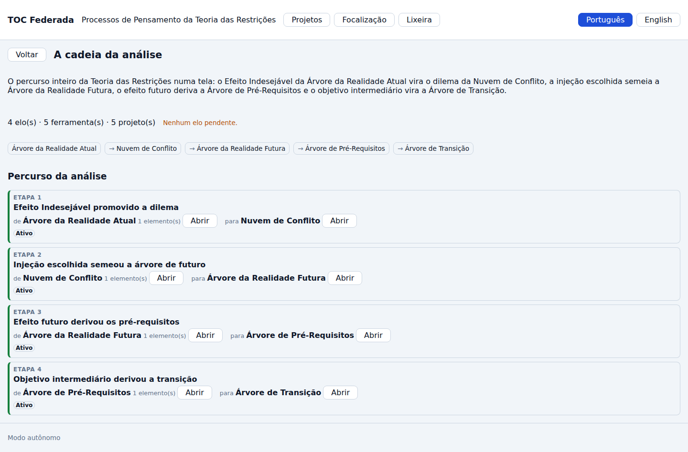

Cada etapa nomeia a costura por extenso — "Efeito Indesejável promovido a dilema",
"Injeção escolhida semeou a árvore de futuro" — e as duas pontas por ferramenta, com os
elementos que participaram. De qualquer ponta se abre a ferramenta correspondente: a cadeia
não é um relatório, é um mapa navegável.

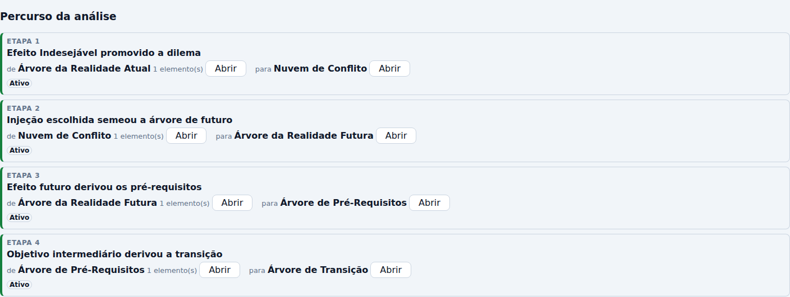

Nesta corrida os quatro elos estão **ativos**, e o cabeçalho diz "Nenhum elo pendente." —
o que se vê acima é a cadeia inteira e sadia. A regra que só aparece quando alguma coisa
quebra é a outra: **o elo pendente nunca some** (RF-35). Quando o projeto de destino de uma
costura é excluído, o vínculo não é escondido — ele fica, com estado `Pendente` e o motivo
escrito, e a contagem sobe no cabeçalho para o aviso não depender de rolar a lista.
Esconder o vínculo que perdeu uma ponta seria esconder exatamente o que a pessoa precisa
consertar. Essa metade tem prova executável, e não captura: o teste de contrato
`test_excluir_um_projeto_da_cadeia_deixa_o_elo_pendente_e_nao_o_apaga`
([`test_http_m4.py`](../../apps/api/tests/contrato/test_http_m4.py)) e o teste da tela
`TelaDaCadeia.test.tsx`, que mede o elo pendente com o motivo à vista e sem botão de abrir
para uma ponta que não existe mais.

## O que a corrida mediu

Uma captura mostra o resultado e não mostra o número. Estas linhas são as que o gerador
imprimiu na corrida de 2026-09-06 que produziu as imagens acima — coladas, não transcritas
(regra R1). Os identificadores são sorteados a cada corrida e por isso **não** se
reproduzem; o que se reproduz é a forma da cadeia.

```text
  · promovido: 1 Efeito Indesejável validado → nuvem 19039fe6-376a-4a42-8561-2740ba5403c0
  · semeada: injeção escolhida → ARF e5418eb1-7f4c-4ea3-a613-519e457d8baa · nós 1 · Efeitos Indesejáveis da cadeia: 1
  · ARF: 4 nós (2 injeções, 2 efeitos) · elos 2 · espelhos 1 · ramos ["tratado"] · pronta: false
  · derivada: efeito futuro → APR 4079c5d6-d6cd-4c96-999d-eecbf09aa0e7 · objetivo proposto: O efeito está alcançado: A fila de conferência deixa de crescer
  · APR: 3 nós · pares 1 · julgamentos 1 · camadas 1 · completo: true
  · derivada: objetivo intermediário → AT d9b4266d-009c-4086-9540-e7186a75e05c
  · AT: 2 passos · resumo {"pendente":1,"em_execucao":0,"concluido":0,"bloqueado":1,"passos":2,"inalcancaveis":0}
  · cadeia: ara→nc (ativa) · nc→arf (ativa) · arf→apr (ativa) · apr→at (ativa)
  · ferramentas atravessadas: ara → nc → arf → apr → at
```

Três coisas que esses números dizem e a imagem não diz:

1. **`pronta: false` com o ramo tratado.** A árvore de futuro terminou a jornada com o ramo
   negativo podado **e** com uma injeção sem efeito declarado — a de corte, que corta o ramo
   e ainda não causa nada por si. A verificação não deixa isso passar por pronto, e também
   não impede nada: é leitura (RF-11).
2. **`camadas 1 · completo: true` na Árvore de Pré-Requisitos.** Um obstáculo, um objetivo
   intermediário pareado, nenhuma dependência declarada: uma camada só, e o sequenciamento
   se declara completo porque **todo obstáculo tem superação** — que é o critério da RN-09,
   e não "tem muitos nós".
3. **A cadeia fecha com quatro elos ativos**, atravessando as cinco ferramentas na ordem
   canônica. É a primeira vez, em cinco gerações desta linhagem, que esse fio existe.

## O que esta jornada NÃO mostra, e por quê

- **Sugestão assistida de ramo negativo.** Ela **não existe**, e a ausência é a decisão do
  round 008 (RF-10): marcar um ramo negativo é o exercício central da ferramenta, e
  terceirizá-lo a um modelo tira da pessoa justamente o trabalho que a ferramenta existe
  para fazer. A prova é negativa e roda no portão: um teste de contrato mede a ausência da
  rota no OpenAPI publicado
  ([`test_http_m4.py`](../../apps/api/tests/contrato/test_http_m4.py), função
  `test_nao_existe_rota_assistida_de_ramo_negativo`).
- **A Árvore de Estratégia & Táticas (M5).** Outro módulo, outro ciclo.
- **O conteúdo das ferramentas de origem.** A ARA e a Nuvem têm as jornadas delas (J-02,
  J-03, J-07); aqui elas aparecem como pontas da cadeia, e não copiadas.

## Avaliação heurística — 2026-09-06

Método: as dez heurísticas de Nielsen aplicadas às capturas acima, do build real. Achado
com prova entra no `qa-report.md` do ciclo; achado sem prova não entra.

| # | Heurística | Achado | Gravidade | Encaminhamento |
|---|---|---|---|---|
| A-01 | Visibilidade do estado do sistema | ✅ O estado do ramo negativo e o do passo saem **por extenso** (`Aberto`/`Tratado`/`Aceito`, `Pendente`/`Em execução`/`Concluído`/`Bloqueado`), como dado no elemento (`data-estado`, `data-status`) e como forma de moldura — tracejada, sólida, pontilhada. Apagar a cor da folha de estilo não apaga a informação. | — | — |
| A-02 | Correspondência com o mundo real | ✅ O vocabulário é o da TOC em português: injeção, efeito futuro, ramo negativo, poda, obstáculo, objetivo intermediário, teste de validade. Nenhum jargão de software na superfície. | — | — |
| A-03 | Controle e liberdade | ✅ Poda e aceite se desfazem por `Reabrir o ramo`; o julgamento acumula em vez de sobrescrever; o resultado esperado nunca é apagado pelo real. | — | — |
| A-04 | Consistência e padrões | ⚠️ O rodapé "Modo autônomo" da casca continua flutuando sobre o painel em 1440×900, como nas jornadas J-02, J-03 e J-09. É defeito da casca, não do M4. | baixa | Já registrado na J-09; continua aberto e agora afeta uma jornada a mais. |
| A-05 | Prevenção de erro | ✅ O seletor da poda só oferece injeção (RN-04); `Aceitar` e `Registrar passo` não armam sem os campos obrigatórios. **E nada é escondido por regra de negócio**: mudar o status de um passo continua clicável, e a recusa volta com a regra nomeada. | — | — |
| A-06 | Reconhecer em vez de lembrar | ✅ A leitura de suficiência, o teste de validade e a leitura corrida do passo são montados pelo servidor e ficam na tela: ninguém precisa lembrar o texto do outro nó para julgar o elo. | — | — |
| A-07 | Flexibilidade e eficiência | ⚠️ A rota **não vive na URL**: recarregar volta para a lista de projetos, e a cadeia se abre de dentro da ferramenta. É o mesmo achado herdado da casca (J-02, A-07). | média | Já registrado na J-02; agora afeta quatro telas a mais. |
| A-08 | Estética e design minimalista | ⚠️ A tela da APR empilha **dois formulários** acima do canvas — o do nó novo e o do pareamento —, e o do pareamento sai com rótulo e seletor em linhas trocadas, apertado contra a borda esquerda (visível na captura 09). Não esconde informação, mas é o bloco mais feio das quatro telas. | baixa | Layout é ação reversível e de baixo raio (regra R3): fica registrado como dívida para o próximo lote de interface, sem ADR. |
| A-09 | Ajudar a reconhecer e recuperar erros | ✅ A recusa chega traduzida **pelo código** (`INVALID_NEGATIVE_BRANCH`, `INVALID_MIRROR`, `INVALID_PAIR`, `INVALID_TRANSITION`, …), com `details.regra`, e nunca pelo texto da mensagem. Coberto pelos testes de fluxo de erro das quatro telas. | — | — |
| A-10 | Ajuda e documentação | ✅ A explicação está **onde a decisão acontece**: "o ramo negativo é o efeito indevido que a própria injeção traz…" fica no cabeçalho da região dos ramos, não num tooltip. | — | — |

### O que a captura do build real encontrou

A corrida encontrou uma lacuna que nenhum teste de componente encontraria: **não havia rota
para mover um nó da ARF ou da APR**. Os casos de uso `MoverNoDaARF` e `MoverNoDaAPR`
existiam desde o ciclo 008 (`apps/api/src/toc_api/aplicacao/arvores.py`), estavam
*importados* pelo roteador — e nenhuma rota os chamava. O canvas oferecia o gesto de
arrastar e o gesto não tinha onde gravar: a pessoa organizaria a árvore, recarregaria, e o
desenho voltaria ao que era.

A correção foi acrescentar `posicao` ao `PATCH` do nó das duas árvores, **pela raiz do
agregado** (a rota genérica do M1 recusa com `AGGREGATE_ROOT_REQUIRED`), com três testes de
contrato novos — inclusive o do `PATCH` vazio, que é recusa e não sucesso silencioso.

E um segundo achado, este puramente de texto, que só a captura mostra: o painel do
sequenciamento repetia **a mesma frase de vazio duas vezes na mesma tela** — "Ainda não há
camada: declare a primeira dependência." aparecia sob as camadas e outra vez sob a lista de
dependências, onde ela nem cabia. A lista de dependências ganhou vazio próprio. É um
defeito que nenhum teste de componente pegaria: cada um dos dois vazios está certo
isoladamente, e só ficam errados juntos.

## Rastreabilidade

| Requisito | Onde vive | Prova |
|---|---|---|
| RF-02/RN-04 · papel do nó e ramo negativo com poda | `apps/api/src/toc_api/dominio/arf.py` | `apps/web/src/telas/TelaDaArf.test.tsx` · `apps/api/tests/contrato/test_http_m4.py` |
| RF-04/RN-03 · espelho UDE → Efeito Desejável | `apps/api/src/toc_api/dominio/arf.py` · `espelhar_ude` | `apps/web/src/componentes/arf/CadeiaDeEfeitos.tsx` (teste na tela) |
| RF-11 · verificação estrutural como leitura | `apps/api/src/toc_api/dominio/arf.py` · `verificar` | `apps/web/src/componentes/arf/VerificacaoDaArf.tsx` (teste na tela) |
| RF-23/RN-06 · sequenciamento em camadas e ciclo bloqueante | `apps/api/src/toc_api/dominio/apr.py` · `sequenciar` | `apps/web/src/telas/TelaDaApr.test.tsx` |
| RN-07 · julgamento que acumula, autor do principal | `apps/api/src/toc_api/dominio/apr.py` · `julgar_par` | `apps/web/src/telas/TelaDaApr.test.tsx` |
| RN-10/RF-30 · a tripla do passo e a mudança de status | `apps/api/src/toc_api/dominio/at.py` | `apps/web/src/telas/TelaDaAt.test.tsx` |
| RF-41/RF-35 · a cadeia inteira e o elo pendente visível | `apps/api/src/toc_api/dominio/referencia.py` · `travessia` | `apps/web/src/telas/TelaDaCadeia.test.tsx` |
| RI-01 · as cinco telas do M4 no registro compartilhado | `apps/web/src/telas/registro.ts` | `apps/web/src/telas/registro.test.ts` (paridade com o manifesto publicado) |
