# J-011 · A árvore de Estratégia & Táticas — a ferramenta que voltou

> **Siglas deste documento**, na primeira ocorrência: **S&T** — Estratégia & Táticas
> (*Strategy & Tactics*) · **TOC** — Teoria das Restrições · **M5** — o módulo Estratégia &
> Táticas · **M1** — Núcleo de Diagramas Lógicos · **APR** — Árvore de Pré-Requisitos ·
> **AT** — Árvore de Transição · **VCD** — *Value Creating Deliverable* (entregável gerador
> de valor, jargão da linhagem) · **ADR** — Registro de Decisão Arquitetural · **API** —
> interface de programação de aplicações · **IA** — inteligência artificial · **P6** — o
> princípio "Jornada viva" da constituição do projeto · **RF/RI/RN/RNF** — requisito
> funcional / de interface / regra de negócio / não funcional · **DoD** — *Definition of
> Done* (Definição de Pronto).

- **Estágio**: 🟢 viva — capturas do build real
- **Nasce no ciclo**: 010 · **Spec**:
  [`../../specs/010-estrategia-e-taticas/spec.md`](../../specs/010-estrategia-e-taticas/spec.md)
- **Capturas geradas em**: 2026-09-06 · **Avaliação heurística revisitada em**: 2026-09-06
- **Como regenerar** (a jornada é autônoma: a S&T não se liga automaticamente a nenhuma
  outra ferramenta neste ciclo, por decisão declarada da spec):

  ```bash
  PLAYWRIGHT_BROWSERS_PATH=/opt/pw-browsers node docs/jornadas/scripts/capturar-telas.mjs --jornada J-011
  ```

- **Base**: sintética — o plano "Dobrar a capacidade de atendimento" da **Instituição
  Horizonte**, instituição e personas **fictícias** (ADR 0006).

## Quem, e o que quer

A **Facilitadora TOC** tem um plano para conduzir, e não um diagrama para desenhar. A meta
é dobrar a capacidade de atendimento em doze meses; o que ela precisa é decompor essa meta
em passos que digam **o quê** e **como**, e — a parte que faz a ferramenta ser S&T e não um
organograma — deixar escrito **por quê** cada passo se liga ao de cima e por que os de
baixo bastam.

Nas quatro gerações da linhagem TOC-Builder, ela não tinha essa ferramenta. Não porque
nunca existiu: porque **foi desligada**. É a única ferramenta que regrediu, e a regressão
está medida arquivo a arquivo na spec 010:

| Geração | Arquivo | Estado |
|---|---|---|
| 1ª | `TOC-Builder/components/Sidebar.tsx:44` | habilitada (sem `disabled`) |
| 2ª | `TOC-Builder-APP/components/Sidebar.tsx:44` | habilitada |
| 3ª | `TOC-Builder-V2/components/Sidebar.tsx:56` | `disabled: true` |
| 4ª | `tocbuilderv3/components/Sidebar.tsx:58` | `disabled: true` |

Desligada duas vezes, sem decisão registrada em lugar nenhum — com o modelo de dados
inteiro parado no código (`tocbuilderv3/types.ts:270-311`). Esta jornada é a prova de que
ela voltou, **com a decisão registrada** ([ADR 0014](../adr/0014-categoria-portada-e-transicao-de-status-livre-na-snt.md)),
que é exatamente o que faltou lá.

## O percurso

### 0 · O projeto nasce com a meta global, e a meta é obrigatória

O formulário de projeto ganha uma quarta ferramenta. Escolhida a S&T, aparece um campo que
as outras não têm: a **meta global**. Ele não é enfeite — sem alvo declarado, "decompor o
quê?" não tem resposta, e a RF-01 o exige na criação.

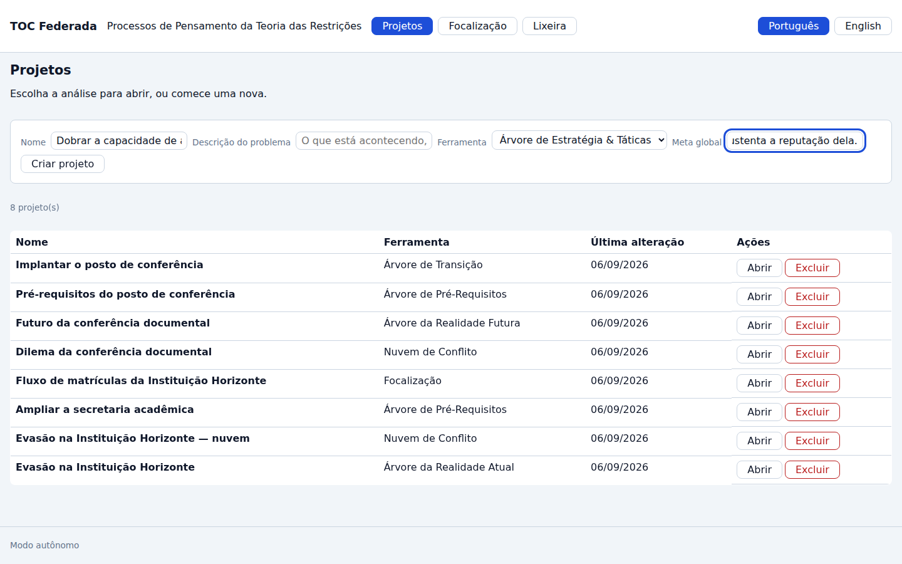

A árvore nasce **vazia**, com a meta no topo — e é a meta que fica em destaque, não o nome
do projeto: quem conduz olha para o alvo, não para o rótulo.

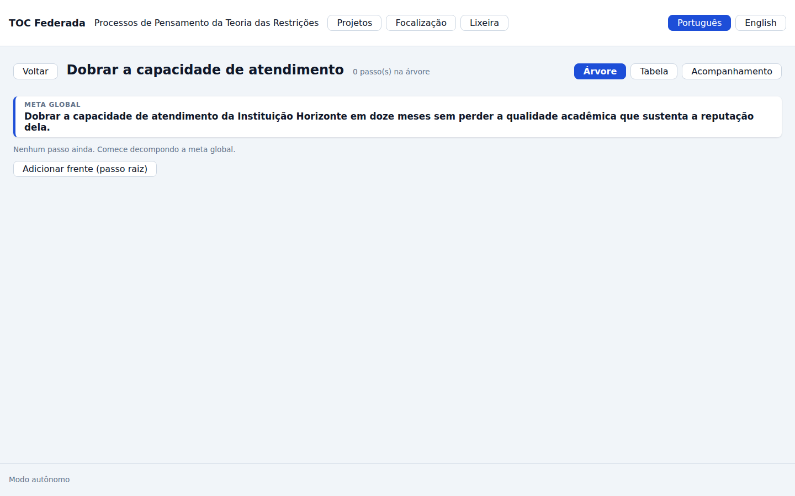

### 1 · O passo entra sem campo de número — e é aí que a linhagem morre

Adicionar um passo é ação contextual ("adicionar frente", "adicionar filho", "adicionar
irmão abaixo"), e o formulário pede **uma coisa**: a estratégia.

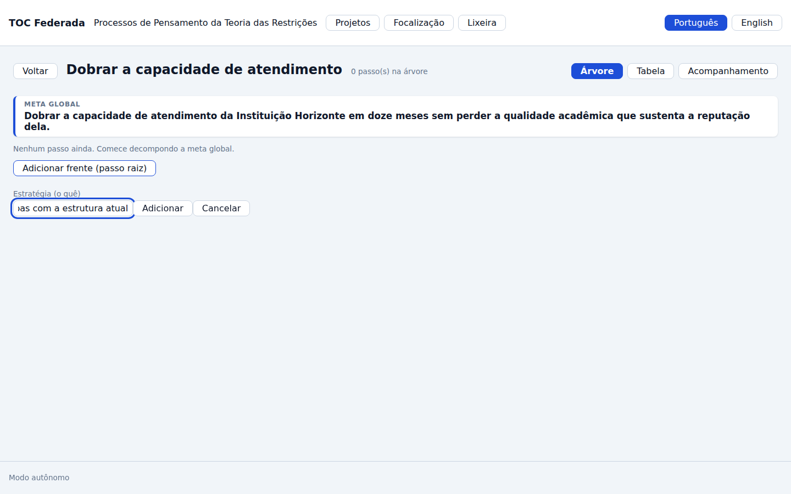

Compare com a quarta geração:
`tocbuilderv3/components/SnTStepEditorModal.tsx:56-57` exigia o número **digitado à mão**,
com o comentário `// Optionally, add validation for stepNumber format or uniqueness against
existingStepNumbers` logo abaixo — obrigatório, texto livre, sem validação de formato nem de
unicidade. E nenhuma das dez funções de serviço da geração calculava, conferia ou renumerava
coisa nenhuma. Aqui o número é **projeção da posição** (RN-01): não existe campo, não existe
coluna no banco, e a exportação não o carrega.

### 2 · Três níveis, numerados pela estrutura

Com o plano decomposto, a árvore mostra a numeração que ninguém digitou:

```text
$ node docs/jornadas/scripts/capturar-telas.mjs --jornada J-011
  árvore com 7 passos em 3 níveis: 1, 1.1, 1.1.1, 1.1.2, 1.2, 1.2.1, 1.3
```

Três níveis é o portão que o roadmap nomeia para este ciclo — e é o que faz `1.1.2`
aparecer, que é o caso exato do comentário da linhagem (`// e.g., "1", "1.1", "1.1.2"`).

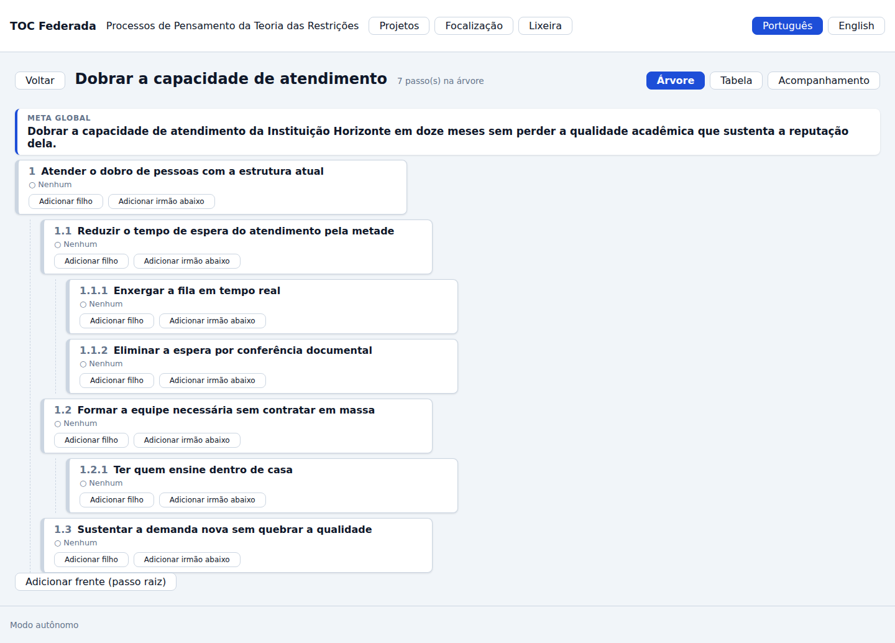

### 3 · As três premissas, nas posições de leitura

A ficha do passo `1.1` abre com as três premissas vazias — e **já com a frase montada**. A
de necessidade é lida contra o pai, a de suficiência contra os filhos nomeados, e a paralela
se lê sozinha. O que está em falta aparece como reticência, não como campo em branco: a
disposição ensina o método antes de a pessoa escrever qualquer coisa.

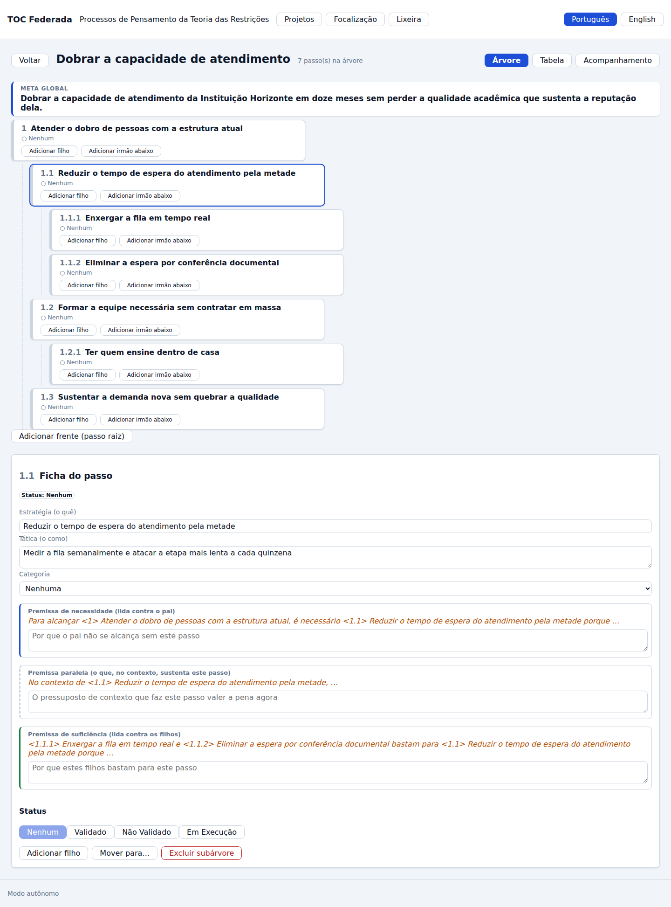

Preenchidas, as três frases fecham:

> *Para alcançar `<1>` Atender o dobro de pessoas com a estrutura atual, é necessário
> `<1.1>` Reduzir o tempo de espera do atendimento pela metade porque **sem cortar a
> espera, o dobro de pessoas só faz a fila dobrar junto**.*

> *`<1.1.1>` Enxergar a fila em tempo real e `<1.1.2>` Eliminar a espera por conferência
> documental bastam para `<1.1>` Reduzir o tempo de espera do atendimento pela metade porque
> **enxergar a fila e tirar a conferência do caminho crítico cobrem as duas únicas etapas
> que hoje respondem por mais de 80% da espera**.*

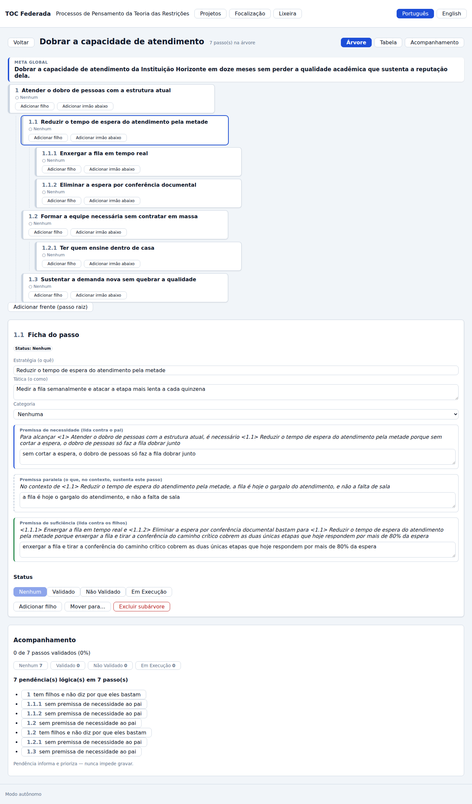

A quarta geração já tinha **os mesmos três campos**
(`tocbuilderv3/components/SnTStepEditorModal.tsx:137-159`) — empilhados em três áreas de
texto, sem pai, sem filhos e sem consequência. O que este ciclo acrescentou não foi o
campo: foi o **papel** dele.

### 4 · Mover mostra a renumeração antes de mover

Mover um passo leva a subárvore inteira, e a numeração muda em dois lugares ao mesmo tempo:
onde ele saiu e onde ele chegou. Por isso a tela **pergunta primeiro** — a prévia lista
número a número o que vai mudar, e nada foi gravado ainda.

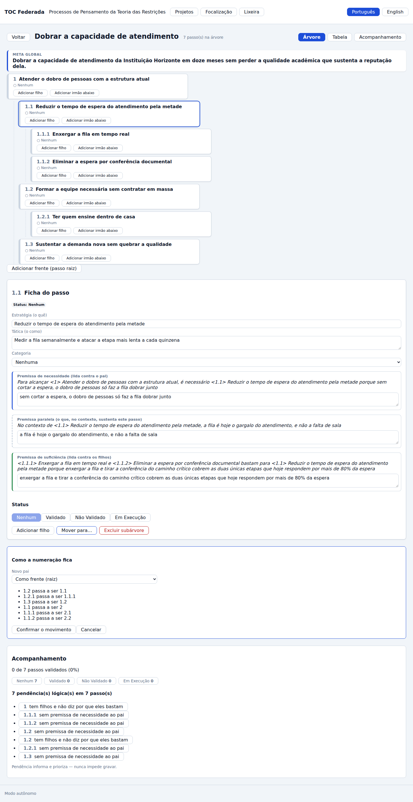

Confirmado, a árvore renumera sozinha:

```text
  renumeração após o mover: 1, 1.1, 1.1.1, 1.1.2, 1.2, 1.2.1, 1.3 → 1, 1.1, 1.1.1, 1.2, 2, 2.1, 2.2
```

O passo `1.1` virou `2` levando os dois filhos (`2.1`, `2.2`), e os antigos irmãos fecharam
a lacuna: `1.2` → `1.1`, `1.2.1` → `1.1.1`, `1.3` → `1.2`. **Nenhum número foi digitado.**

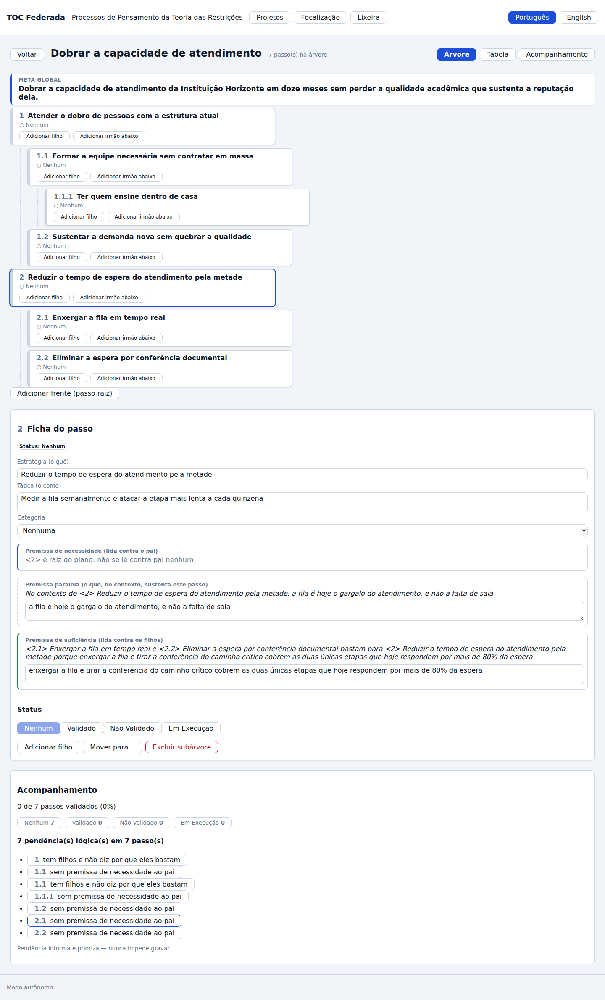

### 5 · A reunião de acompanhamento

O painel conta os passos por status, calcula o progresso e lista as pendências lógicas com
salto direto — tudo da **mesma função pura** que o domínio usa; não há segunda conta na
tela.

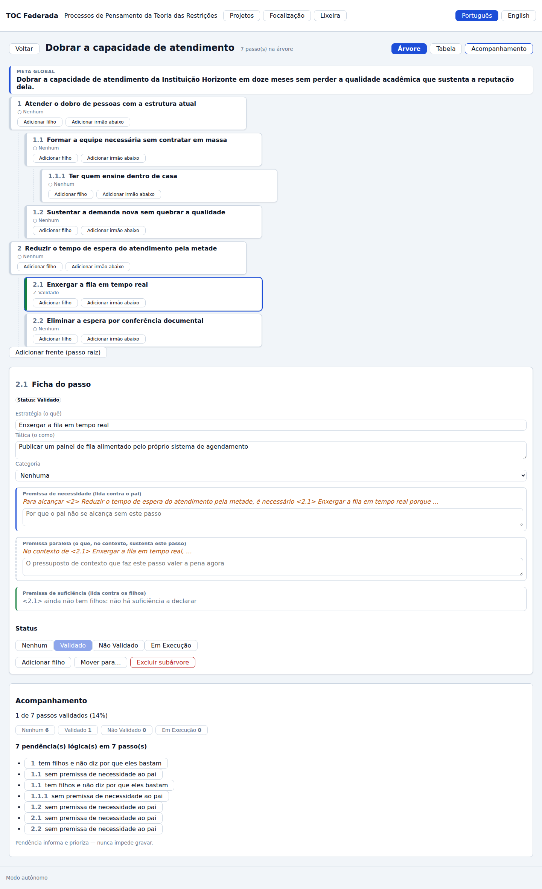

```text
  acompanhamento: 7 passos · 7 pendências lógicas
```

Sete pendências sobre sete passos, e a árvore **grava assim mesmo**: a pendência informa e
prioriza, nunca trava (RN-06). O rodapé do painel diz isso com todas as letras — "Pendência
informa e prioriza — nunca impede gravar."

A vista tabular é a mesma árvore para quem conduz sem canvas: indentada, com o número na
primeira coluna e a presença das três premissas como marca.

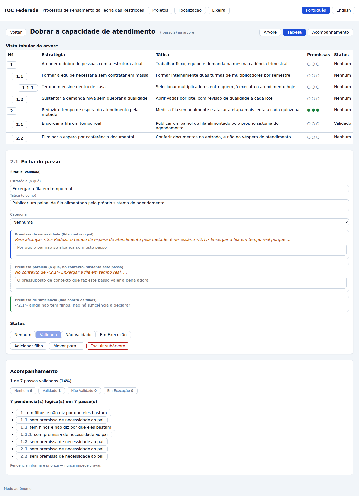

### 6 · Excluir avisa **quantos** caem — e não toca no resto

Este é o passo em que a linhagem falhava de forma catastrófica.
`tocbuilderv3/services/mockApiService.ts:521` fazia
`project.nodes = project.nodes.filter(n => n.id === nodeId)` — o predicado correto seria
`!==`. O filtro **mantinha só o nó excluído** e descartava todos os outros passos do
projeto: excluir um passo destruía a árvore inteira, em silêncio.

Aqui a confirmação diz a contagem e o primeiro nível do que cai, antes de qualquer escrita:

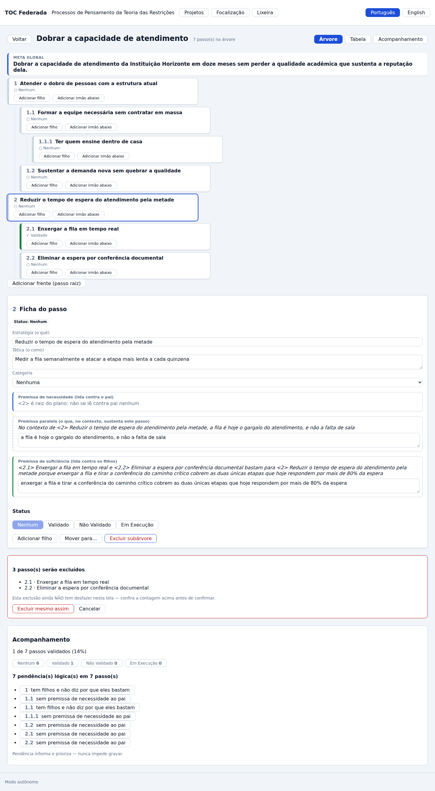

A confirmação também diz o que **não** existe: o desfazer de sessão do M1 (RF-20) não foi
entregue nesta tela, e o aviso o declara em vez de prometer o contrário. A mitigação é
justamente esta prévia — a contagem chega antes da escrita, não depois dela.

E confirmada, ela remove **exatamente** a subárvore:

```text
  exclusão de subárvore: 7 → 4 passos · numeração 1, 1.1, 1.1.1, 1.2
```

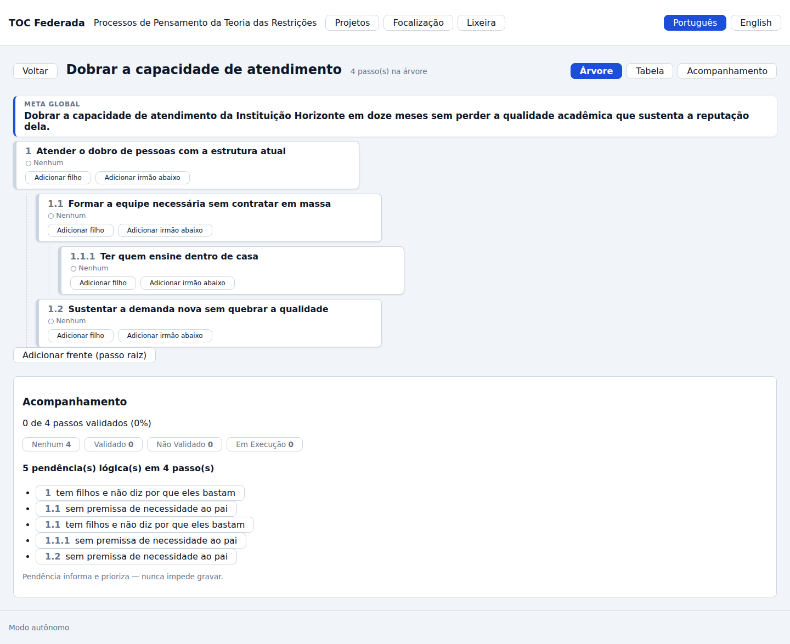

Sete menos três é quatro — e os quatro que ficaram são os que não estavam na subárvore, com
a numeração fechada sem lacuna. O defeito da linhagem entrou na suíte como caso de teste
(`test_exclusao_subarvore_remove_exatamente_a_subarvore_e_nao_toca_no_resto`), comparando os
passos de fora campo a campo antes e depois.

## Desempenho medido (RNF-04)

Medido contra o serviço de verdade, na mesma corrida da captura — não estimado:

```text
  desempenho (RNF-04): abrir 100 passos em 5 níveis — p95 10.7 ms sobre 20 amostras (alvo < 1000 ms) · mover subárvore de 20 passos — 176 ms (alvo < 500 ms)
```

| Métrica | Alvo (RNF-04) | Medido | Veredito |
|---|---|---|---|
| Abrir árvore de 100 passos em 5 níveis — p95 | < 1 s | 10,7 ms (20 amostras) | ✅ |
| Mover subárvore de 20 passos, renumeração incluída | < 500 ms | 176,0 ms | ✅ |

**O que a medição NÃO cobre, e é honesto dizer**: ela mede a rota que a interface chama, não
o tempo de pintura do navegador. A folga é grande o bastante (duas ordens de grandeza na
abertura) para o alvo continuar de pé com o custo da renderização somado, mas quem quiser o
número da tela precisa medi-lo na tela.

## O que esta jornada NÃO mostra

- **Vínculo automático com a APR e a AT.** A ponte lógica entre o plano e a implementação
  existe no método e está **fora** do round 010 por decisão declarada. A S&T deste ciclo é
  completa e autônoma sobre o núcleo M1.
- **Assistência de IA sobre a árvore.** Este módulo **não declara nenhuma ação de
  catálogo** (INT-04 da spec 010) — a ausência é declaração, não esquecimento. Quando
  entrar, é decisão nova sob o [ADR 0007](../adr/0007-ia-somente-pela-fundacao.md).
- **Arrastar para mover.** O movimento acontece por comando explícito na ficha ("mover
  para…"), com pré-visualização. O arrastar é o segundo degrau do corte de apetite
  declarado no plano do ciclo, e ele não subiu.
- **Importação dos exports S&T da quarta geração.** É o E1.4 avançado do ciclo 011; o que
  este ciclo entrega é o modelo (pai + ordem) que torna a reconstrução possível.

## Avaliação heurística — 2026-09-06

Heurísticas de Nielsen, sobre as capturas acima — do build real, não de protótipo.

| # | Heurística | Veredito | Nota |
|---|---|---|---|
| 1 | Visibilidade do estado | ✅ | O cabeçalho diz quantos passos há; o painel diz o progresso ("1 de 7 passos validados (14%)"); cada nó carrega o status escrito. |
| 2 | Correspondência com o mundo real | ✅ | "Estratégia (o quê)" e "Tática (o como)" nomeiam o que o método nomeia; as premissas aparecem com o papel no rótulo, não com o nome do campo. |
| 3 | Controle e liberdade | ⚠️ | Mover e excluir **pré-visualizam antes de agir** — a renumeração e a contagem aparecem enquanto nada foi gravado. O que falta é o desfazer depois do fato: a S&T não expõe o desfazer de sessão do M1 (RF-20 não entregue), e por isso a confirmação **diz isso com todas as letras** em vez de prometer o que não cumpre. Achado A-03. |
| 4 | Consistência e padrões | ✅ | Cabeçalho, vistas, ficha lateral e painel seguem o padrão das telas do M2/M3/M6; o número usa numeração tabular em todo lugar. |
| 5 | Prevenção de erro | ✅ | Não há campo de número para errar; a posição entre irmãos é escolhida por ação contextual; a exclusão diz a contagem antes. |
| 6 | Reconhecer em vez de lembrar | ✅ | A leitura dirigida traz o texto do pai e dos filhos **na frase**: ninguém precisa lembrar o que era o passo 1 para escrever a premissa do 1.1. |
| 7 | Flexibilidade | ⚠️ | Duas vistas (árvore e tabela) e filtro por status; **falta atalho de teclado** para adicionar filho/irmão, que é o gesto mais repetido da decomposição. Achado A-04. |
| 8 | Estética e minimalismo | ⚠️ | Com a ficha e o painel abertos ao mesmo tempo, a página fica longa e a árvore sai do campo de visão — ver a captura 05. Achado A-05. |
| 9 | Recuperação de erro | ✅ | A recusa do domínio chega com a regra nomeada e aparece em `role="alert"`; nenhum botão é escondido por regra de negócio (mover para a própria subárvore continua clicável, e a recusa ensina a regra). |
| 10 | Ajuda e documentação | ✅ | A leitura dirigida **é** a ajuda: ela mostra a forma da frase antes de a pessoa escrevê-la, e o rodapé do painel explica que pendência não trava. |

### Achados

- **A-03 · o desfazer de sessão (RF-20) não foi entregue nesta tela.** O `useDesfazer` do
  M1 existe e hoje só a tela da Árvore da Realidade Atual o usa. A primeira versão desta
  confirmação dizia "dá para desfazer nesta sessão" — uma promessa que a tela não cumpre —,
  e o texto foi trocado por um aviso verdadeiro: *"Esta exclusão ainda NÃO tem desfazer
  nesta tela — confira a contagem acima antes de confirmar."* Promessa falsa é pior que
  ausência declarada. **O requisito fica como dívida nomeada no `qa-report.md`**, e a
  mitigação que existe hoje é a prévia com a contagem, que acontece antes de qualquer
  escrita.
- **A-04 · falta atalho de teclado para decompor.** Adicionar filho e irmão é o gesto que
  mais se repete numa sessão de decomposição, e hoje ele exige dois cliques por passo.
- **A-05 · a página cresce demais com ficha e painel abertos.** Numa árvore de sete passos
  já é preciso rolar para ver a árvore e a ficha juntas. Um layout de duas colunas resolve;
  fica registrado e não foi feito neste ciclo.
- **A-06 · a rota não está na URL** — o mesmo achado A-01 da J-02, que aparece aqui de
  novo: recarregar a página devolve a listagem em vez da árvore aberta. A captura desta
  jornada teve de voltar pela lista em vez de recarregar, e isso está escrito no gerador.

O **A-03 é o único que corresponde a um requisito não entregue** (RF-20) e está declarado
como tal no `qa-report.md`; A-04 e A-05 são de conforto e nasceram desta avaliação; o A-06 é
dívida conhecida e compartilhada com as outras telas.
