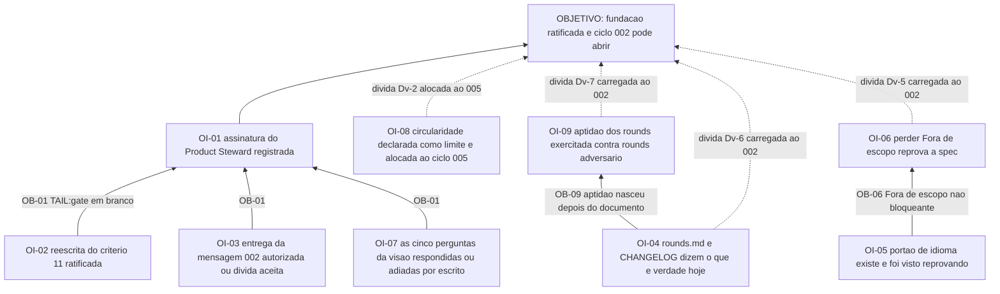

# APR 001 — Árvore de Pré-Requisitos da fundação e planejamento

> Siglas deste documento: **APR** — Árvore de Pré-Requisitos · **OI** — Objetivo
> Intermediário · **ARF** — Árvore da Realidade Futura · **AT** — Árvore de Transição ·
> **TOC** — Teoria das Restrições · **UDE** — Efeito Indesejável · **ADR** — Architecture
> Decision Record (Registro de Decisão Arquitetural) · **DoD** — Definition of Done
> (Definição de Pronto) · **DoR** — Definition of Ready (Definição de Prontidão) ·
> **IA** — inteligência artificial.

- **Spec**: `specs/001-fundacao-e-planejamento/spec.md` · **Ciclo**: 001 · **Data desta
  árvore**: 2026-09-05
- **Lógica**: condição **necessária** — "para o objetivo existir, este obstáculo precisa
  ter sido superado". Lê-se de baixo para cima.
- **Objetivo**: **a fundação está ratificada e o ciclo 002 pode abrir** — o corpus
  aprovado pelo Product Steward, as dívidas com dono, e nenhum portão vermelho sem
  diagnóstico escrito.

## Como os obstáculos foram levantados

Obstáculo é **condição que existe hoje** e bloqueia o objetivo — nunca tarefa, nunca
previsão. Todos os nove abaixo estão ancorados em fato deste repositório: uma caixa em
branco no `tasks.md`, uma dívida numerada no `qa-report.md`, ou a saída de um portão
executado nesta data. Nenhum é genérico.

## Obstáculos e objetivos intermediários

| # | Obstáculo (condição atual que bloqueia) | Evidência | OI que o supera | Depende de |
|---|---|---|---|---|
| **OB-01** | A caixa `TAIL:gate` de `specs/001-fundacao-e-planejamento/tasks.md` está em branco, e o §8 do `qa-report.md` lista **sete** itens que só o Product Steward assina | `tasks.md`, última seção: "`TAIL:gate` é do Product Steward: quem executou não aprova o que executou" | **OI-01**: a assinatura do Product Steward está registrada, item a item, e a promoção `dev` → `main` autorizada | OI-02, OI-03, OI-07 |
| **OB-02** | O critério de aceite 11 foi **reescrito por quem o executou**, e uma troca de critério de aceite é mudança de contrato do ciclo | `specs/001-fundacao-e-planejamento/spec.md`, seção "Mudança declarada no critério 11"; item 4 do §8 do `qa-report.md` (dívida **Dv-4**) | **OI-02**: a reescrita está ratificada por quem responde pela política — a execução já está feita, declarada e provada por quatro sabotagens | nenhum |
| **OB-03** | `scripts/check-conformance.sh 001` sai **1**: os pisos de ciclo do método são absolutos e reprovam todo repositório recém-instalado; o arquivo é do `maestro`, que é **leitura** (P1) | saída colada abaixo; dívida **Dv-3**; `mensagens/002-para-maestro-pisos-absolutos-de-ciclo.md`, estado `aberta` | **OI-03**: a entrega da mensagem 002 ao método está autorizada (escrita externa exige aprovação humana caso a caso), ou a dívida está aceita por escrito com dono | nenhum |
| **OB-04** | `docs/produto/rounds.md` declara na linha 18 que o verificador executável dos rounds "ainda não existe" — e `scripts/check-rounds.sh` existe e sai **0** sobre os sete campos de cada round | saída colada abaixo; dívida **Dv-6**, dono declarado: construtor do ciclo 002 | **OI-04**: as duas linhas divergentes (`docs/produto/rounds.md` e `CHANGELOG.md`) dizem o que é verdade hoje | nenhum |
| **OB-05** | O RNF-01 — português no projeto, inglês na superfície instalável — é verificado **por leitura**: não existe portão executável para ele | dívida **Dv-1**, dono declarado: construtor do ciclo 002 | **OI-05**: existe portão de idioma que imprime quanto examinou e que foi **visto reprovando** uma sabotagem plantada | nenhum |
| **OB-06** | A seção "Fora de escopo" é **pontuada e não bloqueante** em `scripts/check-specs.sh`: perdê-la custa 8 dos 15 pontos de Escopo e a spec continua passando no corte (medido: 92,6 → 84,6, portão saiu 0) | dívida **Dv-5**, dono declarado: construtor do ciclo 002 | **OI-06**: perder a seção "Fora de escopo" reprova a spec, e a sabotagem que o prova está na suíte | OI-05 (mexem no mesmo par de arquivos) |
| **OB-07** | As cinco perguntas de `docs/produto/visao.md` §7 estão sem resposta, e a **pergunta 1** (colaboração por projeto × isolamento por usuário) muda as telas do épico E1.1 | item 2 do §8 do `qa-report.md`; pré-condição declarada em `docs/roadmap.md`, "O que o ciclo 002 não pode começar sem" | **OI-07**: as cinco perguntas estão respondidas — ou cada adiamento está escrito como adiamento, com o ciclo em que volta | nenhum |
| **OB-08** | A base que valida a própria regra é **autoral**: 12 UDEs escritos por quem escreveu as checagens, e o único material de controle externo da linhagem tem 9 enunciados, dos quais 6 rotulados; 4 das 11 características são indecidíveis por função pura | dívida **Dv-2**; saída de `docs/produto/dados/medir-base.py` colada abaixo | **OI-08**: a circularidade está declarada como limite que **não fecha neste projeto** — corpus de oficina real seria dado de pessoa real, que o ADR 0006 proíbe — e o trabalho possível está alocado ao ciclo 005 | nenhum |
| **OB-09** | A aptidão dos rounds nasceu **depois** do documento que ela verifica: um portão escrito sobre um texto pronto tende a caber nele | dívida **Dv-7**, dono declarado: revisão independente do ciclo 002 | **OI-09**: a aptidão foi exercitada contra um `rounds.md` adversário por quem não a escreveu, e sobreviveu | OI-04 |

## Sequenciamento

Três frentes independentes, que podem correr em paralelo, convergindo num único ponto:

1. **Frente humana** (OI-02, OI-03, OI-07) — nenhuma delas é delegável a agente; são as
   decisões do §8. São pré-requisito direto de OI-01.
2. **Frente do construtor do 002** (OI-04, OI-05, OI-06) — as três dívidas com dono
   nomeado. OI-05 e OI-06 tocam os mesmos dois arquivos (`scripts/check-specs.sh` e
   `scripts/tests/run-sabotagem.sh`), então OI-06 vem depois de OI-05 por economia, não
   por lógica.
3. **Frente declarativa** (OI-08, OI-09) — o que se resolve escrevendo o limite e depois
   exercitando-o com adversário.

O objetivo não exige as três frentes fechadas: **exige OI-01**, e OI-01 exige que a
matéria das decisões humanas esteja pronta. As dívidas da frente 2 são carregadas para o
ciclo 002 com dono — é isso que as impede de virar esquecimento silencioso.

## O grafo



## Evidência — as saídas que ancoram os obstáculos

```
$ scripts/check-conformance.sh 001 ; echo "exit=$?"
cycles checked: 1
✗ mutation floor 55 is above the newest cycle 012 — TAIL:mutation was charged to nobody.
✗ declared-absence floor 61 is above the newest cycle 012 — 'pendente' would pass as evidence everywhere.
✗ the method did not survive into the artifacts of at least one cycle.
exit=1
```

```
$ scripts/check-rounds.sh ; echo "exit=$?"
✓ todo round declara os sete campos, as dependências não formam ciclo,
  e cada defeito medido tem exatamente um destino.
exit=0

$ sed -n '18p' docs/produto/rounds.md
  campos e da alocação exaustiva de D-01..D-11 ainda não existe; até ele entrar (candidato
```

```
$ python3 docs/produto/dados/medir-base.py   (trecho final)
  NÚMERO DE CONTROLE — enunciados: 9  ·  passam (texto normalizado): 8  ·  passam (texto literal, como citado): 6
  rotulados pela fonte como bom/ruim: 6  ·  concordância: 5 (K-01, K-04, K-05, K-06, K-07)
  FALSO POSITIVO (a fonte diz bom, a checagem reprova): 0 (—)
  FALSO NEGATIVO (a fonte diz ruim, a checagem aprova): 1 (K-03)
  autoral:  3/12 passam (25%) — base escrita para exercitar as checagens
```

## O que esta árvore não decide

- **O que se ganha quando o objetivo existir** — é da ARF (`arf.md`).
- **Quem executa cada passo e em que ordem operacional** — é da AT (`at.md`), amarrada ao
  `tasks.md` deste ciclo.
- **O destino das dívidas** — já está decidido no §9 de
  `specs/001-fundacao-e-planejamento/qa-report.md`, com dono por linha; esta árvore só as
  lê como obstáculos.
