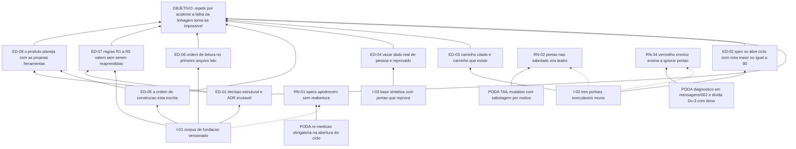

# ARF 001 — Árvore da Realidade Futura da fundação e planejamento

> Siglas deste documento: **ARF** — Árvore da Realidade Futura · **ARA** — Árvore da
> Realidade Atual · **APR** — Árvore de Pré-Requisitos · **AT** — Árvore de Transição ·
> **TOC** — Teoria das Restrições · **UDE** — Efeito Indesejável (*Undesirable Effect*) ·
> **ADR** — Architecture Decision Record (Registro de Decisão Arquitetural) · **DoD** —
> Definition of Done (Definição de Pronto) · **DoR** — Definition of Ready (Definição de
> Prontidão) · **APH** — Aplicação ↔ Harness · **IA** — inteligência artificial.

- **Spec**: `specs/001-fundacao-e-planejamento/spec.md` · **Ciclo**: 001 (executado,
  aguardando gate humano) · **Data desta árvore**: 2026-09-05
- **Lógica**: causa **suficiente** — "se a injeção, então o efeito desejável". A árvore
  lê-se de baixo para cima.
- **Como ler as três árvores deste ciclo**: `specs/README-arvores.md`.

## A injeção — o que a spec entrega

| # | Injeção | O que a spec diz |
|---|---|---|
| **I-01** | **O corpus de fundação existe como artefato versionado**: constituição de projeto v1.0.0 com sete princípios, oito ADRs (0001–0008) indexados, doze pastas de spec com quatro artefatos cada, roadmap com doze ciclos e portões, `docs/produto/rounds.md` com seis campos por round, e o site gerado por script | RF-01..RF-12 |
| **I-02** | **Três portões executáveis novos nascem com a fundação** — `scripts/check-caminhos.sh` (regra R4), `scripts/check-adrs-sucessao.sh` (regra R5) e `scripts/check-specs.sh` (régua DoR ≥ 80) — cada um imprimindo quanto examinou | RF-11 |
| **I-03** | **A base é sintética por regra, e o portão que a defende reprova de verdade**: `scripts/check-vazamento.sh` mede conteúdo vazado em três sinais e é derrubado por quatro sabotagens plantadas em `scripts/tests/run-sabotagem.sh` | RNF-03, DoD 11 |

## Os efeitos desejáveis — o que passa a ser verdade quando o ciclo fecha

Cada efeito traz **a evidência de que hoje ele é falso** — sem isso, um efeito desejável
é elogio, não previsão.

| # | Efeito desejável | Decorre de | Hoje é falso porque (evidência) |
|---|---|---|---|
| **ED-01** | Nenhuma decisão estrutural deste produto vive apenas na conversa: ela é ADR imutável, indexado em `docs/records/decisoes.jsonl` | I-01 | A linhagem TOC-Builder abandonou cinco repositórios sem registrar por quê — defeito **D-10** de `docs/produto/visao.md`, e a razão de o próprio ciclo 001 existir (`docs/produto/rounds.md`, "Defeitos não corrigidos em round próprio") |
| **ED-02** | Uma spec só abre ciclo se pontuar ≥ 80 na régua de prontidão, e a nota é impressa, não alegada | I-02 | Antes deste ciclo não havia régua alguma; a saída atual de `scripts/check-specs.sh` mede **166 sinais** sobre as doze specs (número colado na §Evidência abaixo) |
| **ED-03** | Caminho citado entre crases é caminho que existe — a forma como esta documentação mais cita arquivo deixa de ser a única que nenhum portão olha | I-02 | `scripts/check-links.sh` apaga trechos em crase antes de procurar link; na irmã `gestaodeprioridades` uma jornada citou arquivo inexistente e o portão respondeu verde sobre 43 links (regra **R4** do `CLAUDE.md`) |
| **ED-04** | Vazar dado real de pessoa passa a ser impossível por acidente: o portão mede **conteúdo**, não caminho, e foi visto reprovando | I-03 | A irmã nasceu com base real e por isso o repositório dela é obrigatoriamente privado (`docs/adr/0006-base-sintetica-desde-o-dia-1.md`); aqui a dívida ainda não existe e o que a impede de nascer é o portão |
| **ED-05** | Quem chega ao projeto sabe **em que ordem** construir, o que sai primeiro e o que nunca sai | I-01 | `docs/produto/rounds.md` e `docs/roadmap.md` não existiam; a linhagem especificou o backend quatro vezes e construiu zero — defeito **D-03** |
| **ED-06** | A ordem de leitura das duas constituições é obrigatória e está no primeiro arquivo que todo agente lê | I-01 | O repositório nasceu com o método Maestro instalado e **nada mais** (spec 001, "O quê e por quê") |
| **ED-07** | As regras R1–R5, pagas pelas retrospectivas da irmã, valem aqui **sem serem reaprendidas na prática** | I-01, ED-01 | São herança declarada pelo ADR 0001; sem o ciclo 001 elas existiriam só em `gestaodeprioridades/CLAUDE.md`, que é leitura (P1) |
| **ED-08** | O produto planeja com as próprias ferramentas que vende — ARF, APR e AT existem antes do código que as implementa | I-01, ED-05 | Nenhuma das quatro gerações da linhagem entregou ARF, APR ou AT: é a lacuna **L-03** da spec 001 e o defeito **D-04** |

## Ramos negativos — o que pode piorar, e a poda

Ramo negativo sem poda escrita é confissão de risco aceito em silêncio.

| # | Ramo negativo (o efeito indesejável que a injeção pode criar) | Poda declarada |
|---|---|---|
| **RN-01** | Doze specs escritas antes de uma linha de código apodrecem: viram ficção que ninguém reabre, e o "spec-driven" passa a descrever o passado | Toda spec de ciclo com bloqueio externo obriga **re-medição na abertura**, com saída colada — `specs/003-esqueleto-federado/tasks.md` T-02 e `specs/006-acoes-governadas-e-snapshot/tasks.md` T-02 são exatamente isso. A spec que não for reaberta não abre ciclo |
| **RN-02** | Portão novo que ninguém sabota vira teatro: verde permanente que não olha para nada | `TAIL:mutation` é obrigatória na cauda de todo ciclo e este ciclo a pagou — quatro sabotagens de vazamento em `scripts/tests/run-sabotagem.sh`, cada uma exigindo recusa **pelo motivo declarado** |
| **RN-03** | Doze specs × até cinco `[DÚVIDA]` cada viram fila de decisões humanas que trava o projeto inteiro no gate | A regra **R3** autoriza o agente a decidir o reversível e de baixo raio, registrar em ADR e seguir; ao gate sobem só as sete decisões do §8 de `specs/001-fundacao-e-planejamento/qa-report.md`, numeradas e numa página só |
| **RN-04** | O portão que responde "estou seguindo o método?" reprova qualquer repositório recém-instalado, e o vermelho crônico ensina a ignorar portão | Diagnosticado, não contornado: `scripts/check-conformance.sh 001` sai **1** por pisos absolutos de ciclo do método, o arquivo é do `maestro` (leitura, P1), e a lacuna virou `mensagens/002-para-maestro-pisos-absolutos-de-ciclo.md` — dívida **Dv-3**, com dono nomeado |
| **RN-05** | Um corpus tão grande convida a herdar por cópia cega em vez de por decisão, e o projeto passa a carregar regra que não entende | O ADR 0001 herda as regras da irmã **por decisão declarada**, e todo ADR daqui traz o campo "Princípios tocados" — a omissão que custou a emenda constitucional 0011→0016 lá é o que esse campo existe para impedir |

## O grafo



## Evidência — os números desta árvore, com o comando executado

Regra **R1**: nenhum número entra aqui sem ter sido executado, com a saída colada.

```
$ scripts/check-specs.sh   (trecho final)
  sinais medidos ao todo: 166 (14 por spec, menos os declarados não aplicáveis por isenção)

✓ todo ciclo tem os quatro artefatos, spec com as seções e os tipos de requisito,
  plano com as duas tabelas e os cinco artefatos declarados, tasks com a cauda,
  e toda spec pontua ≥ 80 na régua de prontidão do ADR 0004.
exit=0
```

```
$ scripts/check-conformance.sh 001 ; echo "exit=$?"
✗ mutation floor 55 is above the newest cycle 012 — TAIL:mutation was charged to nobody.
✗ declared-absence floor 61 is above the newest cycle 012 — 'pendente' would pass as evidence everywhere.
✗ the method did not survive into the artifacts of at least one cycle.
exit=1
```

## O que esta árvore não decide

- **Se a fundação está ratificada.** A ARF projeta o estado futuro; quem o autoriza é o
  gate humano, e os sete itens que aguardam assinatura estão no §8 de
  `specs/001-fundacao-e-planejamento/qa-report.md`.
- **Os obstáculos entre hoje e esse futuro** — são da APR (`apr.md`), que usa lógica de
  condição necessária, não de causa suficiente.
- **A ordem de execução** — é da AT (`at.md`), amarrada ao `tasks.md` deste ciclo.
