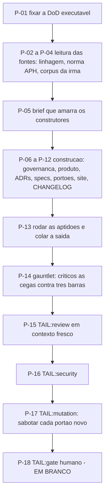

# AT 001 — Árvore de Transição da fundação e planejamento

> Siglas deste documento: **AT** — Árvore de Transição · **APR** — Árvore de
> Pré-Requisitos · **OI** — Objetivo Intermediário · **ARF** — Árvore da Realidade
> Futura · **ADR** — Architecture Decision Record (Registro de Decisão Arquitetural) ·
> **DoD** — Definition of Done (Definição de Pronto) · **DoR** — Definition of Ready
> (Definição de Prontidão) · **APH** — Aplicação ↔ Harness · **TOC** — Teoria das
> Restrições · **IA** — inteligência artificial.

- **Spec**: `specs/001-fundacao-e-planejamento/spec.md` · **Ciclo**: 001 · **Data desta
  árvore**: 2026-09-05
- **Fonte dos passos**: `specs/001-fundacao-e-planejamento/tasks.md` — a AT **não inventa
  passo**: cada linha abaixo é uma tarefa daquele arquivo, com a necessidade que a
  justifica e o resultado que a torna verificável. Onde os dois divergirem, o `tasks.md`
  manda.
- **Estado**: este é o único ciclo já executado. A coluna "Estado" copia a caixa do
  `tasks.md`, sem reinterpretar.

## Os passos

| Passo | Tarefa | Necessidade (por que este passo, agora) | Ação | Resultado esperado (verificável) | Estado |
|---|---|---|---|---|---|
| **P-01** | T-01 | Sem DoD executável fixada primeiro, "pronto" vira opinião no fim do ciclo | Fixar as treze verificações com comando e valor esperado | Cada linha da tabela de aceite tem comando; nenhum critério subjetivo | `[x]` |
| **P-02** | T-02 | O domínio TOC e o catálogo de defeitos deste produto só existem na linhagem; escrever antes de ler produziria a quinta geração | Ler `tocbuilderv3` — propósito, tipos, serviço falso, prompts — e extrair domínio e defeitos por `arquivo:linha` | A fonte F-01 da spec cita a violação canônica com a linha colada | `[x]` |
| **P-03** | T-03 | O lado aplicação da federação é contrato de outro repositório; supor o contrato é como a irmã descobriu que a junta não fechava | Ler a norma APH e o guia do desenvolvedor de aplicação federada | F-02..F-04 citam nível, modo e introspecção por `arquivo:linha` | `[x]` |
| **P-04** | T-04 | As regras R1–R5 foram pagas por retrospectiva alheia; reaprendê-las na prática seria pagar duas vezes | Ler o corpus da irmã, a spec 001 do ECS e o gerador do site | F-05 cita as regras herdadas por linha; as barras de comparação estão nomeadas no `plan.md` | `[x]` |
| **P-05** | T-05 | Vários construtores em paralelo sem partitura comum produzem doze documentos que não se citam | Sintetizar o brief que amarra os construtores | Todo construtor lê o brief inteiro antes de escrever | `[x]` |
| **P-06** | T-06 | Sem constituição própria e sem fronteira de escrita, todo o resto é sugestão | Escrever `CLAUDE.md` preservando o bloco do instalador, `docs/governance/constitution.md` v1.0.0, `mensagens/README.md`, `LICENSE`, `THIRD-PARTY-NOTICES.md` | DoD linhas 1, 2 e 11 | `[ ]` — **o aceite não fechou**: a linha 11 saiu `1` onde esperava `0`, o critério foi reescrito (OB-02 da APR) e a ratificação é humana |
| **P-07** | T-07 | Sem visão, módulos e roadmap, os ciclos seguintes não sabem o que constroem nem em que ordem | Escrever `docs/produto/visao.md`, `docs/produto/modulos.md` e `docs/roadmap.md` | DoD linha 6 — doze ciclos declarados | `[x]` |
| **P-08** | T-08 | Decisão que não vira ADR volta a ser rediscutida a cada contexto novo — é o defeito D-10 | Escrever os ADRs 0001–0008 com "Princípios tocados" e alternativas com número executado; indexar em `docs/adr/README.md` e em `docs/records/decisoes.jsonl` | DoD linhas 3 e 4 | `[x]` |
| **P-09** | T-09 | O roadmap sem specs é intenção; a spec é o insumo que gera o código | Escrever as specs 002–012 no formato do ADR 0004, com plano de duas tabelas e cauda no `tasks.md` | DoD linhas 5 e 7 | `[x]` |
| **P-10** | T-10 | As regras R4, R5 e a régua DoR não têm portão no método; sem portão são memória | Escrever `scripts/check-caminhos.sh`, `scripts/check-adrs-sucessao.sh` e `scripts/check-specs.sh`, cada um imprimindo quanto examinou | DoD linhas 4, 7 e 8 | `[x]` |
| **P-11** | T-11 | Rastreabilidade que só existe em arquivo não é lida por quem está de fora | Vendorizar o gerador em `tools/product-site/` com atribuição e gerar `docs/product-site/` | DoD linha 10 — site gerado por script, nunca HTML à mão | `[x]` |
| **P-12** | T-12 | Entrega sem entrada de CHANGELOG é entrega que ninguém encontra depois | Escrever a entrada da fundação em `CHANGELOG.md` | Entrada em `[Unreleased]` citando o ciclo 001 | `[x]` |
| **P-13** | T-13 | Caixa marcada não é testemunha: o que prova é a saída colada | Rodar todas as aptidões e colar saída, código de saída e tamanho examinado no `qa-report.md` | Nenhuma linha do `qa-report.md` com sinal transcrito sem a saída colada — regras R1 e R2 | `[x]` |
| **P-14** | T-14 | Quem construiu não enxerga a própria lacuna: a irmã perdeu cinco defeitos no ciclo 001 dela, todos pegos por revisor independente | Críticos em contexto fresco comparam às cegas contra as três barras; a maior lacuna nomeada dirige o retrabalho | Veredito por barra registrado no `qa-report.md` | `[x]` |
| **P-15** | `TAIL:review` | Quem executa não verifica (Princípio II do método) | Revisão independente em contexto fresco | Achados numerados com destino — oito corrigidos, os abertos com dono (§5 do `qa-report.md`) | `[x]` |
| **P-16** | `TAIL:security` | A classe de risco deste ciclo é textual: dado real de pessoa e segredo em texto | Passe de segurança proporcional | Resultado por item no §6 do `qa-report.md` | `[x]` |
| **P-17** | `TAIL:mutation` | Portão verde que nunca reprovou não é evidência (ramo negativo RN-02 da ARF) | Sabotar cada portão criado em P-10 e vê-lo recusar | Cada sabotagem com o comando e a recusa impressa (§7 do `qa-report.md`) | `[x]` |
| **P-18** | `TAIL:gate` | Quem executou não aprova o que executou | Apresentar a DoD e as sete decisões do §8 ao Product Steward | Assinatura registrada e promoção `dev` → `main` autorizada | `[ ]` — **em branco de propósito**; é o OI-01 da APR |

## O grafo

## Onde a AT diverge do que aconteceu — e por quê

Uma AT honesta registra o desvio, não o esconde.

- **P-06 ficou aberto** porque o seu aceite inclui a linha 11 da DoD, que saiu `1` onde
  esperava `0`. O diagnóstico está no §4.2 do `qa-report.md`: o critério media **caminho**
  e não **conteúdo**. O critério foi reescrito, a troca está declarada na spec e provada
  por quatro sabotagens — o que falta é ratificação humana, que é o OI-02 da APR.
- **P-18 está em branco por regra**, não por atraso: marcar `TAIL:gate` sem a assinatura
  seria exatamente a caixa sem testemunha que este projeto herdou pronto para não
  repetir.

## O que esta árvore não decide

- **Se os passos foram suficientes** — quem julga é a revisão independente e o gate.
- **Os obstáculos que restam** — são da APR (`apr.md`).
- **O que se ganha quando tudo fechar** — é da ARF (`arf.md`).
