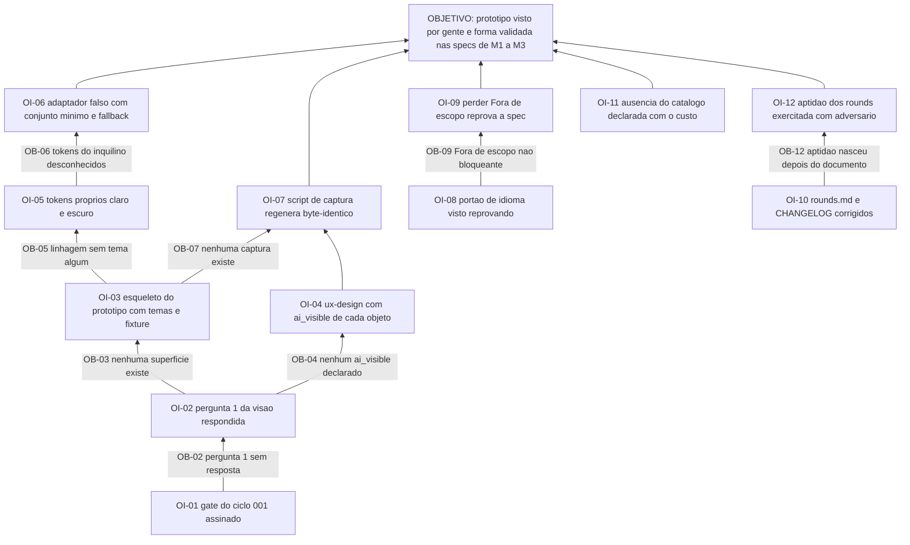

# APR 002 — Árvore de Pré-Requisitos do protótipo de interfaces

> Siglas deste documento: **APR** — Árvore de Pré-Requisitos · **OI** — Objetivo
> Intermediário · **ARF** — Árvore da Realidade Futura · **AT** — Árvore de Transição ·
> **ARA** — Árvore da Realidade Atual · **NC** — Nuvem de Conflito · **UDE** — Efeito
> Indesejável · **TOC** — Teoria das Restrições · **ADR** — Architecture Decision Record
> (Registro de Decisão Arquitetural) · **IA** — inteligência artificial · **DoD** —
> Definition of Done (Definição de Pronto).

- **Spec**: `specs/002-prototipo-de-interfaces/spec.md` · **Ciclo**: 002 (planejado) ·
  **Data desta árvore**: 2026-09-05
- **Lógica**: condição **necessária**. Lê-se de baixo para cima.
- **Objetivo**: **o protótipo descartável de M1–M3 existe, foi visto por gente, e as
  specs dos módulos consomem a forma que ele validou** — sem que uma linha de código de
  produção tenha nascido.

## Obstáculos e objetivos intermediários

| # | Obstáculo (condição atual que bloqueia) | Evidência | OI que o supera | Depende de |
|---|---|---|---|---|
| **OB-01** | O gate humano do ciclo 001 não fechou: `TAIL:gate` está em branco e sete decisões aguardam assinatura | `specs/001-fundacao-e-planejamento/tasks.md`, cauda; §8 do `qa-report.md` daquele ciclo; `docs/roadmap.md`, "O que o ciclo 002 não pode começar sem" | **OI-01**: o gate do 001 está assinado e a promoção autorizada | nenhum |
| **OB-02** | A pergunta 1 de `docs/produto/visao.md` §7 — colaboração por projeto ou isolamento por usuário — está sem resposta, e ela **muda as telas de projeto do épico E1.1** | pré-condição declarada em `docs/roadmap.md`; primeiro `[DÚVIDA]` do `## Clarify` da spec 002 | **OI-02**: a resposta está registrada na spec, na seção "O que entra como dado" | OI-01 |
| **OB-03** | Não existe superfície alguma neste repositório: `prototipo/` não existe, e a varredura por arquivos de interface devolve **zero** `.tsx` | saídas coladas abaixo | **OI-03**: o esqueleto do protótipo existe em `prototipo/`, com os tokens dos dois temas e a fixture sintética carregada | OI-02 |
| **OB-04** | Não existe declaração de papel semântico nem de `ai_visible`: `specs/002-prototipo-de-interfaces/ux-design.md` é entrega futura declarada, não arquivo | `scripts/check-caminhos.sh` classifica esse caminho em `FUTUROS` com o motivo "002: papel semântico antes do componente" | **OI-04**: o `ux-design.md` existe e todo objeto de tela declara `ai_visible`, com padrão não visível | OI-02 |
| **OB-05** | A linhagem não tem tema algum a herdar — a medição sobre o `tocbuilderv3` devolveu `0` ocorrências de `theme`/`darkMode` | fonte F-07 da spec 002 | **OI-05**: existem tokens próprios claro e escuro, decididos sem referência, e o *fallback* cobre todo token ausente | OI-03 |
| **OB-06** | Não se sabe quais `theme.tokens` um inquilino real da fundação define; a interseção depende do `theme.tokens_used` do nosso manifesto, que só nasce no ciclo 003 | lacuna **L-02** da spec 002 | **OI-06**: o adaptador falso entrega um conjunto mínimo plausível e o *fallback* obrigatório cobre o resto, como a norma manda | OI-05 |
| **OB-07** | Não existe script de captura nem captura alguma: `docs/jornadas/` tem apenas `README.md` | saída colada abaixo | **OI-07**: o script versionado de captura existe e regenera as imagens byte-idênticas sobre o mesmo build — dado fixo, relógio congelado, mesma viewport | OI-03, OI-04 |
| **OB-08** | O RNF-01 (português no projeto, inglês na superfície instalável) é verificado **por leitura**: não existe portão executável | dívida **Dv-1** do `qa-report.md` do ciclo 001, dono declarado: construtor do ciclo 002 | **OI-08**: existe portão de idioma que imprime quanto examinou e foi visto reprovando uma sabotagem | nenhum |
| **OB-09** | A seção "Fora de escopo" é pontuada e não bloqueante: perdê-la custa 8 dos 15 pontos de Escopo e a spec continua passando (medido: 92,6 → 84,6, portão saiu 0) | dívida **Dv-5**, mesmo dono | **OI-09**: perder a seção "Fora de escopo" reprova a spec, com a sabotagem que o prova na suíte | OI-08 |
| **OB-10** | `docs/produto/rounds.md` declara que o verificador executável dos rounds "ainda não existe" — e `scripts/check-rounds.sh` existe e sai 0 | dívida **Dv-6**, mesmo dono; saída colada abaixo | **OI-10**: as duas linhas divergentes dizem o que é verdade hoje | nenhum |
| **OB-11** | O catálogo `toc.*` não existe, e sem ele não há como prototipar o ciclo propor → confirmar → executar; a irmã prototipou o dela cedo porque o catálogo dela nascia no mesmo ciclo | lacuna **L-03** da spec 002; `specs/006-acoes-governadas-e-snapshot/spec.md` é quem o cria | **OI-11**: a ausência está declarada como fora de escopo com o custo escrito — uma rodada de ajuste a mais no ciclo 006, sobre build real | nenhum |
| **OB-12** | A aptidão dos rounds nasceu depois do documento que verifica, e ninguém a exercitou contra um texto adversário | dívida **Dv-7**, dono declarado: revisão independente do ciclo 002 | **OI-12**: a aptidão foi exercitada contra um `rounds.md` adversário por quem não a escreveu | OI-10 |

## Sequenciamento

O caminho crítico é curto e todo humano na base: **OI-01 → OI-02 → OI-03/OI-04**. Nada
de tela começa antes da resposta à pergunta 1, porque ela muda as telas de projeto — e
começar antes seria construir para refazer.

As dívidas herdadas do ciclo 001 (OI-08, OI-09, OI-10, OI-12) formam um **ramo paralelo
independente**: não bloqueiam o protótipo e o protótipo não as bloqueia. Elas entram
aqui porque o `qa-report.md` do 001 lhes deu como dono o **construtor do ciclo 002** —
uma dívida com dono nomeado é obstáculo do dono, não lembrete genérico.

O ramo da prova (OI-07) exige tela **e** semântica prontas: capturar antes do
`ux-design.md` produziria imagem de algo que ainda vai mudar.

## O grafo



## Evidência — as saídas que ancoram os obstáculos

```
$ test -d prototipo && echo SIM || echo "NAO existe prototipo/"
NAO existe prototipo/

$ find . -path ./.git -prune -o -name '*.tsx' -print | wc -l
0

$ ls docs/jornadas
README.md
```

```
$ scripts/check-rounds.sh ; echo "exit=$?"
✓ todo round declara os sete campos, as dependências não formam ciclo,
  e cada defeito medido tem exatamente um destino.
exit=0

$ sed -n '18p' docs/produto/rounds.md
  campos e da alocação exaustiva de D-01..D-11 ainda não existe; até ele entrar (candidato
```

## O que esta árvore não decide

- **Se a visão conflito+solução entra no apetite** — é o "sai primeiro" declarado do round
  002 e uma `[DÚVIDA]` do `## Clarify`; a decisão é do gate, não desta árvore.
- **O que se ganha quando o objetivo existir** — é da ARF (`arf.md`).
- **Quem faz o quê, em que ordem** — é da AT (`at.md`), amarrada ao `tasks.md` do ciclo.
