# ARF 002 — Árvore da Realidade Futura do protótipo de interfaces

> Siglas deste documento: **ARF** — Árvore da Realidade Futura · **APR** — Árvore de
> Pré-Requisitos · **AT** — Árvore de Transição · **ARA** — Árvore da Realidade Atual ·
> **NC** — Nuvem de Conflito · **UDE** — Efeito Indesejável · **TOC** — Teoria das
> Restrições · **ADR** — Architecture Decision Record (Registro de Decisão Arquitetural)
> · **IA** — inteligência artificial · **CSS** — Cascading Style Sheets · **DoD** —
> Definition of Done (Definição de Pronto).

- **Spec**: `specs/002-prototipo-de-interfaces/spec.md` · **Ciclo**: 002 (planejado) ·
  **Data desta árvore**: 2026-09-05
- **Lógica**: causa **suficiente**. Lê-se de baixo para cima.
- **Round correspondente**: `docs/produto/rounds.md`, round 002.

## A injeção — o que a spec entrega

| # | Injeção | O que a spec diz |
|---|---|---|
| **I-01** | **`ux-design.md` nasce antes de qualquer componente**: papel semântico, estados obrigatórios e `ai_visible` de cada objeto de tela, com padrão **não visível** e justificativa escrita em cada `sim` | RF-01, US-01 |
| **I-02** | **Um protótipo descartável navegável em `prototipo/`**, sob as quatro condições cumulativas herdadas do ADR 0005 da irmã: fora do diretório da aplicação, sem regra de domínio, sem dado real nem fala com a fundação, apagado ou reescrito no round que o implementa | RF-02, RF-07 |
| **I-03** | **A prova visual é gerada do build real por script versionado** e regenera byte-idêntica, com jornada por tela e avaliação heurística datada | RF-03, RF-04, RNF-03 |
| **I-04** | **A junta é ensaiada por adaptador falso** que devolve o envelope `ghd.handshake` no formato do guia da fundação, com tema do inquilino por cima do tema próprio e *fallback* obrigatório | RF-09, RI-07, RI-09 |

## Os efeitos desejáveis

| # | Efeito desejável | Decorre de | Hoje é falso porque (evidência) |
|---|---|---|---|
| **ED-01** | A forma das telas de M1–M3 está **validada por olho humano** antes de existir código de produção | I-02, I-03 | Quatro gerações redesenharam canvas, painel e tema sem registrar o que foi visto e decidido (spec 002, "O quê e por quê"); e hoje o repositório não tem tela alguma — `test -d prototipo` responde que o diretório não existe |
| **ED-02** | O snapshot sanitizado do ciclo 006 nasce **por lista de permissão**, não por esquecimento: cada campo já declara se a IA pode vê-lo | I-01 | O registro de telas com `ai_visible` só nasce no ciclo 006 (`specs/006-acoes-governadas-e-snapshot/spec.md`, RF-34); sem o `ux-design.md` do 002 ele nasceria adivinhando campo a campo |
| **ED-03** | Existe **prova visual versionada** do que foi construído: rodar o script duas vezes sobre o mesmo build devolve as mesmas imagens | I-03 | `docs/jornadas/` contém hoje apenas o `README.md` — nenhuma captura, nenhum script. A linhagem "funcionava" e nunca se soube exatamente o quê (defeito **D-10**) |
| **ED-04** | A aplicação tem tema claro **e** escuro pela primeira vez na linhagem | I-04 | Medição colada na spec 002 (F-07): `grep -rn -i -E "theme\|darkMode\|dark-mode"` sobre o `tocbuilderv3` devolve `0` — não há tema algum a herdar |
| **ED-05** | Trocar o adaptador falso pelo hospedeiro real, no ciclo 003, é **configuração e não reescrita** | I-04 | A irmã escreveu a metade dela da junta sem contrato e o envelope saiu `{tipo, versao, payload}` — registrado na própria norma como o exemplo de que "a junta não fecharia" |
| **ED-06** | A vista tabular é validada como **par** do canvas, não como acessório | I-02 | Na linhagem o painel de entidades é o que tornava projetos grandes utilizáveis (`tocbuilderv3/components/EntitiesPanel.tsx`); o round 002 a declara "nunca sai" |
| **ED-07** | O modo embarcado só-conteúdo é visto **dentro de um iframe real**, não imaginado | I-02, I-04 | A norma exige renderizar apenas conteúdo quando embarcada; sem casca local, a primeira vez que se veria isso seria em produção, no ciclo 003 |

## Ramos negativos — o que pode piorar, e a poda

| # | Ramo negativo | Poda declarada |
|---|---|---|
| **RN-01** | O protótipo descartável vira código de produção por atalho — "já está funcionando, é só mover" — e a fronteira que separa exploração de compromisso desaparece | As **quatro condições cumulativas** são contrato, não adjetivo (RF-02), e a DoD linha 2 as verifica: `prototipo/` fora da aplicação, nenhuma referência a ele em código de produção |
| **RN-02** | O protótipo **calcula** o estado de validação de UDE para parecer mais completo, e nasce uma segunda fonte de verdade da regra que o ciclo 005 vai escrever | Condição 2 do descartável: estados vêm **prontos da fixture** (RI-11), e a DoD linha 3 exige que a revisão independente confirme a ausência de cálculo |
| **RN-03** | Os 420px de referência são a prova **da irmã**, não a nossa: valida-se a forma errada e o retrabalho aparece no ciclo 003 | Lacuna L-01 declarada com risco baixo, e a poda é a própria natureza do artefato: as capturas estreitas **regeneram** quando o embarque real medir a largura |
| **RN-04** | A jornada ganha capturas coladas à mão e vira ficção ilustrada — o pecado que a Iron Law da skill de jornada viva nomeia | RF-03 exige captura do **build real** por script versionado, e a DoD linha 5 roda o script duas vezes e compara: `diff -r` limpo ou reprova |
| **RN-05** | O protótipo prototipa o que ainda não tem spec executada — ARF, APR, AT, S&T, focalização — e produz estoque de tela que ninguém vai construir tão cedo | O campo *Fora* do round 002 é explícito, e a spec repete: prototipar o que só entra nos rounds 008–010 seria estoque |
| **RN-06** | Sem o ciclo propor → confirmar → executar em tela, a forma da assistência só será validada no ciclo 006, sobre build real, com uma rodada de ajuste a mais | Lacuna L-03, declarada com risco **médio** e custo aceito por escrito: o catálogo `toc.*` que governa esse ciclo só nasce no 006, e prototipá-lo antes seria desenhar sobre contrato inexistente |

## O grafo

```mermaid
graph BT
  I01["I-01 ux-design com ai_visible antes do componente"]
  I02["I-02 prototipo descartavel sob as quatro condicoes"]
  I03["I-03 captura do build real por script versionado"]
  I04["I-04 adaptador falso do handshake com tema e fallback"]

  ED01["ED-01 forma das telas validada por olho humano"]
  ED02["ED-02 snapshot do ciclo 006 nasce por lista de permissao"]
  ED03["ED-03 prova visual versionada e regeneravel"]
  ED04["ED-04 tema claro e escuro pela primeira vez"]
  ED05["ED-05 trocar o falso pelo real e configuracao"]
  ED06["ED-06 vista tabular validada como par do canvas"]
  ED07["ED-07 modo so-conteudo visto em iframe real"]

  OBJ["OBJETIVO: as specs de M1 a M3 consomem forma validada, nao suposta"]

  I01 --> ED02
  I02 --> ED01
  I02 --> ED06
  I03 --> ED01
  I03 --> ED03
  I04 --> ED04
  I04 --> ED05
  I02 --> ED07
  I04 --> ED07

  ED01 --> OBJ
  ED02 --> OBJ
  ED03 --> OBJ
  ED04 --> OBJ
  ED05 --> OBJ
  ED06 --> OBJ
  ED07 --> OBJ

  RN01["RN-01 descartavel vira producao por atalho"]
  RN02["RN-02 prototipo calcula e vira segunda fonte de verdade"]
  RN04["RN-04 captura colada a mao vira ficcao"]
  P01["PODA quatro condicoes cumulativas verificadas na DoD 2"]
  P02["PODA estado vem da fixture e revisao confirma ausencia de calculo"]
  P04["PODA script rodado duas vezes com diff limpo"]

  I02 -.-> RN01
  I02 -.-> RN02
  I03 -.-> RN04
  P01 --> RN01
  P02 --> RN02
  P04 --> RN04
```



## Evidência — os números desta árvore, com o comando executado

```
$ test -d prototipo && echo SIM || echo "NAO existe prototipo/"
NAO existe prototipo/

$ ls docs/jornadas
README.md
```

A medição da ausência de tema na linhagem está colada na fonte F-07 da própria spec 002
(`grep` sobre o `tocbuilderv3` devolvendo `0`) e não é recontada aqui — citar a fonte é o
que a regra R1 pede quando o número já foi executado e registrado.

## O que esta árvore não decide

- **Se o ciclo 002 pode abrir** — depende do gate humano do 001 e da resposta à pergunta 1
  da visão; os dois são obstáculos da APR (`apr.md`).
- **A ordem de execução dos passos** — é da AT (`at.md`).
- **Os requisitos definitivos de cada ferramenta** — vivem nas specs dos módulos; o que
  sai deste ciclo é a **forma validada** que elas consomem.
