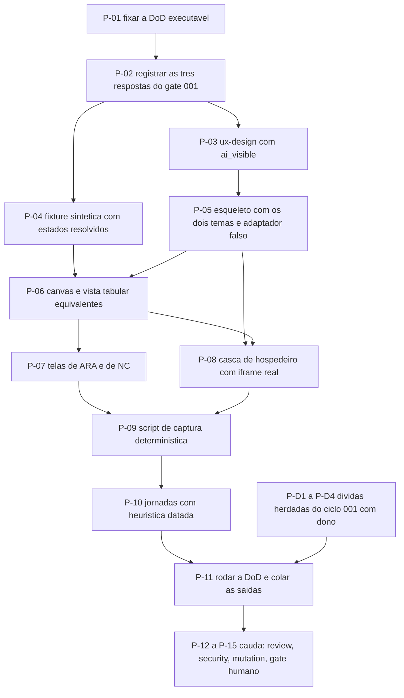

# AT 002 — Árvore de Transição do protótipo de interfaces

> Siglas deste documento: **AT** — Árvore de Transição · **APR** — Árvore de
> Pré-Requisitos · **OI** — Objetivo Intermediário · **ARF** — Árvore da Realidade
> Futura · **ARA** — Árvore da Realidade Atual · **NC** — Nuvem de Conflito · **UDE** —
> Efeito Indesejável · **TOC** — Teoria das Restrições · **ADR** — Architecture Decision
> Record (Registro de Decisão Arquitetural) · **IA** — inteligência artificial · **DoD**
> — Definition of Done (Definição de Pronto).

- **Spec**: `specs/002-prototipo-de-interfaces/spec.md` · **Ciclo**: 002 (planejado,
  nenhuma tarefa executada) · **Data desta árvore**: 2026-09-05
- **Fonte dos passos**: `specs/002-prototipo-de-interfaces/tasks.md`. A AT **não inventa
  passo**: cada linha é uma tarefa daquele arquivo. Onde divergirem, o `tasks.md` manda.

## Os passos

| Passo | Tarefa | Necessidade (por que este passo, agora) | Ação | Resultado esperado (verificável) |
|---|---|---|---|---|
| **P-01** | T-01 | Fixar o que conta como pronto **antes** de construir é o que impede a DoD de ser escrita para caber no que saiu | Fixar as onze verificações da spec com comando e valor esperado | Cada linha tem comando e saída esperada; nenhum critério subjetivo |
| **P-02** | T-02 | Três respostas do gate 001 entram como **dado** deste ciclo, e a primeira delas muda as telas do E1.1 — construir antes é construir para refazer (OI-02 da APR) | Registrar na spec: pergunta 1 da visão §7, apetite da visão conflito+solução, fonte dos `theme.tokens` de teste | As três respostas escritas na seção "O que entra como dado"; nenhuma resolvida em silêncio |
| **P-03** | T-03 | Papel semântico antes de componente é o que faz o snapshot do ciclo 006 nascer por lista de permissão (ED-02 da ARF) | Escrever `ux-design.md` com papel, estados obrigatórios e `ai_visible` de cada objeto | DoD linha 1: o arquivo existe e o número de declarações de `ai_visible` cobre os objetos declarados |
| **P-04** | T-04 | O protótipo não pode calcular nada (condição 2 do descartável): os estados de validação têm de **vir resolvidos no dado** | Escrever a fixture sintética da "Instituição Horizonte" em `prototipo/dados/`: projeto, nós, arestas, UDEs com estado, NC com 5 entidades, 7 premissas e 1 injeção | DoD linhas 3 e 4; nenhum nome real de pessoa |
| **P-05** | T-05 | Sem esqueleto e sem tema não há o que capturar, e a linhagem não tem tema a herdar (OB-05 da APR) | Montar `prototipo/` com os tokens dos dois temas e o adaptador falso do handshake | DoD linha 2; o envelope do adaptador tem o mesmo formato do guia da fundação |
| **P-06** | T-06 | Canvas e vista tabular são um par: um canvas sozinho repetiria o corte errado da linhagem, e o round 002 declara a tabela como "nunca sai" | Construir canvas e vista tabular equivalentes, com alternância sem perda de estado e degradação digna em 420px | As duas vistas mostram os mesmos dados da fixture; a alternância preserva a edição em curso |
| **P-07** | T-07 | As duas ferramentas mais maduras da linhagem precisam ser vistas com os estados que as specs de módulo vão exigir | Construir as telas de ARA (UDEs com estado vindo da fixture) e de NC (forma canônica) | Nenhum estado calculado pelo protótipo; premissas acessíveis pelas sete arestas |
| **P-08** | T-08 | A aplicação vai ser usada **embarcada**: ver isso só em produção, no ciclo 003, é ver tarde | Construir a casca de hospedeiro local com iframe: modo só-conteúdo, tema do inquilino por cima com *fallback*, alternância autônomo/embarcado × claro/escuro × mesa/estreito | DoD linhas 7 e 8 |
| **P-09** | T-09 | Jornada sem captura do build real é ficção — a Iron Law da skill de jornada viva | Escrever o script versionado de captura em `prototipo/scripts/` e gerar as capturas determinísticas em `docs/jornadas/capturas/` | DoD linha 5: duas execuções sobre o mesmo build, `diff -r` limpo |
| **P-10** | T-10 | Captura sem leitura é imagem; o que valida a forma é a avaliação heurística, e ela tem de ser **datada** para envelhecer honestamente | Escrever os documentos de jornada em versão de protótipo, cada um com avaliação heurística datada e limite declarado; atualizar `docs/jornadas/README.md` | DoD linhas 6 e 10; nenhuma captura órfã — toda imagem citada por exatamente uma jornada |
| **P-11** | T-11 | Caixa marcada não é testemunha; o verde só vale se disser **quanto** examinou (regra R2) | Rodar a DoD completa e as aptidões do projeto, colando saída, código de saída e tamanho examinado | Nenhuma linha do `qa-report.md` com sinal transcrito sem a saída colada |
| **P-12** | `TAIL:review` | Quem construiu não vê que o próprio protótipo passou a calcular — é o achado que só um revisor em contexto fresco encontra | Revisão independente, incluindo a conferência de que o protótipo não calcula nada | Veredito e achados registrados no `qa-report.md` |
| **P-13** | `TAIL:security` | A classe de risco aqui é dado real em fixture ou captura e provedor de modelo no cliente — o defeito canônico da linhagem | Passe de segurança proporcional | DoD linha 9: nenhuma ocorrência de cliente de provedor ou chave em `prototipo/` |
| **P-14** | `TAIL:mutation` | Portão que nunca reprovou não é evidência (RN-02 da ARF do ciclo 001) | Sabotar todo portão novo do ciclo e vê-lo recusar; se nenhum nascer, marcar `n/a` com o motivo | Cada sabotagem com o comando e a recusa impressa |
| **P-15** | `TAIL:gate` | Quem executou não aprova o que executou | Apresentar a DoD verde e a jornada ao Product Steward | Decisão de merge registrada |

## Os passos que a AT acrescenta como dívida herdada

O `tasks.md` do ciclo 002 **não lista** as quatro dívidas que o `qa-report.md` do ciclo
001 deu ao construtor deste ciclo. Elas são obstáculos reais da APR (OB-08 a OB-10,
OB-12) e ficam registradas aqui como o que são: trabalho com dono, ainda **fora** do
`tasks.md`.

| Passo | Necessidade | Ação | Resultado esperado |
|---|---|---|---|
| **P-D1** | Dívida **Dv-1**: o RNF-01 não tem portão executável | Escrever o portão de idioma e a sabotagem que o derruba | Portão imprime quanto examinou e reprova a sabotagem |
| **P-D2** | Dívida **Dv-5**: perder "Fora de escopo" não reprova a spec | Tornar a seção bloqueante em `scripts/check-specs.sh` e plantar a sabotagem em `scripts/tests/run-sabotagem.sh` | A spec sem "Fora de escopo" reprova |
| **P-D3** | Dívida **Dv-6**: duas linhas afirmam que o verificador de rounds não existe, e ele existe | Corrigir a linha de `docs/produto/rounds.md` e a de `CHANGELOG.md` | As duas linhas dizem o que é verdade hoje |
| **P-D4** | Dívida **Dv-7**: a aptidão dos rounds nasceu depois do documento | A revisão independente deste ciclo a exercita contra um `rounds.md` adversário | A aptidão reprova o texto adversário |

> **Por que ficam aqui e não no `tasks.md`.** O `tasks.md` do 002 foi escrito no ciclo
> 001, antes de o `qa-report.md` daquele ciclo existir — as dívidas nasceram depois dele.
> Acrescentá-las ao `tasks.md` a partir desta árvore seria reescrever o plano de um ciclo
> por um documento de planejamento; o caminho do método é a abertura do ciclo 002 as
> absorver. Registrá-las **aqui** é o que impede que se percam no intervalo.

## O grafo

## O que esta árvore não decide

- **Se o ciclo pode abrir** — os pré-requisitos são da APR (`apr.md`); o primeiro deles é
  humano.
- **O que se ganha** — é da ARF (`arf.md`).
- **O conteúdo do `ux-design.md`** — é entrega do próprio ciclo, não deste planejamento.
