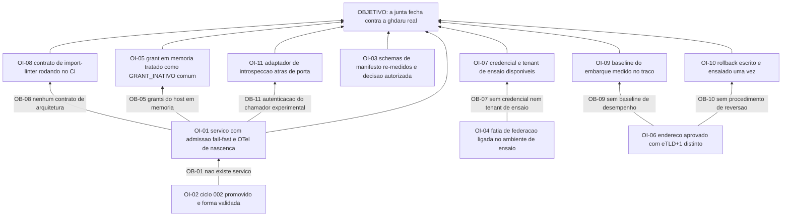

# APR 003 — Árvore de Pré-Requisitos do esqueleto federado

> Siglas deste documento: **APR** — Árvore de Pré-Requisitos · **OI** — Objetivo
> Intermediário · **ARF** — Árvore da Realidade Futura · **AT** — Árvore de Transição ·
> **APH** — Aplicação ↔ Harness · **ADR** — Architecture Decision Record (Registro de
> Decisão Arquitetural) · **OTel** — OpenTelemetry · **CI** — integração contínua ·
> **eTLD+1** — *effective Top-Level Domain plus one* · **TOC** — Teoria das Restrições ·
> **DoD** — Definition of Done (Definição de Pronto).

- **Spec**: `specs/003-esqueleto-federado/spec.md` · **Ciclo**: 003 (planejado, raia
  **infra**) · **Data desta árvore**: 2026-09-05
- **Lógica**: condição **necessária**. Lê-se de baixo para cima.
- **Objetivo**: **a aplicação existe embarcada na `ghdaru` real, sob identidade
  introspectada, com banco e traço próprios** — a aptidão mais importante do roadmap, e
  binária.

## Nota sobre a natureza dos obstáculos deste ciclo

Cinco dos onze obstáculos abaixo **não são nossos para resolver**: dependem da fundação,
da norma ou do Product Steward. Isso não os torna menos obstáculos — torna-os obstáculos
com dono externo, e o objetivo intermediário correspondente é uma **medição registrada**
ou uma **decisão autorizada**, nunca um conserto que o P1 proíbe.

## Obstáculos e objetivos intermediários

| # | Obstáculo (condição atual que bloqueia) | Evidência | OI que o supera | Depende de |
|---|---|---|---|---|
| **OB-01** | Não existe serviço: o repositório não tem `pyproject.toml`, não tem diretório de aplicação, e a varredura devolve **cinco** arquivos de código, todos utilitários de documentação e de portão | saída colada abaixo | **OI-01**: existe serviço com admissão de falha rápida, OTel de nascença e log estruturado com identificador de traço | OI-02 |
| **OB-02** | O ciclo 002 não foi executado: o esqueleto embarca a casca de telas que o protótipo validou, e `prototipo/` não existe | `docs/produto/rounds.md`, round 003: "Depende de: 002"; `test -d prototipo` responde que não existe | **OI-02**: o ciclo 002 está promovido e a forma das telas está validada por olho humano | nenhum |
| **OB-03** | Os dois schemas de manifesto eram **mutuamente exclusivos** quando a irmã mediu — o golden da fundação exige `level` e `endpoints.validate_token`, o normativo do Anexo B exige `mode` e `endpoints.introspect`, ambos com `additionalProperties: false`, e a validação cruzada devolveu **4 erros** | fonte F-14 da spec 003 (`gestaodeprioridades/mensagens/005-para-ghdaru-embarque-da-prioridades.md`); lacuna **L-01**, risco **alto** | **OI-03**: a re-medição contra o commit atual está feita e registrada; se o conflito persistir, a decisão de entregar tudo menos o registro do manifesto está autorizada e a nossa `mensagens/NNN` está escrita | nenhum |
| **OB-04** | A fatia de federação da fundação é **desligada por padrão**: sem `FEDERATION_MANIFESTS_ENABLED`, tudo responde 404 | `ghdaru/apps/api/src/ghdaru_api/http/manifest_loader.py:28`, linha colada abaixo; lacuna **L-02** | **OI-04**: a fatia está ligada no ambiente de ensaio pelo operador da fundação — ou a recusa está registrada como bloqueio, com data | nenhum |
| **OB-05** | Os grants de embarque do hospedeiro vivem **em memória**, em repositório declaradamente protótipo: um reinício invalida embarques em voo | `ghdaru/apps/api/src/ghdaru_api/identity/adapters/in_memory.py:60-61`, linhas coladas abaixo; lacuna **L-03**, risco baixo | **OI-05**: o caso está tratado como `GRANT_INATIVO` comum, sem tratamento especial e sem chamado aberto como se fosse defeito nosso | OI-01 |
| **OB-06** | Não há endereço publicado, e a escolha do eTLD+1 é **irreversível na prática** porque entra no manifesto que circula | primeira `[DÚVIDA]` do `## Clarify` da spec 003; portão humano declarado em `docs/roadmap.md` | **OI-06**: o endereço está aprovado pelo Product Steward e o eTLD+1 é comprovadamente distinto do hospedeiro | nenhum |
| **OB-07** | Não existe credencial de aplicação nem tenant de ensaio, e o ambiente de teste da fundação é "DEVE ser oferecido" na norma — o que não impede subir sem ele | lacuna **L-05**, risco médio; `[DÚVIDA]` 4 do `## Clarify` | **OI-07**: a credencial e o tenant de ensaio existem, ou está registrado que o ensaio acontece no ambiente real com tenant de teste | OI-04 |
| **OB-08** | Não existe contrato de arquitetura executável: nem `pyproject.toml`, nem `scripts/check-arquitetura.sh` — o `import-linter` que o P3 exige como função de aptidão não roda porque não existe | saída colada abaixo | **OI-08**: o contrato de `import-linter` existe, roda no CI e o vermelho bloqueia o merge | OI-01 |
| **OB-09** | Não há baseline de desempenho do embarque: o alvo de 3 segundos do RNF-06 é proposto, não medido | lacuna **L-06** | **OI-09**: a primeira medição real do tempo entre `ghd.ready` e a lista renderizada está registrada, extraída do traço | OI-01, OI-06 |
| **OB-10** | Não existe procedimento de reversão: `docs/operacao/rollback.md` é entrega futura declarada, e a raia infra exige reversibilidade **entregue** | `scripts/check-caminhos.sh` classifica o caminho em `FUTUROS` com o motivo "003: procedimento de reversão da raia infra" | **OI-10**: o procedimento está escrito e **ensaiado uma vez**, com a saída do ensaio colada | OI-06 |
| **OB-11** | A autenticação do chamador da introspecção é marcada como experimental na norma, embora a fundação já a implemente | lacuna **L-04**, risco baixo; a rota real existe em `ghdaru/apps/api/src/ghdaru_api/http/auth_router.py:139` | **OI-11**: seguimos a implementação real da fundação, com o adaptador de introspecção isolado atrás de porta para absorver a mudança se a norma fechar diferente | OI-01 |

## Sequenciamento

O ciclo tem **três raízes independentes**, e é isso que permite trabalhar em paralelo sem
esperar o que não depende de nós:

1. **A raiz do produto**: OI-02 (ciclo 002 promovido) → OI-01 (o serviço existe) → OI-08,
   OI-05, OI-11. É a única frente inteiramente nossa.
2. **A raiz externa**: OI-03 e OI-04 dependem da fundação e da norma. Elas não bloqueiam
   OI-01: bloqueiam apenas o **registro do manifesto**, que é a parte da aptidão central
   declarada como cortável se OB-03 persistir.
3. **A raiz humana**: OI-06 (endereço aprovado) é portão do Product Steward e destrava
   OI-09 e OI-10 — as duas coisas que só existem depois de haver algo publicado.

O objetivo exige as três raízes convergindo. **A ordem entre elas importa**: publicar
antes de aprovar o endereço custa re-admissão de manifesto, e medir desempenho antes de
publicar mede a máquina de quem mediu.

## O grafo



## Evidência — as saídas que ancoram os obstáculos

```
$ ls pyproject.toml package.json
ls: cannot access 'pyproject.toml': No such file or directory
ls: cannot access 'package.json': No such file or directory

$ find . -path ./.git -prune -o \( -name '*.py' -o -name '*.tsx' -o -name '*.ts' \) -print
./scripts/hooks/guard-immutables.py
./scripts/tests/sabotagem/vazamento/scripts/gera-base.py
./tools/product-site/render.py
./tools/product-site/generate.py
./docs/produto/dados/medir-base.py

$ ls scripts/ | grep arquitetura || echo "check-arquitetura.sh nao existe"
check-arquitetura.sh nao existe
```

```
$ sed -n '28p' /home/user/ghdaru/apps/api/src/ghdaru_api/http/manifest_loader.py
    return os.environ.get("FEDERATION_MANIFESTS_ENABLED", "").strip().lower() in {

$ sed -n '60,61p' /home/user/ghdaru/apps/api/src/ghdaru_api/identity/adapters/in_memory.py
class InMemoryEmbedGrantRepository:
    """Grants de embed (spec 041 / D3) — protótipo in-memory como o registro federado;
```

## O que esta árvore não decide

- **Se um bloqueio externo persistente fecha ou não o ciclo** — é a `[DÚVIDA]` 5 do
  `## Clarify`, matéria do gate humano.
- **Como cada obstáculo é atacado, em que ordem operacional** — é da AT (`at.md`).
- **O que se ganha quando a junta fechar** — é da ARF (`arf.md`).
