# ARF 003 — Árvore da Realidade Futura do esqueleto federado

> Siglas deste documento: **ARF** — Árvore da Realidade Futura · **APR** — Árvore de
> Pré-Requisitos · **AT** — Árvore de Transição · **APH** — Aplicação ↔ Harness ·
> **TOC** — Teoria das Restrições · **ADR** — Architecture Decision Record (Registro de
> Decisão Arquitetural) · **OTel** — OpenTelemetry · **CI** — integração contínua ·
> **eTLD+1** — *effective Top-Level Domain plus one*, o "site" no sentido do navegador ·
> **TTL** — Time To Live (tempo de vida) · **DoD** — Definition of Done (Definição de
> Pronto) · **IA** — inteligência artificial.

- **Spec**: `specs/003-esqueleto-federado/spec.md` · **Ciclo**: 003 (planejado, raia
  **infra**) · **Data desta árvore**: 2026-09-05
- **Lógica**: causa **suficiente**. Lê-se de baixo para cima.
- **Round correspondente**: `docs/produto/rounds.md`, round 003 — "o primeiro corte".

## A injeção — o que a spec entrega

| # | Injeção | O que a spec diz |
|---|---|---|
| **I-01** | **Admissão com falha rápida**: sem qualquer um dos quatro parâmetros do §B.4, mais `DATABASE_URL` e a credencial da aplicação, o serviço **recusa subir** nomeando o que faltou, com código de saída diferente de zero e nenhuma porta aberta | RF-01..RF-05 |
| **I-02** | **Identidade só por introspecção**: o grant do handshake é trocado imediatamente por identidade em `POST /auth/introspect`, servidor a servidor, e é a resposta `active: true` — nunca o payload do canal — que define o que a pessoa vê | RF-06..RF-13 |
| **I-03** | **Canal `ghd.*` com a trava dupla**: `ev.source` e depois `ev.origin` verificados antes de olhar conteúdo, `targetOrigin` sempre dirigido, `ghd.ready` primeiro, envelope canônico de quatro campos | RF-14..RF-23 |
| **I-04** | **Chão próprio**: PostgreSQL em projeto próprio com migração Alembic reversível, isolamento por inquilino em toda consulta, OTel de nascença em todo endpoint, deploy em eTLD+1 distinto do hospedeiro e rollback ensaiado | RF-28..RF-39 |

## Os efeitos desejáveis

| # | Efeito desejável | Decorre de | Hoje é falso porque (evidência) |
|---|---|---|---|
| **ED-01** | Uma pessoa abre a aplicação dentro da fundação e a vê **sob a identidade dela** — sem segundo login e sem segundo cadastro | I-02 | Na linhagem não havia usuário: `tocbuilderv3/constants.ts:5` define `DEFAULT_USER_ID = 'user_placeholder_001'` (defeito **D-02**) |
| **ED-02** | O dado sai do navegador: existe banco de verdade, isolado por inquilino, com migração que sobe **e** desce sem resíduo | I-04 | Toda a persistência da 4ª geração era memória de processo — `tocbuilderv3/services/mockApiService.ts:9-14` declara três vetores de simulação, e recarregar perdia tudo (defeito **D-07**) |
| **ED-03** | O backend deixa de ser especificação parada e passa a existir | I-01, I-04 | Vinte endpoints especificados e nenhuma chamada real de rede no aplicativo (fonte F-07 da spec 004; defeito **D-03**) — a linhagem especificou quatro vezes e construiu zero |
| **ED-04** | Os três defeitos que a norma registrou do protótipo da irmã passam a ser **testes que recusam** neste código | I-03 | A norma registra os três como contraexemplos: envelope `{tipo, versao, payload}`, `ev.source === parent` inexistente, e `parent.postMessage(pronto, "*")` tendo a origem em mãos (`protocolos/padrao/anexo-b-federacao.md:62`, colado abaixo) |
| **ED-05** | Fundação indisponível vira **negação**, nunca janela de acesso sem dono | I-01, I-02 | Fail-closed não existe onde não existe serviço: o repositório não tem `pyproject.toml` nem diretório de aplicação |
| **ED-06** | Um embarque é diagnosticável em minutos: um traço único cobre do `ghd.ready` à lista renderizada | I-04 | Nenhuma das quatro gerações tem telemetria; o P5 exige o traço nascer com a funcionalidade, e não há funcionalidade |
| **ED-07** | A fronteira de origem em que toda a segurança do embarque se apoia **existe de fato**, não só no manifesto | I-04 | Não há endereço publicado; o eTLD+1 é a primeira `[DÚVIDA]` do `## Clarify` e portão humano declarado no `docs/roadmap.md` |
| **ED-08** | Reverter um deploy ruim é procedimento ensaiado, não improviso — a exigência da raia infra | I-04 | `docs/operacao/rollback.md` é entrega futura declarada: o arquivo não existe |

## Ramos negativos — o que pode piorar, e a poda

| # | Ramo negativo | Poda declarada |
|---|---|---|
| **RN-01** | A aptidão central do ciclo — "a junta fecha contra a `ghdaru` real" — **depende de coisa que não é nossa**: quando a irmã mediu, os dois schemas de manifesto eram mutuamente exclusivos, com 4 erros na validação cruzada. O ciclo pode terminar sem poder fechar o que existe para fechar | Declarado como lacuna **L-01**, risco **alto**, com caminho escrito: o ciclo entrega **tudo menos o registro do manifesto** e a recusa vira `mensagens/NNN` referenciando a mensagem 005 da irmã. A confirmação de que isso fecha o ciclo é a `[DÚVIDA]` 5 do `## Clarify` |
| **RN-02** | Publicar o endereço é **irreversível na prática**: o eTLD+1 entra no manifesto e circula. Escolher errado custa re-admissão | Portão **humano** antes do RF-36, declarado no `docs/roadmap.md`; a AT o trata como dependência de T-14, não como detalhe de deploy |
| **RN-03** | Raia infra sem reversibilidade entregue é raia plena com nome pomposo: promete-se rollback e ensaia-se na primeira emergência | RF-39 exige o ensaio **uma vez dentro do ciclo**, com a saída colada no `qa-report.md`; é a linha 14 da DoD e a tarefa T-15 |
| **RN-04** | Os grants de embarque do hospedeiro vivem em memória: um reinício do host invalida embarques em voo, e alguém depura isso como se fosse defeito nosso | Medido e declarado: `ghdaru/apps/api/src/ghdaru_api/identity/adapters/in_memory.py:60-61` é repositório declaradamente protótipo. O RNF-07 manda tratar como `GRANT_INATIVO` comum, **sem tratamento especial** — a poda é não escrever código para um caso que não é nosso |
| **RN-05** | A fatia de federação da fundação é desligada por padrão e tudo responde 404: o ciclo pode parecer quebrado quando só está desligado | Lacuna **L-02**, com a linha medida (`ghdaru/apps/api/src/ghdaru_api/http/manifest_loader.py:28` lê `FEDERATION_MANIFESTS_ENABLED`); ligar é do operador da fundação e o pedido é da abertura do ciclo, tarefa T-02 |
| **RN-06** | O serviço sobe pela metade — com um parâmetro faltando — e o erro só aparece quando alguém clica, no pior momento possível | RF-04: recusar subir é **terminar com código diferente de zero**, sem abrir porta, com o código de recusa na última linha do log. Subir pela metade é não-conformidade nomeada na norma |
| **RN-07** | O grant vaza para log, traço ou URL enquanto se depura a junta — e a credencial da aplicação vai junto no bundle | RNF-01 e RNF-02, verificados por grep negativo sobre os logs do teste de embarque e pela linha 13 da DoD (nenhum segredo versionado) |

## O grafo

```mermaid
graph BT
  I01["I-01 admissao com falha rapida nomeando o que faltou"]
  I02["I-02 identidade so por introspeccao servidor a servidor"]
  I03["I-03 canal ghd com trava dupla e targetOrigin dirigido"]
  I04["I-04 banco proprio, OTel, eTLD+1 distinto, rollback ensaiado"]

  ED01["ED-01 a pessoa entra sob a identidade dela"]
  ED02["ED-02 o dado sai do navegador"]
  ED03["ED-03 o backend deixa de ser especificacao parada"]
  ED04["ED-04 os tres defeitos da irma viram testes que recusam"]
  ED05["ED-05 fundacao indisponivel vira negacao"]
  ED06["ED-06 embarque diagnosticavel num traco unico"]
  ED07["ED-07 a fronteira de origem existe de fato"]
  ED08["ED-08 reverter deploy e procedimento ensaiado"]

  OBJ["OBJETIVO: a junta fecha contra a ghdaru real"]

  I02 --> ED01
  I04 --> ED02
  I01 --> ED03
  I04 --> ED03
  I03 --> ED04
  I01 --> ED05
  I02 --> ED05
  I04 --> ED06
  I04 --> ED07
  I04 --> ED08

  ED01 --> OBJ
  ED02 --> OBJ
  ED03 --> OBJ
  ED04 --> OBJ
  ED05 --> OBJ
  ED06 --> OBJ
  ED07 --> OBJ
  ED08 --> OBJ

  RN01["RN-01 schemas de manifesto podem seguir exclusivos"]
  RN02["RN-02 endereco publicado e irreversivel na pratica"]
  RN03["RN-03 rollback prometido e nao ensaiado"]
  P01["PODA entrega tudo menos o registro do manifesto e relata por mensagens"]
  P02["PODA portao humano do endereco antes do deploy"]
  P03["PODA ensaio de rollback uma vez no ciclo com saida colada"]

  I04 -.-> RN01
  I04 -.-> RN02
  I04 -.-> RN03
  P01 --> RN01
  P02 --> RN02
  P03 --> RN03
```



## Evidência — as linhas que ancoram os efeitos

```
$ sed -n '5p' /home/user/tocbuilderv3/constants.ts
export const DEFAULT_USER_ID = 'user_placeholder_001'; // Placeholder

$ sed -n '9,14p' /home/user/tocbuilderv3/services/mockApiService.ts
// Simulate a database for ARA Projects
let projects: AraProject[] = [];
// Fix: Added separate database for S&T Projects
let sntProjects: SnTProject[] = [];
// Simulate a database for Conflict Cloud Projects
let conflictCloudProjects: ConflictCloudProject[] = [];
```

```
$ sed -n '62p' /home/user/protocolos/padrao/anexo-b-federacao.md
> Defeito real, registrado aqui como o exemplo: `prototipo/adaptadores.js` posta o `ghd.ready` com `parent.postMessage(pronto, "*")` tendo `HOST_ORIGIN` em mãos.

$ sed -n '28p' /home/user/ghdaru/apps/api/src/ghdaru_api/http/manifest_loader.py
    return os.environ.get("FEDERATION_MANIFESTS_ENABLED", "").strip().lower() in {

$ sed -n '60,61p' /home/user/ghdaru/apps/api/src/ghdaru_api/identity/adapters/in_memory.py
class InMemoryEmbedGrantRepository:
    """Grants de embed (spec 041 / D3) — protótipo in-memory como o registro federado;
```

## O que esta árvore não decide

- **Se os bloqueios externos caíram** — a re-medição é a primeira tarefa do ciclo (T-02) e
  os obstáculos estão na APR (`apr.md`).
- **O endereço publicado** — é portão humano, declarado no `docs/roadmap.md`.
- **Qualquer ferramenta TOC** — este ciclo lista projetos sintéticos e nada mais; a
  primeira ferramenta é o núcleo de diagramas do ciclo 004.
