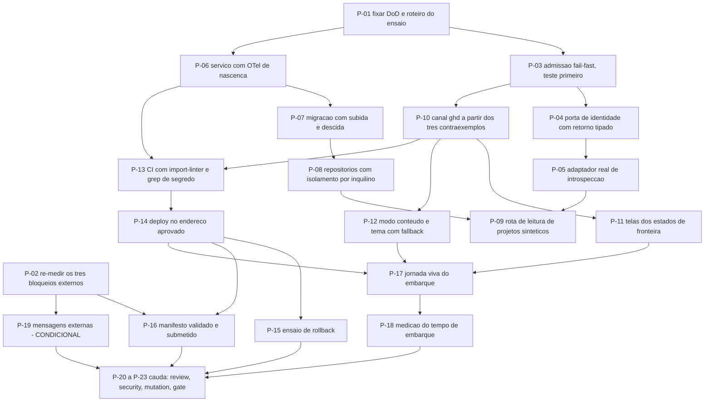

# AT 003 — Árvore de Transição do esqueleto federado

> Siglas deste documento: **AT** — Árvore de Transição · **APR** — Árvore de
> Pré-Requisitos · **OI** — Objetivo Intermediário · **ARF** — Árvore da Realidade
> Futura · **APH** — Aplicação ↔ Harness · **ADR** — Architecture Decision Record
> (Registro de Decisão Arquitetural) · **OTel** — OpenTelemetry · **CI** — integração
> contínua · **TDD** — Test-Driven Development (desenvolvimento guiado por teste) ·
> **eTLD+1** — *effective Top-Level Domain plus one* · **DoD** — Definition of Done
> (Definição de Pronto) · **TOC** — Teoria das Restrições.

- **Spec**: `specs/003-esqueleto-federado/spec.md` · **Ciclo**: 003 (planejado, raia
  **infra**) · **Data desta árvore**: 2026-09-05
- **Fonte dos passos**: `specs/003-esqueleto-federado/tasks.md` — T-01 a T-19 mais a
  cauda. A AT **não inventa passo**; onde divergirem, o `tasks.md` manda.
- **Ordem TDD**: em toda tarefa de código, o teste vermelho vem antes do adaptador. A
  coluna "Ação" abaixo respeita isso literalmente.

## Os passos

| Passo | Tarefa | Necessidade (por que este passo, agora) | Ação | Resultado esperado (verificável) |
|---|---|---|---|---|
| **P-01** | T-01 | A aptidão central é binária — "a junta fecha" — e binário sem roteiro vira discussão | Fixar as catorze linhas da DoD e o roteiro do ensaio contra a `ghdaru` real | Cada linha tem comando; o roteiro da linha 12 lista as evidências a colar |
| **P-02** | T-02 | Três bloqueios externos foram medidos **pela irmã**, não por nós, e um deles (OB-03 da APR) pode custar a aptidão central | Re-medir os três contra o commit atual da fundação e do normativo, com saída colada | As três medições no `qa-report.md` com `arquivo:linha` e data; decisão registrada se o primeiro persistir |
| **P-03** | T-03 | Subir pela metade é não-conformidade nomeada: o erro tem de aparecer na partida, não quando alguém clica (RN-06 da ARF) | Teste por parâmetro ausente primeiro; depois a função pura de admissão; depois o `main` que sai com código diferente de zero | DoD 1; nenhuma porta aberta após a recusa |
| **P-04** | T-04 | A identidade não pode nascer do payload do canal — é o defeito que a norma chama de confiar na credencial que o remetente escolheu | Porta de identidade com retorno tipado e adaptador falso para teste | DoD 2 e 4: payload forjado não produz principal; exceção nunca vira acesso |
| **P-05** | T-05 | O grant tem vida curta e uso único; validá-lo no navegador seria inventar um segundo protocolo | Adaptador real de introspecção: troca imediata, credencial no cabeçalho, grant descartado, 401 sem repetição automática | DoD 3: introspecção chamada uma vez; grep negativo do grant em log e traço |
| **P-06** | T-06 | O P5 exige o traço nascer **com** a funcionalidade; acrescentá-lo depois é reescrever o serviço | Esqueleto do serviço com middleware de traço, log estruturado com identificador de traço, métrica de descarte e exportador nulo sem coletor | DoD 10 parcial: todo endpoint com span, correlação afirmada por teste |
| **P-07** | T-07 | Raia infra: migração que sobe e não desce é dívida de banco disfarçada de entrega | Migração inicial com subida **e** descida, ensaiada em banco limpo | DoD 8: ciclo de subida e descida sem resíduo, saída colada |
| **P-08** | T-08 | Isolamento que depende da interface se perde no primeiro caminho novo | Repositórios com filtro por inquilino na consulta, escolhidos por configuração; teste com dois principais | DoD 9: interseção vazia entre inquilinos |
| **P-09** | T-09 | A entrega visível do round é leitura sob identidade real — sem ela o ciclo é invisível para quem o aprova | Rota de leitura de projetos sintéticos, autorizada pela capacidade do principal, com span e semente de fixture | Sem a capacidade de leitura, lista vazia; fixture sem dado real de pessoa |
| **P-10** | T-10 | Os três defeitos do protótipo da irmã estão registrados **na norma**; errar igual depois disso é pagar duas vezes | Escrever primeiro os testes dos três contraexemplos; depois o adaptador do canal | DoD 5, 6 e 7: envelope divergente ignorado, ordem de verificação respeitada, `targetOrigin` nunca curinga |
| **P-11** | T-11 | Frame branco é a pior falha possível numa aplicação embarcada: ninguém sabe de quem é o defeito | Telas dos quatro estados de fronteira, sem detalhe interno, com anúncio para leitor de tela | Teste de fluxo por estado; a janela de seis segundos dispara o estado "sem canal" |
| **P-12** | T-12 | Embarcada, a aplicação é só conteúdo — e os tokens do inquilino são parciais por desenho | Sinal explícito de embarque na URL, zero cromo próprio, tokens por lista de permissão com *fallback* completo | Teste com tokens parciais: nenhum elemento sem cor definida |
| **P-13** | T-13 | Portão que não roda não protege; e o P3 sem `import-linter` é intenção (OB-08 da APR) | CI com suíte, `import-linter`, aptidões do projeto e grep de segredo | Pipeline abaixo de dez minutos; execução de exemplo colada |
| **P-14** | T-14 | O endereço é irreversível na prática (RN-02 da ARF) e por isso vem **depois** do portão humano, nunca antes | Publicar serviço e interface no endereço aprovado; comparar o eTLD+1 com o do hospedeiro | DoD 11: domínios registráveis distintos, comparação colada |
| **P-15** | T-15 | Reversibilidade prometida e não ensaiada é a raia infra por fora e a raia plena por dentro | Reverter interface e serviço ao deploy anterior; documentar em `docs/operacao/rollback.md` | DoD 14: saída do ensaio colada |
| **P-16** | T-16 | O manifesto é onde a junta se registra — e é exatamente o ponto que o bloqueio externo pode fechar | Manifesto validado contra o schema normativo **e** o golden da fundação; submissão à rota real de administração | DoD 12: aceito com resposta colada, **ou** o bloqueio re-medido e o passo P-19 acionado |
| **P-17** | T-17 | Jornada sem captura do build real é ficção — e aqui o build real é o **embarcado** | Jornada do embarque: fluxo feliz e três falhas, capturas por script versionado, avaliação heurística datada | Script em `docs/jornadas/scripts/`, capturas referenciadas na jornada |
| **P-18** | T-18 | O alvo de desempenho é proposto, não medido (OB-09 da APR): calibrar antes de medir seria inventar o número | Extrair do traço o tempo entre `ghd.ready` e a lista renderizada, em embarques reais | Números medidos no `qa-report.md`, nunca estimados |
| **P-19** | T-19 | O P1 manda **relatar e parar**: lacuna em repositório alheio não se conserta daqui | Escrever `mensagens/NNN-para-ghdaru-*` e/ou `mensagens/NNN-para-protocolos-*` com evidência por `arquivo:linha` | Mensagem no formato de `mensagens/README.md`; nenhuma escrita externa |
| **P-20** | `TAIL:review` | Quem executa não verifica | Revisão independente em contexto fresco: spec × código × DoD | Achados registrados com destino |
| **P-21** | `TAIL:security` | A irmã achou quatro furos na fronteira dela; procurar os nossos é o trabalho, celebrar a ausência não é | Passe de segurança sobre admissão, canal e introspecção | Resultado por item no `qa-report.md` |
| **P-22** | `TAIL:mutation` | Admissão e verificação de fonte são as funções cuja falha **silenciosa** custa mais | Testes de mutação sobre a lógica de admissão e de verificação de fonte e origem | Taxa e sobreviventes no `qa-report.md` |
| **P-23** | `TAIL:gate` | Raia infra: além da DoD, os portões de reversibilidade sobem ao humano | Apresentar as catorze linhas da DoD, os gates de reversibilidade e a cauda | Decisão de merge registrada |

## Condicionalidade declarada — o passo que pode não acontecer

**P-19 só existe se P-02 confirmar o bloqueio.** Escrevê-lo por precaução seria produzir
uma mensagem sobre um problema que talvez já não exista; não escrevê-lo quando o bloqueio
persistir seria descobrir a lacuna e engoli-la. A condição está no próprio `tasks.md`
("somente se T-02 confirmar"), e a AT a repete porque um passo condicional que não se
declara vira passo esquecido.

**P-16 pode fechar sem aceitação.** Se o bloqueio persistir, o ciclo entrega tudo menos o
registro do manifesto — o caminho está escrito no round 003 e a confirmação de que isso
fecha o ciclo é matéria do gate.

## O grafo

## O que esta árvore não decide

- **Se o ciclo abre** — depende do ciclo 002 promovido e do endereço aprovado; são
  obstáculos da APR (`apr.md`).
- **O conteúdo das mensagens externas** — depende do que a re-medição de P-02 encontrar.
- **O que se ganha quando a junta fechar** — é da ARF (`arf.md`).
