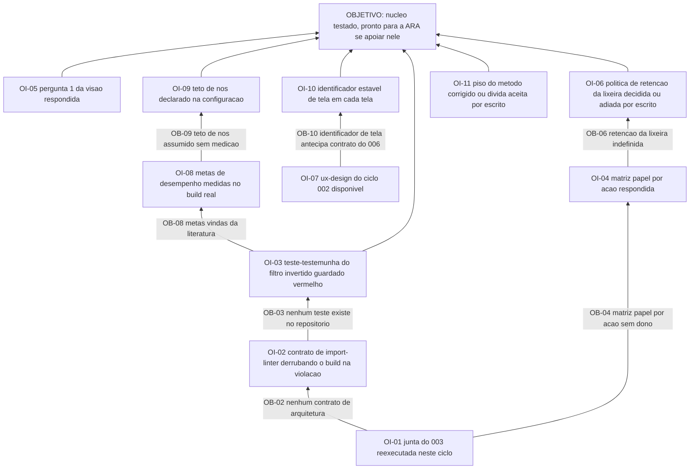

# APR 004 — Árvore de Pré-Requisitos do núcleo de diagramas

> Siglas deste documento: **APR** — Árvore de Pré-Requisitos · **OI** — Objetivo
> Intermediário · **ARF** — Árvore da Realidade Futura · **AT** — Árvore de Transição ·
> **ARA** — Árvore da Realidade Atual · **TOC** — Teoria das Restrições · **ADR** —
> Architecture Decision Record (Registro de Decisão Arquitetural) · **TDD** —
> Test-Driven Development (desenvolvimento guiado por teste) · **JSON** — JavaScript
> Object Notation · **DoD** — Definition of Done (Definição de Pronto) · **IA** —
> inteligência artificial.

- **Spec**: `specs/004-nucleo-de-diagramas/spec.md` · **Ciclo**: 004 (planejado) ·
  **Data desta árvore**: 2026-09-05
- **Lógica**: condição **necessária**. Lê-se de baixo para cima.
- **Objetivo**: **o núcleo de diagramas existe, com teste que nasceu antes do código, e a
  ARA pode ser construída sobre ele sem reimplementar grafo, canvas, tabela ou
  exportação.**

## Obstáculos e objetivos intermediários

| # | Obstáculo (condição atual que bloqueia) | Evidência | OI que o supera | Depende de |
|---|---|---|---|---|
| **OB-01** | A junta do ciclo 003 não existe: sem introspecção não há inquilino nem usuário, e o M1 nasceria como a quinta geração autônoma da linhagem | lacuna **L-01** da spec 004, risco **alto** — "é a dependência inteira do ciclo"; `docs/roadmap.md`: "O ciclo 003 promovido — sem junta, o M1 seria a 5ª geração standalone" | **OI-01**: o ciclo 003 está promovido e a aptidão "a junta fecha" foi **reexecutada neste ciclo**, com saída colada | nenhum |
| **OB-02** | Não existe contrato de arquitetura executável: sem `pyproject.toml`, o `import-linter` que o P3 declara função de aptidão não roda porque não existe | saída colada abaixo | **OI-02**: o contrato existe, `lint-imports` sai 0, e a sabotagem que importa framework no domínio **derruba o build** | OI-01 |
| **OB-03** | Não existe teste algum neste repositório, e o defeito que este ciclo corrige é exatamente o que quatro gerações sem teste não pegaram | o filtro invertido de `tocbuilderv3/services/mockApiService.ts:521` sobreviveu a quatro gerações; defeito **D-06** | **OI-03**: o teste-testemunha do filtro invertido existe, **foi visto falhar** e está guardado vermelho antes de o agregado existir | OI-02 |
| **OB-04** | A matriz papel × ação não tem dono: não está decidido se Participante pode excluir projeto que não criou — e a política do RF-21 congela sobre essa matriz | terceira `[DÚVIDA]` do `## Clarify` da spec 004 | **OI-04**: a matriz papel × ação está respondida, e a política por tipo de ação é escrita sobre ela | OI-01 |
| **OB-05** | A pergunta 1 de `docs/produto/visao.md` §7 — colaboração por projeto ou isolamento por usuário — segue sem resposta, e ela **muda o épico E1.1**; a spec assume que projeto pertence a um par inquilino e usuário | *Fora de escopo* da spec 004: "depende da resposta à primeira pergunta do Product Steward, que muda o E1.1 e precisa estar respondida antes de esta spec congelar"; `docs/roadmap.md`, pré-condição do ciclo 002 | **OI-05**: a resposta está registrada — a mesma que destrava o ciclo 002, herdada aqui | nenhum |
| **OB-06** | A política de retenção da lixeira não existe: não está decidido se projeto excluído expira | primeira `[DÚVIDA]` do `## Clarify` | **OI-06**: a política está decidida, ou o adiamento está escrito com o ciclo em que volta — o *Fora de escopo* já a trata como decisão nova com ADR próprio | OI-04 |
| **OB-07** | Não existe `ux-design.md`: quem decide **forma** é o ciclo 002, e esta spec decide só comportamento | `specs/002-prototipo-de-interfaces/ux-design.md` está classificado em `FUTUROS` por `scripts/check-caminhos.sh`, com o motivo "002: papel semântico antes do componente" | **OI-07**: o `ux-design.md` do ciclo 002 existe e a interface deste ciclo é construída sobre ele | nenhum |
| **OB-08** | As metas de desempenho — 200 nós em menos de 2 segundos, 30 quadros por segundo no canvas — vêm do tamanho típico de árvore na literatura, não de medição própria | lacuna **L-04** da spec 004, risco baixo | **OI-08**: as metas foram medidas sobre o build real na jornada viva, e o número medido substitui o estimado | OI-03 |
| **OB-09** | O teto de nós por projeto é assumido em 500 sem medição, e ele protege desempenho **e** o payload de importação | quarta `[DÚVIDA]` do `## Clarify`; RNF-07 | **OI-09**: o teto está declarado na configuração e o limite de payload da importação o respeita | OI-08 |
| **OB-10** | O identificador estável de tela antecipa um contrato que o ciclo 006 ainda vai fixar: escolher errado custa renomear tela a tela | lacuna **L-03** da spec 004, risco baixo; INT-02 | **OI-10**: cada tela carrega um identificador estável, com a migração declarada como mecânica se o 006 decidir outro formato | OI-07 |
| **OB-11** | `scripts/check-conformance.sh` sai **1** neste repositório, e a linha 13 da DoD deste ciclo exige código 0 | saída colada abaixo; dívida **Dv-3** do `qa-report.md` do ciclo 001, com a lacuna relatada em `mensagens/002-para-maestro-pisos-absolutos-de-ciclo.md` | **OI-11**: o piso do método foi corrigido a montante, ou a dívida está aceita por escrito e a linha da DoD declara o desvio com motivo | nenhum |

## Sequenciamento

O caminho crítico é uma **linha só**, e ela começa fora deste ciclo:

> OI-01 (junta fecha) → OI-02 (contrato de arquitetura) → OI-03 (teste vermelho guardado)
> → o domínio.

Nada de código de domínio nasce antes de OI-03, porque o P4 é literal: o teste que falha
vem **antes**. E OI-03 não pode nascer antes de OI-02, porque um teste de domínio puro
sobre um domínio que pode importar framework não prova pureza nenhuma.

Duas frentes correm em paralelo sem tocar o caminho crítico: a **frente de decisão**
(OI-04, OI-05, OI-06, OI-11 — matéria humana) e a **frente de forma** (OI-07 → OI-10, que
vem do ciclo 002). A frente de medição (OI-08 → OI-09) só faz sentido depois de haver o
que medir.

## O grafo



## Evidência — as saídas que ancoram os obstáculos

```
$ ls pyproject.toml
ls: cannot access 'pyproject.toml': No such file or directory

$ ls scripts/ | grep arquitetura || echo "check-arquitetura.sh nao existe"
check-arquitetura.sh nao existe

$ sed -n '521p' /home/user/tocbuilderv3/services/mockApiService.ts
        project.nodes = project.nodes.filter(n => n.id === nodeId);
```

```
$ scripts/check-conformance.sh 001 ; echo "exit=$?"
✗ mutation floor 55 is above the newest cycle 012 — TAIL:mutation was charged to nobody.
✗ declared-absence floor 61 is above the newest cycle 012 — 'pendente' would pass as evidence everywhere.
✗ the method did not survive into the artifacts of at least one cycle.
exit=1
```

## O que esta árvore não decide

- **Se o corte de apetite é acionado** — o round 004 já decidiu **o que** sai primeiro; se
  sai, decide-se na execução.
- **Como cada obstáculo é atacado** — é da AT (`at.md`).
- **O que se ganha quando o núcleo existir** — é da ARF (`arf.md`).
