# ARF 004 — Árvore da Realidade Futura do núcleo de diagramas

> Siglas deste documento: **ARF** — Árvore da Realidade Futura · **APR** — Árvore de
> Pré-Requisitos · **AT** — Árvore de Transição · **ARA** — Árvore da Realidade Atual ·
> **NC** — Nuvem de Conflito · **S&T** — Árvore de Estratégia & Táticas · **UDE** —
> Efeito Indesejável · **TOC** — Teoria das Restrições · **ADR** — Architecture Decision
> Record (Registro de Decisão Arquitetural) · **TDD** — Test-Driven Development
> (desenvolvimento guiado por teste) · **DDD** — Domain-Driven Design (Design Orientado a
> Domínio) · **JSON** — JavaScript Object Notation · **OTel** — OpenTelemetry · **IA** —
> inteligência artificial · **DoD** — Definition of Done (Definição de Pronto).

- **Spec**: `specs/004-nucleo-de-diagramas/spec.md` · **Ciclo**: 004 (planejado) ·
  **Data desta árvore**: 2026-09-05
- **Lógica**: causa **suficiente**. Lê-se de baixo para cima.
- **Round correspondente**: `docs/produto/rounds.md`, round 004.

## A injeção — o que a spec entrega

| # | Injeção | O que a spec diz |
|---|---|---|
| **I-01** | **Um agregado de domínio puro** — projeto, nó, aresta causal — com as invariantes encapsuladas e eventos somente-acréscimo, testável sem rede e sem banco, e uma função de aptidão que **falha o build** se o domínio importar framework | RF-11..RF-20, RNF-02 |
| **I-02** | **Exclusão suave com lixeira e restauração**, e exclusão definitiva só por confirmação que nomeia o projeto | RF-06..RF-10 |
| **I-03** | **Desfazer de sessão por episódio, e reverter de domínio para o que já gravou** — a pilha morre no recarregamento e o passado volta por ação nomeada com evento compensatório | RF-22..RF-25 |
| **I-04** | **Canvas e vista tabular equivalentes**: toda operação existe nas duas vistas, com o mesmo efeito, o mesmo traço e a mesma pilha | RF-27..RF-31 |
| **I-05** | **Exportação canônica determinística e importação não destrutiva**, que valida tudo antes de criar qualquer coisa e recusa com relato por item | RF-32..RF-36 |

## Os efeitos desejáveis

| # | Efeito desejável | Decorre de | Hoje é falso porque (evidência) |
|---|---|---|---|
| **ED-01** | Excluir um nó remove **exatamente** aquele nó e as arestas que nele incidem | I-01 | Na linhagem o filtro está invertido: `tocbuilderv3/services/mockApiService.ts:521` faz `project.nodes = project.nodes.filter(n => n.id === nodeId)` — mantém **só** o nó excluído e apaga todos os outros. Linha colada abaixo. Quatro gerações sem teste nunca a pegaram |
| **ED-02** | Recarregar a página não perde o trabalho | I-01 | `tocbuilderv3/services/mockApiService.ts:9-14` — três vetores em memória de processo; o único paliativo era um autosave de navegador cobrindo uma sessão só (defeito **D-07**) |
| **ED-03** | Um engano deixa de custar uma análise inteira: excluir é reversível | I-02 | A exclusão da linhagem é destrutiva e imediata — remoção por filtro, sem lixeira (fonte F-05 da spec 004) |
| **ED-04** | Desfazer existe pela primeira vez na linhagem | I-03 | Medição executada: `grep -rni "undo\|desfazer"` sobre os arquivos de código do `tocbuilderv3`, excluído `node_modules`, devolve **0** — saída colada abaixo |
| **ED-05** | Existe **um** canvas e **uma** tabela para as seis ferramentas, em vez de uma cópia por ferramenta | I-04 | Na linhagem cada ferramenta carregava a própria cópia de canvas, painel e serviço de dados (spec 004, "O quê e por quê") — o M1 é a fatoração que impede a sétima |
| **ED-06** | Projetos grandes continuam utilizáveis: a mesma informação é editável como tabela | I-04 | O painel de entidades é o que a linhagem acertou (`tocbuilderv3/components/EntitiesPanel.tsx`), e o round 004 o declara "nunca sai" |
| **ED-07** | Importar arquivo inválido devolve **o que está errado, item a item** | I-05 | Na linhagem a validação é rasa e o erro é uma caixa do navegador: `components/NodeZoneView.tsx:314` e `:319` chamam `alert(...)` — linhas coladas abaixo |
| **ED-08** | O que já foi gravado volta por ação **nomeada**, com evento compensatório correlacionado, sem apagar o evento original | I-03 | O padrão foi pago pela irmã no ADR 0013 dela; na linhagem não há evento algum, porque não há domínio |
| **ED-09** | O portão de aplicar-na-hora ou propor é decidido **por tipo de ação, no servidor** — nunca por origem alegada pelo cliente | I-01 | Regra do item 8 de `docs/governance/constitution.md`; sem servidor e sem domínio, hoje não existe portão nenhum |

## Ramos negativos — o que pode piorar, e a poda

| # | Ramo negativo | Poda declarada |
|---|---|---|
| **RN-01** | O núcleo vira canvas genérico e abstrato que não serve bem a ferramenta nenhuma — abstração especulativa, o oposto do que o método poda por YAGNI | RN-04 da spec fixa o alcance: o núcleo conhece grafo dirigido e nada de semântica TOC. E o teste real vem no ciclo **seguinte**: a ARA estende o núcleo por composição; se o corte estiver errado, o 005 mostra em uma semana, não em um ano |
| **RN-02** | O desfazer de sessão cria a expectativa de histórico persistente — "desfiz, recarreguei e voltou tudo" — e a primeira decepção destrói a confiança | Padrão herdado pronto do ADR 0013 da irmã: recarregar **mata** a pilha (RF-24), e o que já gravou volta por "reverter", ação de domínio nomeada. A distinção é de vocabulário na interface, não só de implementação (RI-06 nomeia o episódio no botão) |
| **RN-03** | A política de portão passa a ler a **origem alegada pelo cliente** — "sou humano, deixe aplicar" — e o item 8 vira decoração | RF-21: política declarada no servidor, resolvida **por tipo de ação**. A tarefa T-07 do `tasks.md` manda enviar a mesma mutação por dois caminhos e provar que a decisão veio da tabela de tipos |
| **RN-04** | Quatro épicos com TDD não cabem num ciclo, e o corte acontece no meio da execução, no lugar errado | Corte declarado **antes** no round 004: sai primeiro o desfazer de sessão — e o `tasks.md` marca T-12 como a primeira tarefa a sair, cortando a interface e **nunca** os comandos inversos do domínio. Nunca sai a vista tabular |
| **RN-05** | O canvas fica bonito e a tabela vira acessório de segunda classe, com operações que só existem numa vista | RF-28 exige equivalência com o **mesmo evento de domínio**, e a tarefa T-11 a verifica por teste de integração: a mesma operação pelas duas vistas produz o mesmo evento |
| **RN-06** | A exportação determinística amarra o formato cedo demais e a primeira mudança de esquema quebra arquivos de gente | RF-32 exige **versão de esquema declarada** no arquivo; a importação valida contra ela antes de criar qualquer coisa. O adaptador para os formatos da linhagem fica declarado fora, no ciclo 011 |
| **RN-07** | A lixeira cresce sem política de retenção e vira depósito com dado que ninguém sabe se pode apagar | Declarado como `[DÚVIDA]` no `## Clarify` da spec, e o *Fora de escopo* diz explicitamente que retenção, expurgo e o direito de apagar de vez são **decisão nova com ADR próprio** — não se resolve de passagem |

## O grafo

```mermaid
graph BT
  I01["I-01 agregado de dominio puro com invariantes e eventos"]
  I02["I-02 exclusao suave com lixeira e restauracao"]
  I03["I-03 desfazer de sessao e reverter de dominio"]
  I04["I-04 canvas e vista tabular equivalentes"]
  I05["I-05 exportacao determinista e importacao nao destrutiva"]

  ED01["ED-01 excluir no remove so o no e suas arestas"]
  ED02["ED-02 recarregar nao perde o trabalho"]
  ED03["ED-03 engano deixa de custar uma analise"]
  ED04["ED-04 desfazer existe pela primeira vez"]
  ED05["ED-05 um canvas e uma tabela para seis ferramentas"]
  ED06["ED-06 projetos grandes seguem utilizaveis"]
  ED07["ED-07 arquivo invalido recusa item a item"]
  ED08["ED-08 o passado volta por acao nomeada com evento compensatorio"]
  ED09["ED-09 portao por tipo de acao no servidor"]

  OBJ["OBJETIVO: as seis ferramentas da TOC nascem sobre um nucleo testado, sem a setima copia"]

  I01 --> ED01
  I01 --> ED02
  I01 --> ED09
  I02 --> ED03
  I03 --> ED04
  I03 --> ED08
  I04 --> ED05
  I04 --> ED06
  I05 --> ED07

  ED01 --> OBJ
  ED02 --> OBJ
  ED03 --> OBJ
  ED04 --> OBJ
  ED05 --> OBJ
  ED06 --> OBJ
  ED07 --> OBJ
  ED08 --> OBJ
  ED09 --> OBJ

  RN01["RN-01 nucleo abstrato que nao serve a ferramenta nenhuma"]
  RN02["RN-02 desfazer cria expectativa de historico persistente"]
  RN03["RN-03 politica passa a ler origem alegada pelo cliente"]
  RN04["RN-04 quatro epicos nao cabem e o corte cai no lugar errado"]
  P01["PODA alcance fixado pela RN-04 e teste real no ciclo 005"]
  P02["PODA recarregar mata a pilha e reverter e acao de dominio"]
  P03["PODA politica por tipo de acao provada por dois caminhos"]
  P04["PODA corte declarado antes: sai o desfazer, nunca a tabela"]

  I01 -.-> RN01
  I03 -.-> RN02
  I01 -.-> RN03
  I04 -.-> RN04
  P01 --> RN01
  P02 --> RN02
  P03 --> RN03
  P04 --> RN04
```



## Evidência — as linhas que ancoram os efeitos

```
$ sed -n '521p' /home/user/tocbuilderv3/services/mockApiService.ts
        project.nodes = project.nodes.filter(n => n.id === nodeId);

$ grep -rni "undo\|desfazer" --include='*.ts' --include='*.tsx' /home/user/tocbuilderv3 | grep -v node_modules | wc -l
0

$ grep -n "alert(" /home/user/tocbuilderv3/components/NodeZoneView.tsx | head -3
314:          if (!data.name || !Array.isArray(data.nodes) || !Array.isArray(data.edges)) { alert(t('project_form.import.invalid_file')); return; }
319:        } catch (error) { alert(t('project_form.import.parse_error')); }
```

## O que esta árvore não decide

- **Se o ciclo pode abrir** — depende inteiramente da junta do 003; é o obstáculo de risco
  **alto** da APR (`apr.md`).
- **A matriz papel × ação e a retenção da lixeira** — são `[DÚVIDA]` do `## Clarify`,
  matéria do gate.
- **Qualquer semântica TOC** — é de M2 em diante, e é justamente o que impede a sétima
  cópia de canvas.
