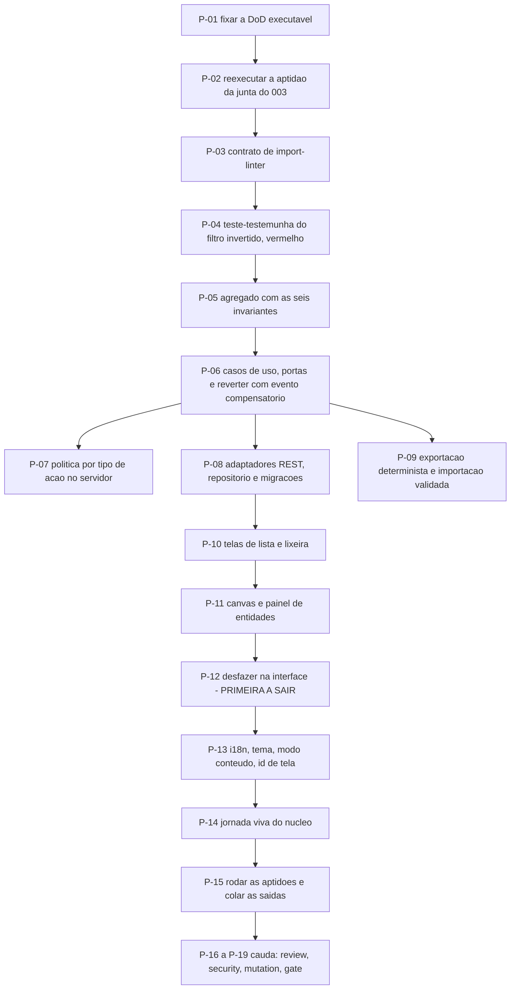

# AT 004 — Árvore de Transição do núcleo de diagramas

> Siglas deste documento: **AT** — Árvore de Transição · **APR** — Árvore de
> Pré-Requisitos · **OI** — Objetivo Intermediário · **ARF** — Árvore da Realidade
> Futura · **ARA** — Árvore da Realidade Atual · **TOC** — Teoria das Restrições ·
> **ADR** — Architecture Decision Record (Registro de Decisão Arquitetural) · **TDD** —
> Test-Driven Development (desenvolvimento guiado por teste) · **JSON** — JavaScript
> Object Notation · **OTel** — OpenTelemetry · **REST** — Representational State
> Transfer · **DoD** — Definition of Done (Definição de Pronto) · **i18n** —
> internacionalização.

- **Spec**: `specs/004-nucleo-de-diagramas/spec.md` · **Ciclo**: 004 (planejado) ·
  **Data desta árvore**: 2026-09-05
- **Fonte dos passos**: `specs/004-nucleo-de-diagramas/tasks.md` — T-01 a T-19. A AT
  **não inventa passo**; onde divergirem, o `tasks.md` manda.

## Os passos

| Passo | Tarefa | Necessidade (por que este passo, agora) | Ação | Resultado esperado (verificável) |
|---|---|---|---|---|
| **P-01** | T-01 | DoD fixada depois do código é DoD escrita para caber no que saiu | Fixar as catorze linhas da spec nos caminhos reais do repositório | Cada linha tem comando que roda no ambiente local; nenhum critério subjetivo |
| **P-02** | T-02 | O ciclo inteiro depende da junta (OB-01 da APR, risco alto): abrir sem ela é construir a quinta geração autônoma | Reexecutar a aptidão do 003 — introspecção respondendo, banco migrável, traço exportando, CI verde | Saída colada no `qa-report.md` |
| **P-03** | T-03 | Domínio puro que ninguém verifica volta a importar framework no primeiro atalho; o P3 exige função de aptidão, não promessa | Escrever o contrato de `import-linter`: domínio e aplicação sem framework, banco ou HTTP | `lint-imports` código 0; a sabotagem que importa framework no domínio derruba o build |
| **P-04** | T-04 | O P4 é literal e este ciclo tem um caso perfeito: o filtro invertido da linhagem, que quatro gerações sem teste nunca pegaram | Escrever o teste-testemunha **antes** do agregado, vê-lo falhar e guardá-lo vermelho | O commit do teste antecede o commit do código que o faz passar |
| **P-05** | T-05 | Invariante que vive no caso de uso vaza pelo primeiro caminho novo; ela pertence ao agregado | Escrever o agregado com as seis invariantes do `specs/004-nucleo-de-diagramas/data-model.md` e os eventos somente-acréscimo, cada invariante com teste que falhou primeiro | DoD 1 e 2; cobertura do domínio no piso declarado |
| **P-06** | T-06 | Sem casos de uso e portas, o domínio puro não é alcançável por ninguém — e o reverter precisa nascer com o evento compensatório, não depois | Casos de uso e portas: projeto, lixeira, mutações de nó e aresta, histórico, reverter | DoD 3; o teste de reverter mostra o evento compensatório correlacionado, nunca um evento apagado |
| **P-07** | T-07 | O item 8 vira decoração no instante em que a política ler a origem que o cliente alega (RN-03 da ARF) | Política por tipo de ação no servidor, traço incondicional em toda mutação | DoD 8 e 9; a mesma mutação por dois caminhos prova que a decisão veio da tabela de tipos |
| **P-08** | T-08 | O domínio sem adaptador não chega a ninguém; e migração sem descida testada é dívida de banco | Rotas REST do contrato, repositório PostgreSQL, migrações com descida testada, isolamento por inquilino na consulta | DoD 7; testes de contrato verdes; descida executada e colada |
| **P-09** | T-09 | Importação que cria antes de validar é como a linhagem perdia projeto; e export não determinístico não permite comparar nada | Exportação canônica versionada e importação que valida tudo antes de qualquer efeito, criando projeto novo com relato | DoD 4, 5 e 6; a sabotagem com aresta órfã é recusada com relato por item |
| **P-10** | T-10 | Lista e lixeira são onde a exclusão suave se torna visível: sem elas, ED-03 da ARF é invisível para quem aprova | Telas de lista e lixeira, com estados de vazio, erro e recusa desenhados | Fluxo excluir → restaurar completo no navegador; recusa vira tela, não exceção |
| **P-11** | T-11 | Canvas e tabela são um par; construir um e adiar o outro é o corte errado que o round 004 proíbe | Canvas e painel de entidades: raio da exclusão no controle, equivalência entre as vistas, foco cruzado | A mesma operação pelas duas vistas produz o mesmo evento de domínio, verificado por teste de integração |
| **P-12** | T-12 | Desfazer é o que permite experimentar sem medo — e é **a primeira tarefa a sair** se o apetite estourar, cortando a interface e nunca os comandos inversos do domínio | Pilha por episódio na interface, atalho e botão nomeado, histórico com reverter | Os dois defeitos-classe do ADR 0013 da irmã reproduzidos como teste e verdes |
| **P-13** | T-13 | Literal solto em componente custa varredura completa depois — a linhagem provou isso na 3ª geração | i18n em toda cadeia visível, tema do hospedeiro com *fallback*, modo só-conteúdo, identificador estável de tela | DoD 11; captura nos dois temas e nas duas larguras |
| **P-14** | T-14 | Jornada sem captura do build real é ficção | Jornada viva do núcleo: criar projeto, nós, arestas, tabela, desfazer, exportar, importar — capturas por script versionado e avaliação heurística datada | DoD 12; capturas regeneram determinísticas; base sintética |
| **P-15** | T-15 | Caixa marcada não é testemunha; o verde só vale dizendo quanto examinou | Rodar as catorze linhas da DoD e os portões do método, colando saída, código e tamanho examinado | Nenhuma linha do `qa-report.md` com sinal transcrito sem a saída colada |
| **P-16** | T-16 (`TAIL:review`) | Quem implementou não vê a política lendo origem em vez de tipo — é o achado clássico deste ciclo | Revisão independente em contexto fresco, com instrução explícita: item 8, equivalência das vistas, seção de fontes por amostragem | Veredito, achados e o que se fez com eles, no `qa-report.md` |
| **P-17** | T-17 (`TAIL:security`) | A classe de risco aqui é isolamento entre inquilinos e payload de importação | Passe de segurança: segredo no cliente, isolamento, recusa fechada sem capacidade, payload, dado real em fixture | Resultado por item no `qa-report.md` |
| **P-18** | T-18 (`TAIL:mutation`) | Portão que nunca reprovou não é evidência | Sabotar e ver recusar: contrato de arquitetura, validação de importação, o teste do filtro com a regressão reintroduzida, o teste de traço | Cada sabotagem com o comando e a recusa impressa |
| **P-19** | T-19 (`TAIL:gate`) | Quem executou não aprova o que executou | Apresentar a DoD verde e a jornada; registrar a decisão de merge | Registro do gate no `qa-report.md` e em `docs/records/decisoes.jsonl` |

## O corte de apetite, escrito antes de precisar dele

O round 004 declara: **sai primeiro o desfazer de sessão** (P-12), e **nunca sai** a vista
tabular (P-11). O `tasks.md` acrescenta a precisão que importa — o corte remove a
**interface** do desfazer, nunca os comandos inversos do domínio, que ficam prontos em
P-06. É a diferença entre adiar uma tela e adiar uma capacidade.

## O grafo

## O que esta árvore não decide

- **Se o ciclo abre** — depende do 003 promovido; é o obstáculo de risco alto da APR
  (`apr.md`).
- **As respostas do `## Clarify`** — matriz papel × ação, retenção da lixeira,
  concorrência e teto de nós são matéria do gate.
- **O que se ganha quando o núcleo existir** — é da ARF (`arf.md`).
