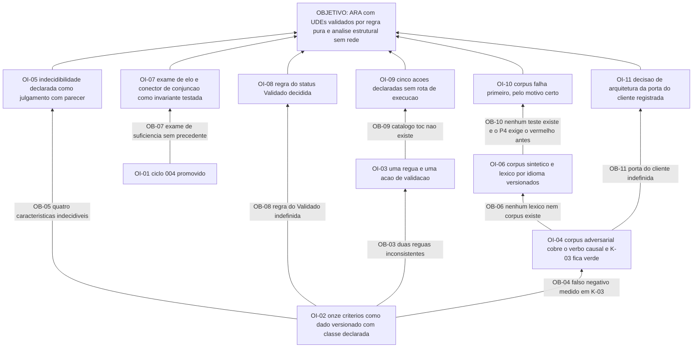

# APR 005 — Árvore de Pré-Requisitos da Árvore da Realidade Atual

> Siglas deste documento: **APR** — Árvore de Pré-Requisitos · **OI** — Objetivo
> Intermediário · **ARF** — Árvore da Realidade Futura · **AT** — Árvore de Transição ·
> **ARA** — Árvore da Realidade Atual · **UDE** — Efeito Indesejável · **NC** — Nuvem de
> Conflito · **TOC** — Teoria das Restrições · **ADR** — Architecture Decision Record
> (Registro de Decisão Arquitetural) · **FSM** — máquina de estados finitos · **IA** —
> inteligência artificial · **TDD** — Test-Driven Development (desenvolvimento guiado por
> teste) · **DoD** — Definition of Done (Definição de Pronto).

- **Spec**: `specs/005-arvore-da-realidade-atual/spec.md` · **Ciclo**: 005 (planejado) ·
  **Data desta árvore**: 2026-09-05
- **Lógica**: condição **necessária**. Lê-se de baixo para cima.
- **Objetivo**: **a Árvore da Realidade Atual constrói-se com UDEs validados por regra de
  domínio pura — sem rede, sem modelo — e a análise estrutural lê o grafo inteiro sem
  chamar ninguém.**

## Obstáculos e objetivos intermediários

| # | Obstáculo (condição atual que bloqueia) | Evidência | OI que o supera | Depende de |
|---|---|---|---|---|
| **OB-01** | O ciclo 004 não está promovido: a ARA é feita de nós e arestas do núcleo, e sem ele reimplementaríamos grafo, canvas, tabela e exportação — a sétima cópia | `docs/roadmap.md`, "O ciclo 004 promovido (a ARA é feita de nós e arestas do M1)"; INT-01 da spec 005 | **OI-01**: o ciclo 004 está promovido e a suíte de domínio dele segue verde sobre as tabelas novas | nenhum |
| **OB-02** | A regra que este ciclo precisa **existe apenas como texto de prompt**: as onze características vivem em `tocbuilderv3/constants.ts:123-133`, e os oito prompts são dado do cliente editável em produção | contagens executadas e coladas abaixo (`11` características, `8` prompts) | **OI-02**: os onze critérios estão transcritos para dado versionado do domínio, com a classe — decidível ou julgamento — declarada critério a critério | nenhum |
| **OB-03** | Duas validações **inconsistentes** convivem na mesma geração: a "simples" usa outros critérios que a detalhada | fonte F-14 da spec 005 | **OI-03**: existe **uma** régua de domínio e **uma** ação de catálogo para validar UDE | OI-02 |
| **OB-04** | A checagem pura que já existe tem um **falso negativo medido**: o enunciado "Falta de treinamento causa erros.", rotulado pela fonte como exemplo ruim, é aprovado — o verbo causal não é detectado | saída de `docs/produto/dados/medir-base.py` colada abaixo: `FALSO NEGATIVO ... 1 (K-03)` | **OI-04**: o corpus adversarial cobre o verbo causal, o teste do caso K-03 está verde, e os três casos canônicos da linhagem decidem como o método manda | OI-02 |
| **OB-05** | Quatro das onze características são **indecidíveis por função pura**, e o único material de controle externo tem nove enunciados, seis deles rotulados | dívida **Dv-2** do `qa-report.md` do ciclo 001; saída colada abaixo | **OI-05**: a indecidibilidade está declarada como julgamento com parecer, e a partição é dado versionado — mover um critério de classe é mudança de dado com teste | OI-02 |
| **OB-06** | Não existe léxico versionado nem corpus de UDEs: `docs/produto/dados/` tem a base sintética e o script de medição, e nada mais | saída colada abaixo | **OI-06**: existe corpus sintético versionado — bons, maus e adversariais, em português e inglês — e o léxico das heurísticas é dado por idioma, testável em isolamento | OI-04 |
| **OB-07** | O exame de suficiência e o conector de conjunção **não têm precedente na linhagem**: a varredura por "sufici" devolve quatro ocorrências e nenhuma é análise de suficiência da árvore | fonte F-09 da spec 005; lacuna **L-02**, risco médio | **OI-07**: o subconjunto — elo examinado, conector de conjunção e relatório estrutural — está modelado como invariante de domínio testada, com as reservas completas declaradas fora da v1 | OI-01 |
| **OB-08** | Não está decidido se `Validado` sempre exige parecer humano, ou se cabe um estado formal intermediário útil em sessão de levantamento rápido | primeira `[DÚVIDA]` do `## Clarify` da spec 005 | **OI-08**: a regra do status está decidida e a FSM a implementa | OI-02 |
| **OB-09** | O catálogo `toc.*` não existe: as cinco ações deste módulo são **contrato**, não execução, e a linha 10 da DoD exige zero rota de execução no serviço | `specs/006-acoes-governadas-e-snapshot/spec.md` é quem cria o catálogo; lacuna **L-03** da spec 005 | **OI-09**: as cinco ações estão declaradas em `contracts/acoes-catalogo.md` sem nenhuma rota de execução, prontas para o ciclo 006 ser o primeiro cliente | OI-03 |
| **OB-10** | Não existe corpus algum de teste no repositório, e o P4 exige o teste vermelho **antes** — aqui o teste vermelho central é o próprio corpus | ver saída de OB-06; nenhum arquivo de teste existe | **OI-10**: o corpus existe e falha **pelo motivo certo** — função inexistente — com a contagem de casos na saída | OI-06 |
| **OB-11** | A porta do cliente é ambígua: a mesma regra precisa responder em menos de 100 milissegundos no servidor **e** ser utilizável offline no cliente, e a decisão de arquitetura ainda não foi tomada | RNF-04 da spec 005, que a remete ao plano | **OI-11**: a decisão de arquitetura está registrada — regra portada ou chamada local — com o teste de igualdade entre as duas execuções | OI-04 |

## Sequenciamento

O ciclo tem **uma raiz dupla** e um caminho crítico claro:

- **OI-01** (núcleo promovido) destrava tudo o que é grafo: OI-07 e, adiante, a análise
  estrutural.
- **OI-02** (critérios como dado versionado) destrava tudo o que é regra: OI-03, OI-04,
  OI-05, OI-08.

O caminho crítico do ciclo é o da regra, e ele é literal quanto ao P4:

> OI-02 → OI-04 (o falso negativo K-03 vira teste) → OI-06 (corpus e léxico) → OI-10
> (o corpus **falha primeiro**) → só então a heurística.

O `tasks.md` diz a mesma coisa em uma frase — "**Nenhuma heurística antes disto**" — e é
o ponto onde este ciclo mais facilmente se trai: escrever a heurística antes do corpus
produz um corpus escrito para caber na heurística, que é a dívida **Dv-2** ampliada em
vez de contida.

OI-09 e OI-11 são frentes laterais: nenhuma delas bloqueia a entrega do ciclo, e as duas
existem para o ciclo 006 não redesenhar o que este já resolveu.

## O grafo



## Evidência — as saídas que ancoram os obstáculos

```
$ sed -n '123,133p' /home/user/tocbuilderv3/constants.ts | grep -c '^[0-9]'
11

$ grep -c "promptText:" /home/user/tocbuilderv3/constants.ts
8

$ ls docs/produto/dados/
README.md
__pycache__
analise-horizonte.json
medir-base.py
```

```
$ python3 docs/produto/dados/medir-base.py   (trecho final)
  K-03  PASSA   [fonte: ruim]  Falta de treinamento causa erros.
  FALSO POSITIVO (a fonte diz bom, a checagem reprova): 0 (—)
  FALSO NEGATIVO (a fonte diz ruim, a checagem aprova): 1 (K-03)
  sem veredito possível (a fonte não rotula bom/ruim): 3 (K-02, K-08, K-09)
  autoral:  3/12 passam (25%) — base escrita para exercitar as checagens
```

## O que esta árvore não decide

- **A régua definitiva de decidível × julgamento** — a partição de seis e cinco é o ponto
  de partida declarado na lacuna L-05, e é dado versionado justamente para poder mudar
  com teste.
- **A ordem operacional dos passos** — é da AT (`at.md`).
- **O que se ganha quando a regra sair do prompt** — é da ARF (`arf.md`).
