# ARF 005 — Árvore da Realidade Futura da Árvore da Realidade Atual

> Siglas deste documento: **ARF** — Árvore da Realidade Futura · **ARA** — Árvore da
> Realidade Atual · **APR** — Árvore de Pré-Requisitos · **AT** — Árvore de Transição ·
> **UDE** — Efeito Indesejável (*Undesirable Effect*) · **NC** — Nuvem de Conflito ·
> **TOC** — Teoria das Restrições · **ADR** — Architecture Decision Record (Registro de
> Decisão Arquitetural) · **FSM** — máquina de estados finitos · **IA** — inteligência
> artificial · **TDD** — Test-Driven Development (desenvolvimento guiado por teste) ·
> **DoD** — Definition of Done (Definição de Pronto) · **OTel** — OpenTelemetry.

- **Spec**: `specs/005-arvore-da-realidade-atual/spec.md` · **Ciclo**: 005 (planejado) ·
  **Data desta árvore**: 2026-09-05
- **Lógica**: causa **suficiente**. Lê-se de baixo para cima.
- **Round correspondente**: `docs/produto/rounds.md`, round 005.

## A injeção — o que a spec entrega

| # | Injeção | O que a spec diz |
|---|---|---|
| **I-01** | **A validação formal de um UDE é função pura de domínio**, executável sem rede e sem modelo, com veredito por critério e o trecho do texto que o motivou | RF-06..RF-12 |
| **I-02** | **A partição decidível × julgamento é dado versionado**, não opinião embutida: cada um dos onze critérios da linhagem declara sua classe, e o léxico das heurísticas é dado por idioma, testável em isolamento | RF-09, RF-11 |
| **I-03** | **`indeterminado` é veredito de primeira classe**: quando a heurística não alcança o caso, ela diz que não alcançou — e isso conta como pendência de julgamento, nunca como reprovação | RF-08 |
| **I-04** | **O status do UDE é uma FSM de domínio guardada por regra**: `Validado` exige todo decidível verde **e** parecer humano confirmado; parecer de IA nunca fecha status sozinho | RF-13..RF-17, RN-10 |
| **I-05** | **A análise estrutural da árvore é função pura sobre o grafo**: fragmentos, entradas, alcance transitivo sobre os UDEs, elos não examinados, ciclos e causa raiz **candidata** | RF-26..RF-31 |

## Os efeitos desejáveis

| # | Efeito desejável | Decorre de | Hoje é falso porque (evidência) |
|---|---|---|---|
| **ED-01** | Validar um UDE deixa de custar uma chamada de rede e deixa de variar com o modelo | I-01 | Na linhagem os onze critérios vivem dentro de um prompt: `tocbuilderv3/constants.ts:123-133`, contados e confirmados em **11** (saída colada abaixo). Validar custava chamada ao provedor |
| **ED-02** | A regra de negócio sai do prompt e vira código testável | I-01, I-02 | Os oito prompts eram **dado do cliente**, editáveis por uma tela de administração — `grep -c "promptText:" constants.ts` devolve **8** (colado abaixo). Regra de negócio editável em produção, sem teste algum: o defeito **D-08** |
| **ED-03** | O que é julgamento **fica declarado como julgamento** — nenhuma função aprova o que só gente decide | I-02, I-03 | Hoje tudo ia ao modelo indistintamente; e a medição própria mostra que **4 das 11 características são indecidíveis** por função pura (defeito **D-12**, dívida **Dv-2**) |
| **ED-04** | Duas validações inconsistentes deixam de conviver na mesma aplicação | I-02 | Na linhagem a validação "simples" usava **outros** critérios que a detalhada — clareza, especificidade, foco, realidade atual (fonte F-14 da spec 005): duas réguas para a mesma coisa |
| **ED-05** | "Validado" passa a significar algo auditável: quem validou e quando estão em evento de domínio, não em campo editável | I-04 | Na linhagem `validado_por` era **texto devolvido pelo modelo** (fonte F-04 da spec 005) |
| **ED-06** | A árvore pode ser lida como um todo antes de se concluir: o que está solto, o que não leva a UDE nenhum, e qual entrada alcança mais sintomas | I-05 | O exame de suficiência não tem precedente na linhagem: a varredura por "sufici" devolve **4** ocorrências e **nenhuma** delas é análise de suficiência da árvore (fonte F-09 da spec 005) |
| **ED-07** | O caso que a linhagem só resolvia por chamada de IA vira **teste de domínio** | I-01 | A checagem pura que já existe mede a base sintética e devolve `autoral: 3/12 passam (25%)` — saída colada abaixo. Esse número passa a ser critério de aceite, não relatório |
| **ED-08** | A ferramenta funciona por inteiro **sem** assistência: o catálogo é acelerador, nunca dependência | I-01, I-05 | É o que permite ao round 005 entregar a ARA antes do 006, e o que a decisão 4 dos rounds fixa: nenhuma ferramenta ganha IA antes do catálogo governado existir |

## Ramos negativos — o que pode piorar, e a poda

| # | Ramo negativo | Poda declarada |
|---|---|---|
| **RN-01** | A heurística lexical **reprova UDE bom** (falso positivo), a Facilitadora aprende a ignorar o veredito, e o portão passa a atrapalhar a oficina em vez de ajudá-la | RF-08: `indeterminado` honesto. A regra escrita na lacuna L-01 é explícita — um falso `indeterminado` degrada para julgamento, **nunca** para veredito errado. E a medição atual sustenta a poda: **0 falsos positivos** no material de controle (saída colada abaixo) |
| **RN-02** | A heurística **aprova UDE ruim** (falso negativo) e o produto legitima lixo na base da análise — o que envenena todo o encadeamento a jusante | **O falso negativo já existe e está medido**: o enunciado K-03, "Falta de treinamento causa erros.", que a própria fonte rotula como exemplo ruim, é aprovado pela checagem atual — verbo causal não detectado. A poda não é promessa: é o **teste vermelho que abre o ciclo** (tarefa T-04), e a linha 2 da DoD exige os três casos canônicos decidindo certo |
| **RN-03** | A ARA nasce **sem assistência** e a Facilitadora sente regressão frente à 4ª geração, que sugeria causas e analisava a árvore | RF-38: o módulo funciona por inteiro com o catálogo ausente ou desligado. O custo está aceito por escrito na decisão 4 dos rounds — "ARA nasce sem assistência e a recebe no 006" — e o contrato das cinco ações fica declarado aqui, sem execução, para o 006 ser cliente e não redesenho |
| **RN-04** | "Validado" vira carimbo automático assim que os decidíveis passam, e a auditabilidade que o ED-05 promete se esvazia | RN-10: `Validado` exige parecer humano confirmado cobrindo os critérios de julgamento **e** os indeterminados; parecer de IA nunca fecha status sozinho. A linha 5 da DoD testa a recusa |
| **RN-05** | A partição de seis decidíveis e cinco de julgamento é **nossa**, não da linhagem: escolher errado congela a régua no lugar errado | Lacuna **L-05**, risco baixo, com a poda estrutural: a partição é **dado versionado** (RF-09), então mover um critério de classe é mudança de dado com teste, não mudança de arquitetura |
| **RN-06** | O corpus que valida a regra é escrito por quem escreve a regra: a base autoral prova que a checagem faz o que quem a escreveu quis, não que ela mede a realidade | Dívida **Dv-2**, declarada como o que **não fecha neste projeto** — corpus de oficina real seria dado de pessoa real, que o ADR 0006 proíbe em fixture, spec e exemplo. O que se pode fazer está alocado: ampliar o controle e transformar cada divergência em teste (épico E2.1) |
| **RN-07** | A causa raiz "candidata" é lida como conclusão, e o sistema passa a decidir o que só o grupo decide | RN-12: o sistema **aponta**, o humano **conclui**; a conclusão é parecer, nunca campo calculado. E ciclos ficam **fora** do cálculo, dito no próprio relatório (RF-29) |

## O grafo

```mermaid
graph BT
  I01["I-01 validacao formal como funcao pura offline"]
  I02["I-02 particao decidivel por julgamento como dado versionado"]
  I03["I-03 indeterminado como veredito de primeira classe"]
  I04["I-04 FSM de status guardada por regra"]
  I05["I-05 analise estrutural como funcao pura sobre o grafo"]

  ED01["ED-01 validar deixa de custar rede e de variar com o modelo"]
  ED02["ED-02 a regra sai do prompt e vira codigo testavel"]
  ED03["ED-03 julgamento fica declarado como julgamento"]
  ED04["ED-04 duas reguas inconsistentes deixam de conviver"]
  ED05["ED-05 Validado passa a significar algo auditavel"]
  ED06["ED-06 a arvore pode ser lida como um todo"]
  ED07["ED-07 o caso que so a IA resolvia vira teste de dominio"]
  ED08["ED-08 a ferramenta funciona sem assistencia"]

  OBJ["OBJETIVO: a ARA constroi-se com UDEs validados por regra testavel, sem rede e sem modelo"]

  I01 --> ED01
  I01 --> ED02
  I02 --> ED02
  I02 --> ED03
  I03 --> ED03
  I02 --> ED04
  I04 --> ED05
  I05 --> ED06
  I01 --> ED07
  I01 --> ED08
  I05 --> ED08

  ED01 --> OBJ
  ED02 --> OBJ
  ED03 --> OBJ
  ED04 --> OBJ
  ED05 --> OBJ
  ED06 --> OBJ
  ED07 --> OBJ
  ED08 --> OBJ

  RN01["RN-01 heuristica reprova UDE bom"]
  RN02["RN-02 heuristica aprova UDE ruim - JA MEDIDO em K-03"]
  RN04["RN-04 Validado vira carimbo automatico"]
  RN06["RN-06 corpus autoral prova apenas a si mesmo"]
  P01["PODA indeterminado honesto: degrada para julgamento, nunca para veredito errado"]
  P02["PODA K-03 e o teste vermelho que abre o ciclo, tarefa T-04"]
  P04["PODA RN-10 exige parecer humano confirmado"]
  P06["PODA divida Dv-2 declarada como nao fechavel aqui e alocada ao epico E2.1"]

  I01 -.-> RN01
  I01 -.-> RN02
  I04 -.-> RN04
  I02 -.-> RN06
  P01 --> RN01
  P02 --> RN02
  P04 --> RN04
  P06 --> RN06
```



## Evidência — os números desta árvore, com o comando executado

```
$ sed -n '123,133p' /home/user/tocbuilderv3/constants.ts | grep -c '^[0-9]'
11

$ grep -c "promptText:" /home/user/tocbuilderv3/constants.ts
8

$ sed -n '16p' /home/user/tocbuilderv3/services/geminiService.ts
const ai = new GoogleGenAI({ apiKey: process.env.API_KEY });
```

```
$ python3 docs/produto/dados/medir-base.py   (trecho final)
  K-03  PASSA   [fonte: ruim]  Falta de treinamento causa erros.
            fonte: tocbuilderv3/constants.ts:162 — Exemplo Ruim: UDE + Causa

  NÚMERO DE CONTROLE — enunciados: 9  ·  passam (texto normalizado): 8  ·  passam (texto literal, como citado): 6
  FALSO POSITIVO (a fonte diz bom, a checagem reprova): 0 (—)
  FALSO NEGATIVO (a fonte diz ruim, a checagem aprova): 1 (K-03)
  autoral:  3/12 passam (25%) — base escrita para exercitar as checagens
  controle: 8/9 passam (89%) — enunciados escritos como material didático, a maioria para ser exemplar
```

> **Leitura honesta deste número.** As duas taxas medem coisas diferentes e nenhuma
> estima prevalência de oficina — é o que a própria saída do script diz, e é o que a
> dívida **Dv-2** registra. O que este ciclo pode fechar é o falso negativo K-03; o que
> ele **não** pode fechar é a circularidade da base.

## O que esta árvore não decide

- **Se o ciclo pode abrir** — depende do 004 promovido; é obstáculo da APR (`apr.md`).
- **Se `Validado` sempre exige parecer humano** — é a primeira `[DÚVIDA]` do `## Clarify`,
  matéria do gate.
- **A assistência** — o épico E2.3 fica declarado como contrato aqui e executa no ciclo
  006, sobre a FSM de proposta que aquele ciclo constrói.
