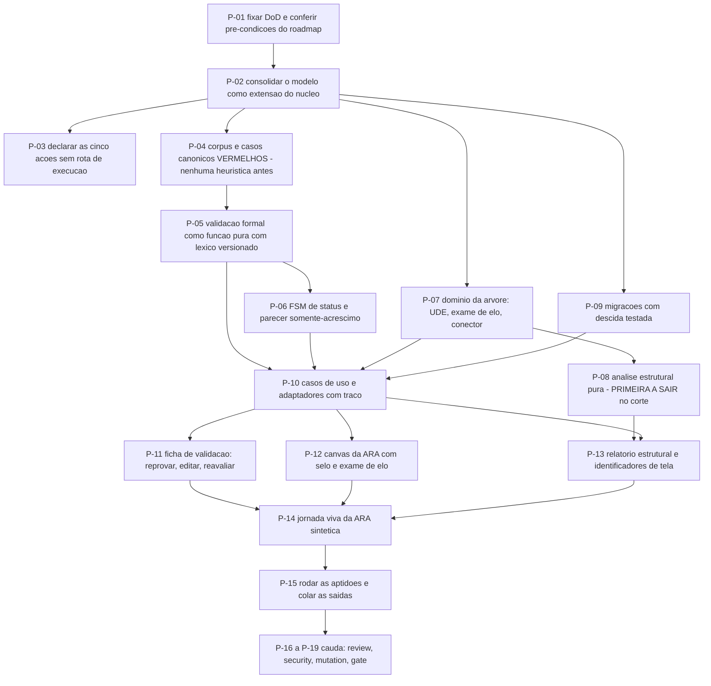

# AT 005 — Árvore de Transição da Árvore da Realidade Atual

> Siglas deste documento: **AT** — Árvore de Transição · **APR** — Árvore de
> Pré-Requisitos · **OI** — Objetivo Intermediário · **ARF** — Árvore da Realidade
> Futura · **ARA** — Árvore da Realidade Atual · **UDE** — Efeito Indesejável · **TOC** —
> Teoria das Restrições · **ADR** — Architecture Decision Record (Registro de Decisão
> Arquitetural) · **FSM** — máquina de estados finitos · **TDD** — Test-Driven
> Development (desenvolvimento guiado por teste) · **IA** — inteligência artificial ·
> **OTel** — OpenTelemetry · **DoD** — Definition of Done (Definição de Pronto) ·
> **i18n** — internacionalização.

- **Spec**: `specs/005-arvore-da-realidade-atual/spec.md` · **Ciclo**: 005 (planejado) ·
  **Data desta árvore**: 2026-09-05
- **Fonte dos passos**: `specs/005-arvore-da-realidade-atual/tasks.md` — T-01 a T-15 mais
  a cauda. A AT **não inventa passo**; onde divergirem, o `tasks.md` manda.
- **A ordem que este ciclo não pode inverter**: o corpus (P-04) nasce **antes** de
  qualquer heurística. É a frase literal do `tasks.md` — "Nenhuma heurística antes disto."

## Os passos

| Passo | Tarefa | Necessidade (por que este passo, agora) | Ação | Resultado esperado (verificável) |
|---|---|---|---|---|
| **P-01** | T-01 | O roadmap declara uma pré-condição de conteúdo, não só de ciclo: os critérios transcritos com a partição decidível × julgamento marcada | Fixar as catorze linhas da DoD e conferir as pré-condições do roadmap | Cada linha tem comando; pré-condições coladas no `qa-report.md` |
| **P-02** | T-02 | A ARA **estende** o núcleo por composição; modelar sem consolidar a extensão produziria entidade duplicada | Consolidar o modelo de dados como extensão do M1 e os contratos REST | Todo agregado e evento da spec aparece no documento; nenhuma entidade sem invariante escrita; contratos **sem** rota de execução de ação de IA |
| **P-03** | T-03 | O ciclo 006 precisa de um cliente concreto; declarar as ações aqui evita que aquele ciclo redesenhe o que este já sabe | Declarar as cinco ações `toc.*` com nome, classe de risco, esquema de entrada, saída e o que nasce proposta | DoD 10: a declaração existe e **nenhuma rota de execução** no serviço |
| **P-04** | T-04 | **O passo que define o ciclo.** Escrever a heurística antes do corpus produz um corpus escrito para caber na heurística — a dívida Dv-2 ampliada em vez de contida | Escrever o corpus sintético versionado — bons, maus e adversariais, em dois idiomas — e os três casos canônicos como teste vermelho | DoD 2 e 4 **vermelhos pelo motivo certo** (função inexistente), com a contagem de casos na saída; zero dado real de pessoa |
| **P-05** | T-05 | Só agora a heurística pode nascer, e ela nasce contra um corpus que não a conhece | Escrever a validação formal: função pura por critério decidível, léxico por idioma como dado versionado, `indeterminado` honesto | DoD 1, 2 e 4 verdes; DoD 3: zero ocorrência de prompt no domínio |
| **P-06** | T-06 | "Validado" sem guarda vira carimbo (RN-04 da ARF), e parecer que se sobrescreve não é auditoria | FSM de status e parecer somente-acréscimo com autor tipado; reabertura com justificativa | DoD 5: `Validado` recusado com decidível vermelho ou sem parecer humano; parecer nunca sobrescrito |
| **P-07** | T-07 | A semântica da ARA só existe se as invariantes do núcleo continuarem intactas — estender não pode ser reescrever | Domínio da árvore: tipo de projeto, marcador de UDE com ficha, exame de elo com reserva obrigatória, conector de conjunção | DoD 6; a suíte do ciclo 004 continua verde; a reavaliação automática ao editar o texto está coberta |
| **P-08** | T-08 | O relatório que a linhagem pedia à IA é **computável**: fragmentos, entradas, alcance, ciclos | Análise estrutural como função pura sobre o grafo, com testes sobre grafos de fixture, incluindo um com ciclo e um com dois fragmentos | DoD 7 e 8; o desempenho medido em grafo de 200 nós, saída colada |
| **P-09** | T-09 | Esquema novo sem descida testada é dívida de banco disfarçada de entrega | Migrações da ficha, do parecer, do exame e do conector, com subida e descida testadas | Ciclo de subida e descida sem resíduo, saída colada; o teste de isolamento do 004 verde sobre as tabelas novas |
| **P-10** | T-10 | Regra pura que nenhum caso de uso alcança não chega a ninguém; e o P5 exige traço nascendo com a funcionalidade | Casos de uso e adaptadores REST com traço por mutação e autorização fechada por capacidade | DoD 9: o teste falha se qualquer um dos três eventos novos não emitir traço |
| **P-11** | T-11 | O fluxo que decide a utilidade da ferramenta é reprovar → editar → reavaliar **na mesma superfície**: fechar a ficha a cada tentativa mata a oficina | Interface da ficha de validação em duas seções, com o trecho apontado no próprio texto | Teste de fluxo feliz e de reprovação; medição do ciclo editar → reavaliar registrada |
| **P-12** | T-12 | Estado de exame que só existe em banco não muda a conversa da sala; ele precisa estar no diagrama | Interface do canvas da ARA: selo com status por cor **e** texto, exame na aresta, conector desenhado, resumo por status | Teste de fluxo por estado de exame; nenhum literal de interface fora do dicionário |
| **P-13** | T-13 | O ciclo 006 vai compor snapshot destas telas: identificador estável e `ai_visible` campo a campo agora custam quase nada e evitam renomear tudo depois | Interface do relatório estrutural com foco por item; identificadores de tela registráveis | O foco centraliza o elemento; identificadores presentes na saída do grep |
| **P-14** | T-14 | Jornada sem captura do build real é ficção — e a jornada desta ferramenta é a que mais mostra o valor do ciclo: um UDE reprovado, reformulado e aceito | Jornada viva de uma ARA sintética completa, do primeiro UDE reprovado à causa raiz candidata | DoD 12: script versionado, capturas geradas, grep negativo de nome real de pessoa |
| **P-15** | T-15 | Caixa marcada não é testemunha | Rodar as aptidões e preencher o `qa-report.md` com saída colada e tamanho examinado; atualizar o CHANGELOG | Nenhuma célula preenchida sem comando executado |
| **P-16** | `TAIL:review` | O portão nomeado do roadmap para este ciclo é específico: **nenhum critério de UDE dependente de prompt** | Revisão independente em contexto fresco, verificando por leitura **e** por grep | Achados registrados |
| **P-17** | `TAIL:security` | A classe de risco aqui é regra de negócio vazando para prompt e ação mutadora aparecendo sem capacidade | Passe de segurança: nenhuma rota de execução de ação de IA, nenhum prompt, chave ou biblioteca de provedor no produto | Resultado por item no `qa-report.md` |
| **P-18** | `TAIL:mutation` | A validação formal, a FSM de status e a análise estrutural são as funções cuja falha **silenciosa** compromete a análise inteira | Testes de mutação sobre as três | Taxa e sobreviventes no `qa-report.md` |
| **P-19** | `TAIL:gate` | Quem executou não aprova o que executou | Apresentar a DoD, as respostas das cinco `[DÚVIDA]` e a cauda | Decisão de merge registrada |

## O corte de apetite, escrito antes de precisar dele

O round 005 declara: **sai primeiro** o relatório de análise estrutural — fica a marcação
manual de elos — e **nunca sai** a validação formal como domínio puro, que é a correção do
defeito D-08 e a razão de este round existir separado do 004. Na AT, isso significa que o
passo cortável é **P-08 e a parte de P-13 que o exibe**, nunca P-04 e P-05.

## O grafo

## O que esta árvore não decide

- **Se o ciclo abre** — depende do 004 promovido e dos critérios transcritos; são
  obstáculos da APR (`apr.md`).
- **A partição decidível × julgamento** — é dado versionado, decidido na execução com
  teste, e a spec já declara o ponto de partida.
- **O que se ganha quando a regra sair do prompt** — é da ARF (`arf.md`).
