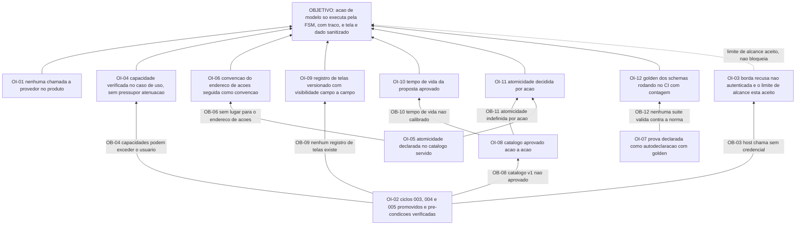

# APR 006 — Árvore de Pré-Requisitos das ações governadas e do snapshot

> Siglas deste documento: **APR** — Árvore de Pré-Requisitos · **OI** — Objetivo
> Intermediário · **ARF** — Árvore da Realidade Futura · **AT** — Árvore de Transição ·
> **APH** — Aplicação ↔ Harness · **FSM** — máquina de estados finitos · **SSE** —
> *Server-Sent Events* · **ARA** — Árvore da Realidade Atual · **TOC** — Teoria das
> Restrições · **ADR** — Architecture Decision Record (Registro de Decisão Arquitetural)
> · **IA** — inteligência artificial · **CI** — integração contínua · **DoD** —
> Definition of Done (Definição de Pronto).

- **Spec**: `specs/006-acoes-governadas-e-snapshot/spec.md` · **Ciclo**: 006 (planejado) ·
  **Data desta árvore**: 2026-09-05
- **Lógica**: condição **necessária**. Lê-se de baixo para cima.
- **Objetivo**: **toda ação vinda de modelo atravessa uma única máquina de estados no
  servidor, com traço, e a tela chega ao modelo como dado sanitizado — nunca como
  instrução.**

## Nota sobre a natureza dos obstáculos deste ciclo

Este é o ciclo com mais obstáculos **de fora**: quatro dos doze abaixo estão em
repositórios que o P1 declara leitura — a fundação, a norma. O objetivo intermediário
correspondente nunca é "consertar lá": é **medir, declarar o limite aceito e relatar por
mensagem**. Confundir as duas coisas é como se escreve fora da fronteira sem perceber.

## Obstáculos e objetivos intermediários

| # | Obstáculo (condição atual que bloqueia) | Evidência | OI que o supera | Depende de |
|---|---|---|---|---|
| **OB-01** | A assistência da linhagem é biblioteca de provedor **no navegador**, com a chave inicializada no cliente | `tocbuilderv3/services/geminiService.ts:16`, linha colada abaixo; defeito **D-01** | **OI-01**: nenhuma chamada a provedor existe no produto — quem fala com modelo é a fundação, e o grep de CI devolve zero | nenhum |
| **OB-02** | Os ciclos 003 e 005 não estão promovidos: sem a junta não há principal com capacidades, e sem a ARA não há sobre o que as primeiras ações operarem | `docs/roadmap.md`, "O ciclo 005 promovido (as primeiras ações operam sobre a ARA)"; "O que entra como dado" da spec 006 | **OI-02**: as pré-condições estão verificadas — aptidão da junta reexecutada, ciclos 004 e 005 promovidos | nenhum |
| **OB-03** | A fatia de ações federadas do hospedeiro **chama sem credencial**, atrás de uma bandeira desligada por padrão; a autenticação da borda é pré-requisito de um piloto pendente do lado dele | lacuna **L-03** da spec 006, risco médio; o próprio ADR do hospedeiro declara "Sem credencial nesta fatia" | **OI-03**: nossa borda nasce recusando chamada não autenticada, e o **limite de alcance** — só leitura enquanto isso durar — está aceito por escrito | OI-02 |
| **OB-04** | As capacidades que o grant traz podem **exceder** as do usuário, e não há laboratório que meça a atenuação do hospedeiro | lacuna **L-04**, risco médio; a irmã já relatou escopo de grant sem interseção com o usuário | **OI-04**: a verificação de capacidade acontece **no caso de uso**, localmente, em todo caminho — sem pressupor atenuação alguma | OI-02 |
| **OB-05** | O schema normativo do manifesto **não admite** o campo de atomicidade de lote: a busca devolve `0`, e a sabotagem que o acrescenta é rejeitada | lacuna **L-02**; saída colada abaixo | **OI-05**: a atomicidade é declarada no **catálogo servido**, não no manifesto, com a lacuna registrada para virar mensagem à norma se doer na admissão | nenhum |
| **OB-06** | O schema do manifesto também **não tem** onde declarar o endereço das ações; o próprio registro de decisão do hospedeiro reconhece o vazio e propõe formalizá-lo à norma | lacuna **L-06**, risco baixo | **OI-06**: seguimos a convenção do hospedeiro, declarada como convenção e não como norma, até a formalização existir | OI-05 |
| **OB-07** | O Nível 2 do padrão **não tem suíte de conformidade executável**: a norma declara que a suíte cobre o Nível 1 e o lado hospedeiro | `protocolos/padrao/padrao-aph.md:17`, trecho colado abaixo; lacuna **L-01**, risco médio | **OI-07**: a prova é dupla e declarada como autodeclaração — golden dos schemas normativos rodando no nosso CI agora, e a autodeclaração formal com evidência por requisito no ciclo 012 | nenhum |
| **OB-08** | O catálogo `toc.*` v1 não está aprovado ação a ação — nomes, riscos e capacidades — e ele é **contrato que circula no manifesto** | primeira `[DÚVIDA]` do `## Clarify`; portão humano declarado no `docs/roadmap.md` | **OI-08**: as oito ações estão aprovadas ação a ação pelo Product Steward | OI-02 |
| **OB-09** | Não existe registro de telas: a varredura por arquivos de interface neste repositório devolve **zero** | saída colada abaixo | **OI-09**: existe registro de telas versionado, fonte de verdade compartilhada entre interface e serviço, com campo a campo declarando visibilidade | OI-02 |
| **OB-10** | O tempo de vida da proposta não está calibrado: um valor curto expira o lote que a Facilitadora está lendo, um longo deixa portão pendurado | `[DÚVIDA]` 2 do `## Clarify` | **OI-10**: o tempo de vida está aprovado, e a expiração é estado da FSM com traço — nunca desaparecimento silencioso | OI-08 |
| **OB-11** | A atomicidade de cada ação de lote não está decidida ação a ação: falhar no sétimo item desfaz os seis anteriores, ou não? | `[DÚVIDA]` 3 do `## Clarify` | **OI-11**: a atomicidade está decidida **por ação** e declarada no catálogo servido | OI-05, OI-08 |
| **OB-12** | Não existe suíte que valide os nossos eventos contra os schemas da norma, e sem ela "conforme" é alegação | os schemas vivem em `protocolos/`, que é leitura; nenhum teste existe neste repositório | **OI-12**: o golden roda no CI, com a contagem de exemplos validados na saída, e as sabotagens do manifesto são recusadas com a contagem de erros impressa | OI-07 |

## Sequenciamento

Três raízes, e uma delas é inteiramente humana:

1. **Raiz de pré-condição**: OI-02 (ciclos 003, 004 e 005 promovidos) destrava quase
   tudo. Sem ela, este ciclo constrói governança para um domínio que não existe.
2. **Raiz humana**: OI-08 (catálogo aprovado ação a ação) é portão declarado, e destrava
   OI-10 e OI-11 — as duas calibrações que só fazem sentido sobre um catálogo aprovado.
3. **Raiz da norma**: OI-05, OI-06, OI-07 e OI-12 vivem em torno de lacunas do padrão. A
   ordem entre elas importa: **OI-07 → OI-12**, porque a decisão de que a prova é
   autodeclaração com golden é o que define o que o golden precisa cobrir.

O ponto de atenção do sequenciamento está em OI-03: ele **não** bloqueia o objetivo. É o
que o roadmap chama de limite de alcance, e o `tasks.md` transforma em decisão de corte —
a borda federada é a primeira tarefa a sair se o apetite estourar, porque a máquina de
estados não depende dela.

## O grafo



## Evidência — as saídas que ancoram os obstáculos

```
$ sed -n '16p' /home/user/tocbuilderv3/services/geminiService.ts
const ai = new GoogleGenAI({ apiKey: process.env.API_KEY });

$ grep -c batch_atomicity /home/user/protocolos/padrao/schemas/federacao-manifesto.schema.json
0

$ find . -path ./.git -prune -o -name '*.tsx' -print | wc -l
0
```

```
$ sed -n '17p' /home/user/protocolos/padrao/padrao-aph.md   (trecho)
... a suíte de conformidade executável cobre o Nível 1 e o lado hospedeiro da federação
(...), e o Nível 2 segue sem suíte.
```

## O que esta árvore não decide

- **Se a borda federada é exposta** enquanto o hospedeiro não emite credencial — é a
  `[DÚVIDA]` 5, matéria do gate.
- **Como cada obstáculo é atacado** — é da AT (`at.md`).
- **O que se ganha quando a governança existir** — é da ARF (`arf.md`).
