# ARF 006 — Árvore da Realidade Futura das ações governadas e do snapshot

> Siglas deste documento: **ARF** — Árvore da Realidade Futura · **APR** — Árvore de
> Pré-Requisitos · **AT** — Árvore de Transição · **APH** — Aplicação ↔ Harness ·
> **FSM** — máquina de estados finitos · **SSE** — *Server-Sent Events* · **ARA** —
> Árvore da Realidade Atual · **UDE** — Efeito Indesejável · **TOC** — Teoria das
> Restrições · **ADR** — Architecture Decision Record (Registro de Decisão Arquitetural)
> · **IA** — inteligência artificial · **OTel** — OpenTelemetry · **KB** — kilobyte ·
> **DoD** — Definition of Done (Definição de Pronto) · **CI** — integração contínua.

- **Spec**: `specs/006-acoes-governadas-e-snapshot/spec.md` · **Ciclo**: 006 (planejado) ·
  **Data desta árvore**: 2026-09-05
- **Lógica**: causa **suficiente**. Lê-se de baixo para cima.
- **Round correspondente**: `docs/produto/rounds.md`, round 006.

## A injeção — o que a spec entrega

| # | Injeção | O que a spec diz |
|---|---|---|
| **I-01** | **O catálogo `toc.*` é a única superfície executável**, derivado das permissões reais do principal: uma fonte com três projeções — valida os argumentos da proposta, vira a ferramenta que a fundação entrega ao modelo, e entra no manifesto | RF-04..RF-09 |
| **I-02** | **A FSM de proposta**: nenhuma ação executa na menção; toda ação nasce proposta com identidade própria, tem tempo de vida, e confirmar fora do estado certo falha com transição inválida | RF-10..RF-16 |
| **I-03** | **Autorização por capacidade dentro do caso de uso**, não na camada de rota, e fechada por padrão — o caminho novo que alguém criar amanhã já nasce coberto | RF-17..RF-20 |
| **I-04** | **Tela é dado**: registro de telas versionado, snapshot sanitizado **no servidor** em três camadas, com esquema fechado e teto declarado | RF-34..RF-40 |
| **I-05** | **O fio do padrão, Nível 1**: eventos tipados com sequência atribuída no servidor, repetição sem perda nem duplicação, cancelamento cooperativo e envelope de erro com códigos estáveis | RF-41..RF-48 |
| **I-06** | **Traço de 100%**: executadas, negadas, expiradas e recusadas — todas deixam registro auditável, escopado por inquilino e usuário | RF-21..RF-23 |

## Os efeitos desejáveis

| # | Efeito desejável | Decorre de | Hoje é falso porque (evidência) |
|---|---|---|---|
| **ED-01** | A assistência deixa de ser biblioteca de provedor no navegador e passa a ser ação governada pela fundação | I-01 | A violação canônica está viva na linhagem: `tocbuilderv3/services/geminiService.ts:16` inicializa o cliente do provedor **no navegador**, com a chave — linha colada abaixo. É o defeito **D-01** e o que o P7 existe para proibir |
| **ED-02** | Nenhuma mutação sugerida por modelo toca o domínio antes de alguém dizer sim | I-02 | Sem FSM, "sugerir" e "executar" são a mesma chamada; na 4ª geração as sete operações de assistência eram chamadas diretas ao provedor (fonte F-03 da spec 005) |
| **ED-03** | "O que a IA fez neste projeto?" tem resposta completa — inclusive o que ela **não** conseguiu fazer | I-06 | Auditoria hoje depende de memória de quem estava na sala; a linhagem não tem traço nenhum |
| **ED-04** | Sem a capacidade de escrita, a ação mutadora **não aparece** — ausência, não recusa | I-01, I-03 | É a lição paga pela irmã e o portão declarado do round 006: um catálogo que oferece o que a pessoa não pode fazer transforma sugestão em convite a erro de permissão |
| **ED-05** | Confirmar oito sugestões é **uma** decisão sobre oito alvos, não oito cliques que ensinam a não ler | I-02 | Decisão herdada do ADR 0009 da irmã, absorvida pela norma como requisito próprio; nada disso existe aqui hoje |
| **ED-06** | Campo sensível ou desconhecido **nunca** chega ao modelo, e a fronteira não depende de o cliente se comportar | I-04 | Não existe registro de telas nem sanitização: a varredura por arquivos de interface neste repositório devolve **zero** — saída colada abaixo |
| **ED-07** | A pessoa pode ver **exatamente** o que a IA vê da tela dela | I-04 | Na linhagem o contexto do modelo era montado no cliente, junto com o prompt editável; não havia o que inspecionar |
| **ED-08** | Recarregar a página no meio de uma proposta não perde a decisão pendente | I-05 | Sem sessão persistida e sem repetição por sequência, uma reconexão perde ou duplica |
| **ED-09** | Existe **uma** superfície de confirmação para humano e para modelo, e a origem é dado exibido — nunca um desvio de fluxo | I-02 | Duas superfícies ensinam a clicar sem ler na que parecer mais inofensiva |

## Ramos negativos — o que pode piorar, e a poda

| # | Ramo negativo | Poda declarada |
|---|---|---|
| **RN-01** | Nossa borda nasce exigindo autenticação, e a fatia do hospedeiro que a chama **envia sem credencial** — resultado: a execução disparada pelo harness simplesmente não funciona, e parece defeito nosso | Lacuna **L-03**, risco médio, com o limite aceito **por escrito no roadmap**: enquanto a autenticação da borda não existir do lado do host, a borda federada serve só leitura. A FSM, o catálogo e o consumo interno não dependem dela — e a tarefa da borda é declarada **a primeira a sair** se o apetite estourar |
| **RN-02** | O catálogo filtrado por capacidade **parece** autorização e não é: o escopo do grant pode não intersectar o usuário, e alguém passa a confiar na filtragem como se fosse fronteira | RF-17 e RF-19: a verificação vive **no caso de uso**, não na rota, e não pressupomos atenuação de autoridade do hospedeiro. A linha 4 da DoD prova isso chamando o caso de uso **sem HTTP**, e a sabotagem que devolve verdadeiro para tudo derruba os testes de recusa |
| **RN-03** | A atomicidade do lote não cabe no manifesto normativo, e declará-la lá quebraria a admissão | Medido: a busca por `batch_atomicity` no schema do manifesto devolve **0** (saída colada abaixo). A poda é declarar a atomicidade no **catálogo servido**, não no manifesto; se a lacuna doer na admissão, vira mensagem ao repositório da norma — P1: relate e pare |
| **RN-04** | A superfície de confirmação se duplica — uma para humano, outra para modelo — e a mais leve vira o caminho de menor resistência | RI-01 e RI-02: **uma** superfície, e a origem é dado exibido que **nunca** muda fluxo. O `tasks.md` transforma isso em verificação: nenhum desvio condicional sobre a origem no código da tela, conferido por revisão e por grep |
| **RN-05** | Autodeclarar Nível 2 sem suíte externa é autoavaliação, e o erro de autoavaliação é nosso | Medido na própria norma: a suíte de conformidade cobre o Nível 1 e o lado hospedeiro, "e o Nível 2 segue sem suíte" (`protocolos/padrao/padrao-aph.md:17`). A poda é dupla — golden dos schemas normativos rodando no **nosso** CI, e a autodeclaração formal adiada para o ciclo 012, com evidência por requisito |
| **RN-06** | O tempo de vida da proposta transforma a governança em incômodo: propostas expiram enquanto a Facilitadora lê o lote com calma | Declarado como `[DÚVIDA]` do `## Clarify`, com proposta explícita e calibrável no gate; e a expiração é **estado da FSM com traço**, não desaparecimento silencioso |
| **RN-07** | O snapshot vira canal de injeção: texto de tela entra no contexto do modelo como se fosse instrução | Esquema **fechado** em todos os níveis (RF-39), sanitização em três camadas **no servidor** (RF-38), e o snapshot entra como camada rotulada de sistema, distinta da fala do usuário (RF-40). O golden do campo vazado é a prova executável |
| **RN-08** | O estado terminal do lote afirma mais sucesso do que os desfechos por alvo sustentam — e o traço passa a mentir para quem audita | RF-27 é explícito, e a linha 6 da DoD o testa: com um alvo falhando, o estado terminal **não** pode dizer executado |

## O grafo

```mermaid
graph BT
  I01["I-01 catalogo toc como unica superficie executavel"]
  I02["I-02 FSM de proposta com tempo de vida"]
  I03["I-03 capacidade verificada no caso de uso, fechada por padrao"]
  I04["I-04 registro de telas e snapshot sanitizado no servidor"]
  I05["I-05 fio Nivel 1 com sequencia, repeticao e cancelamento"]
  I06["I-06 traco de cem por cento, inclusive recusas"]

  ED01["ED-01 assistencia deixa de ser biblioteca no navegador"]
  ED02["ED-02 nenhuma mutacao toca o dominio antes do sim"]
  ED03["ED-03 o que a IA fez tem resposta completa"]
  ED04["ED-04 sem capacidade de escrita a acao nao aparece"]
  ED05["ED-05 lote e uma decisao sobre N alvos"]
  ED06["ED-06 campo sensivel nunca chega ao modelo"]
  ED07["ED-07 a pessoa ve o que a IA ve da tela dela"]
  ED08["ED-08 recarregar nao perde a decisao pendente"]
  ED09["ED-09 uma superficie de confirmacao para humano e modelo"]

  OBJ["OBJETIVO: a aplicacao e um Operador de verdade - conversa sem nunca executar sem governanca"]

  I01 --> ED01
  I02 --> ED02
  I06 --> ED03
  I01 --> ED04
  I03 --> ED04
  I02 --> ED05
  I04 --> ED06
  I04 --> ED07
  I05 --> ED08
  I02 --> ED09

  ED01 --> OBJ
  ED02 --> OBJ
  ED03 --> OBJ
  ED04 --> OBJ
  ED05 --> OBJ
  ED06 --> OBJ
  ED07 --> OBJ
  ED08 --> OBJ
  ED09 --> OBJ

  RN01["RN-01 borda do host chama sem credencial"]
  RN02["RN-02 catalogo filtrado parece autorizacao e nao e"]
  RN03["RN-03 atomicidade do lote nao cabe no manifesto"]
  RN05["RN-05 autodeclarar Nivel 2 sem suite externa"]
  P01["PODA alcance limitado a leitura, aceito no roadmap; a borda e a primeira a sair"]
  P02["PODA capacidade verificada no caso de uso e provada sem HTTP"]
  P03["PODA atomicidade no catalogo servido e mensagem a norma"]
  P05["PODA golden dos schemas no nosso CI e autodeclaracao so no ciclo 012"]

  I03 -.-> RN01
  I01 -.-> RN02
  I02 -.-> RN03
  I01 -.-> RN05
  P01 --> RN01
  P02 --> RN02
  P03 --> RN03
  P05 --> RN05
```



## Evidência — as linhas e números desta árvore

```
$ sed -n '16p' /home/user/tocbuilderv3/services/geminiService.ts
const ai = new GoogleGenAI({ apiKey: process.env.API_KEY });

$ grep -c batch_atomicity /home/user/protocolos/padrao/schemas/federacao-manifesto.schema.json
0

$ find . -path ./.git -prune -o -name '*.tsx' -print | wc -l
0
```

```
$ sed -n '17p' /home/user/protocolos/padrao/padrao-aph.md   (trecho)
... a suíte de conformidade executável cobre o Nível 1 e o lado hospedeiro da federação
(...), e o Nível 2 segue sem suíte.
```

## O que esta árvore não decide

- **O catálogo v1 ação a ação** — nomes, riscos e capacidades das oito ações são portão
  humano declarado no `docs/roadmap.md` e a primeira `[DÚVIDA]` do `## Clarify`.
- **Se a borda federada é exposta enquanto o hospedeiro não emite credencial** — é a
  `[DÚVIDA]` 5, matéria do gate.
- **Os obstáculos entre hoje e este futuro** — são da APR (`apr.md`).
