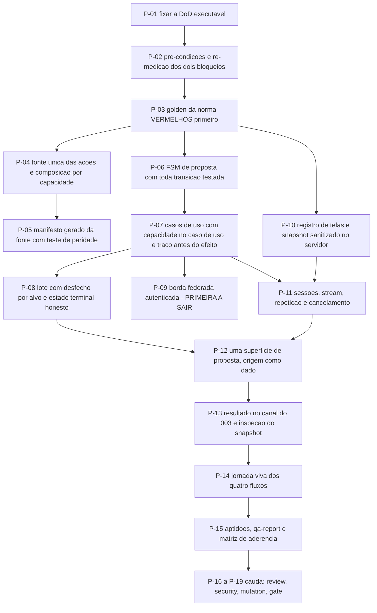

# AT 006 — Árvore de Transição das ações governadas e do snapshot

> Siglas deste documento: **AT** — Árvore de Transição · **APR** — Árvore de
> Pré-Requisitos · **OI** — Objetivo Intermediário · **ARF** — Árvore da Realidade
> Futura · **APH** — Aplicação ↔ Harness · **FSM** — máquina de estados finitos ·
> **SSE** — *Server-Sent Events* · **ARA** — Árvore da Realidade Atual · **TOC** — Teoria
> das Restrições · **ADR** — Architecture Decision Record (Registro de Decisão
> Arquitetural) · **IA** — inteligência artificial · **TDD** — Test-Driven Development
> (desenvolvimento guiado por teste) · **CI** — integração contínua · **DoD** —
> Definition of Done (Definição de Pronto).

- **Spec**: `specs/006-acoes-governadas-e-snapshot/spec.md` · **Ciclo**: 006 (planejado) ·
  **Data desta árvore**: 2026-09-05
- **Fonte dos passos**: `specs/006-acoes-governadas-e-snapshot/tasks.md` — T-01 a T-19. A
  AT **não inventa passo**; onde divergirem, o `tasks.md` manda.

## Os passos

| Passo | Tarefa | Necessidade (por que este passo, agora) | Ação | Resultado esperado (verificável) |
|---|---|---|---|---|
| **P-01** | T-01 | Este é o ciclo com mais requisitos vindos de norma alheia; DoD frouxa aqui é conformidade alegada | Fixar as catorze linhas da spec nos caminhos reais do repositório | Cada linha tem comando que roda no ambiente local |
| **P-02** | T-02 | Dois bloqueios externos definem o **alcance** da entrega, e medi-los depois de construir é descobrir o limite tarde | Verificar as pré-condições e re-medir os dois bloqueios do round 006 | Saídas das re-medições coladas no `qa-report.md`, com data e commit lido |
| **P-03** | T-03 | O P4 aplicado a conformidade: os golden da norma nascem **vermelhos**, antes de haver o que validar | Suíte que valida nossos eventos contra os schemas da norma, o golden do campo vazado, e o manifesto contra o schema com as três sabotagens | A suíte existe e falha porque nada está implementado; as sabotagens do manifesto são recusadas com a contagem de erros impressa |
| **P-04** | T-04 | Uma fonte com três projeções é o que impede o catálogo, o manifesto e as ferramentas do modelo de divergirem — divergirem é como nasce um segundo protocolo | Fonte única das oito ações e composição por capacidade, como função pura | DoD 3: contagem de ações com e sem a capacidade de escrita impressa; catálogo servido já filtrado |
| **P-05** | T-05 | Manifesto escrito à mão diverge da fonte no primeiro dia; a paridade é o que torna a divergência impossível | Gerar o manifesto da fonte única, com teste de paridade e validação contra o schema no CI | DoD 11 com a saída da validação; divergência entre fonte e manifesto derruba o build |
| **P-06** | T-06 | Nada executa na menção: é a linha inteira do P2, e uma FSM sem as transições **inválidas** testadas é meia FSM | Escrever a tabela de transições e **todos** os testes — válidos e inválidos — antes do código | DoD 1 e 2; cobertura de 100% das transições; confirmação duplicada não reexecuta |
| **P-07** | T-07 | A armadilha nomeada da norma: verificar capacidade na rota produz falso positivo em auditoria, e o caminho novo de amanhã nasce descoberto | Casos de uso propor, decidir e executar, com capacidade verificada no caso de uso e traço gravado **antes** do efeito | DoD 4 e 5: o caso de uso chamado sem HTTP recusa; a sabotagem que autoriza tudo derruba os testes de recusa; a sabotagem sem traço rejeita a execução |
| **P-08** | T-08 | Lote é uma proposta com N alvos, e o estado terminal do lote é onde o traço mais facilmente passa a mentir | Validação de lote pura, execução por item, desfecho por alvo, estado terminal nunca mais otimista que os desfechos | DoD 6: uma proposta com oito alvos, uma falha, e o estado terminal **não** diz executado |
| **P-09** | T-09 | A borda é o ponto onde a chamada chega de fora e, hoje, **sem credencial** — nascer aberta seria confiar numa validação que o hospedeiro declara não fazer | Borda de execução federada com autenticação exigida, argumentos validados contra o esquema, limite de taxa e orçamento de tempo medido | DoD 12. **Primeira tarefa a sair** se o apetite estourar — a FSM não depende dela |
| **P-10** | T-10 | Tela é dado, e a sanitização tem de ser do lado que a pessoa não controla | Registro de telas versionado e pipeline de sanitização em três estágios no servidor, com esquema fechado e teto | DoD 7: campo fora do registro rejeitado; o campo vazado ausente de todo prompt montado |
| **P-11** | T-11 | Sem sessão persistida e sequência atribuída no servidor, uma reconexão perde ou duplica — e as decisões pendentes somem | Sessões e stream: eventos tipados persistidos, repetição sem perda nem duplicação, cancelamento cooperativo, envelope de erro | DoD 8, 9 e 10: golden com contagem; repetição do início idêntica ao stream e do fim vazia |
| **P-12** | T-12 | Duas superfícies de confirmação ensinam a clicar sem ler (RN-04 da ARF) | Uma superfície de proposta com origem exibida como dado, desfecho por alvo, painel de assistência e estados da proposta | Fluxo de lote completo no navegador; **nenhum desvio condicional sobre a origem** no código da tela, conferido por revisão e grep |
| **P-13** | T-13 | O sinal de resultado no canal é palpite de interface, não prova — e a pessoa precisa poder inspecionar o que a IA vê | Emitir o resultado no canal do ciclo 003 e oferecer a inspeção do snapshot | O envelope canônico aparece no canal simulado; a inspeção exibe exatamente o snapshot sanitizado enviado |
| **P-14** | T-14 | Os quatro fluxos que definem a governança — confirmada, recusada, lote com falha parcial, expirada — só provam valor se forem vistos | Jornada viva dos quatro fluxos, com capturas por script versionado e avaliação heurística datada | DoD 13; capturas regeneram determinísticas |
| **P-15** | T-15 | A matriz de aderência é o artefato vivo da fronteira: deixá-la para o ciclo 012 é autodeclarar de memória | Rodar as aptidões, preencher o `qa-report.md` e atualizar a matriz de aderência com evidência por caminho nas linhas que este ciclo fecha | Nenhuma linha com sinal transcrito sem saída colada; nenhuma linha "atendido" sem caminho |
| **P-16** | T-16 (`TAIL:review`) | O achado clássico deste ciclo é auditar a rota e concluir que a capacidade está verificada — falso positivo nomeado pela própria norma | Revisão independente com instrução explícita: capacidade no caso de uso, nenhum caminho fora da FSM, estado terminal do lote honesto | Veredito, achados e destino no `qa-report.md` |
| **P-17** | T-17 (`TAIL:security`) | A classe de risco aqui é a mais alta do projeto: borda externa, contexto de modelo, capacidade inflada | Passe de segurança: borda sem credencial, capacidade inflada, injeção por snapshot e argumentos, segredo no cliente, campo vazado em log e traço | Resultado por item no `qa-report.md` |
| **P-18** | T-18 (`TAIL:mutation`) | Toda peça de governança deste ciclo falha **em silêncio** quando falha — é o pior modo de falha possível | Sabotar e ver recusar: política que autoriza tudo, execução sem traço, transição inválida forçada, campo fora do registro, estado terminal mentiroso, manifesto sabotado | Cada sabotagem com o comando e a recusa impressa |
| **P-19** | T-19 (`TAIL:gate`) | O catálogo é contrato que circula: conferi-lo contra o aprovado é parte do gate, não do código | Apresentar a DoD, conferir o catálogo contra o aprovado na abertura, rever a jornada | Registro do gate no `qa-report.md` e no índice de decisões |

## O corte de apetite, escrito antes de precisar dele

O round 006 declara: **sai primeiro** o lote — fica a proposta unitária — e **nunca sai**
a máquina de estados única no servidor nem o traço por ação, porque são o P2, que é
inegociável. O `tasks.md` acrescenta um segundo candidato de corte, a borda federada
(P-09), pelo motivo já medido: enquanto o hospedeiro chamar sem credencial, ela serve
pouco, e a FSM não depende dela.

Um ciclo que executasse ação de modelo sem FSM e sem traço **não pode ser aceito** — está
escrito no round, e a AT o repete porque é a única linha aqui que não é negociável por
apetite.

## O grafo

## O que esta árvore não decide

- **Se o ciclo abre** — depende dos ciclos 003, 004 e 005 promovidos e do catálogo
  aprovado; são obstáculos da APR (`apr.md`).
- **O alcance da borda federada** — depende do que a re-medição de P-02 encontrar e da
  decisão do gate.
- **O que se ganha quando a governança existir** — é da ARF (`arf.md`).
