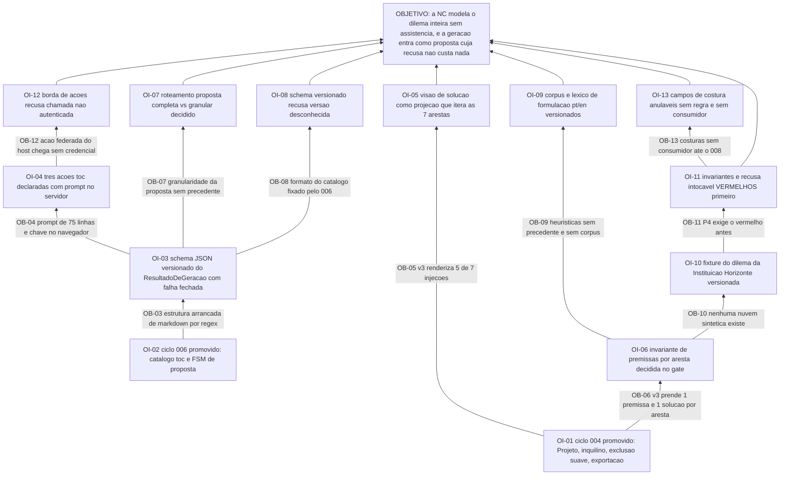

# APR 007 — Árvore de Pré-Requisitos da Nuvem de Conflito

> Siglas deste documento: **APR** — Árvore de Pré-Requisitos · **OI** — Objetivo
> Intermediário · **ARF** — Árvore da Realidade Futura · **AT** — Árvore de Transição ·
> **NC** — Nuvem de Conflito · **ARA** — Árvore da Realidade Atual · **UDE** — Efeito
> Indesejável · **TOC** — Teoria das Restrições · **TRIZ** — Teoria da Resolução
> Inventiva de Problemas · **ADR** — Architecture Decision Record (Registro de Decisão
> Arquitetural) · **FSM** — máquina de estados finitos · **IA** — inteligência
> artificial · **SDK** — Software Development Kit (kit de desenvolvimento) · **TDD** —
> Test-Driven Development (desenvolvimento guiado por teste) · **DoD** — Definition of
> Done (Definição de Pronto) · **JSON** — JavaScript Object Notation · **APH** — o
> padrão Aplicação ↔ Harness.

- **Spec**: `specs/007-nuvem-de-conflito/spec.md` · **Ciclo**: 007 (planejado) ·
  **Data desta árvore**: 2026-09-05
- **Lógica**: condição **necessária**. Lê-se de baixo para cima.
- **Objetivo**: **a Nuvem de Conflito modela o dilema por inteiro sem assistência
  nenhuma, e a geração a partir de narrativa entra como proposta recusável cuja recusa
  não custa nada.**

## Obstáculos e objetivos intermediários

| # | Obstáculo (condição atual que bloqueia) | Evidência | OI que o supera | Depende de |
|---|---|---|---|---|
| **OB-01** | O ciclo 004 não está promovido: a NC herda do M1 projeto, inquilino, exclusão suave, desfazer, vista tabular e exportação — sem ele o M3 reimplementaria o ciclo de vida do projeto | `docs/roadmap.md` § "O que o ciclo 007 não pode começar sem": "Os ciclos 004 e 006 promovidos"; INT-01 da spec | **OI-01**: o ciclo 004 está promovido e a NC consome Projeto, inquilino, exclusão suave e exportação sem reimplementar nada | nenhum |
| **OB-02** | O ciclo 006 não está promovido: a FSM de proposta é **uma só e do servidor** (constituição, item 8) e o M3 é cliente dela, nunca dono — e antecipar uma FSM provisória está proibido | `plan.md` § Constitution Check, ressalva: "se o 006 escorregar, o 007 não abre, e antecipar uma FSM provisória está proibido por constituição" | **OI-02**: o catálogo `toc.*` e a FSM de proposta do 006 existem promovidos, e o M3 entra como **segundo cliente** deles | nenhum |
| **OB-03** | A geração da linhagem depende da **forma** do texto: 5 extrações de entidade e 7 pares premissa/solução arrancados de markdown por expressão regular, com `return null;` inteiro em qualquer variação | saídas coladas abaixo (`5`, `7`, `parserService.ts:67`); fonte F-03 da spec | **OI-03**: existe schema JSON **versionado** do ResultadoDeGeracao em `contracts/`, e resultado que não valida é recusado em falha fechada com erro legível e traço | OI-02 |
| **OB-04** | A regra inteira da ferramenta vive como prompt de **75 linhas no cliente**, servido por um SDK inicializado com a chave **no navegador** | `constants.ts:264-338` (75 linhas, contagem colada); `geminiService.ts:16` (linha colada) — defeito **D-01**, ADR 0007 | **OI-04**: as 3 ações `toc.*` deste módulo estão declaradas em `contracts/acoes-catalogo.md` com prompts **no servidor**, e o grep de integração contínua cobre `CONFLICT_CLOUD_PROMPT` e `GoogleGenAI` | OI-03 |
| **OB-05** | A visão de solução da 4ª geração renderiza **5** das 7 injeções: `D_C.solution` e `D_D_PRIME.solution` — o perigo e o conflito central — não são renderizadas em lugar nenhum | `sed -n '164,185p' ConflictCloudView.tsx \| grep -c "Injection"` → `5`; `grep -n "D_D_PRIME.solution\|D_C.solution"` → 0 linhas (coladas abaixo); fonte F-07 | **OI-05**: a visão de solução é **projeção** que itera as 7 arestas por construção, e o defeito do v3 é caso de teste (DoD 9) | OI-01 |
| **OB-06** | O dado da linhagem prende **exatamente uma** premissa e **uma** solução por aresta, sem referência entre elas: `ConflictCloudAssumption` tem `assumption: string` e `solution: string` | `types.ts:72-76` (colado abaixo); lacuna **L-01**, risco **baixo** | **OI-06**: a decisão sobre multiplicidade de premissas por aresta está tomada no gate, e a invariante escolhida — zero ou mais ordenadas, com completude medindo ≥ 1 vigente — é teste de domínio | OI-01 |
| **OB-07** | A granularidade da proposta de geração — completa sobre nuvem vazia, granular sobre nuvem preenchida — é desenho **nosso**, sem precedente: o v3 sempre sobrescrevia tudo | lacuna **L-02** da spec, risco declarado **médio**; segunda `[DÚVIDA]` do `## Clarify` | **OI-07**: o roteamento por estado da nuvem está decidido no gate e a prova negativa existe: recusar deixa o estado serializado idêntico byte a byte (DoD 5) | OI-03 |
| **OB-08** | O formato do catálogo é fixado pelo ciclo 006 e a declaração das 3 ações do M3 **o antecipa** — divergência entre o que escrevemos e o que o 006 fixar é possível | lacuna **L-03** da spec, risco **baixo**; `plan.md` § Riscos, linha GATE-schema | **OI-08**: o schema é versionado e resultado de versão desconhecida é recusado (RF-29) — divergência custa migração de um contrato, nunca de domínio | OI-03 |
| **OB-09** | As heurísticas de formulação **não têm precedente medido**: a linhagem mandava a formulação inteira ao modelo, e não existe corpus de entidades bem e mal formuladas em lugar nenhum | lacuna **L-04** da spec; `ls docs/produto/dados/` devolve apenas o material da ARA (saída colada abaixo) | **OI-09**: existe corpus sintético versionado pt/en de entidades bem e mal formuladas, com casos adversariais, e o léxico é dado por idioma testável em isolamento | OI-06 |
| **OB-10** | Não existe nuvem sintética alguma no repositório: `docs/produto/dados/` tem a base da ARA (`analise-horizonte.json`) e o script que a mede, e nada de dilema | saída de `ls docs/produto/dados/` colada abaixo | **OI-10**: a fixture do dilema da "Instituição Horizonte" existe versionada — narrativa, 5 entidades, premissas por aresta e injeções — sem nenhum dado real de pessoa (ADR 0006) | OI-06 |
| **OB-11** | O princípio P4 exige o teste vermelho **antes**, e neste ciclo os dois testes que definem a entrega — invariantes da topologia e recusa intocável — não existem | `tasks.md` T-04: "**Nenhum agregado antes disto.**"; T-09 traz a prova de recusa antes da integração | **OI-11**: os testes de invariante e a prova de recusa byte a byte existem e falham **pelo motivo certo** (agregado e borda inexistentes), com a contagem de casos na saída | OI-10 |
| **OB-12** | A chamada de ação federada vinda do hospedeiro chega **sem credencial**: a fatia F4 envia `POST {origin}/aph/actions/{action_id}` sem token, atrás de uma variável desligada por padrão | `ghdaru/docs/adr/0023-acoes-federadas-por-adapter-remoto.md:49` (linha colada abaixo); bloqueio externo 1 do round 006 em `docs/produto/rounds.md` | **OI-12**: a nossa borda de ações **recusa chamada não autenticada** em falha fechada, e o limite de alcance está declarado por escrito — não é defeito nosso a depurar | OI-04 |
| **OB-13** | Os campos de costura com M2 e M4 nascem **sem consumidor**: promover UDE→NC e semear ARF são do ciclo 008, e desenhar dado sem uso é como se cria migração inútil | lacuna **L-05** da spec, risco **baixo**; `docs/produto/rounds.md`, round 007, § Fora | **OI-13**: ReferenciaDeOrigem e ReferenciaDeSemeadura existem como colunas **anuláveis, sem regra e sem consumidor**, com a leitura ("origem: UDEs …") quando houver | OI-11 |

## Sequenciamento

O ciclo tem **duas raízes** — os dois ciclos que o roadmap exige promovidos — e elas
alimentam ramos de natureza diferente:

- **OI-01** (o núcleo M1) destrava tudo o que é **estrutura e tela**: a topologia
  (OI-05), a invariante de premissas (OI-06) e, adiante, a fixture e os testes.
- **OI-02** (o catálogo e a FSM do 006) destrava tudo o que é **assistência**: o schema
  (OI-03), a declaração das ações (OI-04), o roteamento (OI-07), o versionamento
  (OI-08) e a borda autenticada (OI-12).

O caminho crítico é o do **domínio**, e ele é literal quanto ao P4:

> OI-01 → OI-06 (a invariante de premissa decidida) → OI-10 (a fixture do dilema) →
> OI-11 (**os testes falham primeiro**) → só então o agregado.

O `tasks.md` diz a mesma coisa em três palavras — "**Nenhum agregado antes disto.**" — e
é o ponto onde este ciclo mais facilmente se trai: escrever o agregado antes dos testes
de invariante produz invariante escrita para caber no agregado, que é o oposto do que a
DoD 2 mede.

O ramo da assistência (OI-03, OI-04, OI-07, OI-08, OI-12) é **isolável por construção**:
RF-28 exige que E3.1, E3.2 e E3.4 funcionem com o catálogo ausente ou desligado. Se o
006 escorregar, o ciclo entrega a NC manual completa e a geração fica pendente — que é
exatamente por que o corte de apetite do round 007 nunca toca nas premissas por aresta.

OI-13 é frente lateral: nada bloqueia, e existe para o ciclo 008 não migrar o M3.

## O grafo



## Evidência — as saídas que ancoram os obstáculos

```
$ cd /home/user/tocbuilderv3 && grep -c "getEntity(" services/parserService.ts
5

$ cd /home/user/tocbuilderv3 && grep -c "getAssumptionAndSolution('" services/parserService.ts
7

$ cd /home/user/tocbuilderv3 && sed -n 67p services/parserService.ts
    return null;

$ cd /home/user/tocbuilderv3 && sed -n '264,338p' constants.ts | wc -l
75

$ cd /home/user/tocbuilderv3 && sed -n 16p services/geminiService.ts
const ai = new GoogleGenAI({ apiKey: process.env.API_KEY });

$ cd /home/user/tocbuilderv3 && sed -n '164,185p' components/ConflictCloudView.tsx | grep -c "Injection"
5

$ cd /home/user/tocbuilderv3 && grep -n "D_D_PRIME.solution\|D_C.solution" components/ConflictCloudView.tsx | wc -l
0

$ cd /home/user/tocbuilderv3 && sed -n '72,76p' types.ts
export interface ConflictCloudAssumption {
  id: 'A_B' | 'A_C' | 'B_D' | 'C_D_PRIME' | 'D_C' | 'D_PRIME_B' | 'D_D_PRIME';
  assumption: string;
  solution: string;
}

$ ls /home/user/toc-federada/docs/produto/dados/
README.md
__pycache__
analise-horizonte.json
medir-base.py

$ grep -n "Sem credencial" /home/user/ghdaru/docs/adr/0023-acoes-federadas-por-adapter-remoto.md
49:- (−) **Sem credencial nesta fatia**: a chamada à app federada vai sem token — aceitável só
```

## O que esta árvore não decide

- **As cinco `[DÚVIDA]` do Clarify** — multiplicidade de premissas, granularidade da
  geração, obrigatoriedade da TRIZ, múltiplas injeções escolhidas e modo estrito de
  formulação são do gate humano, e três delas (OB-06, OB-07 e a TRIZ) só viram
  invariante depois de respondidas.
- **A ordem operacional dos passos** — é da AT (`at.md`).
- **O que se ganha quando a nuvem passar a funcionar sozinha** — é da ARF (`arf.md`).
