# ARF 007 — Árvore da Realidade Futura da Nuvem de Conflito

> Siglas deste documento: **ARF** — Árvore da Realidade Futura · **APR** — Árvore de
> Pré-Requisitos · **AT** — Árvore de Transição · **NC** — Nuvem de Conflito · **ARA** —
> Árvore da Realidade Atual · **UDE** — Efeito Indesejável (*Undesirable Effect*) ·
> **TOC** — Teoria das Restrições · **TRIZ** — Teoria da Resolução Inventiva de
> Problemas · **ADR** — Architecture Decision Record (Registro de Decisão Arquitetural) ·
> **FSM** — máquina de estados finitos · **IA** — inteligência artificial · **SDK** —
> Software Development Kit (kit de desenvolvimento) · **TDD** — Test-Driven Development
> (desenvolvimento guiado por teste) · **DoD** — Definition of Done (Definição de
> Pronto) · **OTel** — OpenTelemetry · **JSON** — JavaScript Object Notation · **i18n** —
> internacionalização · **APH** — o padrão Aplicação ↔ Harness.

- **Spec**: `specs/007-nuvem-de-conflito/spec.md` · **Ciclo**: 007 (planejado) ·
  **Data desta árvore**: 2026-09-05
- **Lógica**: causa **suficiente**. Lê-se de baixo para cima.
- **Round correspondente**: `docs/produto/rounds.md`, round 007.

## A injeção — o que a spec entrega

| # | Injeção | O que a spec diz |
|---|---|---|
| **I-01** | **A topologia da nuvem é invariante de agregado, não convenção de interface**: 5 entidades e 7 arestas nascem num único ato atômico e o domínio **não tem** operação de criar ou excluir nenhuma delas | RF-02, RF-03, RN-01 |
| **I-02** | **A geração assistida devolve resultado estruturado validado por schema JSON versionado**, no servidor, **antes** de virar proposta — nunca texto interpretado por parser | RF-21, RF-22, RF-29, RNF-04 |
| **I-03** | **Toda escrita originada de modelo nasce `action_proposal` na FSM do servidor**, e a recusa é provada intocável byte a byte por teste | RF-23, RF-24, RN-05 |
| **I-04** | **Injeção referencia uma premissa existente por identidade**: não existe construtor de injeção sem premissa, e arquivar a premissa arquiva as injeções ligadas dizendo quantas | RF-15, RF-16, RN-04 |
| **I-05** | **A visão de solução é projeção do mesmo agregado**, iterando as 7 arestas por construção — não existe "dado da visão de solução" | RF-30, RF-31, `plan.md` § Decisão 7 |
| **I-06** | **A forma canônica é heurística pura de domínio** com léxico versionado pt/en e `indeterminado` honesto: aviso pedagógico, nunca bloqueio | RF-09, RF-10, RF-11, RN-06 |
| **I-07** | **As duas costuras nascem como dado anulável sem regra** — ReferenciaDeOrigem (vem da ARA) e ReferenciaDeSemeadura (vai para a ARF do 008) — lugar pronto, ação nenhuma | RF-20, INT-05, INT-06 |

## Os efeitos desejáveis

| # | Efeito desejável | Decorre de | Hoje é falso porque (evidência) |
|---|---|---|---|
| **ED-01** | O melhor recurso da ferramenta deixa de quebrar **pela forma do texto** e passa a quebrar só pelo conteúdo — quando quebra, diz o que faltou | I-02 | Na linhagem a estrutura era arrancada de markdown por expressão regular: `grep -c "getEntity(" services/parserService.ts` devolve **5** e `grep -c "getAssumptionAndSolution('"` devolve **7** (saídas coladas abaixo); qualquer variação de formato devolve `null` **inteiro** — `sed -n 67p services/parserService.ts` é literalmente `return null;` |
| **ED-02** | A regra da ferramenta deixa de ser texto editável servido ao navegador e vira contrato mais domínio testável | I-02, I-06 | `CONFLICT_CLOUD_PROMPT_TEXT` ocupa **75** linhas de `tocbuilderv3/constants.ts:264-338` (contagem colada abaixo) e o cliente é inicializado com a chave **no navegador** — `tocbuilderv3/services/geminiService.ts:16` (linha colada abaixo). É o defeito **D-01**, que o ADR 0007 mata |
| **ED-03** | Pedir ajuda ao modelo deixa de custar o trabalho que o grupo já fez: recusar volta ao estado exato | I-03 | Na linhagem a geração devolvia markdown cru e a aplicação o aplicava — `services/geminiService.ts:173` devolve `{ markdown: textResponse }`, sem contrato e sem proposta (linha colada abaixo). Não havia recusa: havia sobrescrita |
| **ED-04** | A solução deixa de ser invisível **exatamente onde o conflito mora**: as 7 posições de aresta mostram injeção ou pendência, D⇸C e D↯D′ inclusive | I-05 | O diagrama de solução da 4ª geração renderiza **5** nós de injeção (`sed -n '164,185p' components/ConflictCloudView.tsx \| grep -c "Injection"` → `5`) e `D_C.solution` / `D_D_PRIME.solution` não aparecem em lugar nenhum (o mesmo grep devolve **0** linhas) — saídas coladas abaixo |
| **ED-05** | Toda solução declara **por que** funciona: a injeção aponta a premissa que invalida, e várias injeções podem atacar a mesma premissa | I-04 | Na linhagem a solução era um campo pareado por posição, um para um, sem referência e sem escolha: `ConflictCloudAssumption` tem `assumption: string` e `solution: string` (`types.ts:72-76`, colado abaixo) |
| **ED-06** | A NC funciona **por inteiro** sem catálogo: modelar, sustentar com premissas, atacar com injeções e ver a solução não dependem de assistência nenhuma | I-01, I-04, I-05 | RF-28 exige isso, e é o que permite ao ciclo entregar valor mesmo se a assistência estiver desligada. Na linhagem o caminho principal da NC **era** a geração assistida (F-04), e sem ela sobrava formulário |
| **ED-07** | O método educa enquanto se usa, sem travar a sessão: quem escreve fora da forma canônica é avisado com exemplo, e quem a heurística não alcança **não** é avisado errado | I-06 | Não há precedente medido: a linhagem mandava a formulação inteira ao modelo (lacuna **L-04** da spec). Hoje não existe aviso — existe chamada de rede |
| **ED-08** | O ciclo 008 encontra o lugar do dado do encadeamento **já pronto** e encadeia sem migrar o M3 | I-07 | O defeito **D-11** é exatamente a ausência de encadeamento entre as ferramentas da linhagem; hoje não há campo algum onde a origem de uma nuvem ou o destino de uma injeção pudessem morar |

## Ramos negativos — o que pode piorar, e a poda

| # | Ramo negativo | Poda declarada |
|---|---|---|
| **RNEG-01** | O schema recusa o que o parser aceitava, a geração falha mais vezes que na 4ª geração, e a Facilitadora conclui que a ferramenta nova é mais frágil | A comparação é falsa e está medida: o parser não era tolerante — devolvia `null` inteiro (`parserService.ts:67`), isto é, **zero** nuvem. A poda de desenho é RF-22: falha fechada com **erro legível e identificador de traço**, mais as ações granulares (INT-03, INT-04) para refazer só a parte que falhou |
| **RNEG-02** | A proposta completa sobre nuvem **preenchida** sobrescreve o trabalho de um grupo inteiro numa aceitação distraída | RF-23 roteia por estado — nuvem vazia recebe proposta completa, nuvem com conteúdo recebe propostas por seção — e a pré-visualização em diff (RI-06) mostra o que cada posição ganha. A lacuna **L-02**, de risco **médio**, é a segunda `[DÚVIDA]` do Clarify: o gate decide se a completa sobre preenchida é recusada de vez |
| **RNEG-03** | O aviso de formulação vira ruído de tela, as pessoas aprendem a ignorá-lo, e a heurística passa a atrapalhar a oficina | RN-06 fixa aviso e nunca bloqueio; RF-10 fixa que `indeterminado` **não gera aviso** — o silêncio é a resposta honesta quando a heurística não alcança. O corpus sintético pt/en (RNF-08) é a função forçante, e a DoD 8 exige que a saída diga quantos casos bons e maus examinou (regra R2) |
| **RNEG-04** | Premissas múltiplas por aresta afastam a ferramenta da régua da skill (1 por seta) e a nuvem vira lista de crenças sem foco | Lacuna **L-01**, risco **baixo**, com poda estrutural: voltar a exatamente 1 é **restrição de dado com teste**, não migração. E a completude (RN-03) mede ≥ 1 premissa **vigente** por aresta — o que prioriza é a aresta descoberta, não o volume |
| **RNEG-05** | A FSM que este ciclo assume é entregue pelo 006; se ela divergir ou atrasar, o 007 fica preso com meia ferramenta | RF-28 é a poda: E3.1, E3.2 e E3.4 funcionam com o catálogo ausente ou desligado, e o grafo de tarefas isola a espera em T-09 e T-13. Antecipar uma FSM provisória está **proibido por constituição** (item 8: uma só e do servidor) — o `plan.md` declara isso como ressalva honesta, não como risco aceito em silêncio |
| **RNEG-06** | Os campos de costura antecipam um desenho de encadeamento que o ciclo 008 contradiz, e o M3 nasce com dado errado | Lacuna **L-05**, risco **baixo**: colunas **anuláveis, sem consumidor e sem regra** (INT-05/INT-06 declaram, não executam). Pior caso é uma migração pequena sobre dado ainda nulo; a decisão do encadeamento continua inteira no round 008 |
| **RNEG-07** | A geração assistida disparada **do hospedeiro** não funciona, e a promessa de federação parece quebrada nesta ferramenta | Bloqueio externo já declarado no round 006: a fatia F4 do host envia `POST {origin}/aph/actions/{action_id}` **sem token** — `ghdaru/docs/adr/0023-acoes-federadas-por-adapter-remoto.md:49` diz literalmente "**Sem credencial nesta fatia**" (linha colada abaixo). A poda é falha fechada: a nossa borda recusa chamada não autenticada. O que fica limitado é o **alcance** (execução disparada do harness), não a FSM, o catálogo nem o consumo interno |

## O grafo

```mermaid
graph BT
  I01["I-01 topologia fixa como invariante de agregado"]
  I02["I-02 resultado estruturado validado por schema versionado no servidor"]
  I03["I-03 escrita de modelo nasce action_proposal com recusa provada intocavel"]
  I04["I-04 injecao referencia premissa por identidade"]
  I05["I-05 visao de solucao e projecao que itera as 7 arestas"]
  I06["I-06 forma canonica como heuristica pura com indeterminado honesto"]
  I07["I-07 costuras nascem como dado anulavel sem regra"]

  ED01["ED-01 a geracao deixa de quebrar pela forma do texto"]
  ED02["ED-02 a regra sai do prompt no cliente e vira contrato mais dominio"]
  ED03["ED-03 pedir ajuda deixa de custar o trabalho ja feito"]
  ED04["ED-04 as 7 posicoes de solucao aparecem, D_C e D_D_PRIME inclusive"]
  ED05["ED-05 toda solucao declara qual premissa invalida"]
  ED06["ED-06 a NC funciona por inteiro sem catalogo"]
  ED07["ED-07 o metodo educa sem travar a sessao"]
  ED08["ED-08 o ciclo 008 encadeia sem migrar o M3"]

  OBJ["OBJETIVO: a Nuvem de Conflito modela o dilema inteira e sozinha, e a assistencia entra por proposta recusavel"]

  I01 --> ED06
  I02 --> ED01
  I02 --> ED02
  I06 --> ED02
  I03 --> ED03
  I05 --> ED04
  I04 --> ED05
  I04 --> ED06
  I05 --> ED06
  I06 --> ED07
  I07 --> ED08

  ED01 --> OBJ
  ED02 --> OBJ
  ED03 --> OBJ
  ED04 --> OBJ
  ED05 --> OBJ
  ED06 --> OBJ
  ED07 --> OBJ
  ED08 --> OBJ

  RNEG01["RNEG-01 o schema recusa mais que o parser aceitava"]
  RNEG02["RNEG-02 proposta completa sobrescreve nuvem preenchida"]
  RNEG03["RNEG-03 o aviso de formulacao vira ruido"]
  RNEG05["RNEG-05 a FSM do 006 atrasa ou diverge"]
  RNEG07["RNEG-07 acao disparada do harness chega sem credencial"]

  P01["PODA erro legivel com traco mais acoes granulares - e o parser devolvia null inteiro"]
  P02["PODA roteamento por estado mais diff, e DUVIDA 2 no gate"]
  P03["PODA indeterminado nao gera aviso, e o corpus mede - DoD 8"]
  P05["PODA E3.1 E3.2 E3.4 sem catalogo; FSM provisoria proibida por constituicao"]
  P07["PODA falha fechada; limite de alcance declarado no round 006"]

  I02 -.-> RNEG01
  I03 -.-> RNEG02
  I06 -.-> RNEG03
  I03 -.-> RNEG05
  I03 -.-> RNEG07
  P01 --> RNEG01
  P02 --> RNEG02
  P03 --> RNEG03
  P05 --> RNEG05
  P07 --> RNEG07
```



## Evidência — os números desta árvore, com o comando executado

```
$ cd /home/user/tocbuilderv3 && grep -c "getEntity(" services/parserService.ts
5

$ cd /home/user/tocbuilderv3 && grep -c "getAssumptionAndSolution('" services/parserService.ts
7

$ cd /home/user/tocbuilderv3 && sed -n 67p services/parserService.ts
    return null;

$ cd /home/user/tocbuilderv3 && sed -n '264,338p' constants.ts | wc -l
75

$ cd /home/user/tocbuilderv3 && sed -n 16p services/geminiService.ts
const ai = new GoogleGenAI({ apiKey: process.env.API_KEY });

$ cd /home/user/tocbuilderv3 && sed -n 173p services/geminiService.ts
       if (request.type === 'generate_conflict_cloud') return { markdown: textResponse };

$ cd /home/user/tocbuilderv3 && sed -n '164,185p' components/ConflictCloudView.tsx | grep -c "Injection"
5

$ cd /home/user/tocbuilderv3 && grep -n "D_D_PRIME.solution\|D_C.solution" components/ConflictCloudView.tsx | wc -l
0

$ cd /home/user/tocbuilderv3 && sed -n '72,76p' types.ts
export interface ConflictCloudAssumption {
  id: 'A_B' | 'A_C' | 'B_D' | 'C_D_PRIME' | 'D_C' | 'D_PRIME_B' | 'D_D_PRIME';
  assumption: string;
  solution: string;
}

$ grep -n "Sem credencial" /home/user/ghdaru/docs/adr/0023-acoes-federadas-por-adapter-remoto.md
49:- (−) **Sem credencial nesta fatia**: a chamada à app federada vai sem token — aceitável só
```

> **Leitura honesta destes números.** `5` e `7` no `parserService.ts` medem a **ambição**
> da 4ª geração, não o defeito: ela tentava extrair a nuvem inteira. O defeito é o par
> `return null;` da linha 67 com o `{ markdown: textResponse }` da linha 173 — extração
> tudo-ou-nada sobre texto sem contrato. E o `0` do último grep da linhagem é o mais
> caro dos números: as duas arestas que o método considera centrais — o perigo D⇸C e o
> conflito D↯D′ — nunca tiveram a solução renderizada em lugar nenhum.

## O que esta árvore não decide

- **Se o ciclo pode abrir** — depende dos ciclos 004 **e 006** promovidos; são
  obstáculos da APR (`apr.md`).
- **Multiplicidade de premissas, granularidade da geração, obrigatoriedade da TRIZ,
  múltiplas injeções escolhidas e modo estrito** — são as cinco `[DÚVIDA]` do
  `## Clarify` da spec, matéria do gate humano.
- **A ordem operacional dos passos** — é da AT (`at.md`).
