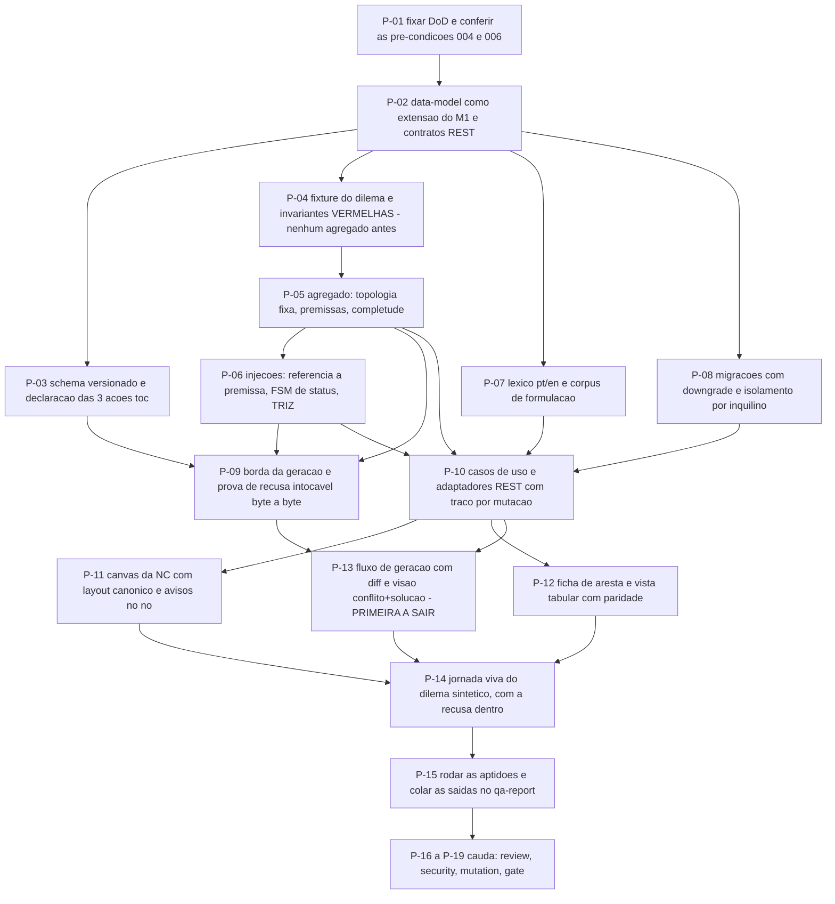

# AT 007 — Árvore de Transição da Nuvem de Conflito

> Siglas deste documento: **AT** — Árvore de Transição · **APR** — Árvore de
> Pré-Requisitos · **OI** — Objetivo Intermediário · **ARF** — Árvore da Realidade
> Futura · **NC** — Nuvem de Conflito · **ARA** — Árvore da Realidade Atual · **UDE** —
> Efeito Indesejável · **TOC** — Teoria das Restrições · **TRIZ** — Teoria da Resolução
> Inventiva de Problemas · **ADR** — Architecture Decision Record (Registro de Decisão
> Arquitetural) · **FSM** — máquina de estados finitos · **IA** — inteligência
> artificial · **SDK** — Software Development Kit (kit de desenvolvimento) · **TDD** —
> Test-Driven Development (desenvolvimento guiado por teste) · **DoD** — Definition of
> Done (Definição de Pronto) · **OTel** — OpenTelemetry · **JSON** — JavaScript Object
> Notation · **i18n** — internacionalização.

- **Spec**: `specs/007-nuvem-de-conflito/spec.md` · **Ciclo**: 007 (planejado) ·
  **Data desta árvore**: 2026-09-05
- **Fonte dos passos**: `specs/007-nuvem-de-conflito/tasks.md` — T-01 a T-15 mais a
  cauda. A AT **não inventa passo**; onde divergirem, o `tasks.md` manda.
- **A ordem que este ciclo não pode inverter**: os testes de invariante (P-04) nascem
  **antes** do agregado. É a frase literal do `tasks.md` — "Nenhum agregado antes disto."

## Os passos

| Passo | Tarefa | Necessidade (por que este passo, agora) | Ação | Resultado esperado (verificável) |
|---|---|---|---|---|
| **P-01** | T-01 | O roadmap exige **dois** ciclos promovidos — 004 e 006 —, e o segundo é o que a constituição impede de simular; abrir sem conferir seria descobrir no meio | Fixar as 16 linhas da DoD com comando e valor esperado; conferir as pré-condições do roadmap e colar no `qa-report.md` | Cada linha tem comando; nenhum critério subjetivo; as quatro pré-condições da tabela do `qa-report.md` preenchidas com evidência |
| **P-02** | T-02 | A NC **estende** o M1 por composição e **não** reusa o grafo livre por dentro; modelar sem escrever essa diferença produziria entidade duplicada ou invariante fingida | Consolidar `data-model.md` (nuvem de topologia fixa, entidade, aresta, premissa, injeção, costuras, eventos) e a extensão REST | Todo agregado e evento da spec aparece no documento; nenhuma entidade sem invariante escrita; campos de costura anuláveis e **sem regra** |
| **P-03** | T-03 | O schema é a peça que substitui o parser por expressão regular — e ele precisa existir **antes** da borda que o usa, ou a borda define o schema pelo que conseguir | Escrever `contracts/resultado-geracao.schema.json` versionado e declarar as 3 ações `toc.*` com classe de risco e o que nasce proposta | O schema cobre 5 entidades, racional, premissas pelas 7 chaves e injeções por premissa; `grep -c "toc\." contracts/acoes-catalogo.md` ≥ 3; nenhuma rota fora da FSM do 006 |
| **P-04** | T-04 | **O passo que define o ciclo.** Escrever o agregado antes das invariantes produz invariante feita para caber no agregado — e a DoD 2 mede exatamente o contrário | Escrever a fixture do dilema sintético da "Instituição Horizonte" e os testes vermelhos: criação atômica, recusa de criar/excluir entidade ou aresta, injeção sem premissa recusada | DoD 2 e 3 **vermelhos pelo motivo certo** (agregado inexistente), com a contagem de casos na saída; zero dado real de pessoa (ADR 0006) |
| **P-05** | T-05 | Só agora o agregado pode nascer, e nasce contra testes que não o conhecem | Domínio da nuvem: topologia fixa, edição de entidade e racional, premissas ordenadas com estado, arquivamento propagando às injeções com contagem, completude por função pura | DoD 1 e 2 verdes; a leitura por extenso das **4** classes de aresta (necessidade, pré-requisito, perigo, conflito) coberta por teste |
| **P-06** | T-06 | Injeção é onde o defeito da linhagem mora: lá a solução era campo pareado por posição, sem referência e sem escolha | Injeções com referência obrigatória a premissa, FSM `candidata → escolhida \| descartada` com retorno justificado, classificação TRIZ e cobertura das 5 separações para D↯D′ | DoD 3 e 4 verdes; teste prova que arquivar uma premissa arquiva as injeções ligadas **e nenhuma outra** |
| **P-07** | T-07 | O aviso de formulação não tem precedente medido (lacuna L-04): sem corpus antes, a heurística vira opinião com aparência de regra | Léxico pt/en como dado versionado e corpus sintético de entidades bem e mal formuladas, com adversariais e `indeterminado` honesto | DoD 8 — a saída diz **quantos casos bons e maus** examinou (regra R2); aviso nunca bloqueia gravação |
| **P-08** | T-08 | Esquema novo sem descida testada é dívida de banco disfarçada de entrega — e as costuras entram aqui como colunas anuláveis | Migrações Alembic (nuvem, premissa, injeção, referências) com `upgrade` **e** `downgrade` testados; repositórios mantendo o isolamento por inquilino | Ciclo de subida e descida sem resíduo, saída colada; o teste de isolamento do 004 verde sobre as tabelas novas |
| **P-09** | T-09 | A prova central deste ciclo é **negativa** e roda antes de a integração existir: recusar não pode custar nada | Borda da geração: validador de schema no servidor com falha fechada, roteamento completa × granular, integração com a FSM do 006, e o teste que serializa, recusa e compara byte a byte | DoD 5, 6 e 13 verdes; DoD 7 com o grep colado (nenhum parse de markdown no caminho); capability ausente esconde as 3 mutadoras |
| **P-10** | T-10 | Regra pura que nenhum caso de uso alcança não chega a ninguém; e o P5 exige traço nascendo **com** a funcionalidade, não depois | Casos de uso e adaptadores REST com traço por mutação — mutação vinda de proposta aceita carrega o identificador da proposta — e autorização em falha fechada | DoD 11 — o teste falha se `PremissaRegistrada`, `InjecaoRegistrada` ou `GeracaoAplicada` não emitirem traço |
| **P-11** | T-11 | Na NC o usuário edita **texto**, não arruma caixas: layout canônico fixo é requisito de método, não preferência visual | Canvas da NC: posições fixas, notação das arestas (perigo tracejado **com rótulo**, conflito com raio), edição direta, avisos no nó, progresso de completude no cabeçalho | Teste de fluxo de edição direta; o aviso some quando o texto vira forma canônica; nenhum literal de interface fora do dicionário |
| **P-12** | T-12 | Sessão de grupo flui na tabela e revisão flui no diagrama: entregar só um dos dois repetiria o corte errado que a vista tabular do M1 já corrigiu | Ficha de aresta (leitura por extenso, premissas com estado, injeções agrupadas por premissa) e vista tabular com paridade de edição | Teste de fluxo feliz e de arquivamento **com aviso quantificado**; paridade tabela × diagrama coberta |
| **P-13** | T-13 | Aqui o defeito medido da 4ª geração vira caso de teste: as duas arestas centrais do método nunca tiveram solução renderizada | Fluxo de geração com diff na bandeja do 006 (aceitar e recusar com mesmo peso) e visão conflito+solução espelhada com foco cruzado | DoD 9 — as **7** posições renderizadas, `D_C` e `D_D_PRIME` inclusive; identificadores de tela (`toc.nc_canvas`, `toc.nc_aresta`, `toc.nc_solucao`, `toc.nc_tabela`) registrados com `ai_visible` campo a campo |
| **P-14** | T-14 | Jornada sem captura do build real é ficção — e nesta ferramenta o momento de confiança é a **recusa**, que precisa aparecer na jornada | Jornada viva do dilema sintético de ponta a ponta: narrativa → proposta → recusa → nova proposta → aceite → premissa desafiada → injeções TRIZ → injeção escolhida | DoD 14 — script em `docs/jornadas/scripts/`, capturas geradas do build, grep negativo de nome real de pessoa |
| **P-15** | T-15 | Caixa marcada não é testemunha | Rodar as aptidões e preencher o `qa-report.md` com saída colada (R1) e quanto cada portão examinou (R2); atualizar o CHANGELOG | `scripts/check-conformance.sh 007` código 0; nenhuma célula do `qa-report.md` preenchida sem comando executado |
| **P-16** | `TAIL:review` | O roadmap nomeia **dois** portões para este ciclo, e nenhum deles é verificável por leitura sozinha | Revisão independente em contexto fresco: invariantes da nuvem por teste de domínio **e** recusar deixa o projeto intacto, verificados por leitura e por execução | Achados registrados no `qa-report.md` |
| **P-17** | `TAIL:security` | A classe de risco aqui é herdada e nomeada: prompt e chave no cliente, e validação de schema só no navegador | Passe de segurança: nenhum SDK, chave ou prompt no produto; schema validado no servidor; autorização em falha fechada; narrativa colada como camada não-confiável no snapshot | DoD 12 com o grep colado; resultado por item no `qa-report.md` |
| **P-18** | `TAIL:mutation` | As invariantes da topologia, a referência injeção → premissa, a FSM de status e o validador de schema são as funções cuja falha **silenciosa** corrompe a nuvem | Testes de mutação sobre as quatro | Taxa e sobreviventes no `qa-report.md` |
| **P-19** | `TAIL:gate` | Quem executou não aprova o que executou — e há cinco `[DÚVIDA]` que só o Product Steward responde | Apresentar as 16 linhas da DoD, as respostas do Clarify e a cauda | Decisão de merge registrada |

## O corte de apetite, escrito antes de precisar dele

O round 007 declara: **sai primeiro** a visão conflito+solução (fica a lista de injeções
sobre o diagrama do conflito); **depois** a regeneração granular (fica só a geração
completa); e **nunca saem** as premissas por aresta — nuvem sem premissa explícita é
desenho de opinião. Na AT isso significa que os passos cortáveis são, nesta ordem, a
metade de **P-13** que desenha a visão espelhada, e a parte de **P-09** que roteia as
ações granulares. **P-04, P-05 e P-06 não são cortáveis** — sem eles o ciclo entregaria
a mesma nuvem que a 4ª geração já entregava, e a razão de refazê-la desaparece.

Uma nota sobre a ordem: se o ciclo 006 escorregar, o corte **não** é o mesmo. A parte
independente do catálogo (P-04 a P-08, P-11, P-12) segue inteira, porque RF-28 exige que
E3.1, E3.2 e E3.4 funcionem com o catálogo ausente — o que sai é o ramo P-03/P-09/P-13
inteiro, e o ciclo entrega a NC manual completa.

## O grafo

## O que esta árvore não decide

- **Se o ciclo abre** — depende dos ciclos 004 e 006 promovidos e dos cinco `[DÚVIDA]`
  respondidos; são obstáculos da APR (`apr.md`).
- **A multiplicidade de premissas e a granularidade da proposta** — são decisão do gate;
  a AT executa o que voltar de lá.
- **O que se ganha quando a nuvem passar a funcionar sozinha** — é da ARF (`arf.md`).
