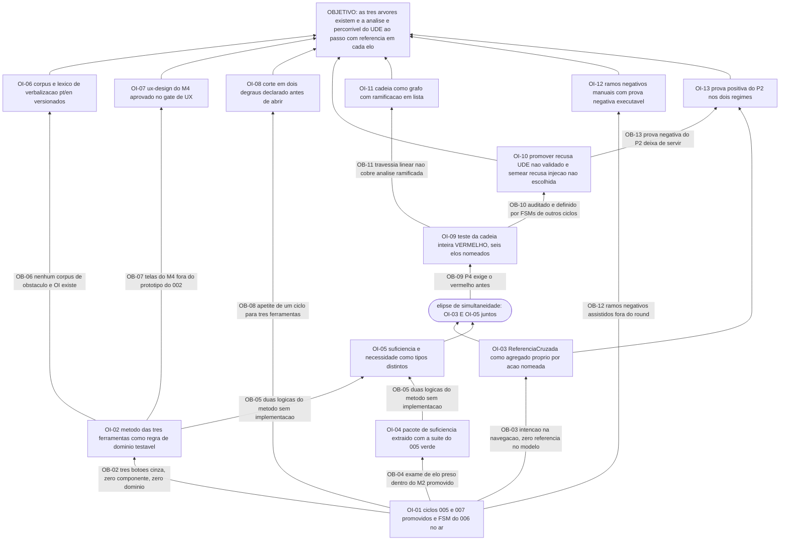

# APR 008 — Árvore de Pré-Requisitos das Árvores de Futuro e Implementação

> Siglas deste documento: **APR** — Árvore de Pré-Requisitos · **OI** — Objetivo
> Intermediário · **ARF** — Árvore da Realidade Futura · **AT** — Árvore de Transição ·
> **ARA** — Árvore da Realidade Atual · **NC** — Nuvem de Conflito · **UDE** — Efeito
> Indesejável · **ED** — Efeito Desejável · **TOC** — Teoria das Restrições · **ADR** —
> Architecture Decision Record (Registro de Decisão Arquitetural) · **FSM** — máquina de
> estados finitos · **IA** — inteligência artificial · **TDD** — Test-Driven Development
> (desenvolvimento guiado por teste) · **DoD** — Definition of Done (Definição de
> Pronto) · **UX** — experiência de usuário · **OTel** — OpenTelemetry.

- **Spec**: `specs/008-arvores-de-futuro-e-implementacao/spec.md` · **Ciclo**: 008
  (planejado) · **Data desta árvore**: 2026-09-05
- **Lógica**: condição **necessária**. Lê-se de baixo para cima.
- **Objetivo**: **ARF, APR e AT existem como ferramentas completas, e a análise é
  percorrível do UDE validado ao passo de transição, com a referência de origem provada
  em cada elo.**

> **Nota sobre este documento.** É a árvore de pré-requisitos do ciclo que entrega a
> ferramenta "árvore de pré-requisitos". Os obstáculos abaixo obedecem à própria régua
> que o módulo vai implementar (RF-20): condição presente, não tarefa disfarçada, não
> previsão futura.

## Obstáculos e objetivos intermediários

| # | Obstáculo (condição atual que bloqueia) | Evidência | OI que o supera | Depende de |
|---|---|---|---|---|
| **OB-01** | Os ciclos 005 e 007 não estão promovidos e a FSM do 006 não está no ar: o encadeamento parte do UDE `Validado` de um e da injeção `escolhida` do outro, e as quatro ações executam pela terceira | `docs/roadmap.md` § "O que o ciclo 008 não pode começar sem": "Os ciclos 005 e 007 promovidos (o encadeamento parte do que eles produzem)" | **OI-01**: os ciclos 005 e 007 estão promovidos, a FSM do 006 responde, e o M4 consome as três peças sem reimplementar nenhuma | nenhum |
| **OB-02** | As três ferramentas existem na linhagem **apenas como item desabilitado de menu**: `disabled: true` nas linhas 55, 56 e 57 de `Sidebar.tsx`, zero componentes, zero prompts e zero linhas de domínio — não há de onde copiar nada | saídas coladas abaixo: `grep -n "disabled: true"` → 3 linhas para ARF/APR/AT; `ls components/ \| grep -icE "arf\|apr\|prereq\|future\|transition"` → **0**; as 3 ocorrências de `ARF` em `constants.ts` são listas de permissão; grep de domínio da APR → **0**. Defeito **D-04**, lacuna **L-01** (risco **médio**) | **OI-02**: o método das três ferramentas está transcrito da fonte técnica para regra de domínio testável — o decidível como regra de negócio com teste, o julgamento declarado julgamento com autor e data (RN-07) | OI-01 |
| **OB-03** | A intenção de encadear foi declarada **na navegação** e nunca chegou ao modelo: `Sidebar.tsx:86` condiciona ARF, APR e AT a um projeto ARA carregado, e a contagem de referência cruzada no modelo de dados é zero | `sed -n '86,88p' components/Sidebar.tsx` (colado abaixo); `grep -c "araProjectId\|sourceUdeId\|linkedProject\|crossTool" types.ts` → **0**. Defeito **D-11** | **OI-03**: a ReferenciaCruzada existe como **agregado próprio**, fora dos projetos, com tipo, origem e destino tipados, criada somente por ação nomeada com evento | OI-01 |
| **OB-04** | O exame de elo e o conector E vivem **dentro do M2 promovido**, e a ARF precisa dos dois: copiá-los criaria a segunda régua de suficiência no mesmo produto | lacuna **L-04** da spec, risco **médio**; `plan.md` § Decisão 1 e § Riscos, linha GATE-extracao | **OI-04**: o pacote de suficiência causal está extraído para módulo de domínio compartilhado, importado por ARA e ARF, **com a suíte do ciclo 005 verde** | OI-01 |
| **OB-05** | As duas lógicas do método — causa **suficiente** na ARF, condição **necessária** na APR — não têm implementação nenhuma para herdar, e misturá-las é o erro clássico de quem aprende TOC por analogia | fonte F-09 da spec (skill `toc-prt`, `prt-methodology.md` l.21: "Lógica usada: Condição Necessária … Diferente das árvores de Realidade Atual e Futura, que usam lógica de causa suficiente") | **OI-05**: suficiência e necessidade são **tipos de domínio distintos** — o domínio não oferece exame de suficiência em projeto `apr`, e nenhuma interface consegue misturá-los | OI-02, OI-04 |
| **OB-06** | Não existe corpus algum de obstáculos e OIs bem e mal verbalizados, e a régua da fonte técnica é **parcialmente indecidível**: "condição presente, não tarefa nem previsão" é reconhecível por léxico só em parte | lacuna **L-02** da spec, risco **baixo**; `prt-methodology.md` l.36-42 (armadilhas de verbalização) e l.53-60 (IO × tarefa) | **OI-06**: existe corpus sintético versionado pt/en de obstáculos e OIs bons e maus, o léxico é dado por idioma, e `indeterminado` é veredito honesto — com a contagem de casos na saída (regra R2) | OI-02 |
| **OB-07** | As telas deste módulo **não estão no protótipo do ciclo 002**, que cobriu M1–M3: canvas ARF/APR/AT, painel de ramos, tabela resumo e vista da cadeia não têm papel semântico desenhado | `plan.md` § Artefatos: `ART:ux-design=yes` — "**Diferença para M2/M3**: as telas do M4 não estavam no protótipo do ciclo 002" | **OI-07**: o `ux-design.md` do M4 existe com papel semântico antes do componente, aprovado no gate de UX, cobrindo a leitura de baixo para cima da APR e a notação da elipse | OI-02 |
| **OB-08** | O apetite é de **um ciclo** e o escopo é três ferramentas novas mais o encadeamento mais uma extração sobre código promovido — a maior aposta do roadmap depois do 003 | lacuna **L-03** da spec, risco declarado **alto** — o único "alto" das seis specs deste lote; `docs/produto/rounds.md`, round 008, § corte | **OI-08**: o corte está declarado **antes** de abrir, em dois degraus: sai primeiro a AT com as derivações OI → AT, depois as quatro ações assistidas; o encadeamento **nunca** sai | OI-01 |
| **OB-09** | O princípio P4 exige o teste vermelho antes, e o teste que define este ciclo — a travessia da cadeia inteira — não existe: sem ele o encadeamento nasceria provado por navegação de tela | `tasks.md` T-05: "**Nenhuma operação de encadeamento antes disto.**"; DoD 1 exige que a saída nomeie os 6 elos | **OI-09**: o teste da cadeia inteira existe e falha **pelo motivo certo** (operações de encadeamento inexistentes), com os seis elos nomeados na saída e zero dado real de pessoa | OI-03, OI-05 |
| **OB-10** | A definição de "material auditado" mora em **outros ciclos**: `Validado` é FSM do M2 e `escolhida` é FSM do M3 — afrouxar qualquer uma delas aqui faria a cadeia nascer sobre rascunho | RN-13 da spec; `plan.md` § Decisão 5: "as FSMs dos ciclos 005 e 007 são os portões de qualidade do encadeamento — o M4 os consome, não os reimplementa nem os afrouxa" | **OI-10**: promover recusa UDE fora de `Validado` e semear recusa injeção fora de `escolhida`, com os dois casos de recusa **mostrados na saída** (DoD 3) | OI-09 |
| **OB-11** | A travessia assumida é **linear**, e uma análise real ramifica: uma NC com duas injeções escolhidas semeia duas ARFs | lacuna **L-05** da spec, risco **baixo**; `plan.md` § Riscos, linha GATE-cadeia-linear | **OI-11**: a vista da cadeia é grafo percorrido a partir do elemento de entrada com ramificações **em lista no elo**, e a jornada viva inclui deliberadamente o caso de duas ARFs semeadas | OI-09 |
| **OB-12** | O tratamento assistido de ramos negativos está **fora** do round, e a decisão precisa estar registrada **antes** de abrir — sem isso, a marcação manual pareceria omissão em vez de escolha | `docs/roadmap.md` § "O que o ciclo 008 não pode começar sem": "Decisão registrada sobre o corte de ramos negativos da ARF (fica manual nesta v1)" | **OI-12**: a decisão de ramos negativos manuais está registrada, e a prova é **negativa e executável**: `grep -rn "suggest_negative\|negative_branch" backend/src/ frontend/src/ \| wc -l` = 0 (DoD 8) | OI-01 |
| **OB-13** | Até este ciclo o P2 foi provado **negativamente** ("nenhuma rota de execução de ação de IA"); aqui as quatro ações **executam**, e a prova negativa deixa de servir | `plan.md` § Constitution Check, ressalva: "este é o primeiro ciclo em que ações de IA **executam** … o P2 deixa de ser prova negativa e passa a ser prova positiva" | **OI-13**: a prova positiva existe e está separada em dois lados — DoD 10 (mutação direta recusada em falha fechada) e DoD 13 (traço com o identificador da referência) —, com `TAIL:security` conferindo os dois regimes em contexto fresco | OI-03, OI-10 |

## Sequenciamento

A base é única — **OI-01**, os três ciclos anteriores no ar — e dela saem quatro ramos
que correm em paralelo por construção (é a decisão V do Constitution Check: ARF, APR e
AT são tipos de projeto independentes entre si):

- **ramo do método** (OI-02 → OI-05, OI-06, OI-07): o que a linhagem não deixou;
- **ramo da suficiência** (OI-04): a extração, isolada e com rede própria;
- **ramo do encadeamento** (OI-03 → OI-09 → OI-10, OI-11, OI-13): o que nunca sai;
- **ramo do apetite** (OI-08) e **do escopo declarado** (OI-12): decisões, não código.

O caminho crítico é o do encadeamento, e ele é literal quanto ao P4:

> OI-03 (a referência como agregado) → OI-09 (**o teste da cadeia falha primeiro**) →
> OI-10 (as recusas sobre material não auditado) → só então as operações de promover,
> semear e derivar.

O `tasks.md` diz a mesma coisa em cinco palavras — "**Nenhuma operação de encadeamento
antes disto.**" — e é onde este ciclo mais facilmente se trai: implementar a promoção
antes do teste da cadeia produz um teste que percorre o que a promoção faz, em vez de
provar o que o método exige.

Há uma **elipse de simultaneidade** — no sentido literal da ferramenta que este ciclo
implementa (RF-19): **OI-09 exige OI-03 e OI-05 ao mesmo tempo**. O teste da cadeia não
pode ser escrito sem a referência cruzada tipada (senão não há o que provar em cada elo)
**nem** sem a separação suficiência × necessidade (senão a ARF e a APR são o mesmo
projeto com nomes diferentes). É a única conjunção obrigatória da árvore, e por isso
está desenhada como tal.

**OI-08 não bloqueia nada e governa tudo**: é a decisão de corte, e ela existe para ser
usada no meio do ciclo sem replanejamento — cortar ramo, não desfiar o resto.

## O grafo



## Evidência — as saídas que ancoram os obstáculos

```
$ cd /home/user/tocbuilderv3 && grep -n "disabled: true" components/Sidebar.tsx
55:    { id: 'arf', label: t('sidebar.nav.arf'), icon: <FutureTreeIcon />, view: 'ARF', disabled: true },
56:    { id: 'apr', label: t('sidebar.nav.apr'), icon: <PrereqIcon />, view: 'APR', disabled: true },
57:    { id: 'at', label: t('sidebar.nav.at'), icon: <TransitionIcon />, view: 'AT', disabled: true },
58:    { id: 'snt', label: t('sidebar.nav.snt'), icon: <SnTIcon />, view: 'SNT_TREE', disabled: true },

$ cd /home/user/tocbuilderv3 && ls components/ | grep -icE "arf|apr|prereq|future|transition"
0

$ cd /home/user/tocbuilderv3 && grep -n "ARF" constants.ts
417:    permissions: ['ARA', 'SNT_TREE', 'NC', 'ARF', 'APR', 'AT'],
422:    permissions: ['ARA', 'SNT_TREE', 'NC', 'ARF', 'APR', 'AT', 'USER_ADMIN'],
427:    permissions: ['ARA', 'SNT_TREE', 'NC', 'ARF', 'APR', 'AT', 'USER_ADMIN', 'PROMPT_ADMIN'],

$ cd /home/user/tocbuilderv3 && grep -rniE "obstác|obstacle|objetivo intermediário|intermediate objective|negative branch|ramo negativo" --include="*.ts" --include="*.tsx" . | grep -v node_modules | wc -l
0

$ cd /home/user/tocbuilderv3 && sed -n '86,88p' components/Sidebar.tsx
          const araProjectDependentViews: TocTool[] = ['ARF', 'APR', 'AT'];
          if (item.view && araProjectDependentViews.includes(item.view)) {
            itemIsDisabled = itemIsDisabled || !isProjectLoaded;

$ cd /home/user/tocbuilderv3 && grep -c "araProjectId\|sourceUdeId\|linkedProject\|crossTool" types.ts
0
```

## O que esta árvore não decide

- **As cinco `[DÚVIDA]` do Clarify** — re-semeadura, promoção a partir de várias ARAs,
  AT autônoma, quem aceita ramo negativo e o texto do objetivo derivado são do gate
  humano; três delas mudam invariante e por isso precedem a implementação.
- **Qual ramo cai se o apetite estourar** — o corte está declarado (OI-08), mas acioná-lo
  é decisão de meio de ciclo, com o `plan.md` como régua.
- **A ordem operacional dos passos** — é da AT (`at.md`).
- **O que se ganha quando as três ferramentas existirem** — é da ARF (`arf.md`).
