# ARF 008 — Árvore da Realidade Futura das Árvores de Futuro e Implementação

> Siglas deste documento: **ARF** — Árvore da Realidade Futura · **APR** — Árvore de
> Pré-Requisitos · **AT** — Árvore de Transição · **ARA** — Árvore da Realidade Atual ·
> **NC** — Nuvem de Conflito · **UDE** — Efeito Indesejável (*Undesirable Effect*) ·
> **ED** — Efeito Desejável · **OI** — Objetivo Intermediário · **TOC** — Teoria das
> Restrições · **ADR** — Architecture Decision Record (Registro de Decisão
> Arquitetural) · **FSM** — máquina de estados finitos · **IA** — inteligência
> artificial · **SDK** — Software Development Kit (kit de desenvolvimento) · **TDD** —
> Test-Driven Development (desenvolvimento guiado por teste) · **DoD** — Definition of
> Done (Definição de Pronto) · **OTel** — OpenTelemetry · **UX** — experiência de
> usuário · **i18n** — internacionalização.

- **Spec**: `specs/008-arvores-de-futuro-e-implementacao/spec.md` · **Ciclo**: 008
  (planejado) · **Data desta árvore**: 2026-09-05
- **Lógica**: causa **suficiente**. Lê-se de baixo para cima.
- **Round correspondente**: `docs/produto/rounds.md`, round 008.

> **Nota sobre este documento.** É a árvore de futuro do ciclo que entrega a ferramenta
> "árvore de futuro". A recursão não é piada: é o produto comendo a própria comida antes
> de existir, e o teste mais honesto do método é ele resistir a ser aplicado a si mesmo.

## A injeção — o que a spec entrega

| # | Injeção | O que a spec diz |
|---|---|---|
| **I-01** | **As três ferramentas nascem como tipos de projeto sobre o núcleo M1**, com papéis de nó tipados e função pura própria — não como item de menu | RF-01, RF-14, RF-28 |
| **I-02** | **A referência cruzada é agregado próprio, fora dos projetos**, com tipo, origem e destino tipados, criada **somente** por ação nomeada com evento | RF-33, RN-11, `plan.md` § Decisão 3 |
| **I-03** | **Suficiência e necessidade são tipos de domínio distintos**, não bandeiras de interface: o domínio simplesmente não oferece a operação errada no tipo de projeto errado | RF-16, RN-01, RN-05, `plan.md` § Decisão 2 |
| **I-04** | **O pacote de suficiência causal é extraído do M2 e compartilhado** — uma definição de exame de elo e conector E, dois consumidores (ARA e ARF) | RF-03, `plan.md` § Decisão 1 |
| **I-05** | **A cadeia só avança sobre material auditado**: promover exige UDE `Validado`, semear exige injeção `escolhida` — as FSMs dos ciclos 005 e 007 são portões, não sugestões | RF-37, RF-38, RN-13 |
| **I-06** | **Exclusão suave suspende a referência, nunca a apaga**: qualquer ponta excluída torna o elo `pendente` e a restauração o reativa | RF-35, RN-12, RNF-09 |
| **I-07** | **A verbalização de obstáculo e de OI é heurística pura que avisa e nunca veta**, com o trecho apontado e `indeterminado` honesto | RF-20, RF-21, RN-08 |
| **I-08** | **As quatro ações `toc.suggest_*` executam pela FSM do 006** — este é o primeiro ciclo em que assistência de modelo muta de verdade, e cada sugestão nasce `action_proposal` individual | RF-43, RF-44, RF-45, INT-05..INT-08 |

## Os efeitos desejáveis

| # | Efeito desejável | Decorre de | Hoje é falso porque (evidência) |
|---|---|---|---|
| **ED-01** | **As três ferramentas passam a existir.** ARF, APR e AT deixam de ser promessa de menu e viram domínio, tela, teste e exportação | I-01 | Em quatro gerações elas nunca saíram do cinza: `grep -n "disabled: true" components/Sidebar.tsx` devolve as linhas **55, 56, 57** (ARF, APR, AT) — e a 58, que é a S&T. Zero componentes (`ls components/ \| grep -icE "arf\|apr\|prereq\|future\|transition"` → **0**), zero prompts (as **3** ocorrências de `ARF` em `constants.ts` são listas de permissão de perfil — linhas 417, 422, 427) e zero domínio (grep por obstáculo, objetivo intermediário e ramo negativo em toda a árvore `.ts`/`.tsx` → **0**). Saídas coladas abaixo. É o defeito **D-04** |
| **ED-02** | **A análise deixa de ser um conjunto de ilhas**: cada elemento sabe de onde veio e o que gerou, e a travessia do sintoma ao passo é computável | I-02 | A contagem de referência cruzada no modelo da 4ª geração é literalmente zero: `grep -c "araProjectId\|sourceUdeId\|linkedProject\|crossTool" types.ts` → **0** (colado abaixo). É o defeito **D-11**, e é o que faz este módulo valer o ciclo |
| **ED-03** | **A intenção declarada na navegação chega ao dado.** O que a linhagem escreveu na barra lateral passa a ter contrapartida no modelo | I-02, I-05 | A linhagem **declarou** o encadeamento e parou ali: `Sidebar.tsx:86` define `araProjectDependentViews: TocTool[] = ['ARF', 'APR', 'AT'];` e desabilita as três sem projeto carregado (linhas coladas abaixo) — intenção na interface, nada no modelo |
| **ED-04** | **A régua de "isto é obstáculo" deixa de ser opinião de quem facilita**: o que é decidível vira função, e o que é julgamento fica declarado julgamento com autor e data | I-07 | Não há precedente: o domínio da APR e do ramo negativo tem **0** ocorrências na linhagem inteira (saída colada). Hoje a distinção obstáculo × tarefa × previsão só existe na cabeça de quem conduz a sala |
| **ED-05** | **ARA e ARF passam a compartilhar a mesma definição de suficiência** — não existem duas réguas para "se… então…" no mesmo produto | I-04 | O exame de elo e o conector E nascem dentro do M2 (ciclo 005); sem extração, a ARF os copiaria — e duas cópias divergem, que é o defeito **ED-04 da ARF do ciclo 005** repetido um andar acima |
| **ED-06** | **O plano de implementação nasce sequenciado**, com camadas, ramos paralelos e elipses de simultaneidade — e a dependência circular é apontada como **bloqueio**, ao contrário da ARA, onde ciclo é legítimo | I-03 | A distinção é do método (condição necessária × causa suficiente) e não tem nenhuma implementação na linhagem para herdar. Hoje o "plano" que sai de uma oficina é uma lista |
| **ED-07** | **A AT deixa de degradar para lista de tarefas**: cada passo carrega a tripla ação · necessidade · resultado esperado, e a divergência entre esperado e real é preservada em evento | I-01 | RN-10 e RF-30 são desenho novo. Na linhagem a AT é o terceiro botão cinza — não há nem campo, nem status, nem noção de resultado esperado |
| **ED-08** | **A assistência passa de contrato a execução governada**: até aqui o P2 era prova negativa ("nenhuma rota de execução"); a partir daqui é prova positiva — mutação direta recusada, aceite criando com traço correlacionado | I-08 | É a virada que o próprio `plan.md` declara como ressalva honesta: "este é o primeiro ciclo em que ações de IA **executam**". Antes dele, o catálogo do M2 era declaração sem cliente executando |
| **ED-09** | **O produto come a própria comida**: uma análise sintética atravessa as cinco ferramentas de ponta a ponta e a travessia é capturada do build real | I-02, I-05, I-06 | A jornada que prova o valor central do produto não existe em nenhuma geração — porque metade das ferramentas que ela atravessa nunca existiu (ED-01) |

## Ramos negativos — o que pode piorar, e a poda

| # | Ramo negativo | Poda declarada |
|---|---|---|
| **RNEG-01** | O apetite estoura e o ciclo entrega **três ferramentas rasas** em vez de duas boas — a pior troca possível, porque ferramenta rasa ensina o método errado | Lacuna **L-03**, e é o **único risco declarado "alto"** neste lote de specs. A poda é o corte em dois degraus, escrito antes de abrir: sai primeiro a AT (com as derivações OI → AT), depois as quatro ações assistidas; **nunca sai o encadeamento**, porque sem ele o round entrega o próprio D-11 com três ferramentas a mais |
| **RNEG-02** | A extração do pacote de suficiência **quebra o M2 já promovido**, e o ciclo 008 derruba o 005 | Lacuna **L-04**, risco **médio**. A rede é a suíte do ciclo 005 continuando verde — e ela é critério de aceite da **T-03**, não do fim do ciclo, isto é: a extração não avança se o 005 ficar vermelho. Plano B declarado: a ARF duplica temporariamente com dívida em ADR datado |
| **RNEG-03** | Sem precedente nenhum, o módulo implementa o método **errado** — e um produto que ensina TOC errado é pior que um botão cinza, porque parece certo | Lacuna **L-01**, risco **médio**. A poda tem três camadas: a fonte técnica é citada por linha (a skill `toc-prt` e o `prt-methodology.md`, com Dettmer cap. 7 e Scheinkopf cap. 10 como autoridades); o que é decidível vira regra de negócio com teste; o que é julgamento **fica declarado julgamento** (RN-07: o teste de validade do par é parecer com autor, nunca campo calculado). A jornada viva completa é o teste de suficiência prática antes do gate |
| **RNEG-04** | A referência cruzada vira **acoplamento**: projetos que não se conseguem mais apagar, ou elos que apontam para o vazio | RN-12 e RNF-09 são a poda estrutural: exclusão suave **suspende** (`pendente`) e restauração **reativa**; apagar referência é ação própria com evento. E a garantia é testada por propriedade — qualquer sequência de exclusões e restaurações termina com toda referência `ativa` ou `pendente`, nunca apontando para elemento inexistente sem estado que o diga |
| **RNEG-05** | A vista da cadeia assume travessia **linear** e uma análise real ramifica — uma NC com duas injeções escolhidas semeia duas ARFs, e a tela mente sobre a estrutura | Lacuna **L-05**, risco **baixo**: a v1 é grafo percorrido a partir do elemento de entrada, com ramificações **em lista no elo**, sem layout de grafo novo. A poda é de medição: a jornada viva **inclui deliberadamente** o caso de duas ARFs semeadas, para a dor aparecer antes do investimento em layout |
| **RNEG-06** | A linha entre **manipulação direta** e **proposta** borra na implementação: promover, semear e derivar aplicam na hora; as sugestões do modelo nascem proposta. Confundi-las quebra o P2 no ciclo em que ele deixa de ser prova negativa | A política é declarada **por tipo de ação**, nunca por origem alegada pelo cliente (constituição, item 8). E as duas provas são separadas: a DoD 10 prova o lado da proposta (mutação direta recusada em falha fechada) e a DoD 13 prova o lado direto (traço com o identificador da referência). `TAIL:security` confere **os dois regimes** em contexto fresco |
| **RNEG-07** | A verbalização avaliada vira veto e a sessão de "sim, mas…" trava na gramática — o levantamento em grupo morre na primeira correção de estilo | RN-08 é explícita: o registro **procede** e o aviso persiste até o texto mudar. A diferença para o M2 é deliberada e está no `plan.md` (decisão 6): lá o veredito compõe status, aqui é orientação. O corpus sintético vem **antes** do código (T-07) e `indeterminado` honesto é herdado do M2 |

## O grafo

```mermaid
graph BT
  I01["I-01 tres tipos de projeto sobre o nucleo M1 com papeis tipados"]
  I02["I-02 referencia cruzada como agregado proprio criado por acao nomeada"]
  I03["I-03 suficiencia e necessidade como tipos, nao flags"]
  I04["I-04 pacote de suficiencia causal extraido e compartilhado"]
  I05["I-05 a cadeia so avanca sobre material auditado"]
  I06["I-06 exclusao suave suspende a referencia, nunca apaga"]
  I07["I-07 verbalizacao avisa e nunca veta"]
  I08["I-08 as quatro acoes toc.suggest executam pela FSM do 006"]

  ED01["ED-01 as tres ferramentas passam a existir"]
  ED02["ED-02 a analise deixa de ser um conjunto de ilhas"]
  ED03["ED-03 a intencao da navegacao chega ao dado"]
  ED04["ED-04 a regua de obstaculo deixa de ser opiniao"]
  ED05["ED-05 ARA e ARF compartilham uma definicao de suficiencia"]
  ED06["ED-06 o plano nasce sequenciado e o ciclo vira bloqueio"]
  ED07["ED-07 a AT deixa de degradar para lista de tarefas"]
  ED08["ED-08 a assistencia passa de contrato a execucao governada"]
  ED09["ED-09 o produto come a propria comida de ponta a ponta"]

  OBJ["OBJETIVO: as tres arvores prescritivas existem e a analise e percorrivel do sintoma ao passo"]

  I01 --> ED01
  I01 --> ED07
  I02 --> ED02
  I02 --> ED03
  I05 --> ED03
  I07 --> ED04
  I04 --> ED05
  I03 --> ED06
  I08 --> ED08
  I02 --> ED09
  I05 --> ED09
  I06 --> ED09

  ED01 --> OBJ
  ED02 --> OBJ
  ED03 --> OBJ
  ED04 --> OBJ
  ED05 --> OBJ
  ED06 --> OBJ
  ED07 --> OBJ
  ED08 --> OBJ
  ED09 --> OBJ

  RNEG01["RNEG-01 o apetite estoura e entrega tres ferramentas rasas"]
  RNEG02["RNEG-02 a extracao quebra o M2 ja promovido"]
  RNEG03["RNEG-03 sem precedente, o metodo e implementado errado"]
  RNEG04["RNEG-04 a referencia cruzada vira acoplamento"]
  RNEG05["RNEG-05 a vista linear mente sobre analise ramificada"]
  RNEG06["RNEG-06 a linha entre manipulacao direta e proposta borra"]

  P01["PODA corte em dois degraus: sai a AT, depois a assistencia; encadeamento nunca"]
  P02["PODA suite do 005 verde e criterio de aceite da T-03, nao do fim do ciclo"]
  P03["PODA fonte tecnica por linha; decidivel vira RN; julgamento fica julgamento"]
  P04["PODA suspende e reativa, com teste de propriedade RNF-09"]
  P05["PODA ramificacao em lista, e a jornada inclui o caso de duas ARFs"]
  P06["PODA politica por tipo de acao; DoD 10 e DoD 13 provam os dois lados"]

  I01 -.-> RNEG01
  I04 -.-> RNEG02
  I01 -.-> RNEG03
  I02 -.-> RNEG04
  I02 -.-> RNEG05
  I08 -.-> RNEG06
  P01 --> RNEG01
  P02 --> RNEG02
  P03 --> RNEG03
  P04 --> RNEG04
  P05 --> RNEG05
  P06 --> RNEG06
```



## Evidência — os números desta árvore, com o comando executado

```
$ cd /home/user/tocbuilderv3 && grep -n "disabled: true" components/Sidebar.tsx
55:    { id: 'arf', label: t('sidebar.nav.arf'), icon: <FutureTreeIcon />, view: 'ARF', disabled: true },
56:    { id: 'apr', label: t('sidebar.nav.apr'), icon: <PrereqIcon />, view: 'APR', disabled: true },
57:    { id: 'at', label: t('sidebar.nav.at'), icon: <TransitionIcon />, view: 'AT', disabled: true },
58:    { id: 'snt', label: t('sidebar.nav.snt'), icon: <SnTIcon />, view: 'SNT_TREE', disabled: true },

$ cd /home/user/tocbuilderv3 && sed -n '86,88p' components/Sidebar.tsx
          const araProjectDependentViews: TocTool[] = ['ARF', 'APR', 'AT'];
          if (item.view && araProjectDependentViews.includes(item.view)) {
            itemIsDisabled = itemIsDisabled || !isProjectLoaded;

$ cd /home/user/tocbuilderv3 && ls components/ | grep -icE "arf|apr|prereq|future|transition"
0

$ cd /home/user/tocbuilderv3 && grep -n "ARF" constants.ts
417:    permissions: ['ARA', 'SNT_TREE', 'NC', 'ARF', 'APR', 'AT'],
422:    permissions: ['ARA', 'SNT_TREE', 'NC', 'ARF', 'APR', 'AT', 'USER_ADMIN'],
427:    permissions: ['ARA', 'SNT_TREE', 'NC', 'ARF', 'APR', 'AT', 'USER_ADMIN', 'PROMPT_ADMIN'],

$ cd /home/user/tocbuilderv3 && grep -rniE "obstác|obstacle|objetivo intermediário|intermediate objective|negative branch|ramo negativo" --include="*.ts" --include="*.tsx" . | grep -v node_modules | wc -l
0

$ cd /home/user/tocbuilderv3 && grep -c "araProjectId\|sourceUdeId\|linkedProject\|crossTool" types.ts
0

$ cd /home/user/tocbuilderv3 && sed -n '68,70p' locales/pt.ts
      arf: "Árvore Realidade Futura (ARF)",
      apr: "Árvore de Pré-Requisitos (APR)",
      at: "Árvore de Transição (AT)",
```

> **Leitura honesta destes números.** Os três `0` são o retrato do defeito **D-04**, e o
> quarto — o das referências cruzadas — é o **D-11**. Mas o par mais instrutivo é
> `Sidebar.tsx:55-57` com `locales/pt.ts:68-70`: a linhagem **nomeou** as três
> ferramentas em dois idiomas e as manteve desabilitadas por quatro gerações. O
> vocabulário desta spec vem de lá; a implementação não vem de lugar nenhum, e é por
> isso que a lacuna L-01 declara risco **médio** e a L-03 declara risco **alto**.

## O que esta árvore não decide

- **Se o ciclo pode abrir** — depende dos ciclos 005 e 007 promovidos, da FSM do 006 no
  ar e da decisão registrada sobre ramos negativos manuais; são obstáculos da APR
  (`apr.md`).
- **Re-semeadura, promoção multi-ARA, AT autônoma, quem aceita ramo negativo e o texto
  do objetivo derivado** — são as cinco `[DÚVIDA]` do `## Clarify` da spec, matéria do
  gate humano.
- **A ordem operacional dos passos e o que sai primeiro se o apetite estourar** — é da
  AT (`at.md`).
