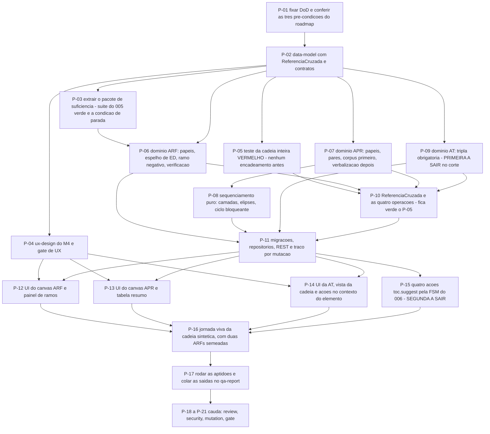

# AT 008 — Árvore de Transição das Árvores de Futuro e Implementação

> Siglas deste documento: **AT** — Árvore de Transição · **APR** — Árvore de
> Pré-Requisitos · **OI** — Objetivo Intermediário · **ARF** — Árvore da Realidade
> Futura · **ARA** — Árvore da Realidade Atual · **NC** — Nuvem de Conflito · **UDE** —
> Efeito Indesejável · **ED** — Efeito Desejável · **TOC** — Teoria das Restrições ·
> **ADR** — Architecture Decision Record (Registro de Decisão Arquitetural) · **FSM** —
> máquina de estados finitos · **IA** — inteligência artificial · **SDK** — Software
> Development Kit (kit de desenvolvimento) · **TDD** — Test-Driven Development
> (desenvolvimento guiado por teste) · **DoD** — Definition of Done (Definição de
> Pronto) · **OTel** — OpenTelemetry · **UX** — experiência de usuário · **i18n** —
> internacionalização · **REST** — Representational State Transfer.

- **Spec**: `specs/008-arvores-de-futuro-e-implementacao/spec.md` · **Ciclo**: 008
  (planejado) · **Data desta árvore**: 2026-09-05
- **Fonte dos passos**: `specs/008-arvores-de-futuro-e-implementacao/tasks.md` — T-01 a
  T-17 mais a cauda. A AT **não inventa passo**; onde divergirem, o `tasks.md` manda.
- **A ordem que este ciclo não pode inverter**: o teste da cadeia inteira (P-05) nasce
  **antes** de existir promoção, semeadura ou derivação. É a frase literal do
  `tasks.md` — "Nenhuma operação de encadeamento antes disto."

> **Nota sobre este documento.** É a árvore de transição do ciclo que entrega a
> ferramenta "árvore de transição" — e por isso cada passo abaixo carrega a tripla que a
> RN-10 vai tornar obrigatória no produto: **necessidade · ação · resultado esperado**.

## Os passos

| Passo | Tarefa | Necessidade (por que este passo, agora) | Ação | Resultado esperado (verificável) |
|---|---|---|---|---|
| **P-01** | T-01 | O roadmap exige **três** pré-condições, e uma delas é uma decisão — ramos negativos manuais — que se esquecida vira omissão em vez de escolha | Fixar as 16 linhas da DoD com comando e valor esperado; conferir ciclos 005 e 007 promovidos, FSM do 006 no ar e a decisão de ramos negativos registrada | Cada linha tem comando; nenhum critério subjetivo; as pré-condições coladas no `qa-report.md` |
| **P-02** | T-02 | Este é o único ciclo do produto que **cria um agregado novo atravessando projetos**; modelar isso depois do código produziria a referência como campo, não como cidadã | Consolidar o `data-model.md` (três tipos de projeto e seus anexos + ReferenciaCruzada + eventos) e os contratos REST e de exportação | Todo agregado e evento da spec aparece no documento; nenhuma entidade sem invariante escrita; o esquema de exportação declara elos `pendente` na importação parcial |
| **P-03** | T-03 | A ARF precisa do exame de elo e do conector E; copiá-los criaria a segunda régua de suficiência do produto — e a extração mexe em código já promovido | Extrair o pacote de suficiência causal do M2 para módulo de domínio compartilhado, importado por ARA e ARF | **A suíte do ciclo 005 continua verde**, com saída colada; `lint-imports` código 0; o grep do nome das classes extraídas aponta **um único** módulo de definição |
| **P-04** | T-04 | As telas do M4 não passaram pelo protótipo do ciclo 002: começar componente sem papel semântico aqui é começar do zero sem saber | Escrever o `ux-design.md` do M4 (canvas ARF/APR/AT, painel de ramos, tabela resumo, vista da cadeia) e passar pelo gate de UX | Toda tela da spec coberta; a leitura de baixo para cima da APR e a notação da elipse desenhadas; gate de UX registrado **antes** de qualquer tarefa de interface |
| **P-05** | T-05 | **O passo que define o ciclo.** Implementar a promoção antes deste teste produz um teste que descreve a promoção, em vez de provar o que o método exige | Escrever **vermelho** o teste de domínio da cadeia inteira com dados sintéticos: UDE → validação → promoção à NC → injeção → escolha → semeadura da ARF → espelho de ED → derivação de obstáculo → par de OI → sequenciamento → derivação da AT → passo concluído | DoD 1 **vermelho pelo motivo certo** (operações inexistentes), com os **6 elos nomeados** na saída; zero dado real de pessoa (ADR 0006) |
| **P-06** | T-06 | A ARF é a ferramenta onde a solução encara os próprios efeitos colaterais; entregá-la sem ramo negativo entregaria otimismo com aparência de método | Domínio ARF: papéis de nó, espelho de UDE com unicidade, ramo negativo com FSM `aberto → tratado \| aceito`, verificação estrutural pura | DoD 6 (verificação pura com rede desabilitada); exame de elo e conector E funcionando na ARF **pelo pacote compartilhado**; DoD 8 — nenhuma rota assistida de ramo |
| **P-07** | T-07 | A sessão de "sim, mas…" registra primeiro e refina depois; escrever a heurística antes do corpus produziria um corpus feito para caber na heurística | Domínio APR: papéis (objetivo único, obstáculo, OI), aresta de dependência **sem** leitura de suficiência, par obstáculo ↔ OI com parecer; **corpus sintético primeiro**, depois a verbalização avaliada | DoD 7 com a contagem de casos bons e maus na saída (regra R2); teste prova que projeto `apr` **não** oferece exame de suficiência (RN-05) |
| **P-08** | T-08 | Sequenciar é o que separa a APR de uma lista de obstáculos; e o ciclo de dependência aqui é **bloqueio**, ao contrário da ARA, onde é legítimo | Sequenciamento como função pura: camadas topológicas, ramos paralelos, elipses de simultaneidade, ciclo como pendência bloqueante; tabela resumo na ordem das camadas | DoD 5, incluindo `-k ciclo` apontando dependência circular; desempenho do RNF-04 medido com 100 OIs e 200 dependências, saída colada |
| **P-09** | T-09 | Passo sem necessidade explícita é o que degrada a AT a lista de tarefas — é a razão da tripla ser obrigatória na criação | Domínio AT: ficha do passo (tripla obrigatória, status com motivo e resultado real, divergência preservada em evento), precedência e passos inalcançáveis | DoD 9; a leitura "Para …, …; espero …" montada **no domínio**, coberta por teste |
| **P-10** | T-10 | Só agora o encadeamento pode nascer — contra um teste que não o conhece — e ele é o que este round nunca corta | Agregado ReferenciaCruzada e as quatro operações (promover, semear, derivar ARF → APR, derivar OI → AT), suspensão e reativação por exclusão suave, vista da cadeia pura | DoD 1, 2 e 3 verdes com saída colada — **fica verde o P-05**; recusa de UDE não-`Validado` e de injeção não-`escolhida` coberta; teste de propriedade da RNF-09 |
| **P-11** | T-11 | Esquema novo sem descida testada é dívida de banco disfarçada de entrega; e o P5 exige o traço nascendo **com** a funcionalidade | Migrações Alembic com `upgrade` e `downgrade` testados; repositórios, casos de uso e adaptadores REST dos três tipos e do encadeamento, com traço por mutação e autorização em falha fechada | DoD 4 e 13; ciclo de subida e descida sem resíduo, saída colada; isolamento por inquilino do 004 verde sobre as tabelas novas |
| **P-12** | T-12 | O ramo negativo só muda a conversa da sala se estiver visível no diagrama, não escondido num relatório | Interface do canvas ARF e do painel de ramos: papéis por forma **e** texto, selo de ED com o UDE referenciado, resumo de cobertura, ramos por estado | Teste de fluxo feliz (espelhar, marcar, tratar) e de recusa (aceitar sem justificativa); nenhum literal de interface fora do dicionário |
| **P-13** | T-13 | A APR se lê de baixo para cima com o obstáculo anotado na dependência — desenhá-la como grafo genérico perderia a notação canônica da ferramenta | Interface do canvas APR e da tabela resumo: camadas como faixas, elipse de simultaneidade, avisos de verbalização inline, pendências e ciclo destacados | Teste de fluxo por pendência (obstáculo sem OI, dependência circular); a tabela exportada confere com o sequenciamento |
| **P-14** | T-14 | As ações de encadeamento só fazem sentido **no contexto do elemento de origem**; num menu global sem alvo elas viram operação administrativa | Interface do canvas AT, da vista da cadeia e das ações de promover, semear e derivar no contexto do elemento; selos de origem e destino; elo `pendente` esmaecido com motivo | Navegar da vista da cadeia abre a ferramenta com o elemento focado (teste de fluxo); os **5** identificadores de tela registrados (DoD 12) |
| **P-15** | T-15 | Aqui a assistência **executa** pela primeira vez no produto: o P2 deixa de ser prova negativa e a implementação precisa provar o lado positivo | As quatro ações `toc.suggest_*` pela FSM do 006: declaração no catálogo, prompts no servidor, contexto de domínio anexado, propostas na bandeja, aceite criando com traço | DoD 10 — mutação direta recusada em falha fechada; proposta de passo sem a tripla recusada por schema; capability ausente esconde as quatro |
| **P-16** | T-16 | Jornada sem captura do build real é ficção — e esta é **a** jornada do produto: a que atravessa as cinco ferramentas | Jornada viva da análise sintética completa da "Instituição Horizonte", do UDE validado ao primeiro passo da AT concluído, **incluindo o caso de duas ARFs semeadas** | DoD 14 — script em `docs/jornadas/scripts/`, capturas geradas do build, grep negativo de nome real de pessoa |
| **P-17** | T-17 | Caixa marcada não é testemunha | Rodar as aptidões e preencher o `qa-report.md` com saída colada (R1) e quanto cada portão examinou (R2); os três portões do roadmap com evidência; atualizar o CHANGELOG | `scripts/check-conformance.sh 008` código 0; nenhuma célula preenchida sem comando executado |
| **P-18** | `TAIL:review` | O portão nomeado do roadmap é a cadeia percorrida com referência **em cada elo** — e isso não se verifica por leitura | Revisão independente em contexto fresco: spec × código × DoD, com a cadeia e a exportação das três árvores verificadas por leitura **e** por execução | Achados registrados no `qa-report.md` |
| **P-19** | `TAIL:security` | Neste ciclo convivem os **dois regimes** do item 8 — manipulação direta e proposta —, e é exatamente na fronteira deles que o P2 se quebra sem ninguém notar | Passe de segurança: conferir os dois regimes, ausência de prompt/chave/SDK no produto, capability ausente escondendo mutadoras, snapshot sanitizado cobrindo os campos novos | DoD 10 e DoD 13 conferidos separadamente; DoD 11 com o grep colado; resultado por item no `qa-report.md` |
| **P-20** | `TAIL:mutation` | O sequenciamento, a verificação da ARF, a FSM do ramo negativo, o léxico e a suspensão de referência são as funções cuja falha **silenciosa** quebra a cadeia inteira | Testes de mutação sobre as cinco | Taxa e sobreviventes no `qa-report.md` |
| **P-21** | `TAIL:gate` | Quem executou não aprova o que executou — e há cinco `[DÚVIDA]` que só o Product Steward responde | Apresentar as 16 linhas da DoD, as respostas do Clarify e a cauda | Decisão de merge registrada |

## O corte de apetite, escrito antes de precisar dele

Este é o ciclo de **maior risco declarado** do lote (lacuna L-03, risco **alto**), e o
round 008 fixa o corte em dois degraus: **sai primeiro a AT** (E4.3) — dos três
diagramas, o de menor risco e o único sem entidade nova além da ficha — e com ela as
derivações OI → AT; **depois** as quatro ações assistidas, que viram declaração para
ciclo futuro, no caminho que o M2 já pavimentou; e **nunca sai o encadeamento** (E4.4),
porque sem ele o round entregaria o próprio D-11 com três ferramentas a mais.

Na AT, isso significa que os passos cortáveis são, nesta ordem, **P-09** com a parte de
**P-10** que deriva OI → AT e a de **P-14** que desenha o canvas da AT; depois **P-15**
inteiro. **P-05 e P-10 não são cortáveis** — são a razão de ser do módulo.

Uma nota sobre a ordem: **P-03** (a extração) tem uma condição de parada própria, e ela
não é o fim do ciclo. Se a suíte do 005 ficar vermelha, a extração para ali e o plano B
declarado entra em vigor — a ARF duplica temporariamente com dívida registrada em ADR
datado. Cortar o ciclo 005 promovido para caber o 008 não é corte de apetite: é
regressão.

## O grafo

## O que esta árvore não decide

- **Se o ciclo abre** — depende dos ciclos 005 e 007 promovidos, da FSM do 006 no ar e
  da decisão registrada sobre ramos negativos; são obstáculos da APR (`apr.md`).
- **Quando o corte é acionado** — a régua está escrita, mas puxá-la é decisão de meio de
  ciclo com o `plan.md` na mão.
- **As cinco `[DÚVIDA]`** — são do gate; a AT executa o que voltar de lá.
- **O que se ganha quando as três ferramentas existirem** — é da ARF (`arf.md`).
