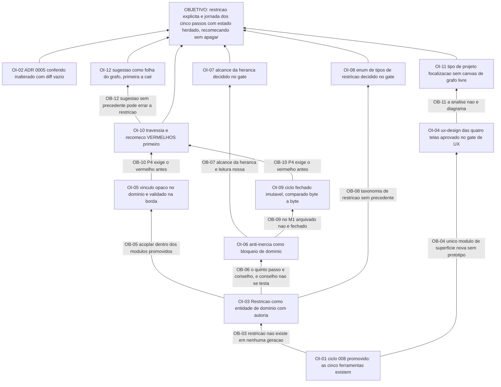

# APR 009 — Árvore de Pré-Requisitos da Focalização

> Siglas deste documento: **APR** — Árvore de Pré-Requisitos · **OI** — Objetivo
> Intermediário · **ARF** — Árvore da Realidade Futura · **AT** — Árvore de Transição ·
> **ARA** — Árvore da Realidade Atual · **NC** — Nuvem de Conflito · **UDE** — Efeito
> Indesejável · **TOC** — Teoria das Restrições · **DBR** — tambor-pulmão-corda
> (*Drum-Buffer-Rope*) · **ADR** — Architecture Decision Record (Registro de Decisão
> Arquitetural) · **FSM** — máquina de estados finitos · **IA** — inteligência
> artificial · **TDD** — Test-Driven Development (desenvolvimento guiado por teste) ·
> **DoD** — Definition of Done (Definição de Pronto) · **UX** — experiência de usuário ·
> **OTel** — OpenTelemetry.

- **Spec**: `specs/009-focalizacao/spec.md` · **Ciclo**: 009 (planejado) ·
  **Data desta árvore**: 2026-09-05
- **Lógica**: condição **necessária**. Lê-se de baixo para cima.
- **Objetivo**: **a restrição é dado explícito da análise, e a jornada dos cinco passos
  conduz cada passo à ferramenta certa com o estado herdado do anterior — recomeçando
  sem apagar nada.**

## Obstáculos e objetivos intermediários

| # | Obstáculo (condição atual que bloqueia) | Evidência | OI que o supera | Depende de |
|---|---|---|---|---|
| **OB-01** | O ciclo 008 não está promovido: a jornada aponta para ARA, NC, ARF, APR e AT, e metade delas nasce lá | `docs/roadmap.md` § "O que o ciclo 009 não pode começar sem": "O ciclo 008 promovido (a jornada aponta para ferramentas que precisam existir)" | **OI-01**: o ciclo 008 está promovido e as cinco ferramentas vinculáveis existem, promovidas e testadas | nenhum |
| **OB-02** | O escopo da v1 exclui DBR, gestão de pulmões e contabilidade de ganho, e essa exclusão é **pré-condição de abertura** deste ciclo — não uma preferência que se possa rever no meio | `docs/roadmap.md`: "ADR 0005 (escopo v1) inalterado — se DBR entrar, é decisão nova antes, não durante" | **OI-02**: o ADR 0005 está conferido inalterado contra o corpo aceito, com o diff vazio colado no `qa-report.md` | nenhum |
| **OB-03** | A restrição **não existe como entidade em nenhuma geração da linhagem**: o grep de `focaliza\|five focusing\|cinco passos` devolve **0** nas quatro, e as **8** ocorrências de "restrição/constraint" na 4ª geração são 4 de texto de apresentação, 3 de conteúdo de prompt e 1 comentário sobre o sistema de tipos do React Flow | saídas coladas abaixo; defeito **D-09**; ADR 0005 traz a mesma medição sobre nove diretórios | **OI-03**: a `Restricao` existe como entidade de domínio — descrição, tipo, justificativa, autoria por evento e referência de origem opcional | OI-01 |
| **OB-04** | O M6 é o **único módulo de superfície nova sem protótipo do ciclo 002**, que cobriu M1–M3: as quatro telas de jornada não têm papel semântico desenhado | lacuna **L-05** da spec, risco **médio** — o mais alto desta spec; `plan.md` § Riscos, linha GATE-ux | **OI-04**: o `ux-design.md` das quatro telas existe com papel semântico antes do componente e passou pelo gate de UX, com estados vazios e de pendência desenhados | OI-01 |
| **OB-05** | A jornada precisa apontar para cinco tipos de projeto de três módulos **já promovidos**, e a via curta — um campo do M6 dentro dos agregados deles — criaria dependência reversa em código fechado | lacuna **L-03** da spec, risco **baixo**; `plan.md` § Decisões 1 e 2 | **OI-05**: o vínculo é **opaco no domínio** (tipo, identificador, papel, justificativa) e validado na borda — existência, inquilino e estado do projeto conferidos no servidor; **nenhum campo novo** em M2–M4 | OI-03 |
| **OB-06** | O quinto passo do método é um **conselho** — "não deixe a inércia virar a restrição do sistema" — e conselho não se testa: implementado como lembrete de tela, ele é ignorado exatamente quando importa | RN-05 da spec; `plan.md` § Decisão 4: "É a decisão que transforma o quinto passo do método de conselho em invariante" | **OI-06**: a anti-inércia é **bloqueio de domínio** — decisão herdada com veredito `pendente` impede concluir `subordinar` no ciclo novo, e manter exige justificativa tanto quanto revogar | OI-03 |
| **OB-07** | O alcance da herança anti-inércia — só as decisões de `explorar` e `subordinar` — é **leitura nossa** do método; as de `identificar` e `elevar` morrem com o ciclo por assunção, não por norma | lacuna **L-02** da spec, risco **baixo**; segunda `[DÚVIDA]` do `## Clarify` | **OI-07**: o alcance da herança está decidido no gate, e a mudança é de **filtro sobre eventos já registrados**, não de modelo | OI-06 |
| **OB-08** | A taxonomia de tipos de restrição (`fisica` \| `politica` \| `de_mercado`) não tem precedente na linhagem — que nunca teve restrição — nem norma neste corpus | lacuna **L-01** da spec, risco **baixo**; primeira `[DÚVIDA]` do Clarify | **OI-08**: o enum de tipos está decidido no gate como conjunto fechado, com migração aditiva declarada como saída — e o motivo de não abrir para texto livre está escrito: consistência da linha do tempo entre ciclos | OI-03 |
| **OB-09** | No M1 um projeto arquivado é restaurável e editável — "fechado" não é um conceito que o núcleo tenha; sem invariante própria, recomeçar seria indistinguível de limpar | RN-04 da spec; `plan.md` § Decisão 3: "Histórico por imutabilidade, não por versionamento"; portão do roadmap: "'recomeçar' reabre sem apagar histórico" | **OI-09**: ciclo fechado é objeto **somente leitura no domínio**, e o teste compara o ciclo fechado **byte a byte** antes e depois do recomeço | OI-06 |
| **OB-10** | O princípio P4 exige o teste vermelho antes, e os dois testes que definem este ciclo — a travessia dos cinco passos com estado herdado e o recomeço que não apaga — não existem | `tasks.md` T-04: "**Nenhum agregado antes disto.**"; DoD 3 e 4 | **OI-10**: os testes de invariante, travessia e recomeço existem e falham **pelo motivo certo** (agregado inexistente), com zero dado real de pessoa | OI-05, OI-09 |
| **OB-11** | A análise de focalização **não é diagrama** — a superfície dela é trilha e linha do tempo —, mas o núcleo M1 entrega canvas e vista tabular: herdar o ciclo de vida sem herdar a superfície é distinção que o núcleo não faz sozinho | spec § "O que entra como dado": "sem canvas de grafo livre: a sua superfície é jornada e linha do tempo, não diagrama" | **OI-11**: o tipo de projeto `focalizacao` herda listagem, inquilino, exclusão suave e exportação do M1 **sem** canvas de grafo livre, e a superfície própria está desenhada | OI-04 |
| **OB-12** | `toc.suggest_constraint` não tem precedente algum — a linhagem não tinha restrição para sugerir —, e errar o recorte das candidatas numa aplicação de TOC é o erro mais caro possível | lacuna **L-04** da spec, risco **baixo**; `docs/produto/rounds.md`, round 009: "**sai primeiro**: a sugestão assistida" | **OI-12**: a sugestão nasce `action_proposal` com prova de recusa intacta, e a tarefa que a implementa é **folha no grafo** — nada depende dela, e é o primeiro item do corte | OI-10 |

## Sequenciamento

A base é dupla e as duas raízes são **conferências, não construções** — OI-01 (o ciclo
008 promovido) e OI-02 (o ADR 0005 inalterado). É uma diferença de natureza que vale
notar: neste ciclo, metade da condição de abertura é *ler e comparar*, não *construir*.

Do OI-01 saem três frentes:

- **a entidade** (OI-03 → OI-05, OI-06, OI-08): o que a linhagem nunca teve;
- **a superfície** (OI-04 → OI-11): o desenho que nenhum protótipo antecipou;
- **a memória** (OI-06 → OI-09): o que separa recomeçar de limpar.

O caminho crítico é o da memória, e ele é literal quanto ao P4:

> OI-03 (a restrição existe) → OI-06 (a anti-inércia é do domínio) → OI-09 (ciclo
> fechado é imutável) → OI-10 (**os testes falham primeiro**) → só então o agregado.

O `tasks.md` diz a mesma coisa em quatro palavras — "**Nenhum agregado antes disto.**" —
e é onde este ciclo mais facilmente se trai: escrever o agregado antes do teste de
recomeço produz um recomeço que faz o que o agregado sabe fazer, em vez de provar que o
ciclo fechado permaneceu íntegro.

**OI-12 é folha por decisão declarada**, não por acaso: a decisão 5 do plano diz que "a
trilha estática é o produto; a sugestão é acessório", e a ordem do grafo de tarefas
reflete isso — nada depende dela, e é ela que cai primeiro se o apetite estourar.

## O grafo



## Evidência — as saídas que ancoram os obstáculos

```
$ cd /home/user && grep -rniE "focaliza|five focusing|cinco passos" TOC-Builder TOC-Builder-APP TOC-Builder-V2 tocbuilderv3 --include="*.ts" --include="*.tsx" --include="*.md" | wc -l
0

$ cd /home/user && for d in TOC-Builder TOC-Builder-APP TOC-Builder-V2 tocbuilderv3; do printf "%-20s %s\n" "$d" "$(grep -rniE 'restri[cç]|constraint' $d --include='*.ts' --include='*.tsx' | grep -v node_modules | wc -l)"; done
TOC-Builder          2
TOC-Builder-APP      2
TOC-Builder-V2       3
tocbuilderv3         8

$ cd /home/user && grep -rniE "restri[cç]|constraint" tocbuilderv3 --include='*.ts' --include='*.tsx' | grep -v node_modules | cut -c1-110
tocbuilderv3/locales/en.ts:34:      subtitle: "Use the Theory of Constraints tools, powered by Artificia
tocbuilderv3/locales/en.ts:439:        p1: "This documentation serves as a quick guide to the main funct
tocbuilderv3/locales/pt.ts:32:      subtitle: "Utilize as ferramentas da Teoria das Restrições, potencia
tocbuilderv3/locales/pt.ts:437:        p1: "Esta documentação serve como um guia rápido para as principa
tocbuilderv3/constants.ts:16:export const SYSTEM_PROMPT_ARA_ASSISTANT_TEXT = `Você é um assistente espec
tocbuilderv3/constants.ts:110:Você é um especialista na Teoria das Restrições (TOC) e um validador de Ef
tocbuilderv3/constants.ts:264:export const CONFLICT_CLOUD_PROMPT_TEXT = `You are a Theory of Constraints
tocbuilderv3/types.ts:114:  // Fix: Add index signature to satisfy Record<string, unknown> constraint fro
```

## O que esta árvore não decide

- **As cinco `[DÚVIDA]` do Clarify** — tipos de restrição, alcance da herança, limite de
  reabertura de passo, desfecho da análise e onde nasce o desenho das telas são do gate
  humano; três delas (OB-07, OB-08 e OB-04) só viram invariante depois de respondidas.
- **Se DBR entra algum dia** — está fora da v1 pelo ADR 0005; entrar exige ADR que o
  suceda, **antes**, nunca durante (é a pré-condição do OB-02).
- **A ordem operacional dos passos** — é da AT (`at.md`).
- **O que se ganha quando a restrição virar dado** — é da ARF (`arf.md`).
