# ARF 009 — Árvore da Realidade Futura da Focalização

> Siglas deste documento: **ARF** — Árvore da Realidade Futura · **APR** — Árvore de
> Pré-Requisitos · **AT** — Árvore de Transição · **ARA** — Árvore da Realidade Atual ·
> **NC** — Nuvem de Conflito · **UDE** — Efeito Indesejável · **OI** — Objetivo
> Intermediário · **S&T** — Estratégia & Táticas · **TOC** — Teoria das Restrições ·
> **DBR** — tambor-pulmão-corda (*Drum-Buffer-Rope*) · **ADR** — Architecture Decision
> Record (Registro de Decisão Arquitetural) · **FSM** — máquina de estados finitos ·
> **IA** — inteligência artificial · **SDK** — Software Development Kit (kit de
> desenvolvimento) · **TDD** — Test-Driven Development (desenvolvimento guiado por
> teste) · **DoD** — Definition of Done (Definição de Pronto) · **OTel** —
> OpenTelemetry · **UX** — experiência de usuário · **i18n** — internacionalização.

- **Spec**: `specs/009-focalizacao/spec.md` · **Ciclo**: 009 (planejado) ·
  **Data desta árvore**: 2026-09-05
- **Lógica**: causa **suficiente**. Lê-se de baixo para cima.
- **Round correspondente**: `docs/produto/rounds.md`, round 009.

## A injeção — o que a spec entrega

| # | Injeção | O que a spec diz |
|---|---|---|
| **I-01** | **A restrição é entidade de primeira classe**: descrição, tipo, justificativa, autoria por evento e referência de origem opcional ao nó de causa raiz que a revelou | RF-05, RF-06, entidade `Restricao` |
| **I-02** | **Os cinco passos são tipo fechado e ordem fixa no domínio** — enum e sequência, nunca tabela de definição de passo nem motor de fluxo configurável | RN-01, `plan.md` § Decisão 6 |
| **I-03** | **A jornada é agregado próprio com acoplamento unidirecional**: o vínculo é opaco no domínio (tipo, identificador, papel) e validado na borda; **nenhum campo novo** em M2–M4 | RF-14, RNF-04, `plan.md` § Decisões 1 e 2 |
| **I-04** | **Histórico por imutabilidade**: ciclo fechado é somente leitura no domínio, recomeçar é a única operação que fecha, e a linha do tempo é a própria lista de ciclos | RF-15, RF-17, RN-04, `plan.md` § Decisão 3 |
| **I-05** | **A anti-inércia é bloqueio de domínio, não lembrete de interface**: veredito herdado `pendente` impede concluir o passo `subordinar` do novo ciclo | RF-16, RN-05, `plan.md` § Decisão 4 |
| **I-06** | **Cada passo apresenta o produto herdado do anterior** no topo do painel — ninguém decide no vácuo | RF-13, RI-02 |
| **I-07** | **A trilha estática é o produto e a sugestão é acessório**: E6.1 e E6.2 funcionam por inteiro com o catálogo ausente ou desligado | RF-20, RF-21, `plan.md` § Decisão 5 |

## Os efeitos desejáveis

| # | Efeito desejável | Decorre de | Hoje é falso porque (evidência) |
|---|---|---|---|
| **ED-01** | **A aplicação passa a ter a entidade que dá nome à teoria.** Registrar "qual é a restrição" deixa de ser uma frase na ata e vira dado com autor, data e tipo | I-01 | Em quatro gerações a palavra nunca apareceu: o grep de `focaliza\|five focusing\|cinco passos` sobre as quatro devolve **0** (saída colada abaixo). E a palavra "restrição" aparece **8** vezes na 4ª geração sem ser entidade nenhuma: **4** em texto de apresentação e documentação ("Teoria das Restrições"), **3** dentro de prompts, e **1** comentário sobre o sistema de tipos do React Flow (`Record<string, unknown> constraint`) — lista colada abaixo. É o defeito **D-09** |
| **ED-02** | **Seis ferramentas deixam de ser seis editores desconexos** e passam a ser uma jornada com começo, direção e critério de recomeço | I-02, I-03, I-06 | É a frase do §"O quê e por quê" da spec, e a linhagem é a prova: as ferramentas existentes nunca souberam umas das outras — a contagem de referência cruzada no modelo da 4ª geração é **0** (medida na spec 008, F-08) |
| **ED-03** | **O quinto passo deixa de ser conselho e vira invariante.** "Não deixe a inércia virar a restrição" passa a ser algo que o sistema **recusa**, não algo que o facilitador lembra | I-05 | Hoje é literatura: nenhuma geração modelou o recomeço, e a regra vive só na cabeça de quem conduz a sala. A decisão 4 do plano é explícita — "quem recusa é o domínio", a interface só mostra o contador |
| **ED-04** | **Ninguém decide no vácuo**: abrir o passo `subordinar` mostra a restrição de `identificar` e as decisões de `explorar` já registradas | I-06 | O round 009 exige exatamente isto — "cada passo referencia a ferramenta certa com o estado herdado do anterior" — e é a aptidão executável que o portão do roadmap mede |
| **ED-05** | **A memória da análise cresce e nunca encolhe**: recomeçar preserva o ciclo anterior íntegro, e a linha do tempo mostra os dois | I-04 | É o portão executável do roadmap, palavra por palavra: "'recomeçar' reabre sem apagar histórico". Sem a imutabilidade de domínio, "recomeçar" seria indistinguível de "limpar" |
| **ED-06** | **A jornada é construída por cima de ferramentas já promovidas sem tocá-las** — M2, M3 e M4 não ganham nenhum campo por causa do M6 | I-03 | É a decisão 1 do plano, e o que a torna necessária é a ordem: quando este ciclo abre, as ferramentas já estão promovidas. Acoplamento reverso obrigaria a mexer em três módulos fechados |
| **ED-07** | **A ferramenta ajuda, nunca condiciona**: a restrição pode nascer de uma causa raiz da ARA **ou** ser registrada à mão, sem ARA nenhuma | I-01 | RF-06 é explícito nos dois sentidos. É o que impede a jornada de virar corredor obrigatório — quem já sabe qual é a restrição não precisa provar por diagrama |
| **ED-08** | **O produto deixa de ser um editor de diagramas.** É a frase do próprio round, e a razão de o registro da restrição estar marcado "nunca sai" | I-01, I-02 | `docs/produto/rounds.md`, round 009: "**Nunca sai**: o registro da restrição — é a entidade que dá nome à teoria, e o produto sem ela é um editor de diagramas" |

## Ramos negativos — o que pode piorar, e a poda

| # | Ramo negativo | Poda declarada |
|---|---|---|
| **RNEG-01** | A trilha vira **burocracia**: cinco passos obrigatórios num produto onde a Facilitadora queria abrir a ARA e trabalhar, e a jornada passa a ser imposto de navegação | A poda está espalhada por desenho: a restrição registra-se à mão sem ARA (RF-06), as notas são texto livre acumulável (RF-11), o avanço é ato explícito e nunca efeito colateral (RF-09), o passo anterior reabre com justificativa (RF-10), e o vínculo fora das combinações canônicas é permitido com justificativa e **aviso, nunca bloqueio** (RN-06). A análise de focalização é um tipo de projeto entre outros — quem não a cria continua usando as ferramentas soltas |
| **RNEG-02** | O bloqueio anti-inércia **trava a análise**: quem recomeça com vinte decisões herdadas não consegue concluir `subordinar` e desiste do recomeço | O bloqueio é cirúrgico: alcança **só** a conclusão do passo `subordinar` do ciclo novo (RN-05), não a abertura do ciclo nem os outros passos; cada veredito é uma linha — `mantida` ou `revogada` — com justificativa; e o contador de pendências é visível já do mapa da jornada (RI-05), não escondido dentro do passo. É deliberado que **manter seja tão explícito quanto revogar**: é essa simetria que impede a inércia de passar por omissão |
| **RNEG-03** | O ciclo 008 escorrega e a jornada **não tem para onde apontar** — cinco passos ligando a nada | O domínio inteiro do M6 (as tarefas T-04 a T-07) roda com **vínculo opaco**, sem M2–M4 existirem: só a T-12 exige as ferramentas reais. E a poda de governança é anterior: se o 008 escorregar, o 009 **não abre** — é pré-condição do roadmap, não decisão deste ciclo |
| **RNEG-04** | O desenho de interface novo estoura o apetite, porque o M6 é o **único** módulo de superfície nova sem protótipo do ciclo 002 | Lacuna **L-05**, risco **médio** — o mais alto desta spec. A poda tem duas partes: `ART:ux-design=yes` com a tarefa de desenho **antes** de qualquer interface no grafo, e o corte de apetite em dois degraus declarado antes de abrir (sai primeiro a sugestão, depois a comparação entre ciclos na linha do tempo; o registro da restrição nunca sai) |
| **RNEG-05** | A navegação de volta — da ARA ou da NC para a análise que a vinculou — resolve por consulta e fica lenta ou confusa | Lacuna **L-03**, risco **baixo**: a saída declarada é um índice materializado **sem tocar nos agregados das ferramentas**, e a medição está marcada (RNF-05: mapa de 5 ciclos e 30 vínculos em menos de 1 segundo no percentil 95, medido na jornada viva). O que não se aceita é o atalho — campo do M6 dentro do M2 |
| **RNEG-06** | O enum de três tipos de restrição não cobre o uso real e as pessoas passam a **forçar** a classificação para poder salvar | Lacuna **L-01**, risco **baixo**, e a primeira `[DÚVIDA]` do Clarify. A saída é migração aditiva pequena; o motivo de não abrir para texto livre está declarado: tipo livre custaria a **consistência da linha do tempo entre ciclos**, que é justamente o que o módulo existe para dar |
| **RNEG-07** | A sugestão de restrição erra o recorte e o grupo aceita como restrição algo que não é a restrição — o pior erro possível numa aplicação de TOC | Lacuna **L-04**, risco **baixo**, com três podas empilhadas: a sugestão nasce `action_proposal` recusável (RF-19); a prova de recusa intacta é linha de DoD (estado serializado idêntico byte a byte); e ela é o **primeiro item do corte de apetite** — a tarefa que a implementa é folha no grafo, com nada dependendo dela |

## O grafo

```mermaid
graph BT
  I01["I-01 restricao como entidade de primeira classe"]
  I02["I-02 cinco passos como tipo fechado e ordem fixa"]
  I03["I-03 jornada como agregado proprio com vinculo opaco"]
  I04["I-04 historico por imutabilidade do ciclo fechado"]
  I05["I-05 anti-inercia como bloqueio de dominio"]
  I06["I-06 cada passo apresenta o produto herdado"]
  I07["I-07 a trilha estatica e o produto, a sugestao e acessorio"]

  ED01["ED-01 a aplicacao ganha a entidade que da nome a teoria"]
  ED02["ED-02 seis ferramentas deixam de ser seis editores desconexos"]
  ED03["ED-03 o quinto passo deixa de ser conselho e vira invariante"]
  ED04["ED-04 ninguem decide no vacuo"]
  ED05["ED-05 a memoria da analise cresce e nunca encolhe"]
  ED06["ED-06 a jornada nasce sobre ferramentas promovidas sem toca-las"]
  ED07["ED-07 a ferramenta ajuda e nunca condiciona"]
  ED08["ED-08 o produto deixa de ser um editor de diagramas"]

  OBJ["OBJETIVO: a analise tem restricao explicita e a jornada dos cinco passos costura as ferramentas sem apagar historico"]

  I01 --> ED01
  I02 --> ED02
  I03 --> ED02
  I06 --> ED02
  I05 --> ED03
  I06 --> ED04
  I04 --> ED05
  I03 --> ED06
  I01 --> ED07
  I07 --> ED07
  I01 --> ED08
  I02 --> ED08

  ED01 --> OBJ
  ED02 --> OBJ
  ED03 --> OBJ
  ED04 --> OBJ
  ED05 --> OBJ
  ED06 --> OBJ
  ED07 --> OBJ
  ED08 --> OBJ

  RNEG01["RNEG-01 a trilha vira burocracia"]
  RNEG02["RNEG-02 o bloqueio anti-inercia trava a analise"]
  RNEG03["RNEG-03 o 008 escorrega e a jornada aponta para nada"]
  RNEG04["RNEG-04 o ux novo estoura o apetite"]
  RNEG07["RNEG-07 a sugestao erra a restricao"]

  P01["PODA restricao manual, notas livres, avanco explicito, vinculo fora do canonico permitido"]
  P02["PODA bloqueio so em subordinar; manter e revogar com o mesmo peso"]
  P03["PODA dominio roda com vinculo opaco; e sem o 008 o 009 nao abre"]
  P04["PODA ux-design antes de qualquer UI e corte em dois degraus"]
  P07["PODA nasce proposta, recusa intacta provada, e e o primeiro corte"]

  I02 -.-> RNEG01
  I05 -.-> RNEG02
  I03 -.-> RNEG03
  I06 -.-> RNEG04
  I07 -.-> RNEG07
  P01 --> RNEG01
  P02 --> RNEG02
  P03 --> RNEG03
  P04 --> RNEG04
  P07 --> RNEG07
```



## Evidência — os números desta árvore, com o comando executado

```
$ cd /home/user && grep -rniE "focaliza|five focusing|cinco passos" TOC-Builder TOC-Builder-APP TOC-Builder-V2 tocbuilderv3 --include="*.ts" --include="*.tsx" --include="*.md" | wc -l
0

$ cd /home/user && for d in TOC-Builder TOC-Builder-APP TOC-Builder-V2 tocbuilderv3; do printf "%-20s %s\n" "$d" "$(grep -rniE 'restri[cç]|constraint' $d --include='*.ts' --include='*.tsx' | grep -v node_modules | wc -l)"; done
TOC-Builder          2
TOC-Builder-APP      2
TOC-Builder-V2       3
tocbuilderv3         8

$ cd /home/user && grep -rniE "restri[cç]|constraint" tocbuilderv3 --include='*.ts' --include='*.tsx' | grep -v node_modules | cut -c1-110
tocbuilderv3/locales/en.ts:34:      subtitle: "Use the Theory of Constraints tools, powered by Artificia
tocbuilderv3/locales/en.ts:439:        p1: "This documentation serves as a quick guide to the main funct
tocbuilderv3/locales/pt.ts:32:      subtitle: "Utilize as ferramentas da Teoria das Restrições, potencia
tocbuilderv3/locales/pt.ts:437:        p1: "Esta documentação serve como um guia rápido para as principa
tocbuilderv3/constants.ts:16:export const SYSTEM_PROMPT_ARA_ASSISTANT_TEXT = `Você é um assistente espec
tocbuilderv3/constants.ts:110:Você é um especialista na Teoria das Restrições (TOC) e um validador de Ef
tocbuilderv3/constants.ts:264:export const CONFLICT_CLOUD_PROMPT_TEXT = `You are a Theory of Constraints
tocbuilderv3/types.ts:114:  // Fix: Add index signature to satisfy Record<string, unknown> constraint fro
```

> **Leitura honesta destes números.** O `0` do primeiro grep é a prova de ausência que a
> spec cita como F-01, e ele sozinho já diz muito. Mas a lista das **8** ocorrências
> diz mais: em quatro gerações a palavra "restrição" só apareceu como **nome do
> produto** (o subtítulo e a documentação), como **texto dentro de prompt** e, uma vez,
> como palavra do TypeScript — nunca como entidade, campo, tipo ou tela. A aplicação
> chamava-se pela teoria sem modelar o conceito central dela.

## O que esta árvore não decide

- **Se o ciclo pode abrir** — depende do ciclo 008 promovido e do ADR 0005 inalterado;
  são obstáculos da APR (`apr.md`).
- **Tipos de restrição, alcance da herança, limite de reabertura, desfecho da análise e
  onde o desenho das telas nasce** — são as cinco `[DÚVIDA]` do `## Clarify`, matéria do
  gate humano.
- **DBR, gestão de pulmões e métricas de desempenho da restrição** — estão fora da v1
  inteira pelo ADR 0005, com a medição colada lá; entrada futura exige ADR que o suceda.
- **A ordem operacional dos passos** — é da AT (`at.md`).
