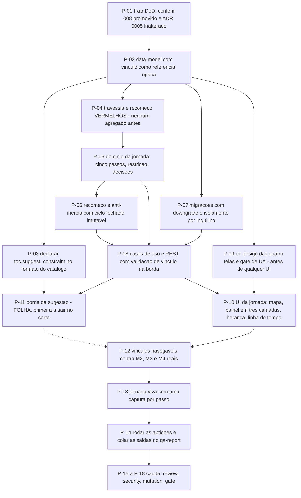

# AT 009 — Árvore de Transição da Focalização

> Siglas deste documento: **AT** — Árvore de Transição · **APR** — Árvore de
> Pré-Requisitos · **OI** — Objetivo Intermediário · **ARF** — Árvore da Realidade
> Futura · **ARA** — Árvore da Realidade Atual · **NC** — Nuvem de Conflito · **TOC** —
> Teoria das Restrições · **DBR** — tambor-pulmão-corda (*Drum-Buffer-Rope*) · **ADR** —
> Architecture Decision Record (Registro de Decisão Arquitetural) · **FSM** — máquina de
> estados finitos · **IA** — inteligência artificial · **SDK** — Software Development
> Kit (kit de desenvolvimento) · **TDD** — Test-Driven Development (desenvolvimento
> guiado por teste) · **DoD** — Definition of Done (Definição de Pronto) · **OTel** —
> OpenTelemetry · **UX** — experiência de usuário · **i18n** — internacionalização.

- **Spec**: `specs/009-focalizacao/spec.md` · **Ciclo**: 009 (planejado) ·
  **Data desta árvore**: 2026-09-05
- **Fonte dos passos**: `specs/009-focalizacao/tasks.md` — T-01 a T-14 mais a cauda. A
  AT **não inventa passo**; onde divergirem, o `tasks.md` manda.
- **A ordem que este ciclo não pode inverter**: a travessia dos cinco passos e o
  recomeço que não apaga (P-04) nascem **antes** do agregado. É a frase literal do
  `tasks.md` — "Nenhum agregado antes disto."

## Os passos

| Passo | Tarefa | Necessidade (por que este passo, agora) | Ação | Resultado esperado (verificável) |
|---|---|---|---|---|
| **P-01** | T-01 | Uma das pré-condições deste ciclo não é um ciclo promovido: é um **ADR inalterado** — e a única forma de conferir isso é comparar, não lembrar | Fixar as 16 linhas da DoD com comando e valor esperado; conferir o ciclo 008 promovido e o ADR 0005 inalterado por diff contra o corpo aceito | Cada linha tem comando; nenhum critério subjetivo; o **diff vazio** do ADR 0005 colado no `qa-report.md` |
| **P-02** | T-02 | A análise de focalização estende o M1 mas **não é diagrama**; modelar sem escrever essa diferença produziria um canvas que ninguém quer manter | Consolidar o `data-model.md` (análise, ciclo, passo, restrição, vínculo, herança, eventos) e a extensão REST | Todo agregado e evento da spec aparece no documento; nenhuma entidade sem invariante escrita; **vínculo modelado como referência opaca** |
| **P-03** | T-03 | Declarar a ação antes de implementá-la mantém o contrato estável mesmo se ela for cortada — e ela **vai** ser a primeira cortada | Declarar `toc.suggest_constraint` no formato do catálogo do 006: nome, classe de risco, esquema de entrada, candidatas com nó de origem e racional | A declaração segue o formato do catálogo do 006; nenhuma rota fora da FSM do servidor |
| **P-04** | T-04 | **O passo que define o ciclo.** Escrever o agregado antes do teste de recomeço produz um recomeço que faz o que o agregado sabe fazer, em vez de provar que o ciclo fechado ficou íntegro | Escrever a fixture da análise sintética "Fluxo de matrículas" e os testes vermelhos: cinco passos fixos e ordenados, unicidades, **travessia com estado herdado**, **recomeço que preserva o ciclo fechado byte a byte**, bloqueio por herança pendente | DoD 2 a 6 **vermelhos pelo motivo certo** (agregado inexistente); zero dado real de pessoa (ADR 0006) |
| **P-05** | T-05 | Só agora o agregado pode nascer, e nasce contra testes que não o conhecem | Domínio da jornada: ciclo com os cinco passos instanciados na criação, restrição com tipo e referência de origem, conclusão de passo com decisão, reabertura com justificativa, notas, mapa de pendências por função pura | DoD 2, 3 e 6 verdes; reabrir **não apaga** a decisão anterior — evento novo, histórico somente-acréscimo |
| **P-06** | T-06 | É aqui que o quinto passo do método deixa de ser conselho: sem bloqueio de domínio, a inércia atravessa por omissão | Recomeço e anti-inércia: fechar ciclo (imutável no domínio), abrir novo em `identificar`, herdar decisões com veredito `pendente`, bloquear a conclusão de `subordinar`; vínculos com regra canônica e justificativa fora dela | DoD 4, 5 e 7 verdes; ciclo fechado comparado **byte a byte** antes e depois do recomeço |
| **P-07** | T-07 | Esquema novo sem descida testada é dívida de banco disfarçada de entrega | Migrações Alembic (análise, ciclo, passo, restrição, vínculo, herança) com `upgrade` e `downgrade` testados; repositórios mantendo o isolamento por inquilino | Ciclo de subida e descida sem resíduo, saída colada; o teste de isolamento do 004 verde sobre as tabelas novas |
| **P-08** | T-08 | O vínculo é opaco no domínio de propósito — o que significa que **a borda é a única linha** que confere existência, inquilino e estado do projeto referenciado | Casos de uso e adaptadores REST com validação de vínculo no servidor (degradação legível para projeto arquivado), traço por mutação e autorização em falha fechada | DoD 8, 11 e 12 verdes; o teste falha se `RestricaoRegistrada`, `PassoConcluido` ou `CicloFechado` não emitirem traço |
| **P-09** | T-09 | Este é o **único** módulo de superfície nova sem protótipo do ciclo 002: começar componente aqui sem papel semântico é começar do zero sem saber | Escrever o `ux-design.md` das quatro telas (mapa, painel do passo, julgamento de herança, linha do tempo) com estados vazios e de pendência, e acessibilidade da trilha nunca só por cor | As 4 telas da spec cobertas; gate de UX do método executado **antes de qualquer interface** |
| **P-10** | T-10 | O painel do passo tem três camadas — herdado, trabalho, decisão — e é essa arrumação que impede alguém de decidir no vácuo | Interface da jornada: mapa dos cinco passos com estado e pendências, painel em três camadas, julgamento de herança com vereditos de mesmo peso, linha do tempo, listagem com passo atual e restrição | Teste de fluxo feliz e de **bloqueio por pendência**; nenhum literal fora do dicionário; os 3 identificadores de tela registrados com `ai_visible` campo a campo |
| **P-11** | T-11 | A sugestão é acessório declarado — e por isso entra depois de tudo o que a jornada precisa para funcionar sem ela | Borda de `toc.suggest_constraint` na FSM do 006: candidatas a partir dos nós de causa raiz da ARA vinculada, uma proposta por candidata, prova de recusa intacta, capability ausente escondendo a ação | DoD 9 e 10 verdes. **Primeiro corte de apetite — nada depende desta tarefa** |
| **P-12** | T-12 | O vínculo opaco só prova que funciona quando encontra os módulos reais: até aqui, tudo foi testado contra identificadores | Vínculos navegáveis contra M2, M3 e M4: ARA em `identificar` (com restrição a partir de causa raiz), NC em `explorar`/`subordinar`, APR e AT em `elevar`; navegação nos dois sentidos | Teste de integração cobre as **quatro** combinações canônicas e **uma** não-canônica com justificativa |
| **P-13** | T-13 | Jornada sem captura do build real é ficção — e aqui o portão do roadmap é mais estrito: **uma captura por passo** | Jornada viva da análise sintética atravessando identificar → explorar → subordinar → elevar → recomeçar, com ARA, NC e APR reais e o julgamento de herança no recomeço | DoD 14 — script em `docs/jornadas/scripts/`, **uma captura por passo**, grep negativo de nome real de pessoa |
| **P-14** | T-14 | Caixa marcada não é testemunha | Rodar as aptidões e preencher o `qa-report.md` com saída colada (R1) e quanto cada portão examinou (R2); atualizar o CHANGELOG; ADR novo se o Clarify gerar decisão material | `scripts/check-conformance.sh 009` código 0; nenhuma célula preenchida sem comando executado |
| **P-15** | `TAIL:review` | Os dois portões nomeados do roadmap são de execução, não de leitura | Revisão independente em contexto fresco: a travessia dos cinco passos com estado herdado e o recomeço que não apaga, verificados por leitura **e** por execução | Achados registrados no `qa-report.md` |
| **P-16** | `TAIL:security` | O vínculo é opaco no domínio: se a borda não conferir inquilino, o isolamento do M1 vaza por uma referência de texto | Passe de segurança: nenhum SDK, chave ou prompt no produto; vínculo validado no servidor com inquilino conferido; autorização em falha fechada; notas e decisões como camada não-confiável no snapshot | DoD 8, 10 e 13 conferidos; resultado por item no `qa-report.md` |
| **P-17** | `TAIL:mutation` | A ordem canônica, as unicidades, a imutabilidade do ciclo fechado e o bloqueio por herança são as funções cuja falha **silenciosa** transforma a jornada em lista de tarefas sem método | Testes de mutação sobre as quatro | Taxa e sobreviventes no `qa-report.md` |
| **P-18** | `TAIL:gate` | Quem executou não aprova o que executou — e há cinco `[DÚVIDA]` que só o Product Steward responde | Apresentar as 16 linhas da DoD, as respostas do Clarify e a cauda | Decisão de merge registrada |

## O corte de apetite, escrito antes de precisar dele

O round 009 declara: **sai primeiro** a sugestão assistida de qual ferramenta usar no
passo (fica a jornada guiada estática); e **nunca sai** o registro da restrição — "é a
entidade que dá nome à teoria, e o produto sem ela é um editor de diagramas". O plano
acrescenta o segundo degrau: a comparação de restrições entre ciclos na linha do tempo.

Na AT, isso significa que o passo cortável é **P-11 inteiro** — e ele está desenhado
como folha justamente para poder cair sem desfiar nada —, depois a parte de **P-10** que
compara ciclos na linha do tempo. **P-04, P-05 e P-06 não são cortáveis**: sem eles o
ciclo entrega uma tela de passos sem restrição, sem memória e sem anti-inércia, que é
exatamente o "editor de diagramas" que o round cita.

Uma nota sobre a ordem: **P-09** (o desenho das telas) é o passo cuja posição mais
importa neste ciclo. Ele é o único módulo de superfície nova sem protótipo anterior, e
por isso vem **antes** de P-10 no grafo — não por elegância de processo, mas porque
desenhar depois de codificar aqui significaria codificar duas vezes o que o apetite não
comporta.

## O grafo

## O que esta árvore não decide

- **Se o ciclo abre** — depende do ciclo 008 promovido e do ADR 0005 inalterado; são
  obstáculos da APR (`apr.md`).
- **As cinco `[DÚVIDA]`** — são do gate; a AT executa o que voltar de lá, e a resposta à
  quinta (onde nasce o desenho das telas) muda a posição de P-09.
- **O que se ganha quando a restrição virar dado** — é da ARF (`arf.md`).
