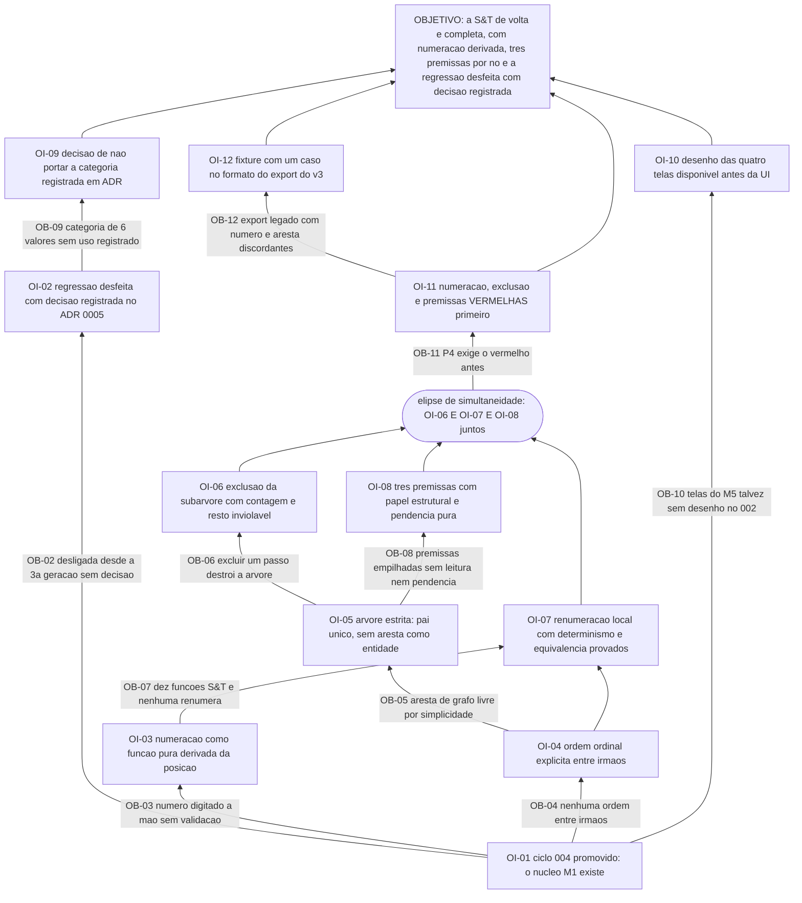

# APR 010 — Árvore de Pré-Requisitos da Estratégia & Táticas

> Siglas deste documento: **APR** — Árvore de Pré-Requisitos · **OI** — Objetivo
> Intermediário · **ARF** — Árvore da Realidade Futura · **AT** — Árvore de Transição ·
> **S&T** — Estratégia & Táticas (*Strategy & Tactics*) · **TOC** — Teoria das
> Restrições · **ADR** — Architecture Decision Record (Registro de Decisão
> Arquitetural) · **IA** — inteligência artificial · **TDD** — Test-Driven Development
> (desenvolvimento guiado por teste) · **DoD** — Definition of Done (Definição de
> Pronto) · **UX** — experiência de usuário · **VCD** — Value Creating Deliverable
> (entregável gerador de valor, jargão da linhagem) · **OTel** — OpenTelemetry.

- **Spec**: `specs/010-estrategia-e-taticas/spec.md` · **Ciclo**: 010 (planejado) ·
  **Data desta árvore**: 2026-09-05
- **Lógica**: condição **necessária**. Lê-se de baixo para cima.
- **Objetivo**: **a árvore de Estratégia & Táticas está de volta e completa — numeração
  derivada da estrutura, as três premissas por nó e a regressão desfeita com decisão
  registrada.**

## Obstáculos e objetivos intermediários

| # | Obstáculo (condição atual que bloqueia) | Evidência | OI que o supera | Depende de |
|---|---|---|---|---|
| **OB-01** | O ciclo 004 não está promovido: a S&T é um tipo de projeto sobre o núcleo, e sem ele o módulo reimplementaria projeto, inquilino, desfazer, vista tabular e exportação | `docs/roadmap.md` § "O que o ciclo 010 não pode começar sem": "O ciclo 004 promovido (é a única dependência técnica…)" | **OI-01**: o ciclo 004 está promovido e a S&T consome dele todo o ciclo de vida do projeto — a única dependência técnica do módulo, satisfeita | nenhum |
| **OB-02** | A ferramenta está **desligada desde a 3ª geração e sem decisão registrada em lugar nenhum**: habilitada na 1ª e na 2ª (`Sidebar.tsx:44`, sem `disabled`), `disabled: true` na 3ª (linha 56) e na 4ª (linha 58) | saídas coladas abaixo, geração a geração; defeito **D-05** | **OI-02**: a regressão está desfeita **com a decisão registrada** — o ADR 0005 declara por que a S&T fica na v1, e é exatamente o registro que faltou quando ela foi desligada | OI-01 |
| **OB-03** | O número do passo é **campo de texto obrigatório digitado à mão**, e a ausência de validação de formato e de unicidade está admitida em comentário no próprio código | `tocbuilderv3/components/SnTStepEditorModal.tsx:56-57` (colado abaixo) | **OI-03**: a numeração é **função pura derivada da posição** — raízes 1..n, filhos X.1..X.m —, determinística e sem lacuna, e nenhum formulário ou rota de escrita expõe campo de número | OI-01 |
| **OB-04** | Não existe **ordem entre irmãos**: os nós flutuam por `pos_x`/`pos_y` e a ordem só existe implícita dentro do número digitado | `tocbuilderv3/types.ts:296-297` (colado abaixo); lacuna **L-03** da spec, risco **baixo** | **OI-04**: a ordem ordinal entre irmãos é explícita e persistida — a estrutura mínima que torna a numeração derivável | OI-01 |
| **OB-05** | A estrutura **reusa aresta de grafo livre**, com a justificativa escrita no próprio tipo — e grafo livre admite dois pais e ciclo, que tornam a numeração hierárquica indefinida | `tocbuilderv3/types.ts:311`: `edges: AraEdge[]; // Reusing AraEdge for simplicity` (colado abaixo) | **OI-05**: a S&T é **árvore estrita no domínio** — pai único, sem aresta como entidade, mover para a própria subárvore recusado, ciclo impossível por construção | OI-04 |
| **OB-06** | Excluir um passo **destrói a árvore inteira**: o filtro do serviço mantém só o nó excluído e descarta todos os demais | `tocbuilderv3/services/mockApiService.ts:521` (colado abaixo) — o predicado correto seria `!==` | **OI-06**: exclusão é da **subárvore**, com a contagem dita antes de confirmar, e todo passo fora dela é inviolável — com o defeito da linhagem reproduzido como caso de teste | OI-05 |
| **OB-07** | Das **10** funções S&T do serviço da linhagem, **nenhuma** calcula, valida ou renumera numeração — ela era responsabilidade integral do usuário | `grep -c "SnT.*= async" services/mockApiService.ts` → `10` (colado abaixo) | **OI-07**: a numeração e a renumeração local são domínio puro, com propriedade de determinismo **e** de equivalência contra o recálculo total na suíte | OI-03, OI-04 |
| **OB-08** | As três premissas existem **desde a 1ª geração** como campos opcionais empilhados — sem leitura dirigida contra pai e filhos, sem pendência, sem semântica normativa | `TOC-Builder/types.ts:243-245` e as **3** áreas de texto de `SnTStepEditorModal.tsx` (colados abaixo); round 010: as premissas são o "**nunca sai**" | **OI-08**: as três premissas têm papel estrutural fixo com leitura dirigida montada dos textos atuais, e a pendência lógica é computada por função pura — informando, nunca travando | OI-05 |
| **OB-09** | A categoria da linhagem tem **6 valores** sem uso registrado além do enum e da paleta de cores, e ela concorre com estratégia e tática como campos do próprio passo | `tocbuilderv3/types.ts:277-284` (`SnTStepCategory`); lacuna **L-01**, risco **baixo**; primeira `[DÚVIDA]` do Clarify | **OI-09**: a decisão de **não portar** a categoria está registrada em ADR pelo gate — e a porta de volta declarada: adicionar classificação depois é campo opcional | OI-02 |
| **OB-10** | O protótipo do ciclo 002 cobriu requisitos de interface de M1–M3; a árvore S&T pode não ter desenho lá | quinta `[DÚVIDA]` do `## Clarify` da spec ("se a árvore S&T não tiver desenho lá, o `ux-design.md` complementar nasce neste ciclo — mesmo arranjo do M6") | **OI-10**: o desenho das quatro telas existe — do protótipo do 002 ou do adendo nascido aqui — antes de qualquer tarefa de interface | OI-01 |
| **OB-11** | O princípio P4 exige o teste vermelho antes, e os testes que definem este ciclo — numeração e renumeração, e a **reprodução do defeito de exclusão da linhagem** — não existem | `tasks.md` T-03: "**Nenhum agregado antes disto.**" | **OI-11**: os testes de numeração, renumeração, árvore estrita, ida e volta das premissas e a reprodução do defeito de exclusão existem e falham **pelo motivo certo** (agregado inexistente) | OI-06, OI-07, OI-08 |
| **OB-12** | O export da 4ª geração traz `stepNumber` livre **e** arestas livres, e os dois podem discordar — o importador do ciclo 011 vai encontrar estrutura ambígua em dado de quem migrar | lacuna **L-04** da spec, risco **médio**, declarado como "pago no 011"; INT-03 | **OI-12**: a fixture deste ciclo inclui **um caso na forma do export do v3** (número digitado + arestas), e o modelo estável — pai + ordem — é o que este ciclo deve ao 011 | OI-11 |

## Sequenciamento

A raiz é única e pequena — **OI-01**, um só ciclo promovido. Este é o módulo mais
independente do produto: a spec diz, e o roadmap confirma, que o 004 é a **única**
dependência técnica, e que a posição tardia no roadmap é escolha de valor, não
consequência de dependência.

Da raiz saem três ramos:

- **o ramo da estrutura** (OI-04 → OI-05 → OI-06), que é onde moram três dos quatro
  defeitos da linhagem;
- **o ramo da numeração** (OI-03 → OI-07), que é onde mora o quarto;
- **o ramo da decisão** (OI-02 → OI-09) e **o do desenho** (OI-10), que não são código.

O caminho crítico é o da estrutura, e ele converge com o da numeração antes do teste:

> OI-04 (ordem entre irmãos) → OI-05 (árvore estrita) → OI-06 (exclusão da subárvore) →
> **OI-11 (os testes falham primeiro)** → só então o agregado.

Há uma **elipse de simultaneidade** — no sentido literal da ferramenta que este ciclo
implementa: **OI-11 exige OI-06, OI-07 e OI-08 ao mesmo tempo**. O conjunto de testes
vermelhos que abre o ciclo cobre exclusão, numeração e premissas numa fixture só, e
escrever qualquer um deles sem os outros produziria uma fixture que precisa ser refeita
duas vezes.

Uma observação que vale registrar: **OI-02 é o objetivo intermediário mais barato e o
mais importante deste ciclo**. Ele não custa código nenhum — o ADR já existe —, e é o
único que ataca a causa da regressão em vez de um dos seus sintomas. Os outros quatro
defeitos são de implementação; este é de governança, e é o que impede a ferramenta de
ser desligada de novo sem que ninguém saiba por quê.

## O grafo



## Evidência — as saídas que ancoram os obstáculos

```
$ cd /home/user && for d in TOC-Builder TOC-Builder-APP TOC-Builder-V2 tocbuilderv3; do echo -n "$d: "; grep -n "'snt'" $d/components/Sidebar.tsx | head -1; done
TOC-Builder: 44:    { id: 'snt', label: 'Árvore S&T', icon: <SnTIcon />, view: 'SNT_TREE' },
TOC-Builder-APP: 44:    { id: 'snt', label: 'Árvore S&T', icon: <SnTIcon />, view: 'SNT_TREE' },
TOC-Builder-V2: 56:    { id: 'snt', label: t('sidebar.nav.snt'), icon: <SnTIcon />, view: 'SNT_TREE', disabled: true },
tocbuilderv3: 58:    { id: 'snt', label: t('sidebar.nav.snt'), icon: <SnTIcon />, view: 'SNT_TREE', disabled: true },

$ cd /home/user/tocbuilderv3 && sed -n '56,57p' components/SnTStepEditorModal.tsx
    if (!stepNumber.trim()) newErrors.stepNumber = "O número do passo é obrigatório.";
    // Optionally, add validation for stepNumber format or uniqueness against existingStepNumbers

$ cd /home/user/tocbuilderv3 && sed -n '296,297p;311p' types.ts
  pos_x?: number;
  pos_y?: number;
  edges: AraEdge[]; // Reusing AraEdge for simplicity

$ cd /home/user/tocbuilderv3 && sed -n 521p services/mockApiService.ts
        project.nodes = project.nodes.filter(n => n.id === nodeId);

$ cd /home/user/tocbuilderv3 && grep -c "SnT.*= async" services/mockApiService.ts
10

$ sed -n '243,245p' /home/user/TOC-Builder/types.ts
  parallelAssumption?: string;
  necessaryAssumptionToParent?: string;
  sufficiencyOfChildrenAssumption?: string;

$ cd /home/user/tocbuilderv3 && grep -c 'id="snt[A-Za-z]*Assumption"' components/SnTStepEditorModal.tsx
3
```

## O que esta árvore não decide

- **As cinco `[DÚVIDA]` do Clarify** — categoria portada, transições de status, raízes
  múltiplas, obrigatoriedade da tática e onde nasce o desenho das telas são do gate
  humano; duas delas (OB-09 e OB-10) só se fecham depois de respondidas.
- **Vínculo automático com APR e AT** — está fora do round 010 como candidato a
  evolução; entrar exige decisão nova.
- **A ordem operacional dos passos** — é da AT (`at.md`).
- **O que se ganha quando a ferramenta voltar** — é da ARF (`arf.md`).
