# ARF 010 — Árvore da Realidade Futura da Estratégia & Táticas

> Siglas deste documento: **ARF** — Árvore da Realidade Futura · **APR** — Árvore de
> Pré-Requisitos · **AT** — Árvore de Transição · **S&T** — Estratégia & Táticas
> (*Strategy & Tactics*) · **TOC** — Teoria das Restrições · **ADR** — Architecture
> Decision Record (Registro de Decisão Arquitetural) · **IA** — inteligência artificial
> · **SDK** — Software Development Kit (kit de desenvolvimento) · **TDD** — Test-Driven
> Development (desenvolvimento guiado por teste) · **DoD** — Definition of Done
> (Definição de Pronto) · **OTel** — OpenTelemetry · **UX** — experiência de usuário ·
> **VCD** — Value Creating Deliverable (entregável gerador de valor, jargão da
> linhagem) · **i18n** — internacionalização.

- **Spec**: `specs/010-estrategia-e-taticas/spec.md` · **Ciclo**: 010 (planejado) ·
  **Data desta árvore**: 2026-09-05
- **Lógica**: causa **suficiente**. Lê-se de baixo para cima.
- **Round correspondente**: `docs/produto/rounds.md`, round 010.

## A injeção — o que a spec entrega

| # | Injeção | O que a spec diz |
|---|---|---|
| **I-01** | **Numeração é derivada, nunca dado**: raízes 1..n pela ordem, filhos X.1..X.m pela ordem, e **nenhum** formulário ou rota de escrita expõe campo de número | RF-04, RF-06, RF-07, RN-01 |
| **I-02** | **A S&T é árvore estrita no domínio**: pai único, ordem explícita entre irmãos, **sem aresta como entidade** — ciclo impossível por construção | RF-10, RN-04 |
| **I-03** | **Excluir um passo é excluir a subárvore, com a contagem dita antes de confirmar** — e todo passo fora dela é inviolável pela operação | RF-09, RN-05 |
| **I-04** | **As três premissas ganham papel estrutural e leitura dirigida** contra o pai e contra os filhos nomeados, com a pendência computada por função pura | RF-12, RF-13, RF-14, RN-02 |
| **I-05** | **Status muda com evento, autor e data** — os quatro valores da linhagem, agora auditáveis | RF-16, RN-03 |
| **I-06** | **Nenhuma ação de catálogo nasce neste ciclo** — declaração explícita para ninguém procurar, não omissão | INT-04, RNF-07 |
| **I-07** | **A regressão desfaz-se com decisão registrada** — o ADR 0005 é o que faltou à linhagem quando ela desligou a ferramenta | ADR 0005; spec § "O quê e por quê" |

## Os efeitos desejáveis

| # | Efeito desejável | Decorre de | Hoje é falso porque (evidência) |
|---|---|---|---|
| **ED-01** | **A ferramenta volta a estar ligada** — e a única do produto que regrediu deixa de ser a única que regrediu | I-07 | A regressão está medida geração a geração: `TOC-Builder/components/Sidebar.tsx:44` e `TOC-Builder-APP/components/Sidebar.tsx:44` trazem a S&T **sem** `disabled`; `TOC-Builder-V2:56` e `tocbuilderv3:58` trazem `disabled: true` (saídas coladas abaixo). Habilitada → habilitada → desligada → desligada, **sem decisão registrada em lugar nenhum**. É o defeito **D-05** |
| **ED-02** | **A numeração deixa de ser trabalho do usuário** e passa a ser consequência da estrutura | I-01, I-02 | Na 4ª geração o número é campo de texto **obrigatório digitado à mão** — e o próprio código admite a lacuna em comentário: `SnTStepEditorModal.tsx:56-57` exige `stepNumber` e anota "*Optionally, add validation for stepNumber format or uniqueness*" (colado abaixo). E das **10** funções S&T do serviço, **nenhuma** calcula, valida ou renumera |
| **ED-03** | **Excluir um passo deixa de destruir a árvore inteira** | I-03 | O defeito é de um caractere e está na linha 521 de `services/mockApiService.ts`: `project.nodes = project.nodes.filter(n => n.id === nodeId);` — o filtro **mantém só o nó excluído** e descarta todos os demais (o predicado correto seria `!==`). Linha colada abaixo; vira a DoD 7 |
| **ED-04** | **A estrutura deixa de admitir topologias que não são árvore** — e com isso a numeração passa a ser sempre calculável | I-02 | A linhagem reusa aresta de grafo livre com a justificativa escrita no próprio tipo: `edges: AraEdge[]; // Reusing AraEdge for simplicity` (`types.ts:311`, colado abaixo). Grafo livre admite dois pais e ciclo; ambos tornam a numeração hierárquica indefinida |
| **ED-05** | **As três premissas deixam de ser campos opcionais empilhados** e passam a ser o que a ferramenta ensina: cada elo do plano com o seu porquê | I-04 | Elas existem **desde a 1ª geração** — `TOC-Builder/types.ts:243-245` traz `parallelAssumption`, `necessaryAssumptionToParent` e `sufficiencyOfChildrenAssumption` (colado abaixo) — e o editor da 4ª as oferece em **3** áreas de texto. O que nunca existiu foi leitura dirigida contra pai e filhos, nem pendência: eram três caixas em branco |
| **ED-06** | **A árvore desenha-se da estrutura**: o usuário ordena e move passos, não arruma caixas | I-01, I-02 | A linhagem guarda `pos_x`/`pos_y` livres por nó (`types.ts:296-297`, colado abaixo) — posição de tela como dado do plano, que é o que faz duas pessoas verem árvores diferentes do mesmo projeto |
| **ED-07** | **Mudar o status passa a ser um fato com autor e data** | I-05 | Os quatro valores existem verbatim e já em português (`SnTStepStatus` em `types.ts:270-275`, colado abaixo) — mas a linhagem não registrava **quem** mudou nem **quando**: era campo, não evento |
| **ED-08** | **O ciclo 011 encontra um modelo estável** para reconstruir os exports da 4ª geração — pai e ordem a partir de número e aresta, com recusa relatada quando não fechar | I-01, I-02 | Hoje não há para onde importar: o export legado traz `stepNumber` livre e arestas livres, e nenhum dos dois é fonte confiável de estrutura. O que este ciclo deve ao 011 é exatamente o modelo (INT-03, lacuna **L-04**) |

## Ramos negativos — o que pode piorar, e a poda

| # | Ramo negativo | Poda declarada |
|---|---|---|
| **RNEG-01** | A numeração derivada **tira controle** de quem tinha uma numeração acordada em ata: mover um passo renumera a árvore e as referências externas envelhecem de uma vez | A poda de fluxo é a pré-visualização: mover oferece arrastar **e** comando explícito, com os números novos mostrados **antes** de confirmar (RI-05), e a mutação é coberta pelo desfazer de sessão (RF-20). A poda de argumento é medida: a numeração manual da linhagem **não era controle** — era campo obrigatório de texto livre sem validação de formato nem de unicidade, admitida como tal em comentário no próprio código |
| **RNEG-02** | Árvore estrita **recusa** o que a linhagem aceitava, e a importação dos projetos legados (ciclo 011) falha em cima de dado real de quem migrar | Lacuna **L-04**, risco **médio**, e ela é paga no 011 — não aqui. O que este ciclo faz é reduzir a surpresa: a fixture inclui **um caso na forma do export do v3** (número digitado + arestas) para o contrato do importador, e a regra do 011 já está escrita — reconstrói quando fecha, **recusa com relato campo a campo** quando não, nunca importa estrutura ambígua em silêncio |
| **RNEG-03** | A pendência lógica vira **cobrança** e as pessoas preenchem premissa por preencher — o plano ganha três parágrafos por passo e nenhuma lógica a mais | RN-06 é explícita: pendência **informa e prioriza, nunca trava** — árvore sem premissa grava-se. O que o painel diz é onde o plano "ainda é organograma", que é a frase do próprio round; e a leitura dirigida (RF-13) existe para a premissa ser escrita **contra** o pai e os filhos, não em abstrato |
| **RNEG-04** | Não portar a categoria da linhagem (Estratégia/Tática/VCD/BUILD/LEVERAGE) tira vocabulário de quem já o usava | Lacuna **L-01**, risco **baixo**, e a primeira `[DÚVIDA]` do Clarify — com ADR previsto se o gate confirmar. O argumento está escrito: com estratégia **e** tática como campos do próprio passo, classificar o nó como "Estratégia" ou "Tática" perde a função; e VCD/BUILD/LEVERAGE não têm uso registrado na linhagem além do enum e da paleta de cores. Voltar atrás é campo opcional, não migração |
| **RNEG-05** | A S&T pode não ter desenho no protótipo do ciclo 002 (que cobriu M1–M3), e o desenho novo come o apetite deste ciclo | Quinta `[DÚVIDA]` do Clarify, com o mesmo arranjo do M6: o adendo de `ux-design.md` nasce neste ciclo. E o corte do round protege: **sai primeiro** o E5.2 (status e painel), com a tarefa de mutação estrutural absorvendo o painel mínimo — contagem por status na própria árvore |
| **RNEG-06** | Status livre entre os quatro valores permite marcar `Em Execução` um passo nunca validado, e o acompanhamento perde sentido | Lacuna **L-02**, risco **baixo**, e a segunda `[DÚVIDA]`. O argumento contra a máquina de estados está escrito e é de campo: impor `em_execucao` só depois de `validado` **travaria reuniões reais** em que o plano executa antes de validar formalmente. O que a spec garante é a auditabilidade — cada mudança com autor e data (RN-03) |
| **RNEG-07** | Renumerar a cada mutação numa árvore de 100 passos fica lento, e mover uma subárvore passa a doer | A renumeração é **local** — a subárvore afetada e os irmãos seguintes —, com **propriedade de equivalência contra o recálculo total** na suíte (tarefa T-04). E o teto está declarado e medido na jornada viva: abertura de 100 passos em menos de 1 segundo no percentil 95, mover subárvore de 20 em menos de 500 milissegundos (RNF-04, DoD 13) |

## O grafo

```mermaid
graph BT
  I01["I-01 numeracao derivada, sem campo de numero em escrita"]
  I02["I-02 arvore estrita no dominio, sem aresta como entidade"]
  I03["I-03 exclusao da subarvore com contagem antes de confirmar"]
  I04["I-04 tres premissas com papel estrutural e leitura dirigida"]
  I05["I-05 status com evento, autor e data"]
  I06["I-06 nenhuma acao de catalogo nasce aqui - declaracao explicita"]
  I07["I-07 a regressao desfaz-se com decisao registrada"]

  ED01["ED-01 a ferramenta volta a estar ligada"]
  ED02["ED-02 a numeracao deixa de ser trabalho do usuario"]
  ED03["ED-03 excluir um passo deixa de destruir a arvore"]
  ED04["ED-04 a estrutura deixa de admitir o que nao e arvore"]
  ED05["ED-05 as tres premissas deixam de ser caixas em branco"]
  ED06["ED-06 a arvore desenha-se da estrutura"]
  ED07["ED-07 mudar status vira fato com autor e data"]
  ED08["ED-08 o ciclo 011 encontra um modelo estavel para importar"]

  OBJ["OBJETIVO: a S&T volta completa, com numeracao derivada e as tres premissas por no - e a regressao fica desfeita com decisao registrada"]

  I07 --> ED01
  I01 --> ED02
  I02 --> ED02
  I03 --> ED03
  I02 --> ED04
  I04 --> ED05
  I01 --> ED06
  I02 --> ED06
  I05 --> ED07
  I01 --> ED08
  I02 --> ED08

  ED01 --> OBJ
  ED02 --> OBJ
  ED03 --> OBJ
  ED04 --> OBJ
  ED05 --> OBJ
  ED06 --> OBJ
  ED07 --> OBJ
  ED08 --> OBJ

  RNEG01["RNEG-01 a numeracao derivada tira controle e envelhece atas"]
  RNEG02["RNEG-02 arvore estrita recusa o que a linhagem aceitava"]
  RNEG03["RNEG-03 a pendencia vira cobranca e a premissa vira enchimento"]
  RNEG05["RNEG-05 o desenho novo come o apetite"]
  RNEG07["RNEG-07 renumerar a cada mutacao fica lento"]

  P01["PODA pre-visualizacao dos numeros novos e desfazer; e o campo manual nao validava nada"]
  P02["PODA a fixture traz um caso no formato do v3; o 011 recusa com relato"]
  P03["PODA RN-06 informa e prioriza, nunca trava; leitura dirigida contra pai e filhos"]
  P05["PODA adendo de ux neste ciclo e o corte solta o E5.2 primeiro"]
  P07["PODA renumeracao local com equivalencia provada e teto medido"]

  I01 -.-> RNEG01
  I02 -.-> RNEG02
  I04 -.-> RNEG03
  I04 -.-> RNEG05
  I01 -.-> RNEG07
  P01 --> RNEG01
  P02 --> RNEG02
  P03 --> RNEG03
  P05 --> RNEG05
  P07 --> RNEG07
```



## Evidência — os números desta árvore, com o comando executado

```
$ cd /home/user && for d in TOC-Builder TOC-Builder-APP TOC-Builder-V2 tocbuilderv3; do echo -n "$d: "; grep -n "'snt'" $d/components/Sidebar.tsx | head -1; done
TOC-Builder: 44:    { id: 'snt', label: 'Árvore S&T', icon: <SnTIcon />, view: 'SNT_TREE' },
TOC-Builder-APP: 44:    { id: 'snt', label: 'Árvore S&T', icon: <SnTIcon />, view: 'SNT_TREE' },
TOC-Builder-V2: 56:    { id: 'snt', label: t('sidebar.nav.snt'), icon: <SnTIcon />, view: 'SNT_TREE', disabled: true },
tocbuilderv3: 58:    { id: 'snt', label: t('sidebar.nav.snt'), icon: <SnTIcon />, view: 'SNT_TREE', disabled: true },

$ cd /home/user/tocbuilderv3 && sed -n '56,57p' components/SnTStepEditorModal.tsx
    if (!stepNumber.trim()) newErrors.stepNumber = "O número do passo é obrigatório.";
    // Optionally, add validation for stepNumber format or uniqueness against existingStepNumbers

$ cd /home/user/tocbuilderv3 && grep -c "SnT.*= async" services/mockApiService.ts
10

$ cd /home/user/tocbuilderv3 && sed -n 521p services/mockApiService.ts
        project.nodes = project.nodes.filter(n => n.id === nodeId);

$ cd /home/user/tocbuilderv3 && sed -n '288p;293,297p;311p' types.ts
  stepNumber: string; // e.g., "1", "1.1", "1.1.2"
  parallelAssumption?: string;
  necessaryAssumptionToParent?: string;
  sufficiencyOfChildrenAssumption?: string;
  pos_x?: number;
  pos_y?: number;
  edges: AraEdge[]; // Reusing AraEdge for simplicity

$ cd /home/user/tocbuilderv3 && sed -n '270,275p' types.ts
export enum SnTStepStatus {
  NONE = 'Nenhum',
  VALIDATED = 'Validado',
  NOT_VALIDATED = 'Não Validado',
  IN_EXECUTION = 'Em Execução',
}

$ sed -n '239p;243,245p' /home/user/TOC-Builder/types.ts
  stepNumber: string;
  parallelAssumption?: string;
  necessaryAssumptionToParent?: string;
  sufficiencyOfChildrenAssumption?: string;

$ cd /home/user/tocbuilderv3 && grep -c 'id="snt[A-Za-z]*Assumption"' components/SnTStepEditorModal.tsx
3
```

> **Leitura honesta destes números.** Este é o único módulo do produto em que a
> linhagem tinha **quase tudo certo** e mesmo assim entregou nada: o modelo dos três
> campos de premissa está lá desde a primeira geração, os quatro status já estão em
> português, o editor já oferece as três áreas de texto. O que falhou foi de outra
> ordem — um número digitado à mão sem validação, uma aresta reusada "por
> simplicidade", um `===` onde cabia `!==`, e a decisão de desligar a ferramenta sem
> registrar por quê. O ciclo 010 não inventa a S&T: ele conserta quatro coisas e liga
> de volta o que já existia.

## O que esta árvore não decide

- **Se o ciclo pode abrir** — depende do ciclo 004 promovido, a única dependência
  técnica; é obstáculo da APR (`apr.md`).
- **Categoria portada, transições de status, raízes múltiplas, tática obrigatória e
  onde nasce o desenho das telas** — são as cinco `[DÚVIDA]` do `## Clarify`, matéria
  do gate humano.
- **Vínculo automático com APR e AT** — está **fora** do round 010 como candidato a
  evolução; entrar exige decisão nova.
- **A ordem operacional dos passos** — é da AT (`at.md`).
