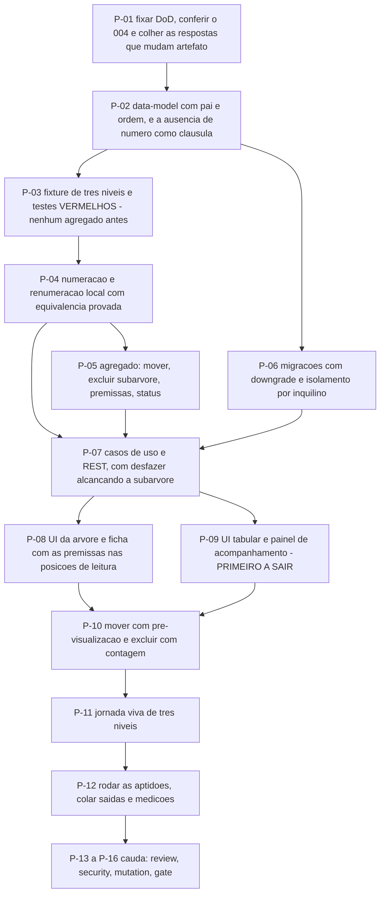

# AT 010 — Árvore de Transição da Estratégia & Táticas

> Siglas deste documento: **AT** — Árvore de Transição · **APR** — Árvore de
> Pré-Requisitos · **OI** — Objetivo Intermediário · **ARF** — Árvore da Realidade
> Futura · **S&T** — Estratégia & Táticas (*Strategy & Tactics*) · **TOC** — Teoria das
> Restrições · **ADR** — Architecture Decision Record (Registro de Decisão
> Arquitetural) · **IA** — inteligência artificial · **SDK** — Software Development Kit
> (kit de desenvolvimento) · **TDD** — Test-Driven Development (desenvolvimento guiado
> por teste) · **DoD** — Definition of Done (Definição de Pronto) · **OTel** —
> OpenTelemetry · **UX** — experiência de usuário · **i18n** — internacionalização ·
> **REST** — Representational State Transfer.

- **Spec**: `specs/010-estrategia-e-taticas/spec.md` · **Ciclo**: 010 (planejado) ·
  **Data desta árvore**: 2026-09-05
- **Fonte dos passos**: `specs/010-estrategia-e-taticas/tasks.md` — T-01 a T-12 mais a
  cauda. A AT **não inventa passo**; onde divergirem, o `tasks.md` manda.
- **A ordem que este ciclo não pode inverter**: os testes de numeração e a reprodução
  do defeito de exclusão (P-03) nascem **antes** do agregado. É a frase literal do
  `tasks.md` — "Nenhum agregado antes disto."

## Os passos

| Passo | Tarefa | Necessidade (por que este passo, agora) | Ação | Resultado esperado (verificável) |
|---|---|---|---|---|
| **P-01** | T-01 | Duas das respostas do Clarify mudam o **modelo** e os **artefatos** deste ciclo — a categoria e o desenho de telas —, e descobrir isso no meio custa retrabalho de migração | Fixar as 16 linhas da DoD com comando e valor esperado; conferir o ciclo 004 promovido e colher as respostas do Clarify que mudam modelo e artefatos | Cada linha tem comando; nenhum critério subjetivo; pré-condição e respostas coladas no `qa-report.md` |
| **P-02** | T-02 | A cláusula que define este módulo é uma **ausência**: nenhum campo de número em rota de escrita. Ausência que não está escrita no contrato reaparece na primeira implementação | Consolidar o `data-model.md` (árvore, passo com **pai + ordem**, premissas, status, eventos) e a extensão REST com a ausência de número como cláusula explícita | Todo agregado e evento da spec aparece no documento; nenhuma entidade sem invariante escrita; **nenhum contrato de catálogo** (INT-04) |
| **P-03** | T-03 | **O passo que define o ciclo.** Escrever o agregado antes reproduziria o hábito da linhagem: numeração como responsabilidade de quem usa, exclusão sem recorte declarado | Escrever a fixture da S&T sintética de 3 níveis e os testes vermelhos: numeração pela posição, renumeração ao inserir/mover/excluir, árvore estrita, **a reprodução do defeito de exclusão** e a ida e volta das três premissas — mais um caso na forma do export do v3 | DoD 2 a 7 **vermelhos pelo motivo certo** (agregado inexistente); zero dado real de pessoa (ADR 0006) |
| **P-04** | T-04 | A renumeração precisa ser **local** para caber no teto de desempenho, e local só é seguro se for provadamente equivalente ao recálculo total | Função pura de numeração e renumeração da subárvore afetada e dos irmãos seguintes | DoD 2 e 3 verdes; propriedade de **determinismo** e propriedade de **equivalência contra o recálculo total** na suíte |
| **P-05** | T-05 | Só agora o agregado pode nascer, e nasce contra testes que não o conhecem — inclusive o que reproduz um defeito de um caractere da linhagem | Domínio da árvore: meta global, passo com estratégia obrigatória e tática como pendência, adicionar em posição, mover subárvore preservando conteúdo, excluir subárvore com contagem, as três premissas com regras de pendência, status com evento | DoD 5, 6, 7 e 8 verdes; DoD 9 — a saída das pendências diz **quantos passos examinou** (regra R2) |
| **P-06** | T-06 | Esquema novo sem descida testada é dívida de banco disfarçada de entrega | Migrações Alembic (árvore, passo com pai e ordem, premissas, status) com `upgrade` e `downgrade` testados; repositórios mantendo o isolamento por inquilino | Ciclo de subida e descida sem resíduo, saída colada; o teste de isolamento do 004 verde sobre as tabelas novas |
| **P-07** | T-07 | O desfazer de sessão do M1 precisa alcançar a **exclusão de subárvore inteira** — a operação mais destrutiva do módulo é justamente a que a linhagem errou | Casos de uso e adaptadores REST com traço por mutação, autorização em falha fechada, e o desfazer estendido à exclusão de subárvore | DoD 4 com o **grep colado** (nenhum campo de número em rota de escrita), 10 e 11 verdes; o teste falha se `PassoAdicionado`, `PassoMovido`, `SubarvoreExcluida` ou `StatusMudou` não emitirem traço |
| **P-08** | T-08 | A ficha é onde a ferramenta ensina: as três premissas nas **posições de leitura** — necessidade acima, ligada ao pai; suficiência abaixo, ligada aos filhos nomeados | Interface da árvore (layout calculado, meta no topo, nó com número, estratégia e status por forma **e** rótulo) e da ficha do passo com leitura dirigida | Teste de fluxo de edição direta; leitura dirigida coberta por teste de interface; nenhum literal fora do dicionário; **nenhum campo de número em formulário algum** |
| **P-09** | T-09 | Reunião de acompanhamento sem canvas é caso de uso real, e a paridade tabela × ficha é o padrão que o M1 e o M3 já fixaram | Interface da vista tabular indentada e do painel de acompanhamento: contagens por status como filtros acionáveis, pendências com salto direto, filtro mantendo ancestrais visíveis | Paridade tabela × ficha coberta; filtro por status testado com ancestrais visíveis; os 4 identificadores de tela registrados com `ai_visible` campo a campo |
| **P-10** | T-10 | As duas mutações estruturais — mover e excluir — são as que mais assustam, e a reversibilidade precisa ser **anunciada na própria confirmação**, não descoberta depois | Mover por arrastar com pré-visualização da renumeração e exclusão com contagem e primeiro nível visível | A pré-visualização mostra os números novos **antes** de confirmar; a contagem da exclusão bate com o evento `SubarvoreExcluida`. **Se o E5.2 sair no corte, este passo absorve o painel mínimo** |
| **P-11** | T-11 | Jornada sem captura do build real é ficção — e o portão do roadmap é específico: **três níveis**, porque é onde a renumeração e a premissa de suficiência ficam visíveis | Jornada viva da S&T sintética de três níveis: criar meta, decompor, preencher as três premissas nos três papéis, mover uma subárvore com a renumeração à vista, conduzir a reunião por status e pendências | DoD 14 — script em `docs/jornadas/scripts/`, capturas geradas do build, grep negativo de nome real de pessoa |
| **P-12** | T-12 | Caixa marcada não é testemunha — e aqui há duas medições de desempenho que só a jornada produz | Rodar as aptidões e preencher o `qa-report.md` com saída colada (R1) e quanto cada portão examinou (R2); colar as medições da jornada; atualizar o CHANGELOG; escrever o ADR da categoria se o gate confirmar | `scripts/check-conformance.sh 010` código 0; DoD 13 com os dois números medidos; nenhuma célula preenchida sem comando executado |
| **P-13** | `TAIL:review` | Os dois portões nomeados do roadmap são de execução: renumeração da subárvore e as três premissas persistidas **e exibidas** | Revisão independente em contexto fresco: spec × código × DoD, com os dois portões verificados por leitura **e** por execução | Achados registrados no `qa-report.md` |
| **P-14** | `TAIL:security` | Este é o único módulo que declara **não ter** ação de catálogo; a verificação de segurança precisa confirmar a ausência, não presumi-la | Passe de segurança: nenhum SDK, chave, prompt **ou ação de catálogo** no módulo; autorização em falha fechada; isolamento por inquilino nas tabelas novas; textos de usuário como camada não-confiável no registro de telas | DoD 12 com os **dois** greps colados (provedor e `toc.` em contratos); resultado por item no `qa-report.md` |
| **P-15** | `TAIL:mutation` | A numeração, a renumeração local, a invariante de árvore estrita e o recorte da exclusão são exatamente as funções cuja falha **silenciosa** reintroduz os defeitos da linhagem | Testes de mutação sobre as quatro | Taxa e sobreviventes no `qa-report.md` |
| **P-16** | `TAIL:gate` | Quem executou não aprova o que executou — e aqui o gate registra algo a mais: que a regressão está desfeita **com decisão registrada**, que é o que faltou à linhagem | Apresentar as 16 linhas da DoD, as respostas do Clarify e a cauda | Decisão de merge registrada, com o registro explícito de que o D-05 está desfeito com ADR |

## O corte de apetite, escrito antes de precisar dele

O round 010 declara: **sai primeiro** o E5.2 (status e acompanhamento — fica a
estrutura); e **nunca saem** as três premissas por nó — "S&T sem premissa é organograma,
e o modelo de dados da linhagem já as tinha; entregar menos que o protótipo seria
regressão sobre regressão".

Na AT, isso significa que o passo cortável é **P-09** e a parte de **P-05** que trata
status — com **P-10** absorvendo o painel mínimo (contagem por status na própria
árvore), que é a nota de apetite escrita na própria tarefa. **P-03, P-04 e a parte de
P-05 e P-08 que trata premissas não são cortáveis**: sem elas o ciclo entregaria menos
do que o protótipo que aposenta, e a frase do round sobre regressão sobre regressão
existe para esse caso exato.

Uma nota sobre a ordem: **P-01 é mais pesado aqui do que nos outros ciclos**. Duas das
cinco `[DÚVIDA]` mudam artefato — a categoria muda o `data-model.md`, o desenho de telas
decide se existe um adendo de `ux-design.md` — e as duas custam pouco antes de P-02 e
caro depois de P-05.

## O grafo

## O que esta árvore não decide

- **Se o ciclo abre** — depende do ciclo 004 promovido, a única dependência técnica; é
  obstáculo da APR (`apr.md`).
- **As cinco `[DÚVIDA]`** — são do gate; duas delas mudam artefato e por isso são
  colhidas em P-01, antes de qualquer modelagem.
- **Se a S&T algum dia se liga automaticamente à APR e à AT** — está fora do round como
  candidato a evolução.
- **O que se ganha quando a ferramenta voltar** — é da ARF (`arf.md`).
