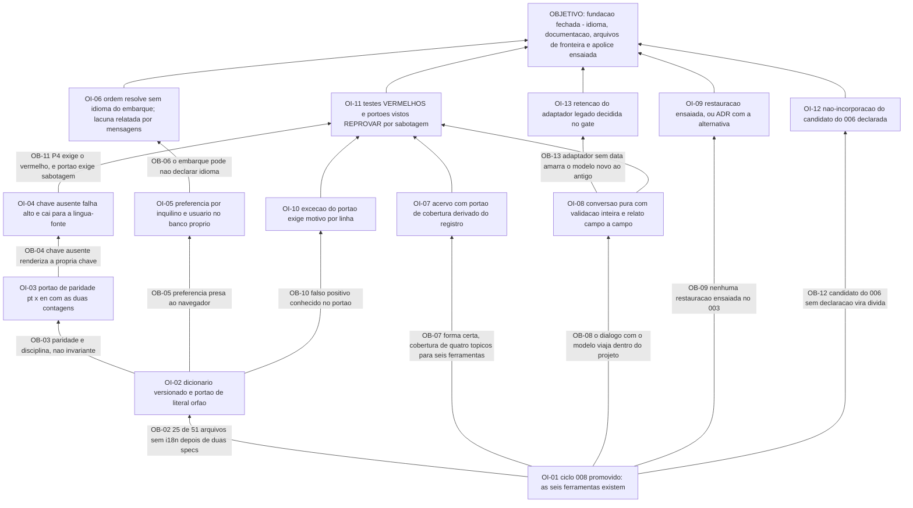

# APR 011 — Árvore de Pré-Requisitos das Fundações da aplicação

> Siglas deste documento: **APR** — Árvore de Pré-Requisitos · **OI** — Objetivo
> Intermediário · **ARF** — Árvore da Realidade Futura · **AT** — Árvore de Transição ·
> **ARA** — Árvore da Realidade Atual · **NC** — Nuvem de Conflito · **S&T** —
> Estratégia & Táticas · **TOC** — Teoria das Restrições · **APH** — o padrão Aplicação
> ↔ Harness · **ADR** — Architecture Decision Record (Registro de Decisão Arquitetural) ·
> **i18n** — internacionalização · **CI** — integração contínua · **IA** — inteligência
> artificial · **SDK** — Software Development Kit (kit de desenvolvimento) · **TDD** —
> Test-Driven Development (desenvolvimento guiado por teste) · **DoD** — Definition of
> Done (Definição de Pronto) · **DDL** — Data Definition Language (linguagem de definição
> de dados) · **JSON** — JavaScript Object Notation.

- **Spec**: `specs/011-fundacoes-da-aplicacao/spec.md` · **Ciclo**: 011 (planejado) ·
  **Data desta árvore**: 2026-09-05
- **Lógica**: condição **necessária**. Lê-se de baixo para cima.
- **Objetivo**: **a fundação da aplicação está fechada — nenhuma cadeia fora do
  dicionário, uma documentação embutida por ferramenta, o formato legado entrando com
  relato campo a campo, e uma restauração ensaiada com data.**

## Obstáculos e objetivos intermediários

| # | Obstáculo (condição atual que bloqueia) | Evidência | OI que o supera | Depende de |
|---|---|---|---|---|
| **OB-01** | O ciclo 008 não está promovido: sem as seis ferramentas dos processos de pensamento, não há o que documentar — e o portão de cobertura mediria um conjunto vazio | `docs/roadmap.md` § "O que o ciclo 011 não pode começar sem": "O ciclo 008 promovido (a documentação embutida cobre as ferramentas existentes)" | **OI-01**: o ciclo 008 está promovido e as seis ferramentas mais a jornada de focalização existem, registradas | nenhum |
| **OB-02** | **25 dos 51** arquivos `.tsx` da 4ª geração nunca importaram o mecanismo de internacionalização — **depois** de duas de cinco especificações da geração terem sido gastas em retrofit —, e os literais em português seguem vivos no código de produção | saídas coladas abaixo: `51`, `25`, e os literais de `SnTView.tsx:182` e `SnTStepEditorModal.tsx:92,95` | **OI-02**: existe dicionário versionado por idioma com o português como língua-fonte, e o portão de literal órfão nasce **por sabotagem** — imprimindo quantos arquivos e quantas cadeias examinou | OI-01 |
| **OB-03** | A paridade entre os dois dicionários é **disciplina, não invariante**: as folhas têm 268 chaves cada uma pelo mesmo critério, e nenhum portão o verifica — e o diretório ainda guarda `en.json` e `pt.json` com **0 bytes**, restos de abordagem abandonada | contagens coladas abaixo | **OI-03**: existe portão de paridade `pt` × `en` — chave só na língua-fonte é pendência listada, chave só na tradução é erro — com as duas contagens impressas | OI-02 |
| **OB-04** | Chave ausente **renderiza a própria chave** na tela, sem erro, sem log e sem portão: `tocbuilderv3/i18n/I18nProvider.tsx:41` é `let result = translation \|\| key;` | linha colada abaixo | **OI-04**: chave ausente falha alto em desenvolvimento e na integração contínua, e em produção cai para a **cadeia da língua-fonte** com registro em log estruturado | OI-03 |
| **OB-05** | A preferência de idioma vive no armazenamento do navegador (`toc_builder_locale`): a escolha morre com o dispositivo — o mesmo vício do dado (defeito **D-07**) aplicado à configuração | `tocbuilderv3/i18n/I18nProvider.tsx:15` (colado abaixo) | **OI-05**: a preferência de idioma é persistida por (inquilino, usuário) no banco próprio, e o idioma efetivo resolve-se por ordem declarada com o **motivo** guardado junto | OI-02 |
| **OB-06** | O embarque pode **não declarar idioma**: a spec 003 não o inclui entre os quatro parâmetros de admissão, e a ausência não é nossa para corrigir — o hospedeiro é leitura (P1) | lacuna **L-02** da spec, risco **médio** | **OI-06**: a ordem de resolução funciona sem erro quando o idioma do embarque falta, registrando a queda para o padrão — e a lacuna está relatada ao hospedeiro por `mensagens/NNN`, com evidência por `arquivo:linha` | OI-05 |
| **OB-07** | A documentação embutida da linhagem tem a **forma certa e a cobertura errada**: 125 linhas com índice por tópico e chamada para a ferramenta, mas **quatro** tópicos (`intro`, `ara`, `nc`, `ai`) para **seis** ferramentas declaradas — porque quatro delas respondiam "Esta ferramenta ainda não foi implementada." | `wc -l components/DocsView.tsx` → `125` (colado abaixo); fontes F-05, F-06, F-07 da spec | **OI-07**: existe acervo versionado com pelo menos um verbete por ferramenta registrada, e o portão de cobertura **deriva do registro de ferramentas** — não de uma segunda lista | OI-01, OI-02 |
| **OB-08** | O formato legado carrega o **diálogo com o modelo dentro do arquivo do projeto**, e a importação da linhagem o reintroduz: validação de três condições, erro por caixa de alerta e `chatHistory: data.chatHistory \|\| []` | `NodeZoneView.tsx:187`, `:314` e `:317` (colados abaixo) | **OI-08**: a conversão é serviço de domínio **puro**, a validação percorre o arquivo inteiro **antes de qualquer efeito**, a recusa é campo a campo e todo descarte é declarado no relato com contagem | OI-01 |
| **OB-09** | A restauração **não foi ensaiada**: o grep sobre `specs/003-esqueleto-federado/` devolve duas linhas, e nenhuma delas é restauração de banco — uma é rollback de implantação, a outra é um ramo de banco criado antes de migrar | saída colada abaixo; lacuna **L-01**, risco declarado **alto** | **OI-09**: a restauração está **ensaiada uma vez dentro do ciclo**, contra um destino separado, com relatório dizendo instante alvo, duração, objetivos de recuperação e **o que não volta** — ou, se o plano do provedor não permitir, um **ADR com a alternativa** | OI-01 |
| **OB-10** | O portão de literal órfão tem **falso positivo conhecido** — cadeias de diagnóstico, atributos técnicos —, e uma lista de exceções sem motivo é exatamente como um portão passa a mentir | lacuna **L-05** da spec, risco **médio** | **OI-10**: a lista de exceções exige **motivo escrito por linha**, no padrão do `scripts/check-caminhos.sh`, e exceção sem motivo **falha o portão** | OI-02 |
| **OB-11** | O princípio P4 exige o teste vermelho antes — e aqui dois dos entregáveis centrais são **portões**, que só valem depois de uma sabotagem os ver reprovar | `tasks.md` T-06: "nascida por sabotagem: planta-se `\"Salvar\"` num componente, o portão tem de pegá-lo"; `TAIL:mutation` lista cinco sabotagens | **OI-11**: os testes de conversão e de idioma efetivo falham primeiro, e os dois portões novos foram vistos **reprovar** com literal plantado, chave removida, chave órfã e verbete removido | OI-04, OI-07, OI-08, OI-10 |
| **OB-12** | O preenchimento estruturado de argumentos foi declarado pelo ciclo 006 como "candidato ao ciclo 011", e esta spec **não o incorpora** — candidato não incorporado que ninguém declara vira dívida silenciosa | spec § Fora de escopo: "fica dito aqui para o candidato não virar dívida silenciosa" | **OI-12**: a não-incorporação está **declarada por escrito** no Fora de escopo, com o motivo — a entrada continua sendo decisão nova | OI-01 |
| **OB-13** | O adaptador do formato legado, sem data de aposentadoria, amarra o modelo novo ao antigo indefinidamente — o oposto do que a visão propõe (quem quiser, exporta e importa) | segunda `[DÚVIDA]` do `## Clarify` | **OI-13**: a retenção do adaptador está decidida no gate, e a arquitetura já sustenta a saída: o `PlanoDeConversao` é a **única** peça que conhece o formato antigo | OI-08 |

## Sequenciamento

A raiz é única — **OI-01** —, e dela saem quatro ramos que quase não conversam entre si:

- **o ramo do idioma** (OI-02 → OI-03 → OI-04, e OI-05 → OI-06, mais OI-10);
- **o ramo da documentação** (OI-07);
- **o ramo dos arquivos** (OI-08 → OI-13);
- **o ramo da apólice** (OI-09), que não depende de nenhum dos outros.

A independência é a característica deste ciclo, e é o que o torna cortável sem dano: o
round declara que **sai primeiro** a importação da linhagem e que **nunca sai** o portão
de internacionalização — e os dois estão em ramos separados, com o corte não desfiando
nada.

O caminho crítico é o do idioma, e ele é literal quanto ao P4 numa forma própria: aqui o
"vermelho antes" não é só um teste, é uma **sabotagem**.

> OI-02 (dicionário e portão) → OI-03 (paridade) → OI-04 (falha alta) → **OI-11 (os
> portões são vistos reprovar)** → só então a interface.

É a diferença que a regra **R2** ensina: um portão que nunca reprovou não é evidência de
nada, e a cauda deste ciclo lista **cinco** sabotagens nomeadas por isso.

Duas observações de sequência que valem registrar:

- **OI-09 corre cedo e sozinho, de propósito.** É o objetivo de risco **alto** da spec, e
  o único cuja falha não se resolve com trabalho: se o plano do provedor não permitir a
  restauração para destino separado, a resposta é um ADR. Descobrir isso no fim do ciclo
  seria descobrir tarde demais para caber a decisão.
- **OI-06 é o único que exige escrita fora deste repositório** — e por isso não é uma
  tarefa de código: é uma mensagem em `mensagens/NNN`, com evidência por `arquivo:linha`,
  que o Product Steward leva ao hospedeiro. O P1 é explícito: relatar e parar.

## O grafo



## Evidência — as saídas que ancoram os obstáculos

```
$ ls /home/user/tocbuilderv3/specs/
feat_conflict_cloud.md
feat_conflict_cloud_refactor.md
feat_direct_ara_flow.md
feat_internationalization_final_steps.md
feat_internationalization_full.md

$ cd /home/user/tocbuilderv3 && find . -name "*.tsx" -not -path "./node_modules/*" | wc -l
51

$ cd /home/user/tocbuilderv3 && grep -rL "useI18n" --include="*.tsx" . | grep -v node_modules | wc -l
25

$ cd /home/user/tocbuilderv3 && sed -n 182p components/SnTView.tsx; sed -n '92p;95p' components/SnTStepEditorModal.tsx
          Criar Novo Projeto S&T
            Cancelar
            Salvar

$ cd /home/user/tocbuilderv3 && grep -c '^\s*[a-zA-Z_]*\s*:\s*"' locales/pt.ts locales/en.ts
locales/pt.ts:268
locales/en.ts:268

$ cd /home/user/tocbuilderv3 && wc -c locales/en.json locales/pt.json
0 locales/en.json
0 locales/pt.json
0 total

$ cd /home/user/tocbuilderv3 && sed -n '15p;41p' i18n/I18nProvider.tsx
const I18N_LOCALE_KEY = 'toc_builder_locale';
      let result = translation || key;

$ cd /home/user/tocbuilderv3 && wc -l components/DocsView.tsx
125 components/DocsView.tsx

$ cd /home/user/tocbuilderv3 && sed -n '187p;314p;317p' components/NodeZoneView.tsx
        const projectWithChat = { ...project, chatHistory: chatMessages };
          if (!data.name || !Array.isArray(data.nodes) || !Array.isArray(data.edges)) { alert(t('project_form.import.invalid_file')); return; }
          await mockApi.saveProjectState({ ...newProjectStub, nodes: data.nodes, edges: data.edges, chatHistory: data.chatHistory || [] });

$ grep -rniE "backup|restaura|point-in-time" specs/003-esqueleto-federado/
specs/003-esqueleto-federado/spec.md:578:| 14 | Rollback ensaiado | saída do ensaio (deploy anterior restaurado) colada no `qa-report.md` |
specs/003-esqueleto-federado/plan.md:75:| GATE-migracao | `alembic upgrade` em Neon | **Branch Neon** criado antes de aplicar (backup por cópia); `downgrade` testado em banco limpo | Saída do ciclo upgrade→downgrade sem resíduo (DoD 8) |
```

## O que esta árvore não decide

- **As cinco `[DÚVIDA]` do Clarify** — idioma padrão sem declaração do embarque,
  aposentadoria do adaptador legado, verbete de "por onde começar", escopo da preferência
  e periodicidade do ensaio são do gate humano; duas delas (OB-06 e OB-13) só se fecham
  depois de respondidas.
- **Se o plano do provedor permite a restauração ensaiada** — é a lacuna de risco **alto**
  do ciclo, e a resposta é medição, não planejamento; o que esta árvore fixa é a **forma
  do desfecho**: ensaio com relatório ou ADR com alternativa, nunca item pendente.
- **A ordem operacional dos passos** — é da AT (`at.md`).
- **O que se ganha quando a fundação fechar** — é da ARF (`arf.md`).
