# ARF 011 — Árvore da Realidade Futura das Fundações da aplicação

> Siglas deste documento: **ARF** — Árvore da Realidade Futura · **APR** — Árvore de
> Pré-Requisitos · **AT** — Árvore de Transição · **ARA** — Árvore da Realidade Atual ·
> **NC** — Nuvem de Conflito · **S&T** — Estratégia & Táticas · **UDE** — Efeito
> Indesejável · **TOC** — Teoria das Restrições · **APH** — o padrão Aplicação ↔ Harness
> · **ADR** — Architecture Decision Record (Registro de Decisão Arquitetural) · **i18n**
> — internacionalização · **CI** — integração contínua · **IA** — inteligência artificial
> · **LLM** — modelo de linguagem de grande porte (*Large Language Model*) · **SDK** —
> Software Development Kit (kit de desenvolvimento) · **TDD** — Test-Driven Development
> (desenvolvimento guiado por teste) · **DoD** — Definition of Done (Definição de
> Pronto) · **DDL** — Data Definition Language (linguagem de definição de dados) ·
> **JSON** — JavaScript Object Notation · **OTel** — OpenTelemetry.

- **Spec**: `specs/011-fundacoes-da-aplicacao/spec.md` · **Ciclo**: 011 (planejado) ·
  **Data desta árvore**: 2026-09-05
- **Lógica**: causa **suficiente**. Lê-se de baixo para cima.
- **Round correspondente**: `docs/produto/rounds.md`, round 011.

## A injeção — o que a spec entrega

| # | Injeção | O que a spec diz |
|---|---|---|
| **I-01** | **Toda cadeia visível vive em dicionário versionado, com o português como língua-fonte**, e o portão de literal órfão nasce **por sabotagem** — imprimindo quantos arquivos e quantas cadeias examinou | RF-06, RF-07, RN-01; `tasks.md` T-06 |
| **I-02** | **A paridade entre dicionários vira invariante**: chave só na língua-fonte é pendência listada, chave só na tradução é erro | RF-08 |
| **I-03** | **Chave ausente falha alto**: erro visível em desenvolvimento, integração contínua vermelha, e em produção queda para a língua-fonte **com log** — nunca a chave crua na tela | RF-09, RF-10 |
| **I-04** | **A preferência de idioma é dado do servidor**, por (inquilino, usuário), e o idioma efetivo resolve-se por ordem declarada com o **motivo** guardado junto | RF-12, RF-13, RF-14 |
| **I-05** | **A documentação embutida é acervo versionado com portão de cobertura** derivado do registro de ferramentas — ferramenta sem verbete é defeito de aceite, e nada é gerado por modelo em tempo de execução | RF-18, RF-23, RF-24, RN-04 |
| **I-06** | **A importação do formato legado valida o arquivo inteiro antes de qualquer efeito** e recusa com relato **campo a campo**; todo descarte é declarado no relato, com contagem | RF-27, RF-29, RN-06 |
| **I-07** | **A restauração é ensaiada uma vez dentro do ciclo**, contra um destino separado, com o relatório dizendo o instante alvo, a duração e **o que não volta** | RF-01, RF-02, RF-03, RNF-04 |

## Os efeitos desejáveis

| # | Efeito desejável | Decorre de | Hoje é falso porque (evidência) |
|---|---|---|---|
| **ED-01** | **A dívida de tradução deixa de crescer em silêncio**: um literal esquecido derruba o pull request nomeando arquivo e linha | I-01 | A linhagem gastou **2 das 5** especificações de uma geração inteira em retrofit de internacionalização — e mesmo assim **25 dos 51** arquivos `.tsx` nunca importaram o mecanismo (saídas coladas abaixo). Os literais estão vivos: `SnTView.tsx:182` traz `Criar Novo Projeto S&T`, `SnTStepEditorModal.tsx:92,95` trazem `Cancelar` e `Salvar` |
| **ED-02** | **A paridade entre idiomas deixa de ser disciplina e vira invariante** | I-02 | Hoje a paridade **existe por sorte**: as duas folhas de tradução têm **268** chaves cada uma pela mesma contagem (colada abaixo) e **nenhum portão a garante**. E o diretório guarda `en.json` e `pt.json` com **0 bytes** — restos de uma abordagem abandonada que ninguém removeu |
| **ED-03** | **Ninguém vê identificador técnico no lugar de um rótulo** | I-03 | O provedor de i18n da linhagem faz exatamente isso: `tocbuilderv3/i18n/I18nProvider.tsx:41` é `let result = translation \|\| key;` — chave ausente **renderiza a própria chave**, sem erro, sem log e sem portão (linha colada abaixo) |
| **ED-04** | **A escolha de idioma deixa de morrer com o dispositivo** | I-04 | A preferência da linhagem vive no armazenamento do navegador: `tocbuilderv3/i18n/I18nProvider.tsx:15` define `const I18N_LOCALE_KEY = 'toc_builder_locale';` (colado abaixo). É o mesmo vício do dado — o defeito **D-07** — aplicado à configuração |
| **ED-05** | **Nenhuma ferramenta é entregue sem verbete** — a cobertura passa a ser regra, e não meta | I-05 | A linhagem acertou a **forma** e errou a cobertura: o `DocsView.tsx` tem 125 linhas, índice por tópico e chamada para a ferramenta descrita — mas o acervo tinha **quatro** tópicos (`intro`, `ara`, `nc`, `ai`) para **seis** ferramentas declaradas, porque quatro delas respondiam "Esta ferramenta ainda não foi implementada." |
| **ED-06** | **Arquivo inválido deixa de virar caixa de alerta genérica** e passa a dizer qual campo está errado e por quê | I-06 | A importação da 4ª geração valida com três condições e um `alert()`: `NodeZoneView.tsx:314` é `if (!data.name \|\| !Array.isArray(data.nodes) \|\| !Array.isArray(data.edges)) { alert(...); return; }` (colado abaixo). Uma aresta órfã ou um nó sem título entram sem reclamação |
| **ED-07** | **O diálogo com o modelo deixa de viajar dentro do arquivo do projeto** — e o descarte é dito em voz alta, com contagem | I-06 | A exportação da linhagem escreve `{ ...project, chatHistory: chatMessages }` (`NodeZoneView.tsx:187`) e a importação o **reintroduz**: `chatHistory: data.chatHistory \|\| []` (linha 317). Conversa com modelo persistida no projeto sem decisão nenhuma sobre retenção |
| **ED-08** | **"Temos backup" passa a ser um fato verificado**, com o que não volta escrito ao lado do que volta | I-07 | O ciclo 003 não cobriu isto, e a medição é curta: o grep de `backup\|restaura\|point-in-time` sobre `specs/003-esqueleto-federado/` devolve **duas** linhas — um rollback de **implantação** e um ramo de banco criado antes de migrar (saída colada abaixo). Nenhuma das duas é restauração de banco ensaiada |
| **ED-09** | **O terceiro idioma deixa de custar um retrofit**: o mecanismo nasce com língua-fonte declarada, dicionário único e portão | I-01, I-02 | É a lição paga pela linhagem em duas specs de cinco, e é por isso que o portão de i18n é o item que **nunca sai** do round 011 mesmo se o apetite estourar |

## Ramos negativos — o que pode piorar, e a poda

| # | Ramo negativo | Poda declarada |
|---|---|---|
| **RNEG-01** | O portão de literal órfão tem **falso positivo** conhecido — cadeias de diagnóstico, atributos técnicos — e a lista de exceções cresce até o portão passar a mentir | Lacuna **L-05**, risco **médio**, e a poda é estrutural: a lista de exceções exige **motivo escrito por linha**, no mesmo padrão do `scripts/check-caminhos.sh`, e **exceção sem motivo falha o portão**. A revisão da cauda tem essa pergunta escrita como item: "a lista de exceções do literal órfão tem motivo por linha?" |
| **RNEG-02** | O portão de cobertura de documentação é alimentado por uma **segunda lista** de ferramentas, que envelhece separada do registro — e passa a dizer verde sobre um conjunto errado | A regra está escrita na tarefa: o portão **deriva do registro de ferramentas**, não de uma lista própria. E a pergunta está na cauda de revisão: "o portão de cobertura deriva do registro de ferramentas ou de uma segunda lista?" É a lição R2 aplicada — verde que não diz sobre o que olhou não é evidência |
| **RNEG-03** | O ensaio de restauração **não pode ser feito** porque o plano contratado do provedor não permite restaurar para um destino separado | Lacuna **L-01**, risco declarado **alto** — "é a diferença entre ter e não ter apólice", e o mais alto desta spec. A poda não é técnica, é de forma de fechamento: se o plano não permitir, **o resultado é um ADR com a alternativa, nunca um item pendente**. A tarefa é independente e roda cedo justamente para a descoberta caber no ciclo |
| **RNEG-04** | O adaptador do formato legado vira **dependência permanente da linhagem**: um conversor que ninguém aposenta e que amarra o modelo novo ao antigo | Segunda `[DÚVIDA]` do Clarify, e é do gate: adaptador permanente ou com data de aposentadoria declarada. A poda de arquitetura já existe — o `PlanoDeConversao` é **a única peça que conhece o formato antigo**, então aposentá-lo é remover um serviço de domínio, não desfazer a importação |
| **RNEG-05** | O embarque não declara idioma, a aplicação cai para o padrão, e a pessoa vê a plataforma num idioma e a ferramenta noutro | Lacuna **L-02**, risco **médio**. A poda imediata é a ordem do RF-12, que resolve **sem erro** (preferência → padrão) e registra a queda em log estruturado; a poda de longo prazo é o P1 aplicado à letra: a lacuna vira `mensagens/NNN` ao hospedeiro — relatar e parar, nunca escrever fora daqui |
| **RNEG-06** | Segredo do provedor vaza **na evidência colada** do ensaio de restauração — o risco próprio deste ciclo, porque aqui a evidência é saída de operação, não de teste | RNF-10 é explícito: as credenciais vêm de variável de ambiente e **não são impressas na saída colada**. E `TAIL:security` nomeia exatamente este risco — "segredo no cliente **e segredo na evidência colada** (o risco próprio deste ciclo)" |
| **RNEG-07** | O preenchimento estruturado de argumentos, que o ciclo 006 declarou "candidato ao ciclo 011", **não entra e ninguém percebe** — o candidato vira dívida silenciosa | A poda é declaratória e está na seção "Fora de escopo" da spec, com a razão escrita: "fica dito aqui para o candidato não virar dívida silenciosa: a entrada continua sendo decisão nova". É o padrão que a regra **R5** ensina — decisão que contradiz expectativa registrada tem de se declarar |

## O grafo

```mermaid
graph BT
  I01["I-01 dicionario unico com portao de literal orfao nascido por sabotagem"]
  I02["I-02 paridade entre dicionarios como invariante"]
  I03["I-03 chave ausente falha alto e cai para a lingua-fonte"]
  I04["I-04 preferencia de idioma no servidor com motivo da escolha"]
  I05["I-05 acervo versionado com portao de cobertura pelo registro"]
  I06["I-06 validacao inteira antes de efeito, com relato campo a campo"]
  I07["I-07 restauracao ensaiada uma vez, com o que nao volta declarado"]

  ED01["ED-01 a divida de traducao deixa de crescer em silencio"]
  ED02["ED-02 a paridade vira invariante e deixa de ser sorte"]
  ED03["ED-03 ninguem ve identificador tecnico no lugar do rotulo"]
  ED04["ED-04 a escolha de idioma deixa de morrer com o dispositivo"]
  ED05["ED-05 nenhuma ferramenta e entregue sem verbete"]
  ED06["ED-06 arquivo invalido deixa de virar alerta generico"]
  ED07["ED-07 o dialogo com o modelo deixa de viajar no projeto"]
  ED08["ED-08 temos backup passa a ser fato verificado"]
  ED09["ED-09 o terceiro idioma deixa de custar um retrofit"]

  OBJ["OBJETIVO: a fundacao da aplicacao fecha - idioma, documentacao, arquivos que atravessam a fronteira e apolice ensaiada"]

  I01 --> ED01
  I02 --> ED02
  I03 --> ED03
  I04 --> ED04
  I05 --> ED05
  I06 --> ED06
  I06 --> ED07
  I07 --> ED08
  I01 --> ED09
  I02 --> ED09

  ED01 --> OBJ
  ED02 --> OBJ
  ED03 --> OBJ
  ED04 --> OBJ
  ED05 --> OBJ
  ED06 --> OBJ
  ED07 --> OBJ
  ED08 --> OBJ
  ED09 --> OBJ

  RNEG01["RNEG-01 a lista de excecoes cresce e o portao passa a mentir"]
  RNEG02["RNEG-02 o portao de cobertura le uma segunda lista que envelhece"]
  RNEG03["RNEG-03 o plano do provedor nao permite o ensaio"]
  RNEG04["RNEG-04 o adaptador legado vira dependencia permanente"]
  RNEG06["RNEG-06 segredo vaza na evidencia colada"]
  RNEG07["RNEG-07 o candidato do 006 vira divida silenciosa"]

  P01["PODA excecao exige motivo por linha e excecao sem motivo derruba"]
  P02["PODA o portao deriva do registro de ferramentas - pergunta na cauda"]
  P03["PODA sem plano do provedor, o resultado e ADR, nunca item pendente"]
  P04["PODA o PlanoDeConversao e a unica peca que conhece o formato antigo"]
  P06["PODA credencial por ambiente e nunca impressa - TAIL:security nomeia o risco"]
  P07["PODA a nao-incorporacao esta declarada no Fora de escopo"]

  I01 -.-> RNEG01
  I05 -.-> RNEG02
  I07 -.-> RNEG03
  I06 -.-> RNEG04
  I07 -.-> RNEG06
  I05 -.-> RNEG07
  P01 --> RNEG01
  P02 --> RNEG02
  P03 --> RNEG03
  P04 --> RNEG04
  P06 --> RNEG06
  P07 --> RNEG07
```



## Evidência — os números desta árvore, com o comando executado

```
$ ls /home/user/tocbuilderv3/specs/
feat_conflict_cloud.md
feat_conflict_cloud_refactor.md
feat_direct_ara_flow.md
feat_internationalization_final_steps.md
feat_internationalization_full.md

$ cd /home/user/tocbuilderv3 && find . -name "*.tsx" -not -path "./node_modules/*" | wc -l
51

$ cd /home/user/tocbuilderv3 && grep -rL "useI18n" --include="*.tsx" . | grep -v node_modules | wc -l
25

$ cd /home/user/tocbuilderv3 && sed -n 182p components/SnTView.tsx; sed -n '92p;95p' components/SnTStepEditorModal.tsx
          Criar Novo Projeto S&T
            Cancelar
            Salvar

$ cd /home/user/tocbuilderv3 && sed -n '15p;41p' i18n/I18nProvider.tsx
const I18N_LOCALE_KEY = 'toc_builder_locale';
      let result = translation || key;

$ cd /home/user/tocbuilderv3 && grep -c '^\s*[a-zA-Z_]*\s*:\s*"' locales/pt.ts locales/en.ts
locales/pt.ts:268
locales/en.ts:268

$ cd /home/user/tocbuilderv3 && wc -c locales/en.json locales/pt.json
0 locales/en.json
0 locales/pt.json
0 total

$ cd /home/user/tocbuilderv3 && wc -l components/DocsView.tsx
125 components/DocsView.tsx

$ cd /home/user/tocbuilderv3 && sed -n '187p;314p;317p' components/NodeZoneView.tsx
        const projectWithChat = { ...project, chatHistory: chatMessages };
          if (!data.name || !Array.isArray(data.nodes) || !Array.isArray(data.edges)) { alert(t('project_form.import.invalid_file')); return; }
          await mockApi.saveProjectState({ ...newProjectStub, nodes: data.nodes, edges: data.edges, chatHistory: data.chatHistory || [] });

$ grep -rniE "backup|restaura|point-in-time" specs/003-esqueleto-federado/
specs/003-esqueleto-federado/spec.md:578:| 14 | Rollback ensaiado | saída do ensaio (deploy anterior restaurado) colada no `qa-report.md` |
specs/003-esqueleto-federado/plan.md:75:| GATE-migracao | `alembic upgrade` em Neon | **Branch Neon** criado antes de aplicar (backup por cópia); `downgrade` testado em banco limpo | Saída do ciclo upgrade→downgrade sem resíduo (DoD 8) |
```

> **Leitura honesta destes números.** O `268` de cada lado é o número mais enganoso desta
> lista: ele diz que a paridade **está certa hoje**, e é exatamente por isso que ninguém
> a protegeu. A contagem foi medida com o padrão acima (`^\s*chave\s*:\s*"`), que não
> capta chaves aninhadas de outra forma — logo é uma medida do mesmo critério nos dois
> arquivos, não um censo do dicionário. O que importa aqui não é o valor: é que **nenhum
> portão o verifica**, e um número que ninguém confere é disciplina, não invariante.

## O que esta árvore não decide

- **Se o ciclo pode abrir** — depende do ciclo 008 promovido (as seis ferramentas
  precisam existir para haver o que documentar); é obstáculo da APR (`apr.md`).
- **Idioma padrão sem declaração do embarque, aposentadoria do adaptador legado, verbete
  de "por onde começar", escopo da preferência e periodicidade do ensaio** — são as cinco
  `[DÚVIDA]` do `## Clarify`, matéria do gate humano.
- **Idiomas além de português e inglês, e migração automática da linhagem** — estão fora
  do round 011; entrar exige decisão nova.
- **A ordem operacional dos passos** — é da AT (`at.md`).
