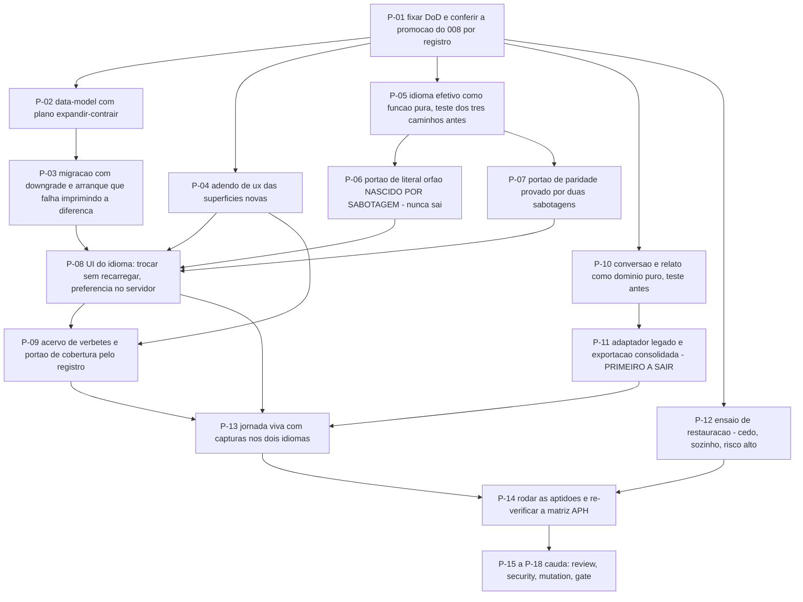

# AT 011 — Árvore de Transição das Fundações da aplicação

> Siglas deste documento: **AT** — Árvore de Transição · **APR** — Árvore de
> Pré-Requisitos · **OI** — Objetivo Intermediário · **ARF** — Árvore da Realidade
> Futura · **TOC** — Teoria das Restrições · **APH** — o padrão Aplicação ↔ Harness ·
> **ADR** — Architecture Decision Record (Registro de Decisão Arquitetural) · **i18n** —
> internacionalização · **CI** — integração contínua · **IA** — inteligência artificial ·
> **SDK** — Software Development Kit (kit de desenvolvimento) · **TDD** — Test-Driven
> Development (desenvolvimento guiado por teste) · **DoD** — Definition of Done
> (Definição de Pronto) · **DDL** — Data Definition Language (linguagem de definição de
> dados) · **JSON** — JavaScript Object Notation · **OTel** — OpenTelemetry · **UX** —
> experiência de usuário.

- **Spec**: `specs/011-fundacoes-da-aplicacao/spec.md` · **Ciclo**: 011 (planejado) ·
  **Data desta árvore**: 2026-09-05
- **Fonte dos passos**: `specs/011-fundacoes-da-aplicacao/tasks.md` — T-01 a T-14 mais a
  cauda. A AT **não inventa passo**; onde divergirem, o `tasks.md` manda.
- **A ordem que este ciclo não pode inverter**: os dois portões novos nascem **por
  sabotagem** (P-06 e P-07) — um portão que nunca reprovou não é evidência de nada.

## Os passos

| Passo | Tarefa | Necessidade (por que este passo, agora) | Ação | Resultado esperado (verificável) |
|---|---|---|---|---|
| **P-01** | T-01 | A pré-condição deste ciclo é o que dá **o que documentar**: sem as seis ferramentas promovidas, o portão de cobertura mediria um conjunto vazio e daria verde | Fixar as 18 linhas da DoD nos caminhos reais do repositório e conferir a promoção do ciclo 008 **por registro, não por memória** | Cada linha tem comando que roda localmente e na integração contínua; nenhum critério subjetivo; a promoção verificada por registro |
| **P-02** | T-02 | Este ciclo mexe em esquema **e** em dado; sem o plano de migração escrito antes, os dois viajam juntos e o rollback deixa de existir | Escrever o `data-model.md`: preferência de idioma, verbete, idioma efetivo, chave de mensagem e relato de importação — com o plano na forma expandir → preencher → alternar → parar de escrever → contrair | O documento declara o que **não** é domínio (mecanismo de i18n, acervo, rotina de restauração); nenhuma revisão planejada muda estrutura e linhas ao mesmo tempo |
| **P-03** | T-03 | O arranque que emite DDL é o modo silencioso de o esquema divergir da migração — e a única prova de que não acontece é ver o arranque falhar | Migração Alembic da preferência de idioma com `downgrade` testado em banco limpo; teste que sobe a aplicação contra esquema incompatível | DoD 15 com a saída colada; o arranque falha **imprimindo a diferença** |
| **P-04** | T-04 | As superfícies novas — painel de documentação, relato campo a campo, seletor de idioma, estado de tradução pendente — não estão no protótipo do ciclo 002 | Escrever o adendo de `ux-design` com papel semântico antes do componente, referenciado ao desenho do 002 | Cada tela nova tem papel semântico declarado e estado vazio e de erro desenhado **antes de qualquer linha de interface** |
| **P-05** | T-05 | A resolução do idioma efetivo é a única parte de i18n que é domínio puro — e é onde o "motivo da escolha" precisa nascer, ou vira campo que ninguém preenche | Escrever o teste dos três caminhos (preferência → embarque → língua-fonte) **antes** do resolvedor e vê-lo falhar; então implementar | DoD 5 — os três caminhos verdes com o **motivo** verificado em cada um; a queda ao padrão aparece em log estruturado |
| **P-06** | T-06 | **Um dos dois passos que definem o ciclo.** Um portão de literal órfão que nunca reprovou não prova nada — e é justamente o portão que o round marca como o que **nunca sai** | Plantar `"Salvar"` num componente e escrever o portão até ele pegar o literal nomeando arquivo e linha; a lista de exceções exige motivo escrito por linha | DoD 2 — código 0 no repositório limpo, código ≠ 0 com o literal plantado, e a saída imprime "N arquivos, M cadeias examinadas" (regra R2) |
| **P-07** | T-07 | **O outro passo que define o ciclo.** A paridade entre dicionários está certa hoje **por sorte**, e sorte não é invariante | Escrever o portão de paridade `pt` × `en`; provar com duas sabotagens: remover uma chave da tradução (pendência listada) e acrescentar uma chave órfã (portão derruba) | DoD 3 — as duas contagens impressas; as duas sabotagens com a recusa que imprimiram |
| **P-08** | T-08 | Trocar de idioma no meio de um diagrama aberto é o momento em que a implementação preguiçosa recarrega a página e joga fora o trabalho | Interface: seletor com origem da escolha, idioma efetivo em **toda** a superfície, preferência persistida no servidor, formatação e colação localizadas, chave ausente falhando alto em desenvolvimento | DoD 4, 6 e 7 — trocar sem recarregar e sem perder o diagrama; limpar o navegador e reabrir mantém o idioma; conteúdo escrito por pessoa e identificador inalterados nos dois idiomas |
| **P-09** | T-09 | A linhagem provou que a forma certa não basta: o que faltou foi **cobertura**, e cobertura só é regra quando um portão a mede contra o registro de ferramentas | Acervo de verbetes bilíngue com âncoras e procedência; painel lateral com foco devolvido ao fechar; portão de cobertura derivado do **registro de ferramentas** | DoD 8 e 9 — as duas contagens impressas; `scripts/check-caminhos.sh` código 0 sobre as procedências; remover um verbete **derruba** o portão; nenhum texto gerado por modelo em tempo de execução |
| **P-10** | T-10 | O arquivo legado é a superfície mais perigosa do produto — entra de fora, com dado de conversa dentro; validar depois de escrever é como o defeito da linhagem nasceu | Escrever, **antes** do serviço, o teste com o arquivo sintético no formato da 4ª geração — com `chatHistory` preenchido e uma aresta órfã — e vê-lo falhar; então o `PlanoDeConversao` e o `RelatoDeImportacao` como domínio puro | DoD 10, 11 e 12 — conversão correta; **dois** problemas geram **dois** itens no relato e nada é criado; histórico de conversa não persistido e contagem declarada |
| **P-11** | T-11 | Reconhecer o formato pelo **nome do arquivo** é o atalho que transforma um adaptador numa adivinhação; e a exportação consolidada é o que faz a cadeia inteira caber num arquivo só | Adaptador de importação legada no caminho do M1 (assinatura de conteúdo, teto de tamanho, projeto novo com relato) e exportação consolidada com os vínculos de encadeamento | DoD 13 — ida e volta com vínculos recriados e contados; medição do desempenho colada. **Primeira tarefa a sair se o apetite estourar** |
| **P-12** | T-12 | **O passo cujo resultado não se resolve com trabalho.** Se o plano do provedor não permitir a restauração para destino separado, a resposta é uma decisão — e decisão precisa de tempo de ciclo | Ensaiar a restauração: restaurar a cópia para um destino separado, subir a aplicação contra ele, verificar a base sintética íntegra, escrever o relatório com instante alvo, duração, objetivos de recuperação e **o que não voltou** | DoD 14 — saída colada no `qa-report.md`, **sem credencial na saída**; se o plano não permitir, o resultado é um **ADR com a alternativa**, nunca um item pendente |
| **P-13** | T-13 | Jornada sem captura do build real é ficção — e aqui a captura tem uma exigência a mais: **os dois idiomas**, porque tela mista é o defeito que RI-03 proíbe | Jornada viva: uma pessoa troca de idioma, abre a documentação pela âncora e importa um arquivo da geração anterior — um caso aceito e um recusado | DoD 17 — capturas geradas por script **nos dois idiomas**, regeneráveis e determinísticas; base 100% sintética; busca negativa de nome real com saída colada |
| **P-14** | T-14 | Caixa marcada não é testemunha — e este ciclo toca a matriz de aderência, que precisa sair do pull request com evidência por caminho | Rodar todas as aptidões e colar saída, código de saída e tamanho examinado; re-verificar a matriz de aderência ao APH; cobertura de requisitos linha a linha; atualizar o CHANGELOG | `scripts/check-conformance.sh 011` código 0; nenhuma célula preenchida sem comando executado (regra R1) |
| **P-15** | `TAIL:review` | Os dois portões novos podem **passar mentindo** de duas formas específicas, e ambas são invisíveis para quem os escreveu | Revisão independente em contexto fresco, com as duas perguntas escritas: a lista de exceções do literal órfão tem motivo por linha? o portão de cobertura deriva do registro de ferramentas ou de uma segunda lista? | Achados registrados; seção Fontes da spec conferida por amostragem |
| **P-16** | `TAIL:security` | O risco próprio deste ciclo não é segredo no cliente — é **segredo na evidência colada**, porque aqui a evidência é saída de operação | Passe de segurança: segredo no cliente e na evidência, teto e caminho da importação de arquivo, isolamento por inquilino na tabela nova, ausência de SDK ou chave, e dado real em fixture, verbete ou captura | DoD 16 conferido; resultado por item no `qa-report.md` |
| **P-17** | `TAIL:mutation` | Cinco coisas neste ciclo só provam que funcionam quando as vemos **recusar** | Sabotar e ver recusar: literal plantado, chave removida da tradução, chave órfã acrescentada, verbete removido do acervo, arquivo legado com aresta órfã e com histórico de conversa, e uma migração que muda estrutura e linhas na mesma revisão | Cada sabotagem com o comando e a recusa que imprimiu, no `qa-report.md` |
| **P-18** | `TAIL:gate` | Quem executou não aprova o que executou — e aqui há um item que o Product Steward precisa **ler**, não só aprovar: o relatório do ensaio | Apresentar a DoD verde, o relatório do ensaio, a jornada nos dois idiomas e as respostas do Clarify | Decisão de merge gravada em `docs/records/decisoes.jsonl` por `scripts/record-decision.sh` |

## O corte de apetite, escrito antes de precisar dele

O round 011 declara: **sai primeiro** o E1.4 avançado — a importação da linhagem — e
**nunca sai** o portão de internacionalização. A razão do segundo está medida: a linhagem
pagou o adiamento com duas de cinco especificações de uma geração inteira e ainda assim
deixou 25 de 51 arquivos fora do mecanismo.

Na AT, isso significa que os passos cortáveis são **P-11** e, com ele, a metade de
**P-10** que trata do adaptador legado (a validação e o relato ficam, porque são domínio
que a exportação consolidada também usa). **P-06 e P-07 não são cortáveis** — e nem
sequer são adiáveis para o fim: são os passos que dão sentido ao "nunca sai".

Uma nota sobre a ordem: **P-12 corre cedo e sozinho**, e não por conveniência de
paralelismo. É o passo de risco **alto** do ciclo, o único cuja falha não se resolve com
mais trabalho, e a resposta a ele — se vier negativa — é um ADR que precisa caber dentro
do ciclo. Deixá-lo para o fim seria descobrir tarde demais.

E um passo que **não** aparece no grafo por ser escrita fora daqui: a lacuna do idioma
não declarado pelo embarque (a ordem do RF-12 a absorve sem erro) vira uma mensagem em
`mensagens/NNN-para-ghdaru-...`, com evidência por `arquivo:linha`. O P1 é explícito —
relatar e parar; quem leva ao hospedeiro é o humano.

## O grafo

## O que esta árvore não decide

- **Se o ciclo abre** — depende do ciclo 008 promovido; é obstáculo da APR (`apr.md`).
- **As cinco `[DÚVIDA]`** — são do gate; a resposta sobre a aposentadoria do adaptador
  legado muda o que P-11 entrega, e a resposta sobre o escopo da preferência muda P-08.
- **Se o ensaio de restauração é possível** — é medição, e o seu desfecho negativo tem
  forma declarada: ADR, nunca pendência.
- **O que se ganha quando a fundação fechar** — é da ARF (`arf.md`).
