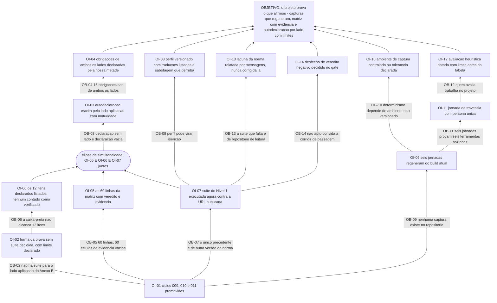

# APR 012 — Árvore de Pré-Requisitos das Jornadas e da autodeclaração

> Siglas deste documento: **APR** — Árvore de Pré-Requisitos · **OI** — Objetivo
> Intermediário · **ARF** — Árvore da Realidade Futura · **AT** — Árvore de Transição ·
> **ARA** — Árvore da Realidade Atual · **NC** — Nuvem de Conflito · **S&T** —
> Estratégia & Táticas · **TOC** — Teoria das Restrições · **APH** — o padrão Aplicação ↔
> Harness · **ADR** — Architecture Decision Record (Registro de Decisão Arquitetural) ·
> **P6** — princípio "Jornada viva" da constituição do projeto · **HTTP** — HyperText
> Transfer Protocol · **CI** — integração contínua · **IA** — inteligência artificial ·
> **UX** — experiência de usuário · **DoD** — Definition of Done (Definição de Pronto).

- **Spec**: `specs/012-jornadas-e-autodeclaracao/spec.md` · **Ciclo**: 012 (planejado) ·
  **Data desta árvore**: 2026-09-05
- **Lógica**: condição **necessária**. Lê-se de baixo para cima.
- **Objetivo**: **o projeto prova o que afirmou — as capturas regeneram do build atual, a
  matriz tem evidência por linha, a suíte do Nível 1 mede a aplicação real, e a
  autodeclaração de Nível 2 sai em ADR pelo lado aplicação, com os limites ditos junto.**

## Obstáculos e objetivos intermediários

| # | Obstáculo (condição atual que bloqueia) | Evidência | OI que o supera | Depende de |
|---|---|---|---|---|
| **OB-01** | Os ciclos 009, 010 e 011 não estão promovidos: autodeclarar antes seria declarar sem provar — o anti-padrão que este projeto existe para não repetir | `docs/roadmap.md` § "O que o ciclo 012 não pode começar sem": "Os ciclos 009, 010 e 011 promovidos — autodeclarar antes seria declarar sem provar" | **OI-01**: os três ciclos estão promovidos e há produto para medir | nenhum |
| **OB-02** | **Não existe suíte executável para o lado aplicação do Anexo B**, e a norma diz por quê: o canal exige navegador, e "uma suíte que fingisse cobri-lo seria pior que a sua ausência" — o §B.11.2 é ainda mais direto: "quem declara o lado da aplicação declara sem suíte" | `anexo-b-federacao.md:215` e `:193` (linhas coladas abaixo); lacuna **L-01**, risco **médio** | **OI-02**: a forma da prova está decidida e escrita — caminho de arquivo mais teste próprio, com o limite declarado junto, e nada que só foi afirmado é contado como verificado | OI-01 |
| **OB-03** | Uma declaração que não diga **de qual lado** fala é vazia por norma: "metade das obrigações não é sua" | `anexo-b-federacao.md:213` (§B.12.1, colado abaixo) | **OI-03**: a autodeclaração está escrita como **lado aplicação**, citando a cláusula que a obriga, com a maturidade dos itens experimentais declarada (§B.11.3) | OI-02 |
| **OB-04** | Das 49 obrigações do Anexo B, **16 são de ambos os lados** — e só fecham se o hospedeiro fizer a metade dele, que não é nossa para declarar nem para corrigir | `anexo-b-federacao.md:209-211` (colado abaixo); lacuna **L-02**, risco **médio** | **OI-04**: as obrigações compartilhadas estão declaradas **pela nossa metade**, com o estado da outra registrado como **observado**; divergência vira `mensagens/NNN` | OI-03 |
| **OB-05** | A matriz de aderência tem **60** linhas de requisito e **as 60** estão com a coluna de evidência vazia — por declaração explícita do cabeçalho | saídas coladas abaixo (`60`, `60`, e a distribuição 53 planejadas / 4 fora do alvo / 3 delegadas) | **OI-05**: as 60 linhas têm veredito e evidência — caminho e teste nas atendidas, o que falta nas parciais, condição de reentrada nas fora do alvo, delegação com ADR e a metade que continua nossa | OI-01 |
| **OB-06** | A suíte do Nível 1 alcança **11** checks executáveis; **12** itens ficam de fora do alcance da caixa-preta — e contá-los juntos leria "apto em 11" como cobertura de 23 | contagens coladas abaixo: `11` e `12` | **OI-06**: os 12 itens declarados estão listados um a um com a evidência interna de cada um, e **nenhum é contado como verificado** | OI-02 |
| **OB-07** | O único precedente de medição real é de **outra versão da norma**: a fundação foi medida contra o padrão v0.3, quando a suíte trazia **10** declarados, e a de hoje traz **12** — o próprio registro manda refazer a medição em vez de supor | `conformidade/execucoes/2026-08-06-ghdaru.md:11` e o cabeçalho do mesmo registro (colados abaixo) | **OI-07**: a suíte foi executada **por nós, agora**, contra a URL publicada, e o relatório integral está registrado com data, versão da norma, alvo e revisão medida | OI-01 |
| **OB-08** | Um perfil de adaptação mal usado transforma tradução em isenção — e o "apto" passaria a medir o perfil, não a aplicação | `conformidade/README.md`, § perfis: "um perfil é um **dicionário**, não uma isenção"; declarar operação ausente **faz o check falhar** | **OI-08**: o perfil, se necessário, está versionado **neste** repositório, cada tradução aplicada aparece no relatório, e a sabotagem que declara uma operação ausente confirma que o check **falha** | OI-07 |
| **OB-09** | Não existe **nenhuma captura** no repositório: `find docs/jornadas -type f` devolve só o README — as seis jornadas nascem cada uma no ciclo da sua ferramenta | saída colada abaixo | **OI-09**: as seis jornadas existem com script de captura versionado, e todas as capturas **regeneram do build atual** com a comparação vazia ou o achado nomeado | OI-01 |
| **OB-10** | A regeneração determinística depende de ambiente controlado — resolução, tema, fontes, base sintética — que ainda não existe versionado, e sem ele a diferença detectada é de ambiente, não de produto | lacuna **L-05** da spec, risco **médio** | **OI-10**: o ambiente de captura está controlado e versionado — ou a tolerância da comparação está **declarada**, nunca silenciosa | OI-09 |
| **OB-11** | Seis jornadas separadas provam que cada ferramenta funciona **sozinha**, que é o defeito **D-11** com documentação melhor | `docs/jornadas/README.md` (as seis jornadas planejadas, uma por ferramenta) | **OI-11**: existe a jornada de travessia — uma persona só, do primeiro ao último elo, com cada captura declarando o ciclo em que a tela nasceu | OI-09 |
| **OB-12** | A avaliação heurística é feita por quem trabalha no projeto, e o viés não tem quem o corrija | lacuna **L-04** da spec, risco **médio** | **OI-12**: a avaliação é datada e traz o limite **antes** da tabela — quem avaliou, em que contexto, o que **não** foi avaliado —, e cada achado sai com severidade e destino | OI-11 |
| **OB-13** | A suíte que falta é do `GHDaru/protocolos`, que é **leitura apenas** (P1): escrevê-la aqui seria escrita externa proibida, e escrevê-la lá exigiria aprovação humana caso a caso | spec § Fora de escopo: "o normativo é do `GHDaru/protocolos`, leitura apenas (P1)" | **OI-13**: qualquer lacuna encontrada na norma durante a medição está relatada em `mensagens/NNN-para-protocolos-<assunto>.md`, com evidência por `arquivo:linha` e o commit lido | OI-07 |
| **OB-14** | Um veredito "não apto" convida a corrigir de passagem, e o round declara que **nada sai deste round** — corrigir aqui transformaria o fechamento num ciclo de funcionalidade disfarçado | `docs/produto/rounds.md`, round 012: "**Fora**: qualquer funcionalidade nova — round de fechamento não esconde feature"; primeira `[DÚVIDA]` do Clarify | **OI-14**: a forma de desfecho de um veredito negativo está decidida no gate — registrar a lacuna com dono e prazo, e a correção é ciclo próprio | OI-07 |

## Sequenciamento

Este ciclo tem **uma raiz** (OI-01) e três frentes que só convergem no fim — e a
convergência é o ponto: a autodeclaração (OI-03) não pode ser escrita antes de a matriz
(OI-05) e a medição (OI-07) existirem, porque ela é **derivada** das duas.

- **frente da prova executável**: OI-07 → OI-08, OI-13, OI-14;
- **frente da prova documental**: OI-05 → (com OI-06) → OI-03 → OI-04;
- **frente da prova visual**: OI-09 → OI-10, OI-11 → OI-12.

Há uma **elipse de simultaneidade** — no sentido literal da ferramenta que o ciclo 008
implementou: **OI-03 exige OI-05 e OI-06 e OI-07 ao mesmo tempo**. A autodeclaração
precisa da matriz preenchida (de onde ela deriva linha a linha), da separação entre
verificado e declarado (senão conta 11 como 23) e do relatório da medição (senão declara
sem medir). Escrevê-la sem qualquer um dos três produz exatamente o documento que este
ciclo existe para não produzir.

O obstáculo **OB-02 é o mais importante desta árvore, e é o único que não se supera** — o
que se supera é a sua consequência. Não há suíte para o lado aplicação do Anexo B, e não
haverá: a norma declara que fingir cobri-lo seria pior. O OI-02 não conserta a ausência;
ele **decide a forma da prova que substitui a suíte** e o limite que a acompanha. É o
tipo de objetivo intermediário que a fonte técnica chama de "eliminar a relevância do
obstáculo" em vez de eliminar o obstáculo.

E **OI-13 é o único objetivo intermediário deste lote que se cumpre fora do código**: uma
mensagem em `mensagens/`, com evidência por `arquivo:linha`, que o humano leva ao outro
repositório. O P1 é explícito — relatar e parar.

## O grafo



## Evidência — as saídas que ancoram os obstáculos

```
$ sed -n '215p' /home/user/protocolos/padrao/anexo-b-federacao.md | grep -o "O \*\*lado da aplicação\*\* não tem:.*"
O **lado da aplicação** não tem: o canal exige navegador, e uma suíte que fingisse cobri-lo seria pior que a sua ausência.

$ sed -n '193p' /home/user/protocolos/padrao/anexo-b-federacao.md | cut -c401-720
 CI) e a **suíte do lado hospedeiro** (`conformidade/suite-federacao.mjs`), de caixa-preta contra uma URL. O que **não** existe: verificação executável do lado da **aplicação**, porque o canal `postMessage` exige navegador. Quem declara o lado da aplicação declara sem suíte, e o §B.12.1 obriga a dizer qual l

$ sed -n '213p' /home/user/protocolos/padrao/anexo-b-federacao.md
**B.12.1** Quem declara conformidade **DEVE** declarar **por lado**, e a declaração de um lado não fala pelo outro. "Somos conformes ao Anexo B", sem dizer qual lado, é declaração vazia: metade das obrigações não é sua. *(É o §B.11.3 com o sujeito explícito, repetido aqui porque é aqui que a matriz dá sentido a "qual lado"; não é obrigação nova.)*

$ sed -n '209p' /home/user/protocolos/padrao/anexo-b-federacao.md | cut -c1-120
A matriz cobre **as cláusulas deste anexo e os requisitos do §4.9 do padrão**, 49 obrigações ao todo (44 mais 5). O

$ sed -n '211p' /home/user/protocolos/padrao/anexo-b-federacao.md | cut -c1-200
Estado desta versão: 25 obrigações do hospedeiro, 8 da aplicação, 16 de ambos; **17 verificadas por suíte** (4 delas com **cobertura parcial declarada**), 6 por schema, 26 por autodeclaração c

$ cd /home/user/protocolos && grep -cE "^\| \`[a-z-]+\` \| " conformidade/README.md
11

$ cd /home/user/protocolos && sed -n '416,470p' conformidade/suite.mjs | grep -c "aph:"
12

$ cd /home/user/protocolos && sed -n '11p' conformidade/execucoes/2026-08-06-ghdaru.md
**NÃO APTO ao Nível 1 (Observador)** — 8 de 11 checks verificados, 1 aviso, **2 falhas**; 10 itens seguem para autodeclaração. As duas falhas eram lacunas **já conhecidas** pela auditoria por leitura (spec 023): o padrão não descobriu um problema novo — a execução confirmou e **precisou** o que a leitura tinha estimado.

$ cd /home/user/protocolos && sed -n '16p' conformidade/execucoes/2026-08-06-ghdaru.md
Suíte de conformidade APH — Nível 1 (Observador) · padrão v0.3 · wire v0.2 (specs 026/027)

$ cd /home/user/protocolos && sed -n '5p' conformidade/execucoes/2026-08-06-ghdaru.md | cut -c1-260
> **Alvo medido**: `GHDaru/ghdaru` no commit **`5084575`** (`5084575af9c0d39604fcee51fcc000d198d5a484`, 2026-07-30) — todos os `path:linha` deste registro se referem a essa revisão. O laboratório é ativo: num commit posterior, as linhas derivam e o result

$ grep -cE "^\| (APH-|§)" docs/integracao/aderencia-aph.md
60

$ grep -E "^\| (APH-|§)" docs/integracao/aderencia-aph.md | grep -cE "\| *\| *$|\|\s*$"
60

$ grep -E "^\| (APH-|§)" docs/integracao/aderencia-aph.md | grep -oE "\| (○|✦|✗|◐|●) [a-zç]+" | sort | uniq -c
     53 | ○ planejado
      4 | ✗ fora
      3 | ✦ delegado

$ find docs/jornadas -type f
docs/jornadas/README.md
```

> **Nota de leitura sobre estes números.** O `60` de linhas e o `60` de células vazias
> foram medidos com o padrão acima, que casa as linhas de requisito da tabela; o `12` foi
> medido contando as entradas de `DECLARADOS` no intervalo indicado do arquivo da suíte.
> São medidas do critério declarado, não censos — e é por isso que estão coladas com o
> comando: quem discordar do critério reexecuta e vê outro número, o que é diferente de
> discordar do fato.

## O que esta árvore não decide

- **As cinco `[DÚVIDA]` do Clarify** — desfecho de um veredito negativo, publicação
  externa da autodeclaração, avaliação heurística por pessoa externa, permanência da
  jornada de travessia no índice e periodicidade de reexecução da suíte são do gate
  humano; duas delas (OB-12 e OB-14) só se fecham depois de respondidas.
- **O veredito da suíte** — é medição, e o que esta árvore fixa é que ele entra **como
  saiu**.
- **A ordem operacional dos passos** — é da AT (`at.md`).
- **O que se ganha quando o projeto provar o que afirmou** — é da ARF (`arf.md`).
