# ARF 012 — Árvore da Realidade Futura das Jornadas e da autodeclaração

> Siglas deste documento: **ARF** — Árvore da Realidade Futura · **APR** — Árvore de
> Pré-Requisitos · **AT** — Árvore de Transição · **ARA** — Árvore da Realidade Atual ·
> **NC** — Nuvem de Conflito · **S&T** — Estratégia & Táticas · **UDE** — Efeito
> Indesejável · **TOC** — Teoria das Restrições · **APH** — o padrão Aplicação ↔ Harness
> · **ADR** — Architecture Decision Record (Registro de Decisão Arquitetural) · **P6** —
> princípio "Jornada viva" da constituição do projeto · **HTTP** — HyperText Transfer
> Protocol · **SSE** — *Server-Sent Events* · **FSM** — máquina de estados finitos ·
> **IA** — inteligência artificial · **CI** — integração contínua · **UX** — experiência
> de usuário · **i18n** — internacionalização.

- **Spec**: `specs/012-jornadas-e-autodeclaracao/spec.md` · **Ciclo**: 012 (planejado) ·
  **Data desta árvore**: 2026-09-05
- **Lógica**: causa **suficiente**. Lê-se de baixo para cima.
- **Round correspondente**: `docs/produto/rounds.md`, round 012.

> **Nota sobre este documento.** Este é o único ciclo da versão 1 que **não entrega
> funcionalidade nenhuma**: ele prova o que os outros onze afirmaram. Uma árvore de
> futuro para um ciclo assim tem uma característica incomum — os efeitos desejáveis não
> são capacidades novas do produto, são **propriedades da prova**.

## A injeção — o que a spec entrega

| # | Injeção | O que a spec diz |
|---|---|---|
| **I-01** | **A autodeclaração diz de qual lado fala**: Nível 2 (Operador), **lado aplicação** do Anexo B, citando a cláusula que obriga a declaração por lado | RF-19, RN-01, INT-02 |
| **I-02** | **Onde há suíte, ela roda de fora**, contra a URL publicada, escrita por quem não somos nós — e o veredito entra no repositório **como saiu**, inclusive "não apto" | RF-13, RF-14, RN-04, INT-01 |
| **I-03** | **Onde não há suíte, a evidência é caminho mais teste próprio e o limite é declarado** — nunca se conta como verificado o que só foi afirmado | RF-17, RF-21, RN-02 |
| **I-04** | **A matriz de aderência tem evidência por linha**: célula vazia em linha atendida ou parcial é defeito de aceite, delegação aparece como delegação, e fora do alvo carrega a condição de reentrada | RF-08, RF-09, RF-10, RF-11 |
| **I-05** | **Registro de execução e autodeclaração são história**: corrigem-se por acréscimo — registro novo, ADR que sucede —, nunca por reescrita | RN-05, RNF-02 |
| **I-06** | **As capturas regeneram do build atual**, e divergência é **achado nomeado**, jamais atualização silenciosa | RF-01, RF-02, RN-06 |
| **I-07** | **Uma jornada de travessia com persona única** atravessa da ARA à AT com a focalização costurando, declarando elo a elo em que ciclo cada tela nasceu | RF-03, RF-04 |
| **I-08** | **O site é saída de gerador versionado**, com as contagens derivadas dos arquivos — e a prova disso é uma **sabotagem** | RF-23, RF-24, RNF-04 |

## Os efeitos desejáveis

| # | Efeito desejável | Decorre de | Hoje é falso porque (evidência) |
|---|---|---|---|
| **ED-01** | **"Somos conformes" deixa de ser uma frase e vira um documento por lado, com evidência por requisito** | I-01, I-04 | A norma trata declaração sem lado como vazia — o §B.12.1 diz literalmente: "'Somos conformes ao Anexo B', sem dizer qual lado, é declaração vazia: metade das obrigações não é sua" (linha colada abaixo). Hoje o projeto tem **alvo declarado** (ADR 0003) e **nenhuma declaração** |
| **ED-02** | **A diferença entre "verificado" e "declarado" fica visível, item a item** | I-02, I-03 | A conta é do próprio padrão e foi executada nesta leitura: a suíte do Nível 1 tem **11** checks executáveis e **12** itens que a caixa-preta não alcança (saídas coladas abaixo). Sem essa separação escrita, um "apto" de 11 seria lido como cobertura de 23 |
| **ED-03** | **A matriz deixa de ser promessa e passa a ser conferência**: quem admite a aplicação segue a evidência até o arquivo | I-04 | Hoje a matriz tem **60** linhas de requisito e **as 60** estão com a coluna de evidência vazia — por declaração explícita do próprio cabeçalho ("toda coluna de evidência está vazia de propósito"). A distribuição atual é 53 planejadas, 4 fora do alvo e 3 delegadas (saídas coladas abaixo) |
| **ED-04** | **A documentação visual deixa de envelhecer sem testemunha** | I-06 | Hoje não há nenhuma: `find docs/jornadas -type f` devolve **apenas o README** (colado abaixo). As seis jornadas nascem cada uma no ciclo da sua ferramenta; o que este ciclo acrescenta é a prova de que **regeneram** |
| **ED-05** | **O encadeamento das ferramentas ganha prova visual**: uma história só, uma persona só, do primeiro ao último elo | I-07 | Seis jornadas separadas provam que cada ferramenta funciona **sozinha** — que é exatamente o defeito **D-11** com melhor documentação. A travessia é o que prova o contrário |
| **ED-06** | **Um veredito negativo passa a ter lugar**: entra no repositório como saiu, com a decisão associada a cada falha | I-02, I-05 | O precedente é forte e é da própria fundação: a primeira aplicação real medida por essa suíte saiu **"NÃO APTO ao Nível 1 (Observador) — 8 de 11 checks verificados, 1 aviso, 2 falhas"** (linha colada abaixo). O registro é público no repositório do padrão, e não foi maquiado |
| **ED-07** | **O site deixa de ser uma versão parada no tempo** — as contagens vêm dos arquivos, e a prova é uma sabotagem | I-08 | É o que o ADR 0008 decide, e o que o portão de divergência sustenta: site escrito à mão diverge da spec no primeiro ciclo seguinte, sem ninguém notar |
| **ED-08** | **A declaração envelhece com data e revisão**, e diz para refazer a medição em vez de supor | I-05 | O registro de referência do padrão já ensina isso na prática: ele foi medido contra o **padrão v0.3**, quando a suíte tinha **10** declarados, e a de hoje tem **12** — o mesmo registro avisa "num commit posterior, as linhas derivam e o resultado pode mudar; refaça a medição em vez de supor" |

## Ramos negativos — o que pode piorar, e a poda

| # | Ramo negativo | Poda declarada |
|---|---|---|
| **RNEG-01** | **A autodeclaração vira auto-elogio.** É o risco estrutural do ciclo: onde não há suíte, quem declara é quem construiu, e o erro de autoavaliação não tem quem o pegue | Lacuna **L-01**, risco **médio**, e a mitigação é escrita: revisão independente em contexto fresco, com as perguntas já formuladas — "todo veredito da autodeclaração aparece na matriz com a mesma evidência?", "nenhuma cláusula que depende do hospedeiro foi declarada como nossa?". E há um antídoto cultural com número: a própria fundação saiu **8 de 11, não apta** na primeira medição, e o registro entrou como saiu |
| **RNEG-02** | **O perfil de adaptação vira lavagem** — traduzir vira isentar, e o "apto" passa a medir o perfil em vez da aplicação | A norma já fechou esta porta e a spec a cita: perfil é **dicionário, não isenção**; declarar uma operação ausente **faz o check falhar**, e toda tradução aplicada aparece no relatório. As duas verificações estão na cauda: `TAIL:review` lê o perfil contra a superfície real ("adaptação ou lavagem?") e `TAIL:mutation` **declara uma operação ausente de propósito** para confirmar que o check falha em vez de ser pulado |
| **RNEG-03** | **O veredito "não apto" tenta o ciclo a corrigir de passagem**, e o fechamento vira um décimo terceiro ciclo de funcionalidade disfarçado | O *Fora de escopo* da spec nomeia isto como "o mais tentador de todos", e o round 012 é categórico: "round de fechamento não esconde feature". A decisão de forma está no gate (primeira `[DÚVIDA]`), mas a regra de fundo já está escrita: **o ciclo registra o veredito e a dívida; a correção é outro ciclo** |
| **RNEG-04** | **As obrigações compartilhadas são declaradas como nossas.** Das 49 obrigações do Anexo B, **16 são de ambos os lados** — e uma declaração descuidada as conta inteiras | Lacuna **L-02**, risco **médio**, com regra clara: declaramos **a nossa metade** com evidência e registramos o estado da outra como **observado**, nunca como nosso; divergência vira `mensagens/NNN`. E a pergunta está literalmente na cauda de revisão |
| **RNEG-05** | **A comparação de capturas não é determinística** e o portão vira ruído: todo fechamento acusa "achados" que são diferença de fonte, não de produto | Lacuna **L-05**, risco **médio**. A poda tem duas camadas: ambiente controlado e versionado (mesma resolução, mesmo tema, mesma base sintética), e — se o determinismo não se sustentar — a degradação para comparação tolerante é **declarada**, nunca silenciosa. Um portão que tolera sem dizer que tolera é pior que portão nenhum |
| **RNEG-06** | **A autodeclaração revela superfície ao circular fora do repositório**: endereços internos, códigos de erro, nomes de rota | `TAIL:security` nomeia exatamente este risco, junto com "credencial na saída colada". E a decisão de publicar é do gate: a segunda `[DÚVIDA]` pergunta se a declaração sai já neste ciclo ou fica interna até revisão externa — porque **é ela que circula**, e isso muda o escrutínio exigido antes do merge |
| **RNEG-07** | **A avaliação heurística é feita por quem trabalha no projeto** e vira elogio visual com aparência de método | Lacuna **L-04**, risco **médio**, com a poda mínima honesta: o limite é **declarado no próprio documento** — quem avaliou, em que contexto, o que **não** foi avaliado — e vem **antes** da tabela de achados, não em nota de rodapé. Avaliação externa fica como porta de volta declarada (terceira `[DÚVIDA]`) |

## O grafo

```mermaid
graph BT
  I01["I-01 autodeclaracao por lado, citando a clausula"]
  I02["I-02 onde ha suite, ela roda de fora e o veredito entra como saiu"]
  I03["I-03 onde nao ha suite, caminho mais teste e o limite declarado"]
  I04["I-04 matriz com evidencia por linha e delegacao declarada"]
  I05["I-05 registro e ADR sao historia, corrigidos por acrescimo"]
  I06["I-06 capturas regeneram e divergencia e achado nomeado"]
  I07["I-07 jornada de travessia com persona unica"]
  I08["I-08 site como saida de gerador, provado por sabotagem"]

  ED01["ED-01 somos conformes vira documento por lado com evidencia"]
  ED02["ED-02 a diferenca entre verificado e declarado fica visivel"]
  ED03["ED-03 a matriz deixa de ser promessa e vira conferencia"]
  ED04["ED-04 a documentacao visual deixa de envelhecer sem testemunha"]
  ED05["ED-05 o encadeamento ganha prova visual"]
  ED06["ED-06 um veredito negativo passa a ter lugar"]
  ED07["ED-07 o site deixa de ser versao parada no tempo"]
  ED08["ED-08 a declaracao envelhece com data e manda re-medir"]

  OBJ["OBJETIVO: o projeto prova o que afirmou - jornadas que regeneram, matriz com evidencia e autodeclaracao por lado com limites ditos"]

  I01 --> ED01
  I04 --> ED01
  I02 --> ED02
  I03 --> ED02
  I04 --> ED03
  I06 --> ED04
  I07 --> ED05
  I02 --> ED06
  I05 --> ED06
  I08 --> ED07
  I05 --> ED08

  ED01 --> OBJ
  ED02 --> OBJ
  ED03 --> OBJ
  ED04 --> OBJ
  ED05 --> OBJ
  ED06 --> OBJ
  ED07 --> OBJ
  ED08 --> OBJ

  RNEG01["RNEG-01 a autodeclaracao vira auto-elogio"]
  RNEG02["RNEG-02 o perfil de adaptacao vira lavagem"]
  RNEG03["RNEG-03 o nao apto tenta corrigir de passagem"]
  RNEG04["RNEG-04 as 16 obrigacoes de ambos os lados viram nossas"]
  RNEG05["RNEG-05 a comparacao de capturas nao e deterministica"]
  RNEG06["RNEG-06 a declaracao revela superficie ao circular"]

  P01["PODA revisao independente com perguntas escritas; e o precedente 8 de 11 nao apto"]
  P02["PODA perfil e dicionario: declarar ausente FAZ o check falhar - sabotagem na cauda"]
  P03["PODA registra o veredito e a divida; a correcao e outro ciclo"]
  P04["PODA declara-se a nossa metade; a outra e observada, nunca nossa"]
  P05["PODA ambiente versionado; tolerancia, se houver, e declarada"]
  P06["PODA TAIL:security nomeia o risco e o gate decide a publicacao"]

  I03 -.-> RNEG01
  I02 -.-> RNEG02
  I02 -.-> RNEG03
  I04 -.-> RNEG04
  I06 -.-> RNEG05
  I01 -.-> RNEG06
  P01 --> RNEG01
  P02 --> RNEG02
  P03 --> RNEG03
  P04 --> RNEG04
  P05 --> RNEG05
  P06 --> RNEG06
```



## Evidência — os números desta árvore, com o comando executado

```
$ sed -n '213p' /home/user/protocolos/padrao/anexo-b-federacao.md
**B.12.1** Quem declara conformidade **DEVE** declarar **por lado**, e a declaração de um lado não fala pelo outro. "Somos conformes ao Anexo B", sem dizer qual lado, é declaração vazia: metade das obrigações não é sua. *(É o §B.11.3 com o sujeito explícito, repetido aqui porque é aqui que a matriz dá sentido a "qual lado"; não é obrigação nova.)*

$ sed -n '215p' /home/user/protocolos/padrao/anexo-b-federacao.md | grep -o "O \*\*lado da aplicação\*\* não tem:.*"
O **lado da aplicação** não tem: o canal exige navegador, e uma suíte que fingisse cobri-lo seria pior que a sua ausência.

$ cd /home/user/protocolos && grep -cE "^\| \`[a-z-]+\` \| " conformidade/README.md
11

$ cd /home/user/protocolos && sed -n '416,470p' conformidade/suite.mjs | grep -c "aph:"
12

$ cd /home/user/protocolos && sed -n '11p' conformidade/execucoes/2026-08-06-ghdaru.md
**NÃO APTO ao Nível 1 (Observador)** — 8 de 11 checks verificados, 1 aviso, **2 falhas**; 10 itens seguem para autodeclaração. As duas falhas eram lacunas **já conhecidas** pela auditoria por leitura (spec 023): o padrão não descobriu um problema novo — a execução confirmou e **precisou** o que a leitura tinha estimado.

$ grep -cE "^\| (APH-|§)" docs/integracao/aderencia-aph.md
60

$ grep -E "^\| (APH-|§)" docs/integracao/aderencia-aph.md | grep -cE "\| *\| *$|\|\s*$"
60

$ grep -E "^\| (APH-|§)" docs/integracao/aderencia-aph.md | grep -oE "\| (○|✦|✗|◐|●) [a-zç]+" | sort | uniq -c
     53 | ○ planejado
      4 | ✗ fora
      3 | ✦ delegado

$ find docs/jornadas -type f
docs/jornadas/README.md
```

> **Leitura honesta destes números.** O par `11` / `12` é o número mais importante deste
> ciclo, e é contraintuitivo: **a maior parte do Nível 1 não é verificável de fora**. O
> `60` / `60` da matriz é o retrato do ponto de partida — e ele é honesto por
> construção, porque o cabeçalho do documento **declara** que as células estão vazias de
> propósito. E há uma discrepância que merece registro: a execução de referência da
> fundação fala em **10** itens declarados porque foi medida contra o **padrão v0.3**,
> enquanto a suíte de hoje traz **12**. É exatamente por isso que aquele registro manda
> refazer a medição em vez de supor — e é a razão de este ciclo medir, e não citar.

## O que esta árvore não decide

- **Se o ciclo pode abrir** — depende dos ciclos 009, 010 e 011 promovidos, das seis
  jornadas com script versionado e da aplicação publicada e alcançável; são obstáculos da
  APR (`apr.md`).
- **O que fazer se a suíte sair "não apta"** — é a primeira `[DÚVIDA]` do `## Clarify`, e
  o round empurra para declarar a lacuna com dono e prazo; a decisão é do Product
  Steward.
- **Se a autodeclaração é publicada fora do repositório neste ciclo** — segunda
  `[DÚVIDA]`, e ela muda o escrutínio exigido antes do gate.
- **A ordem operacional dos passos** — é da AT (`at.md`).
