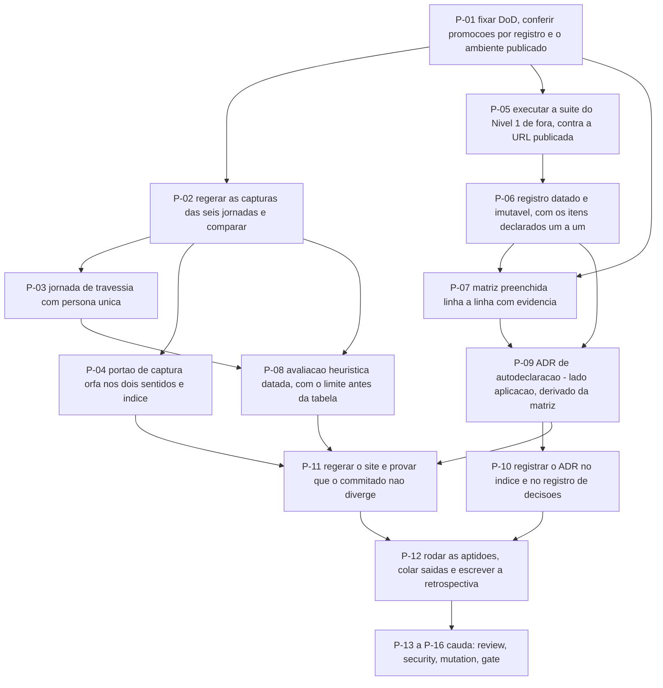

# AT 012 — Árvore de Transição das Jornadas e da autodeclaração

> Siglas deste documento: **AT** — Árvore de Transição · **APR** — Árvore de
> Pré-Requisitos · **OI** — Objetivo Intermediário · **ARF** — Árvore da Realidade
> Futura · **ARA** — Árvore da Realidade Atual · **NC** — Nuvem de Conflito · **S&T** —
> Estratégia & Táticas · **TOC** — Teoria das Restrições · **APH** — o padrão Aplicação ↔
> Harness · **ADR** — Architecture Decision Record (Registro de Decisão Arquitetural) ·
> **P6** — princípio "Jornada viva" da constituição do projeto · **HTTP** — HyperText
> Transfer Protocol · **CI** — integração contínua · **IA** — inteligência artificial ·
> **UX** — experiência de usuário · **DoD** — Definition of Done (Definição de Pronto) ·
> **i18n** — internacionalização.

- **Spec**: `specs/012-jornadas-e-autodeclaracao/spec.md` · **Ciclo**: 012 (planejado) ·
  **Data desta árvore**: 2026-09-05
- **Fonte dos passos**: `specs/012-jornadas-e-autodeclaracao/tasks.md` — T-01 a T-12 mais
  a cauda. A AT **não inventa passo**; onde divergirem, o `tasks.md` manda.
- **A ordem que este ciclo não pode inverter**: a autodeclaração (P-09) vem **depois** da
  medição (P-05/P-06) e da matriz (P-07) — ela é derivada das duas, e escrevê-la antes
  produziria exatamente o documento que este ciclo existe para não produzir.

## Os passos

| Passo | Tarefa | Necessidade (por que este passo, agora) | Ação | Resultado esperado (verificável) |
|---|---|---|---|---|
| **P-01** | T-01 | Este ciclo mede **de fora**: sem a aplicação publicada e alcançável num ambiente com base sintética, a frente executável inteira não sai do papel | Fixar as 17 linhas da DoD e conferir as pré-condições: ciclos 009, 010 e 011 promovidos **por registro, não por memória**; as seis jornadas com script versionado; a aplicação publicada e alcançável | Cada linha tem comando; as promoções verificadas por registro; o ambiente de medição nomeado |
| **P-02** | T-02 | Uma captura que não regenera é uma captura que envelheceu **sem testemunha** — e regenerar em silêncio seria pior do que não regenerar | Regerar as capturas das seis jornadas pelos scripts versionados contra o build atual e comparar com as commitadas | DoD 1 e 2 — duas execuções seguidas produzem imagens idênticas; divergência sai como **achado nomeado** (jornada, captura, o que mudou), nunca como atualização silenciosa |
| **P-03** | T-03 | Seis jornadas separadas provam seis ferramentas **sozinhas** — que é o defeito D-11 com documentação melhor | Escrever a jornada de travessia: ARA → NC → ARF → APR → AT com a focalização costurando, uma persona só do primeiro ao último elo, cada captura declarando o ciclo em que a tela nasceu | DoD 4 — o UDE que abre a análise é o mesmo que fecha; nenhum nome fora da base sintética |
| **P-04** | T-04 | Um índice de jornadas que ninguém verifica envelhece igual às capturas | Função de aptidão de captura órfã **nos dois sentidos** e índice com ciclo de nascimento, estágio e número de capturas | DoD 3 — código 0 e as **duas** contagens impressas; apagar uma captura citada **derruba** o portão |
| **P-05** | T-05 | O veredito precisa vir de uma ferramenta que **não escrevemos**; e um perfil mal usado transformaria tradução em isenção | Executar a suíte do Nível 1 do `GHDaru/protocolos` de fora, contra a URL publicada, com perfil versionado **neste** repositório se a superfície divergir do canônico | DoD 8 e 9 — relatório integral; cada tradução do perfil listada; nenhuma operação declarada ausente para escapar de check; nenhuma credencial em arquivo nem na saída |
| **P-06** | T-06 | O que a caixa-preta não alcança é **a maior parte** do Nível 1, e contá-lo junto leria "apto em 11" como cobertura de 23 | Registrar a execução como registro datado e **imutável** — data, versão da norma, alvo, revisão, perfil, veredito como saiu — e listar os itens não observáveis um a um com evidência interna | DoD 10 — nenhum item declarado contado como verificado; se o veredito for "não apto", cada falha sai com a decisão associada |
| **P-07** | T-07 | A matriz é o documento que a Administradora do inquilino usa para **conferir** em vez de confiar; célula vazia em linha atendida é defeito de aceite | Preencher a matriz linha a linha: evidência com caminho e teste nas atendidas, o que falta nas parciais, condição de reentrada nas fora do alvo, delegação com ADR e a metade que continua nossa | DoD 6 e 7 — nenhuma célula de evidência vazia em linha atendida ou parcial; contagem por status impressa; `scripts/check-caminhos.sh` código 0 sobre as evidências |
| **P-08** | T-08 | Seis avaliações de seis telas não dizem onde a experiência quebra **entre** ferramentas — e quem avalia trabalha no projeto, o que precisa estar escrito | Escrever a avaliação heurística datada do conjunto: quem avaliou, quando, em que contexto, o que **não** foi avaliado; cada achado com severidade e destino | DoD 5 — limite declarado **antes** da tabela; nenhum achado sem destino; correção de produto vira dívida no módulo dono, nunca conserto de passagem |
| **P-09** | T-09 | **O passo que fecha a versão 1.** Ele é derivado da matriz e da medição: escrito antes delas, seria declaração sem prova — o oposto exato do propósito | Escrever o ADR de autodeclaração: Nível 2 (Operador), **lado aplicação** do Anexo B, com a cláusula citada, a maturidade dos itens experimentais, os limites nomeados e uma linha por requisito derivada da matriz | DoD 11 e 12 — todo veredito da declaração aparece na matriz com a mesma evidência; campo "Princípios tocados" preenchido; alternativas descartadas com número real |
| **P-10** | T-10 | O método guarda ADR e índice de decisões como história, e um guarda recusa a reescrita — registrar à mão seria contornar o que existe para proteger | Registrar o ADR: entrada no índice de ADRs e linha no índice de decisões por `scripts/record-decision.sh`, **nunca** editando o arquivo à mão | DoD 13 — `scripts/check-adr.sh` código 0 |
| **P-11** | T-11 | Site escrito à mão diverge da spec no primeiro ciclo seguinte, sem ninguém notar; e a única forma de saber se uma contagem é derivada é **sabotá-la** | Regerar o site pelo gerador versionado, com navegação por módulo, ciclo e requisito, rastreabilidade nos dois sentidos e a nota de honestidade; provar que o commitado não diverge | DoD 14 e 15 — diferença vazia na integração contínua; acrescentar um requisito a uma spec muda a contagem exibida **sem edição manual** |
| **P-12** | T-12 | Caixa marcada não é testemunha — e este é o ciclo em que a versão 1 fecha, o que inclui dizer o que virou regra versionada | Rodar todas as aptidões e colar saída, código de saída e tamanho examinado; busca negativa de dado real em capturas, relatórios e páginas; atualizar o CHANGELOG; escrever a **retrospectiva do fechamento da versão 1** | `scripts/check-conformance.sh 012` código 0; DoD 16 com o tamanho examinado; nenhuma célula preenchida sem comando executado |
| **P-13** | `TAIL:review` | Onde não há suíte, **quem declara é quem construiu** — e esse erro não tem quem o pegue, exceto uma revisão que faça as perguntas certas | Revisão independente em contexto fresco: conferir linha a linha que todo veredito da autodeclaração aparece na matriz com a mesma evidência; ler o perfil contra a superfície real (adaptação ou lavagem?); conferir que **nenhuma cláusula que depende do hospedeiro foi declarada como nossa** | Achados registrados; seção Fontes da spec conferida por amostragem |
| **P-14** | `TAIL:security` | Aqui há um risco que os outros ciclos não têm: **o que a declaração revela ao circular fora do repositório** | Passe de segurança: credencial em perfil, em variável de ambiente ou **na saída colada**; dado real em captura, relatório ou página; e superfície exposta pela declaração (endereços internos, códigos de erro, nomes de rota) | Resultado por item no `qa-report.md` |
| **P-15** | `TAIL:mutation` | Quatro portões deste ciclo só provam que funcionam quando os vemos **recusar** | Sabotar e ver recusar: apagar uma captura citada, esvaziar uma célula de evidência de linha atendida, acrescentar um requisito e conferir que a contagem do site muda sozinha, e **declarar uma operação ausente no perfil** para confirmar que o check falha em vez de ser pulado | Cada sabotagem com o comando e a recusa que imprimiu |
| **P-16** | `TAIL:gate` | Quem executou não aprova o que executou — e aqui o Product Steward **assina** algo que circula para fora do repositório | Ler a matriz e o relatório da suíte, assinar a autodeclaração, decidir sobre a publicação externa e registrar a decisão de merge | Decisão gravada por `scripts/record-decision.sh`. **Fecha a versão 1** |

## O corte de apetite, escrito antes de precisar dele

O round 012 é o único do produto em que **não sai nada**: "este round já é só o essencial
de fechamento; se estourar, o que se corta é escopo dos rounds anteriores, nunca a
autodeclaração com evidência". E o que **nunca sai** é a autodeclaração em ADR — "é o
'prove, não declare' aplicado ao projeto inteiro".

Na AT, isso significa que **nenhum passo deste ciclo é cortável**, e a válvula está fora
dele: se o apetite estourar aqui, quem perde escopo é um ciclo anterior, não este. É uma
inversão deliberada, e vale dizer por quê: cortar o fechamento é a única forma de o
projeto terminar afirmando o que não provou.

A tentação real deste ciclo não é cortar — é **acrescentar**. Um veredito "não apto"
convida a corrigir de passagem, e o *Fora de escopo* da spec nomeia isso como "o mais
tentador de todos". A regra está escrita: o ciclo registra o veredito e a dívida; a
correção é ciclo próprio.

## O grafo

## O que esta árvore não decide

- **Se o ciclo abre** — depende dos ciclos 009, 010 e 011 promovidos e da aplicação
  publicada num ambiente com base sintética; são obstáculos da APR (`apr.md`).
- **O veredito da suíte** — é medição; o que a AT fixa é que ele entra **como saiu**, e o
  que fazer com um "não apto" é a primeira `[DÚVIDA]` do gate.
- **Se a autodeclaração circula para fora já neste ciclo** — segunda `[DÚVIDA]`, decidida
  em P-16, e ela muda o escrutínio exigido em P-13 e P-14.
- **O que se ganha quando o projeto provar o que afirmou** — é da ARF (`arf.md`).
